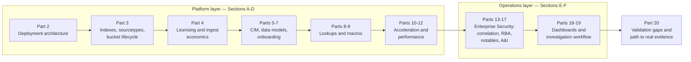

# Part 1 — Why This Book Exists: From SPL Syntax to Platform Operations

## Why this part exists

**[CONCEPT]** *The Detection Engineering Handbook* (DEH) V2 spends six parts — 24 through 29 —
teaching one query language each: Sigma, KQL, SPL, AQL, YARA-L, and Elastic's three query surfaces.
Part 26 is the SPL installment, and it closes with a scope note this book takes as its own founding
brief rather than paraphrasing at a distance: it states plainly that it "does not cover Splunk
administration, index/bucket lifecycle management, or `tstats`/data-model acceleration in
depth... a full accelerated-search treatment belongs in a dedicated performance-engineering
appendix, not here" (DEH Part 26, closing paragraph of "Why this part exists"). *Splunk Security
Operations* is that appendix, expanded into a full platform-operations title. This part exists to
state that relationship precisely, once, so that no later part in this book has to reconstruct it
from scratch — the same problem DEH's own Part 23 solves for its six language parts, applied here
to this book's relationship with DEH as a whole.

Three things follow from that relationship, and this part states each as a design fact rather than
a disclaimer buried in a preface:

1. **This book assumes you can already write the query.** If you have not read DEH Part 23 (query
   language strategy) and DEH Part 26 (SPL syntax), read those first — §1 below tells you exactly
   what they cover and exactly where this book picks up instead of repeating them.
2. **This book runs a platform-layer/operations-layer split through every part that follows**,
   adapted from the telemetry-layer/analytic-layer split DEH runs through its own domain parts. §2
   states that split and previews how the book's twenty parts sit on either side of it.
3. **This book is written without a real Splunk deployment in the author's lab.** Every platform
   claim in it is sourced from Splunk's own public documentation, product pages, and Splunkbase
   listings, or marked as an explicitly labeled conceptual illustration. §3 states why that's a
   structural fact about this book's evidence, not an apology for it, and what would change it.

---

## 1. What the Detection Engineering Handbook already taught you

**[CONCEPT]** This section is deliberately short, for the same reason DEH Part 23 is deliberately
short: its job is to name a boundary precisely enough that the parts on either side of it can each
do their own job without duplicating the other's.

### 1.1 DEH Part 23 — the analytic, and the detection rule it becomes

**[CONCEPT]** DEH Part 23 §1 formalizes one canonical detection — **DET-23-01**, a process other than a small,
known set of legitimate system components opening a handle to `lsass.exe` (the Local Security
Authority Subsystem Service, the Windows process that holds credential material in memory) with
access rights sufficient to read that memory — **MITRE T1003.001 (OS Credential Dumping: LSASS
Memory)**. DET-23-01 is stated at the analytic layer, independent of any query language, precisely
so that Parts 24 through 29 can each re-implement it file-for-file and let a reader compare the
translation loss between backends directly. DEH Part 23 §3 then names that translation loss
explicitly: a field a Sigma rule assumes exists (`GrantedAccess`, `TargetImage`) may not exist under
the same name, or with the same semantics, in a given backend's actual schema, and that gap is
Detection Debt's translation-layer failure mode, not a cosmetic authoring inconvenience.

This book does not re-teach the Analytic-vs-Detection-Rule distinction or Sigma-vs-native-authoring
tradeoffs — DEH Part 23 owns both, in general. What this book does, starting in earnest at Part 14,
is pick up DET-23-01 exactly where DEH Part 26 leaves it (§1.2 below) and carry it one layer
further: from a working SPL search into a scheduled, throttled, notable-generating correlation
search inside Splunk Enterprise Security — the platform-specific realization DEH's own detection
ledger explicitly leaves for a sibling volume to complete, per this book's own ID discipline (no new
`DET-##-##` numbers minted here; see `STYLE-GUIDE.md` §0).

### 1.2 DEH Part 26 — SPL syntax, and where it stops on purpose

**[CONCEPT]** DEH Part 26 teaches the SPL execution model this book assumes throughout: the pipeline
shape of a search, and — per DEH Part 26 §1.2 — the search-time/index-time field split, the one
distinction Part 26 calls out as separating SPL from most of the other five languages in DEH's own
comparison. This book does not restate either term's definition; a reader who needs it should go
read DEH Part 26 §1.2 directly rather than rely on a summary here. DEH Part 26 §2 through §4 then
teach `stats`, `transaction`, and subsearch cost — culminating in DEH Part 26 §5's own worked
implementation of DET-23-01 as **DET-26-01**, a real SPL search against Sysmon Event ID 10
(ProcessAccess) telemetry.

DEH Part 26 §1.3's syntax table names `tstats` — "aggregates directly over indexed/accelerated
fields without reading raw events" — and immediately flags it as "named where scale matters; not
covered in depth here." That single row is the specific, literal forward reference this book's
Part 10 resolves. This book does not re-teach `search`, `eval`, `where`, `rex`, `stats`, or
`transaction` syntax anywhere in its twenty parts; where a correlation search or RBA rule body in
Parts 14–15 needs one of those commands, the framing sentence states what the command does in one
clause and points back to the relevant DEH Part 26 subsection rather than re-deriving it. A reader
who hasn't read DEH Part 26 §1.2 in particular should stop and read it before Part 3 of this book —
the search-time/index-time split is the single piece of DEH Part 26 this book's index-design and CIM
content (Parts 3, 5–7) depends on most directly, and neither restates it.

### 1.3 The scope note that created this book

**[CONCEPT]** DEH Part 26's own closing scope note — quoted in full at the top of this part — names three things
it declines to cover: Splunk administration, index/bucket lifecycle management, and
`tstats`/data-model acceleration in depth. Those three are not a random remainder; they are, almost
exactly, this book's Sections A and D (platform deployment and indexing in Parts 2–4, acceleration
and performance in Parts 10–12). The rest of this book's twenty parts — CIM and data models
(Section B), lookups and macros as maintained infrastructure (Section C), and the whole of
Enterprise Security's operations layer (Sections E and F) — go further than DEH Part 26's scope
note asks for, because a platform-operations title that stopped exactly where DEH stopped would be
a pamphlet, not a handbook. §2 lays out where each of those sections sits relative to the platform
layer/operations layer split this book uses to organize all of it.

---

## 2. Two layers, one platform: how this book is organized

**[PLATFORM ENGINEER]** DEH runs a telemetry-layer/analytic-layer distinction through its own
domain parts: telemetry is what a system actually logs; an analytic is the logical statement of
what pattern in that telemetry indicates a targeted behavior. This book adapts that same shape to a
single-platform scope, because "telemetry" and "analytic" both undersell what Splunk specifically
adds on top of raw log data once it's indexed. The two layers this book uses instead:

- **The platform layer** — what Splunk itself *is* and how it's built: indexers, search heads,
  forwarders, indexes, sourcetypes, buckets, licensing, the Common Information Model, data models,
  acceleration, and search performance under load. Nothing in this layer knows or cares what a
  detection is; it's the plumbing every detection and every dashboard in the book runs on top of.
- **The operations layer** — what a SOC actually *does* with that platform once it's built:
  correlation searches, risk-based alerting, notable-event triage inside Incident Review,
  asset/identity enrichment, dashboards, and the specific pivot paths an analyst or hunter follows
  through Splunk's own tooling during an investigation.

Every part in this book states, in its own opening scope paragraph, which of the two layers it
occupies and which neighboring part owns the layer it isn't covering — the same mechanical
discipline DEH uses against its own V1 draft's silent-duplication problem, applied here one level
up, at the layer boundary rather than the part boundary. Table 1.1 previews the full twenty-part
map against that split; use it to decide where to go next rather than reading linearly if you
already know which layer's problem you have.

**Table 1.1 — This book's twenty parts, mapped to the platform/operations split.** Use this table to
find the part that owns a specific problem rather than guessing from a title alone; the "Scope note"
column names each part's own stated boundary against its neighbors.

| Part(s) | Section | Layer | Scope note |
|---|---|---|---|
| 2 | A | Platform | Deployment topology — indexers, search heads, forwarders, clustering, on-prem vs. Splunk Cloud |
| 3 | A | Platform | Index/sourcetype design, bucket lifecycle, retention enforced at the bucket, not the query |
| 4 | A | Platform → SOC management | Licensing/ingest economics; the cost levers before "reduce license" becomes "reduce visibility" |
| 5–7 | B | Platform | CIM as a field-naming/tagging contract; data models and Pivot; the maintained work of onboarding a source into CIM compliance |
| 8–9 | C | Operations | Lookup tables and search macros as maintained infrastructure, not one-off files |
| 10–11 | D | Platform | `tsidx` summaries, `tstats`, and summary indexing — the pre-computation decisions made before a query runs |
| 12 | D | Platform | Search concurrency, the Job Inspector, workload management — cost paid *after* a query runs |
| 13–17 | E | Operations | Enterprise Security: architecture/editions, correlation searches and RBA, notable-event triage, asset/identity enrichment |
| 18–19 | F | Operations | Dashboards and the actual investigation pivot path through Splunk's own tooling |
| 20 | — | Both (capstone) | Honest inventory of every claim in Parts 1–19 resting on `OFFICIAL REFERENCE`/`CONCEPTUAL` evidence |

Figure 1.1 draws the same map as a flow rather than a table, following one event roughly the way it
actually moves through a real deployment: from raw ingestion, through the platform-layer machinery
that makes it queryable at scale, into the operations-layer machinery that turns a matching pattern
into something a human looks at.

**Figure 1.1 — This book's part sequence as a platform-to-operations data flow.** *CONCEPTUAL.*
Illustrates how this book's twenty parts sit on either side of the platform-layer/operations-layer
split described above, loosely following the direction one indexed event actually travels through a
real Splunk deployment. This is a map of the book's own structure, not a capture of a running
system's dataflow — no Splunk instance backs it (see §3).

> **Product Version Note**
> Splunk Enterprise Security is currently sold in two editions — Essentials and Premier — with
> SOAR integration, User and Entity Behavior Analytics (UEBA), and "Automated Threat Analysis"
> gated to Premier; AI capabilities, SIEM, Threat Intelligence, Detection Studio, and Exposure
> Analytics ship in both. As of 2026-09-15, verified against Splunk's own Enterprise Security
> product page (Enterprise Security 8.7.0, released 2026-09-02; `REFERENCES.md` entry
> `[SPLUNK-ES-PRODUCT-PAGE]`). Part 13 covers this split in the depth it deserves; it's previewed here only
> because it's the sharpest example of why the operations layer in Sections E–F needs its own
> Product Version Notes far more often than the platform layer in Sections A–D does — an indexer's
> job hasn't been restructured into a two-tier product line, and ES's has. Re-verify this split
> before treating it as still accurate more than a few release cycles out.

---

## 3. The evidentiary-honesty constraint, stated as a design fact

**[SOC MANAGEMENT]** This book's author maintains a real, actively-operated home lab — Proxmox
virtualization, a honeynet with live indicator enrichment, a vulnerability-scanner platform, general
infrastructure documented in that lab's own operational notes. DEH draws on that lab directly: its
Part 26, for instance, cites a real `lastb` capture and a real honeynet HTTP-events table as
evidence for specific claims. None of that lab runs Splunk, and as of this part's `last_validated`
date, no plan exists to change that. That's not a gap this book is quietly working around; it's a
structural fact about the evidence base every one of the following nineteen parts has to work
inside, and `STYLE-GUIDE.md` §9 turns it into a hard rule rather than a soft caveat: this book's
figures are, and are expected to remain, almost exclusively `OFFICIAL REFERENCE` (sourced from
Splunk's own public documentation, product pages, or Splunkbase listings, cited in
`REFERENCES.md`) or `CONCEPTUAL` (this book's own labeled illustrative diagrams and mockups) — with
**zero** `CONTROLLED LAB EXAMPLE` or `REAL LAB EXAMPLE` tags anywhere in the book, unless that
changes and the change is disclosed as a dated policy update, not a silent upgrade of old figures.

> **Engineering Reality**
> The platform-layer/operations-layer split in §2 is analytically clean and organizationally
> false more often than not. A well-resourced SOC might have a dedicated Splunk platform team
> running Sections A and D as their whole job and a separate detection-engineering team owning
> Sections C, E, and F; a smaller team has one or two people doing all of it, context-switching
> between a bucket-retention setting and a correlation-search threshold in the same afternoon. This
> book's part boundaries track the *kind* of decision being made, not a staffing model — don't read
> Section headers as an org chart, and don't use this book's structure to justify splitting a
> two-person Splunk practice into roles that need five.

That constraint has a direct, checkable consequence for how you should read every part that
follows: a claim that names a specific Splunk version, edition, default setting, or documented
percentage carries a Product Version Note (§6.9 of `STYLE-GUIDE.md`, and see the worked example in
§2 above) stating what source it was checked against and what would make it stale. A claim with no
such note and no citation, describing something this book can't verify against its own evidence
base, gets marked `CONCEPTUAL` or dropped outright — never asserted on the strength of general
familiarity with the product, the same discipline DEH applies to MITRE ATT&CK IDs ("never invent or
guess an ID," per DEH `STYLE-GUIDE.md` §5, extended here to platform facts generally). Part 20 closes
the book by inventorying every one of those notes and marks in one place, organized by what specific
observation would upgrade each claim — most often, in this book's case, "a real Splunk deployment,
instrumented and observed over a real retention window," which is a legitimate answer to give
twenty times over, not a deflection repeated for lack of a better one.

> **What Would Change My Mind**
> Every platform-behavior claim in this book that isn't a direct quote from Splunk's own
> documentation is, at best, a documented expectation rather than a measured result. What would move
> a specific claim in this book from "documented" to "verified": standing up a Splunk instance in
> the author's own lab — even a single-instance, non-clustered deployment ingesting the honeynet's
> and vulnerability-scanner's own real log traffic would let Parts 3, 5–7, and 10–12 cite an actual
> `tstats` result count, an actual CIM-compliance check output, and an actual bucket-rollover event
> instead of Splunk's documentation's description of what those should look like. That instance does
> not exist as of this part's `last_validated` date. If it's stood up later, that's a dated,
> disclosed change to `STYLE-GUIDE.md` §9.2, not a quiet retroactive upgrade of this part's own
> `CONCEPTUAL` figure.

---

## 4. Where DEH's concepts land in this book

**[CONCEPT]** Table 1.2 is the crosswalk this part exists to make explicit: for each DEH concept
this book's own content depends on, where DEH states it, and where this book takes it further as a
Splunk-specific, platform-operations extension. Use it the way you'd use an index — to jump directly
to the part that extends a DEH concept you already understand, rather than reading this book's
twenty parts in strict numeric order if your actual need is narrower.

**Table 1.2 — DEH concepts this book extends, and where.** Read the "This book's extension" column as
"once you know the DEH concept in the left two columns, here's where this book turns it into
something you configure inside Splunk specifically."

| DEH concept | DEH location | This book's extension | Where |
|---|---|---|---|
| Analytic vs. Detection Rule distinction | DEH Part 1; formalized as DET-23-01 in DEH Part 23 §1 | Correlation-search anatomy (`savedsearches.conf`) and RBA rule design as the Splunk-specific realization of a detection rule | Part 14 |
| SPL execution model, search-time/index-time field split | DEH Part 26 §1, §1.2 | Index/sourcetype design decisions that determine which fields even can be index-time, and CIM field aliasing built on search-time extraction | Parts 3, 5–7 |
| `tstats`, named but not taught | DEH Part 26 §1.3 (forward reference, explicitly undeveloped) | `tsidx` summary mechanics, accelerated data models, and `tstats` itself as a command that reads them directly | Part 10 |
| `stats`/`transaction`/subsearch cost | DEH Part 26 §2–4 | Lookup tables as the maintained alternative to a costly subsearch, at platform scale | Part 8 |
| Sigma-vs-native authoring tradeoff, translation loss | DEH Part 23 §2–5 | ES Content Update model and correlation-search versioning as Splunk's own content-packaging answer to the same tradeoff | Part 14 |
| Detection Debt's translation-layer failure mode | DEH Part 23 §3 | A stale CIM field mapping or a decommissioned-host lookup entry as this book's own version of the identical failure shape | Parts 7, 8, 17 |
| Normalization framing (ECS/OCSF/UDM/ASIM/CIM in general) | DEH Part 6 | What CIM specifically standardizes for Splunk — `tags.conf`, `eventtypes.conf`, field aliases — as a testable, falsifiable compliance claim | Part 5 |
| DET-23-01 → DET-26-01 (SPL implementation) | DEH Part 23 §1; DEH Part 26 §5 | The same analytic deployed as a scheduled, throttled correlation search inside Enterprise Security | Part 14 |

Two rows in that table repeat "Part 14" because Part 14 is this book's flagship-depth part for
exactly the reason DEH's own DET-23-01 walkthrough is: a single, carried-forward example lets a
reader who's already followed it through DEH Part 26 recognize it immediately when it becomes a
Splunk correlation search, rather than learning a new illustrative scenario from a cold start.

---

## 5. How to read a tag, a callout, and a figure in this book

**[CONCEPT]** This book uses DEH's own content-tagging and callout system with two tag renames and
one added callout, all defined in full in `STYLE-GUIDE.md` §§6–7 — this part previews the renames
only, because they're the two places a reader who already knows DEH's system could misread this
book by pattern-matching too fast:

- **`[SOC ANALYST]`**, not DEH's `[ANALYST]` — because this book talks about Splunk's own Incident
  Review workflow often enough that the triage-facing tag needs to be unambiguous against the
  informal sense of "Splunk analyst" that also means a detection-content developer. If a paragraph
  is about working a notable event, it's `[SOC ANALYST]`; if it's about building the correlation
  search that generated that notable, it's `[DETECTION ENGINEER]` even though a person with the job
  title "Splunk analyst" might be the one doing it.
- **`[PLATFORM ENGINEER]`**, not DEH's `[ENGINEERING]` — because DEH's tag spans onboarding,
  parsing, normalization, and pipeline cost across any log source in general, and this book's
  engineering content is narrower and more specific: the Splunk platform itself — indexers, search
  heads, buckets, licensing, acceleration. A paragraph about a parser silently mis-normalizing a
  timestamp before it ever reaches Splunk is DEH's `[ENGINEERING]` territory (Parts 5–7 there); a
  paragraph about what happens to that same event once it's inside Splunk's index is this book's
  `[PLATFORM ENGINEER]`.

`[CONCEPT]`, `[DETECTION ENGINEER]`, `[THREAT HUNTER]`, and `[SOC MANAGEMENT]` keep their DEH names
and scope unchanged. The one callout this book adds beyond DEH's eight — **Product Version Note** —
is not cosmetic: §2 and §3 above each use one, and the reviewer checklist in `STYLE-GUIDE.md` §11
treats a version/edition/default claim with no Product Version Note attached as a hard rejection,
not a style suggestion. Expect it constantly in Sections E and F, where Enterprise Security's own
feature surface has visibly reorganized within the current release cycle (the Essentials/Premier
split covered above is one instance of that, not the only one this book will flag).

---

## 6. What to read next

**[CONCEPT]** If you arrived here without having read DEH Part 23 and DEH Part 26, stop and read
those two parts first — this book's Parts 3 and 5 in particular assume DEH Part 26 §1.2's
search-time/index-time split as settled background, not something this book re-derives for you. If
you've read both, Part 2 picks up immediately where this part leaves off: the actual deployment
topology — indexers, search heads, forwarders — that everything else in this book eventually runs
on top of. If your problem is narrower than "read the whole book" — a specific `tstats` question, a
specific lookup-staleness incident, a specific ES edition question — Table 1.1 and Table 1.2 above
are built to send you directly to the part that owns it.

One last framing point worth stating plainly rather than leaving implicit: this book does not treat
"we don't run Splunk in our lab, so we can't write about it accurately" as a reasonable inference.
The inference this book makes instead is narrower and, we think, correct — a platform's own public
documentation, product pages, and Splunkbase listings are a legitimate source for platform-behavior
claims, provided every one of them is cited, dated, and honestly labeled `OFFICIAL REFERENCE` rather
than dressed up as something a live deployment confirmed. Where that's not enough — where a claim
genuinely needs a running instance to verify, not just a documentation page to cite — this book says
so, in a `What Would Change My Mind` box, rather than quietly asserting the claim anyway. Part 20
collects every one of those admissions in one place at the end. The nineteen parts between here and
there are where the actual platform-operations content lives.

---

**Cross-references:** DEH Part 23 §§1, 3 (DET-23-01, translation loss); DEH Part 26 §§1, 1.2, 1.3, 2–5
(SPL execution model, search-time/index-time fields, `stats`/`transaction`/subsearch, DET-26-01,
`tstats` forward reference); this book's Part 2 (deployment architecture), Part 5 (CIM), Part 10
(acceleration and `tstats`), Part 13 (Enterprise Security editions), Part 14 (correlation searches
and DET-26-01's realization as a scheduled search), Part 20 (validation-gap capstone).
