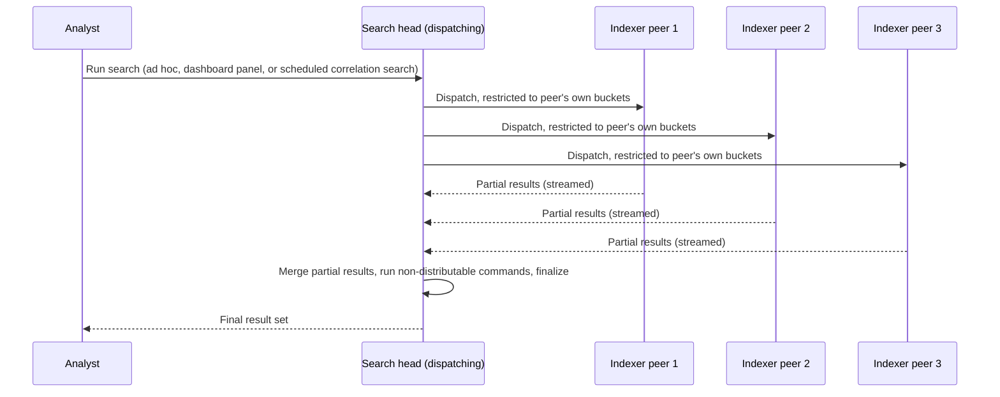
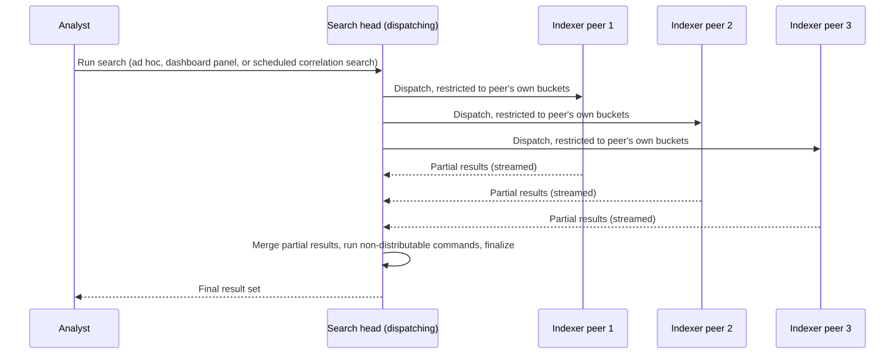
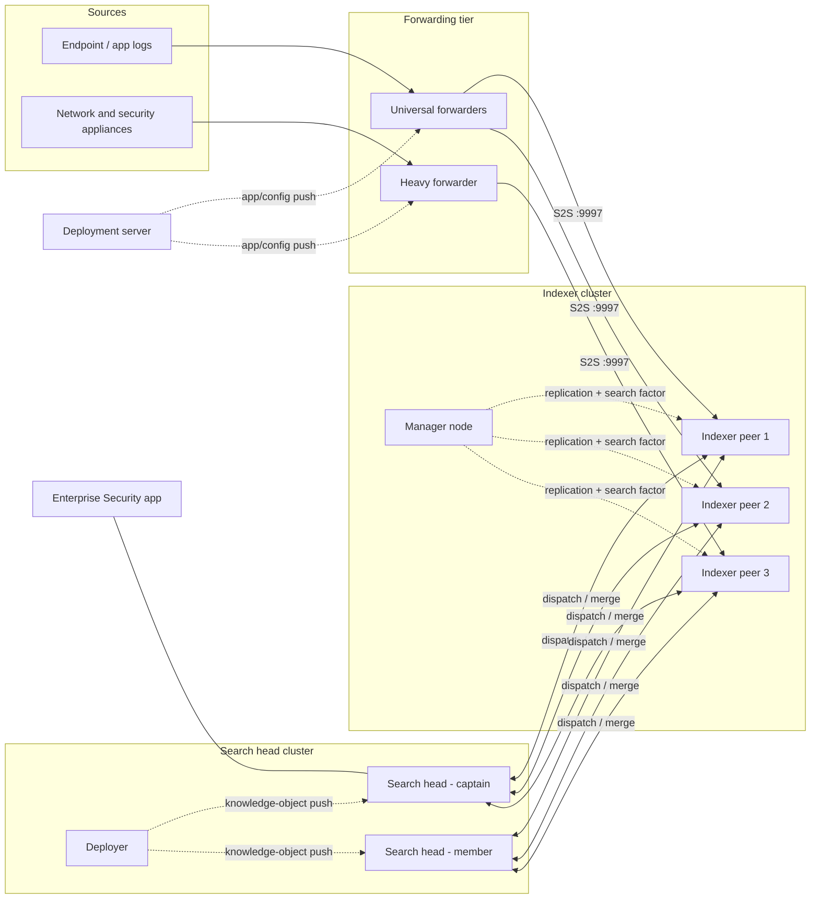

# Part 2 — Splunk Deployment Architecture

## Why this part exists

**[CONCEPT]** DEH Part 26 states its own scope limit plainly: it "does not cover Splunk administration, index/bucket lifecycle management, or `tstats`/data-model acceleration in depth... a full accelerated-search treatment belongs in a dedicated performance-engineering appendix, not here." This book is that appendix, and this part is where it starts, because everything else in the book assumes a topology already exists underneath it. Part 3's bucket lifecycle, Part 4's licensing math, Part 10's acceleration mechanics, Part 12's search-concurrency limits, and every Enterprise Security part from 13 onward all describe things that happen *on* indexers and search heads — none of them make sense until the reader knows what an indexer and a search head actually are, how data gets from an endpoint to one, and how a single search fans out across a fleet of them.

This is a **platform-layer** part, in this book's own platform/operations vocabulary: it covers what Splunk *is*, structurally, not what a SOC does with it. It does not cover index and bucket design (Part 3 owns that), ingest licensing (Part 4), the Common Information Model (Parts 5–7), or how a correlation search actually gets scheduled and throttled (Part 14) — this part hands off to each of those the moment it would need to go deeper than "here is where that thing runs."

DEH Part 26 also owns SPL syntax itself — `stats`, `transaction`, the search-time/index-time field distinction — and DEH Part 23 owns the general query-language-strategy vocabulary (analytic vs. detection rule, Sigma-vs-native tradeoffs) this book's later correlation-search content assumes. Neither is re-taught here. Where this part needs a syntax concept to explain *why* a search behaves differently depending on topology, it names the relevant DEH Part 26 section and moves on.

One more thing follows this book everywhere, including here: no real Splunk deployment exists in this book's evidence base. Every claim below about how a component behaves is sourced from Splunk's own public documentation, product pages, or Splunkbase listings — cited where a specific version or edition fact is involved — or stated as an explicitly labeled conceptual illustration. `STYLE-GUIDE.md` §9.2 makes this the structural default for every figure and code sample in the book; this part is not an exception.

## 1. The core components: indexers, search heads, and forwarders

**[PLATFORM ENGINEER]** A Splunk deployment is built from a small number of role types, and almost every operational question in this book eventually reduces to "which of these roles is doing the work, and where is it running."

An **indexer** is the Splunk instance that parses incoming data into events, writes those events into indexed buckets on disk, and — when a search head asks it to — runs a search against its own locally stored buckets and returns results. Indexing and searching that indexer's own data are both jobs the indexer does; nothing else in the deployment touches those buckets directly.

A **search head** is the Splunk instance an analyst or a scheduled job actually talks to. It doesn't hold the primary copy of indexed data. Instead, it takes a search, works out which indexers ("search peers," in Splunk's own terminology) actually hold data relevant to that search, dispatches the search to each of them, and merges their partial results into one final answer. It also hosts the knowledge objects everything else in this book depends on — saved searches, correlation searches, dashboards, lookups, macros, and apps like Enterprise Security (ES) — Splunk's premium security-analytics app, covered in depth starting at Part 13, which installs on a search head the same way any other app does.

A **universal forwarder** (UF) is a minimal, dedicated build of Splunk whose only job is getting data off an endpoint and onto the wire toward an indexer or an intermediate forwarder. A **heavy forwarder** (HF) is a full Splunk Enterprise instance running in a forwarding role — it can do everything an indexer's parsing pipeline does before the data ever reaches an indexer, and it can index locally as well as forward, though most security deployments configure it purely as a routing/parsing hop. Section 2 works through the practical difference.

A **deployment server** distributes apps and configuration files to a fleet of forwarders (and, less commonly, other components) grouped into named "server classes." It is not itself part of the search or indexing path — it is fleet-management plumbing, covered in Section 3.

> **Engineering Reality**
> A single-instance ("all-in-one") Splunk deployment — one process acting as indexer, search head, and often the only forwarder — is the default shape of an evaluation install, and it stays that way in a lot of small production environments longer than it should. It works fine until either the ingest volume outgrows one indexer's disk/CPU budget or the scheduled-plus-ad-hoc search load outgrows one search head's concurrency limit (Part 12 covers that limit directly). Splitting indexer and search head roles apart — and only then considering clustering either — is the first scaling decision every deployment eventually faces, and doing it reactively, after a Sunday-night correlation search backlog, is worse than doing it on a sizing exercise (Section 8).

The table below compares the roles this section introduces, since a single-instance evaluation install is exactly the case where it's easy to lose track of which role is doing which job.

**Table 2.1 — Splunk deployment component roles at a glance.**

| Component | Primary Job | Holds Indexed Data | Hosts Knowledge Objects | Typical Scale Unit |
|---|---|---|---|---|
| Indexer | Parses, indexes, stores events; executes searches against its own buckets | Yes | No | Indexing volume (GB/day) per peer |
| Search head | Dispatches distributed searches, merges peer results, renders output | No (transient job artifacts only) | Yes — dashboards, saved/correlation searches, apps | Concurrent and scheduled search load |
| Universal forwarder | Tags and forwards data toward an indexer or heavy forwarder | No | No | Endpoint count |
| Heavy forwarder | Parses, conditionally routes, optionally indexes locally, before forwarding onward | Optional | Limited (mainly routing/parsing apps) | Aggregation-point throughput |
| Deployment server | Distributes app/config bundles to registered forwarders | No | No — distributes objects, doesn't run them | Managed client count |

> **Product Version Note**
> Splunk's current release line is in the 10.x series. As of 2026-09-15, Splunkbase listings for
> Enterprise Security (version 8.7.0) and the Common Information Model Add-on (version 8.7.0),
> both last updated 2026-09-02, list compatibility with Splunk platform versions 10.5 down through
> 10.2 — the CIM Add-on's listing additionally extends compatibility back to 9.4 (REFERENCES.md
> entries [ES-SPLUNKBASE] and [SPLUNKBASE-CIM-ADDON]). What would make this stale: any new
> Splunk Enterprise major/minor release, or either app publishing a new version with a different
> compatibility floor — re-check the current Splunkbase listing before assuming a given
> environment's version is still inside the supported range for whichever app you're deploying.

## 2. Universal forwarders and heavy forwarders: what actually crosses the wire

**[PLATFORM ENGINEER]** A universal forwarder tags each event with `host`, `source`, and `sourcetype` metadata and ships it toward an indexer (or an intermediate heavy forwarder) over Splunk's own forwarder-to-indexer protocol, conventionally on TCP port 9997. It deliberately does not run the heavier parts of the event-processing pipeline — the line-breaking heuristics, `SEDCMD` masking, and structured-data extraction that a full Splunk instance applies. Splunk's own longstanding operational guidance is to keep that heavier parsing work on the indexing tier (or an intermediate heavy forwarder) rather than the forwarder, precisely because a universal forwarder's whole value proposition is a small, stable, low-privilege footprint running on tens of thousands of endpoints you'd rather not have to individually tune.

A heavy forwarder exists for the cases where that light-touch model doesn't fit. Two concrete examples: routing decisions that need to happen before data lands in an index — sending one sourcetype to a restricted, RBAC-scoped index and another to a general one, based on content rather than just source — need a full parsing pipeline to make that call, and syslog aggregation for network and security appliances that speak UDP/TCP syslog rather than writing to a local file needs a listening service a universal forwarder isn't built to run. Splunk DB Connect is a sharper example still: it requires a full Splunk Enterprise instance (a heavy forwarder, a search head, or an indexer) because its modular input needs a Java runtime and app framework a universal forwarder's minimal build doesn't include.

> **Engineering Reality**
> "Forwarder" is not one tier of cost and one tier of behavior — a heavy forwarder is a full Splunk Enterprise instance, licensed and administered like one, running in a mode where forwarding happens to be its main job. Treat it in your capacity planning like the indexer-adjacent component it actually is, not like a slightly heavier universal forwarder. Part 4 covers how ingest volume actually gets metered through a topology like this; this part is only naming where the parsing decision gets made, not what it costs on your license.

## 3. Deployment servers and app distribution

**[PLATFORM ENGINEER]** Once a fleet of forwarders exists, someone has to push app updates — a new Technology Add-on (TA) version, a `props.conf` fix, a new `outputs.conf` target — to all of them without touching each one by hand. That's the deployment server's entire job, and it's a push-on-checkin model, not a live push: a forwarder configured as a deployment client polls its deployment server periodically and pulls whatever app bundles are currently assigned to it.

On the forwarder side, `deploymentclient.conf` points the instance at its deployment server:

CONCEPTUAL SAMPLE — illustrative stanza shape, not captured from a running deployment.
```ini
[deployment-client]

[target-broker:deploymentServer]
targetUri = deploymentserver.internal.example:8089
```

### serverclass.conf — grouping forwarders for app distribution

On the deployment server side, `serverclass.conf` defines named server classes — groups of clients matched by hostname pattern, DNS name, or an explicit `clientName` the forwarder sets in its own `deploymentclient.conf` — and maps each class to the apps it should receive:

CONCEPTUAL SAMPLE — illustrative stanza shape, not captured from a running deployment.
```ini
[serverClass:security_endpoint_forwarders]
whitelist.0 = *

[serverClass:security_endpoint_forwarders:app:TA-windows]
```
This is a fan-out mechanism, not a search-path component — a forwarder that never checks in still forwards whatever data it's already configured to forward with whatever app version it already has; it just stops receiving updates. That failure mode is quiet rather than loud, which is exactly why it's worth naming: a TA that silently stops matching a renamed field after an upstream log-format change (the failure mode Part 7 covers directly) can just as easily be explained by a forwarder that stopped checking in months ago and never picked up the fix.

> **Engineering Reality**
> The deployment server manages *forwarders*, not search heads or indexers as a general configuration-management tool — trying to use it as your only mechanism for pushing knowledge-object changes to a search head cluster is fighting the tool. Search head clusters have their own distribution mechanism, the deployer, covered in Section 5, and it is a different piece of infrastructure with a different job, not a renamed version of the same one.

## 4. Indexer clustering: replication, search factor, and what "highly available" actually buys you

**[PLATFORM ENGINEER]** An indexer cluster is a group of indexers ("peer nodes") that replicate each other's data, coordinated by a dedicated manager node.

> **Product Version Note**
> This book uses Splunk's current terminology, the manager node, for the indexer-cluster coordinator
> role. Splunk renamed this role from its earlier name, the cluster master; some older Splunk
> documentation, third-party material, and community discussion still use that older term. This
> book's research tooling could not reach `docs.splunk.com` directly to pin the specific version at
> which the rename took effect (`STYLE-GUIDE.md` §9.4 records this as a standing constraint on that
> tooling), so treat the rename itself as real but its exact version boundary as unverified here.
> What would make this stale: either term becoming exclusively current, or a further rename — confirm
> which term the documentation set for your own deployed version actually uses before assuming either
> name is current for it.

Two numbers define what a cluster actually protects against: the **replication factor** (RF) is how many raw copies of each bucket the cluster keeps across peers, and the **search factor** (SF) is how many of those copies are additionally made fully searchable — with their own index-time metadata files built, not just the raw journal — where SF is always less than or equal to RF. A peer holding a bucket copy that counts toward RF but not SF has the raw data for replication/disaster-recovery purposes but can't serve a search against it until it's promoted. Multisite clustering extends the same RF/SF model per site, so a deployment can guarantee, for example, that losing an entire data center still leaves a searchable copy of every bucket somewhere.

### server.conf — declaring a node's clustering role

Each peer and the manager node declare their clustering role in `server.conf`'s `[clustering]` stanza:

CONCEPTUAL SAMPLE — illustrative stanza shape, not captured from a running deployment.
```ini
# On the manager node
[clustering]
mode = manager
replication_factor = 3
search_factor = 2
pass4SymmKey = <shared-secret>
```

CONCEPTUAL SAMPLE — illustrative stanza shape, not captured from a running deployment.
```ini
# On a peer node
[clustering]
mode = peer
manager_uri = https://cm.internal.example:8089
pass4SymmKey = <shared-secret>
```
The specific `replication_factor`/`search_factor` values above are illustrative, not a recommended default — there is no factory-set value that fits every environment; both are sizing decisions made against retention requirements (Part 3) and available disk, not values to copy from a worked example.

> **Engineering Reality**
> Replication is not a free insurance policy — it is disk, multiplied. A replication factor of 3 means three full copies of every bucket's raw data somewhere in the cluster, and a search factor of 2 means two of those three additionally carry the searchable index files, which themselves consume meaningful additional disk on top of the raw data they index (the same accounting problem Part 10 covers for data-model acceleration's `tsidx` summaries). Budget storage for RF copies from the start of a sizing exercise, not as a surprise after the first peer fills its disk.

## 5. Search head clustering: the deployer, the captain, and what actually replicates

**[PLATFORM ENGINEER]** A search head cluster (SHC) is a group of search heads that share configuration and knowledge objects and present a single logical search-head identity to the rest of the deployment, even though any member can serve a given search. Two mechanisms make that work, and they are easy to conflate with similarly-named things elsewhere in the topology.

The **deployer** is a separate Splunk instance — not itself a cluster member — whose job is pushing apps and configuration bundles to every member of the search head cluster. Despite the name similarity, it is not the deployment server from Section 3; the deployment server manages forwarders, the deployer manages search head cluster members, and they are configured, and administered, independently.

The **captain** is one cluster member, dynamically elected among the members, that takes on a small number of cluster-coordination responsibilities beyond just serving searches — most relevantly for this book, it's the captain that ensures a given scheduled search runs exactly once across the cluster on its configured schedule, rather than once per member. Captain status can move to a different member (an election, whether from a clean failover or the member holding captaincy becoming unreachable).

**[DETECTION ENGINEER]** This matters directly for correlation-search troubleshooting, not just cluster administration: a correlation search scheduled on a search head cluster is coordinated by whichever member currently holds captaincy, not by every member independently. A captain election happening mid-cycle — a rolling upgrade, a network blip, a manual failover during maintenance — can delay or, depending on the search's own skip-if-still-running and scheduling-priority settings (Part 12 covers both), cause that cycle to be skipped outright. "Why didn't the notable fire this hour" is sometimes a captain-transition question before it's a correlation-search-logic question.

> **Engineering Reality**
> A search head cluster buys continuity of the search-head *role*, not zero scheduling disruption during a transition. Treat a captain election as a brief, expected gap in coordinated scheduling, not a bug — and treat repeated, frequent elections (rather than occasional ones tied to actual maintenance or failure events) as the actual signal worth investigating, since that pattern usually points at a network or resource problem on one or more members rather than anything about the scheduled content itself.

## 6. Distributed search: how a search actually gets planned and executed

**[PLATFORM ENGINEER]** A search head doesn't run a search itself in the way an indexer does — it plans one, dispatches pieces of it, and assembles the answer. This is the mechanism that makes every correlation search, dashboard panel, and ad hoc investigation in later parts of this book actually execute against real data, and it's worth being explicit about the two phases involved, since they behave differently and fail differently.

In the dispatch phase, the search head determines which indexers are relevant search peers for the query (an indexer cluster's manager node maintains the peer list the search head consults) and sends each of them the parts of the search that can run locally against that peer's own buckets. In the execution phase, each peer runs its portion in parallel against only the data it actually holds, streaming partial results back as it goes rather than waiting to finish before responding. In the merge phase, the search head combines every peer's partial results, runs whatever commands in the search can't be split across peers this way, and finalizes the result set the analyst or the correlation search actually sees.

DEH Part 26 §1.2 already covers the search-time/index-time field split at the language level; the distributed-search consequence of that split is that field extraction happening at search time runs on whichever machine is actually evaluating the search — the peer, for anything pushed down to it, or the search head, for anything that has to wait for the merge. Which SPL commands can be pushed down to peers and which force a wait for the full merged result set is exactly DEH Part 26 §1.1's "cost is paid left to right" principle; this part only introduces the two-phase shape that principle operates inside, and Part 12 applies it at fleet scale rather than single-query scale.

The following illustrates the shape without re-deriving `stats` syntax, which DEH Part 26 §2 already owns:

CONCEPTUAL SAMPLE — illustrative query shape, not a captured production search.
```spl
index=network_traffic sourcetype=cisco:asa
| stats count by src_ip, dest_ip
| sort - count
```
The `search` and the `stats` immediately after it can both run independently on every peer holding `index=network_traffic` buckets, each peer contributing its own partial count table for the fields it actually has. The `sort` cannot run that way — it has to wait until the search head has merged every peer's partial `stats` output into one table, because sorting requires seeing the complete result set at once. A search built almost entirely of commands like the first two is cheap at scale; a search that front-loads a command with `sort`'s requirement is not, regardless of how small the query looks on the page.

**Figure 2.2 — Distributed search dispatch and merge.** *CONCEPTUAL.* Illustrates the expected sequence from a search head's dispatch of a search across three indexer peers through partial-result streaming and final merge. This is a sequence diagram of documented expected behavior, not a capture from a real Splunk job inspector or a live deployment — none exists in this book's evidence base (see `STYLE-GUIDE.md` §9.2).






A search built against an accelerated data model instead of raw buckets — using `tstats`, named but deliberately not taught at the syntax level in DEH Part 26 §1.3 — changes this picture by having each peer read from a pre-built summary rather than raw events. Part 10 of this book is where that mechanism, and its own cost and coverage tradeoffs, gets covered in depth; this part's job was only to establish the dispatch/merge shape that acceleration modifies rather than replaces.

## 7. On-premises Splunk Enterprise vs. Splunk Cloud Platform: what changes, what doesn't

**[PLATFORM ENGINEER]** Everything in Sections 1–6 describes the search/indexing model itself, and that model doesn't change between running Splunk Enterprise on infrastructure you operate and running Splunk Cloud Platform, Splunk's managed offering. Splunk's own framing of Splunk Cloud Platform is explicit that the operational burden, not the architecture, is what moves: Splunk states that its own personnel "manage your IT backend so you can focus on acting on your data, while our platform scales to your analytics needs" (REFERENCES.md entry [SPLUNK-CLOUD-PRODUCT-PAGE]). Concretely, that means Splunk operates the indexing and much of the search-head tier's underlying infrastructure, handles its scaling, and applies platform patching — work that, on-premises, is the customer's own responsibility end to end.

What doesn't change is the authoring surface: correlation searches, dashboards, lookups, and macros are still built the same way, in the same Splunk Web, on either. What does change beyond infrastructure ownership is *administrative reach* — direct filesystem and `server.conf`-level access that's routine on a self-managed Splunk Enterprise instance is either unavailable or replaced by a narrower, API-mediated path (Splunk's Admin Config Service, or a support case for anything that API doesn't cover) on Splunk Cloud Platform. Data still arrives the same two ways either deployment supports — forwarders (universal or heavy) or the HTTP Event Collector (HEC) — just pointed at a cloud-hosted indexing tier instead of one you run yourself.

**Table 2.2 — On-premises Splunk Enterprise vs. Splunk Cloud Platform: who controls what.** Choosing between the two is a decision about who operates the infrastructure this part describes, not a difference in the underlying search/indexing model — the table states what actually moves.

| Responsibility | On-Premises Splunk Enterprise | Splunk Cloud Platform |
|---|---|---|
| Indexer/search-head OS and infrastructure | Customer | Splunk |
| Indexer/search-head clustering configuration | Customer, direct `server.conf` access | Splunk-managed; topology is visible, not customer-edited at the `server.conf` level |
| App installation | Direct install of any Splunkbase or custom app | Self-service for vetted apps; others require Splunk review before install |
| Configuration below the knowledge-object layer (`limits.conf`, most `server.conf` stanzas) | Direct file access | Admin Config Service API/CLI where exposed, a support case otherwise |
| Correlation searches, dashboards, lookups, macros | Customer, authored in Splunk Web | Customer, authored in Splunk Web — same surface |
| Data ingestion path | Forwarders or HEC, pointed at self-hosted indexers | Forwarders or HEC, pointed at the cloud-hosted indexing tier |

> **Product Version Note**
> Splunk Cloud Platform's own internal architecture — how elastically its indexing and search tiers scale independently, and exactly which administrative settings are self-service through the Admin Config Service versus support-case-only — has changed over the product's history and should be expected to keep changing. This book could not reach Splunk's own documentation domain to verify current specifics (`STYLE-GUIDE.md` §9.4 records this as a standing constraint on this book's research tooling); the managed-service framing above is confirmed only at the level Splunk's own product page states it, as of 2026-09-15 (REFERENCES.md entry [SPLUNK-CLOUD-PRODUCT-PAGE]). Confirm the current administrative boundary against your own Splunk Cloud Platform tenant's documentation before assuming any specific setting is or isn't self-service.

**[SOC MANAGEMENT]** The on-prem-versus-Cloud choice is a real infrastructure build-versus-buy decision with staffing and cost consequences on both sides — a self-managed cluster needs someone who can run one; a managed one trades that staffing cost for a recurring service cost and less direct control. Part 4 covers the licensing and ingest-economics side of that tradeoff in the depth it deserves; this part is only naming that the decision exists and pointing at where the cost analysis actually lives.

**Figure 2.1 — Splunk distributed deployment topology, sources through Enterprise Security.** *CONCEPTUAL.* Illustrates the components covered in Sections 1–5 and how they connect: forwarders feeding an indexer cluster coordinated by a manager node, a deployment server managing the forwarder fleet, and a search head cluster (managed by a deployer, with one member acting as captain) dispatching searches against the indexer tier and hosting the Enterprise Security app. This is an architecture sketch of documented component relationships, not a capture from a real deployment — see `STYLE-GUIDE.md` §9.2.






## 8. Sizing a deployment for a security workload

**[PLATFORM ENGINEER]** Sizing a topology like the one this part describes comes down to four inputs feeding back into the components already covered: daily ingest volume (indexer disk and CPU, and Part 4's license), retention requirements by index (Part 3's bucket lifecycle), how much of that data will sit behind accelerated data models (Part 10's storage and maintenance cost), and — the input most often underestimated for a security-specific deployment — the scheduled-search load Enterprise Security itself adds once it's installed.

**[SOC MANAGEMENT]** That last input is the one worth naming explicitly, because it's easy to size a search head tier for the ad hoc investigation load a team of analysts generates and then discover that ES's own scheduled correlation searches — potentially dozens to low hundreds of them, each on its own cadence, once a reasonably complete detection content set is enabled — are competing for the same concurrent-search budget. Sizing "for search," not just "for ingest," is the mistake that under-sizes a SOC's search head tier; Part 12 covers the concurrency limits and scheduling-priority mechanics that make this concrete.

> **Engineering Reality**
> An Enterprise Security deployment's baseline scheduled-search load exists from the moment a reasonable set of correlation searches is enabled, independent of how much ad hoc searching anyone does on top of it. Treat that baseline as a fixed cost to size against from day one, not a variable that only shows up once analysts start actively hunting.

> **What Would Change My Mind**
> This section stays deliberately qualitative — it names the inputs to a sizing decision without giving a specific "GB per core" or "searches per search head" formula, because this book has no real Splunk deployment to benchmark those numbers against, and inventing a specific figure without evidence behind it would be exactly the kind of unsupported claim `STYLE-GUIDE.md` §9.4 rules out. A real Splunk lab, ingesting a representative security-telemetry mix and instrumented over an actual retention window with ES's own scheduled content running against it, is what would let this section move from naming inputs to giving numbers — Part 20 names this same gap as one of the book's largest open items.

## Cross-references

- DEH Part 26 §1.1 ("cost is paid left to right") and §1.2 (search-time/index-time field split) — the language-level foundation for Section 6's distributed-search dispatch/merge model; Part 12 of this book applies §1.1's principle at fleet scale.
- DEH Part 26 §1.3 — the named-but-undeveloped `tstats` forward reference this book resolves in Part 10.
- DEH Part 23 §1 — the analytic-vs-detection-rule vocabulary this book's correlation-search content (Part 14) assumes; not used directly in this part but load-bearing for what runs on the search heads this part describes.
- This book's Part 1 — states the general non-duplication boundary against DEH Parts 23 and 26 that this part applies specifically to deployment topology.
- This book's Part 3 (indexes, sourcetypes, bucket lifecycle), Part 4 (licensing and ingest economics), Part 10 (data model and report acceleration), Part 12 (search performance and tuning at scale), and Part 13 (Enterprise Security architecture and editions) — each owns depth this part deliberately deferred to.
