# Part 3 — Indexes, Sourcetypes, and the Bucket Lifecycle

## Why this part exists

DEH Part 26's own introductory scope note is explicit about what it chose not to cover: it "does not cover Splunk administration, index/bucket lifecycle management, or `tstats`/data-model acceleration in depth... a full accelerated-search treatment belongs in a dedicated performance-engineering appendix, not here." This part is the first half of that appendix, expanded into full chapter depth. It assumes you already know how to write a search — DEH Part 26 owns `stats`, `transaction`, subsearch cost, and the search-time-vs-index-time field split at the language level, and DEH Part 23 owns the Analytic-vs-Detection-Rule vocabulary this book's own correlation-search content (Part 14 onward) will lean on. Neither is re-taught here.

What this part owns instead: the storage layer every one of those searches runs against. An index is not a cosmetic label you type after `index=` — it is a named, access-controlled, independently-retained collection of data on disk, and the decisions you make about index design determine who can see what, how long it survives, and whether a retention or compliance requirement is actually enforced or just aspirational. A sourcetype is a different, easily confused thing: a parsing contract, not a storage boundary, and one that can silently drift out from under a running detection without anyone touching the detection itself. Underneath both sits the bucket — the actual physical unit Splunk ages, compresses, moves, and eventually deletes or archives, on a clock that runs whether or not anyone is searching.

This part explicitly defers three things to their own parts rather than covering them here: the cost and licensing side of index sizing (Part 4), how a sourcetype's fields become a queryable CIM data model (Parts 5–7), and `tstats`/data-model acceleration performance (Part 10, resolving the forward reference DEH Part 26 §1.3 names but doesn't develop). What follows is scoped to the platform mechanics underneath all of those: index and sourcetype architecture, and the bucket lifecycle that makes retention a real, physically-enforced thing rather than a setting you configure once and trust.

---

## 1. The index as a security boundary

**[CONCEPT]** An index is the largest unit of data organization Splunk exposes to an administrator, and it is defined by where its data physically lives and who is allowed to search it — not by what the data is about. Two log sources describing completely unrelated systems can share an index; two log sources describing the same system cannot safely share an index if they need different retention or different access control, because both of those are properties of the index, not the event. This is the single fact this part keeps returning to: an index is a security and retention boundary first, and a convenient query filter only as a side effect of that.

### 1.1 What an index actually is

**[CONCEPT]** Mechanically, an index is a named directory tree containing a set of buckets (§5), each bucket holding a contiguous range of indexed events plus the compressed raw data and index structures (`.tsidx` files) Splunk uses to search it. Every event lands in exactly one index, assigned either by whatever `index=` value a forwarder's outputs configuration specifies or by an explicit `props.conf`/`transforms.conf` routing rule at the parsing tier. Once an event is written into a bucket in an index, moving it to a different index is not a metadata edit — it requires re-ingesting the underlying data, because the index assignment, like the sourcetype assignment covered in §3, is baked into the bucket at write time.

### 1.2 Default indexes, and why `main` is not a security boundary

**[PLATFORM ENGINEER]** A stock Splunk installation ships several indexes out of the box, most visibly `main` (the default destination for any data source that isn't explicitly routed elsewhere), `_internal` (Splunk's own operational logging — the platform monitoring itself), `_audit` (search and configuration-change auditing), and `_introspection` (host resource metrics). `main` is the one that causes the most avoidable damage: it is the path of least resistance for a new data source's onboarding, and because it's the default, it accumulates whatever nobody made an explicit decision about. A security team that lets Windows authentication logs, a vulnerability scanner's findings feed, and a noisy IoT device's syslog all land in `main` by default inheritance has, without anyone deciding it on purpose, given every role with access to `main` visibility into all three, and locked all three into whatever single retention setting `main` carries. Treat `main` as a place things end up, not a place you designed.

### 1.3 Sourcetype vs. index: two different axes

**[CONCEPT]** It's worth being precise about this distinction early, because the rest of this part depends on readers not conflating the two: an index is a storage and access-control boundary, and a sourcetype (`sourcetype=WinEventLog:Security`, `sourcetype=aws:cloudtrail`) is a parsing and field-extraction label describing what format an event is in. Two events with the same sourcetype can live in different indexes (Windows Security events from a PCI-scoped domain controller vs. a general one); two events in the same index can carry different sourcetypes (a SOC's `security` index routinely holds dozens of distinct sourcetypes side by side). Confusing the two leads to two different design mistakes: trying to enforce access control with sourcetype filters in a search (which a user with broad index access can simply omit), or trying to isolate retention by sourcetype within a shared index (which doesn't work, because retention settings apply to the whole index — see §2.1).

---

## 2. Designing indexes around retention and access control

**[PLATFORM ENGINEER]** The two properties that actually make index design a security decision — not just a storage-tidiness one — are retention and role-based access control. Both are configured per index, both are enforced by the platform independently of any individual search, and both are the reason "which index does this data go in" deserves a deliberate answer before ingestion starts, not an after-the-fact cleanup project.

### 2.1 Retention is index-scoped, not source-scoped

**[PLATFORM ENGINEER]** Every retention-relevant setting this part discusses in §4 — `frozenTimePeriodInSecs`, `maxTotalDataSizeMB`, `coldToFrozenDir` — lives in an `indexes.conf` stanza for one named index and applies to everything stored under it. There is no per-sourcetype or per-source override sitting underneath that; if two data sources with genuinely different legal or operational retention requirements share an index, the index's single retention clock governs both, and it will be either too short for the one that needed to be kept longer, or too long (with the storage and license cost that implies — Part 4) for the one that didn't need to be. This isn't a limitation you work around with a clever search-time filter; a search's time range only decides what a given query looks at among data that still physically exists (§6.2 has the sharp version of this).

> **Engineering Reality**
> The team that puts "temporary" debug-level application logs and a year-mandated compliance log into the same index because "it's just easier to manage one index" is not choosing a compromise between two retention needs — they're choosing the debug logs' short retention requirement or the compliance logs' long one, and whichever one loses stays lost even if a later audit needs it. Splitting a shared index after the fact doesn't retroactively fix already-indexed data: the events already written stay under the old index's settings until they age out or get manually migrated, which for a compliance requirement means the exposure already happened by the time anyone notices the mistake.

### 2.2 `authorize.conf` — the file that actually enforces index-level RBAC

**[PLATFORM ENGINEER]** Splunk's role-based access control for search scope is configured in `authorize.conf`, through two settings on a role stanza: `srchIndexesAllowed`, the list of indexes (wildcards permitted) a role is permitted to search at all, and `srchIndexesDefault`, the indexes a search scans automatically when a user doesn't type an explicit `index=` clause. A role with `srchIndexesAllowed = security_*` cannot see events in an index outside that pattern no matter what SPL it runs — this is enforced below the query, at the same layer that decides which buckets a search is even allowed to open, not by filtering results after the fact.

CONCEPTUAL SAMPLE — illustrative role stanza; field values are representative, not reproduced from a running deployment.

```ini
[role_soc_tier1]
srchIndexesAllowed = security_endpoint;security_network;security_auth
srchIndexesDefault  = security_endpoint;security_network;security_auth
importRoles         = user

[role_pci_auditor]
srchIndexesAllowed = pci_cardholder_data
srchIndexesDefault  = pci_cardholder_data
importRoles         = user
```

**[PLATFORM ENGINEER]** The failure mode to watch for is `importRoles` inheritance stacking `srchIndexesAllowed` values across roles a user holds simultaneously: Splunk unions the allowed-index lists of every role a user is assigned, so a tier-1 analyst who also picks up an unrelated role granted broad access (a shared "read-only-everything" role created for a one-off investigation and never revoked) inherits that role's index scope permanently, silently, and outside whatever review process governs the tier-1 role itself. Index-level RBAC is only as tight as the least-reviewed role a user has ever been assigned.

### 2.3 Multi-tenancy and sensitivity segregation

**[PLATFORM ENGINEER]** The same mechanism that isolates one compliance domain from another scales directly into multi-tenant separation — an MSSP SOC running detection content across multiple customers, or a single enterprise segregating a regulated business unit's data from the rest of the company, both use index-per-tenant (or index-per-sensitivity-tier) as the enforcement boundary, paired with `srchIndexesAllowed` scoped per tenant's role. The table below is the decision matrix this part uses to answer "does this new data source need its own index," and it's worth working through explicitly rather than defaulting to `main` or to whatever index the last onboarding used.

The table below supports the index-vs-sourcetype design decision a platform engineer makes at onboarding time, before the first event from a new source is written.

| Decision Driver | Same Index OK? | Why |
|---|---|---|
| Retention requirement differs materially (e.g., 30 days vs. multi-year) | No | `frozenTimePeriodInSecs` and size caps (§4.3) apply per index; the whole index inherits one retention clock |
| Access-control boundary differs (e.g., regulated cardholder data vs. general infrastructure logs) | No | `srchIndexesAllowed` grants at index granularity; there is no sub-index search scope |
| Multi-tenant or MSSP customer separation | No | Tenant isolation is a hard requirement here, not a preference, and index-level RBAC is the mechanism that actually enforces it |
| Same retention, same RBAC, different `sourcetype` | Yes | Sourcetype and index are independent axes (§1.3); splitting on sourcetype alone adds administrative overhead with no isolation benefit |
| Very high-volume source vs. low-volume source, same retention/RBAC, little query overlap | Consider | Isolating the high-volume source limits how many small, low-value buckets a broad search across the low-volume index has to open |

---

## 3. Sourcetype assignment and drift

**[PLATFORM ENGINEER]** A sourcetype is Splunk's label for "what format is this data in," and it drives which field extractions, event-type tags, and (eventually) CIM mappings (Parts 5–7) apply to an event. Getting sourcetype assignment right matters as much as getting index assignment right — the difference is that a sourcetype mistake tends to fail quietly, months after everyone stopped thinking about it, rather than immediately and visibly the way a wrong `index=` in an RBAC-restricted search does.

### 3.1 `props.conf` and `transforms.conf` — where sourcetype actually gets assigned

**[PLATFORM ENGINEER]** Sourcetype is normally assigned by a forwarder's monitor stanza (a fixed value per file or input) or, for data that needs conditional assignment based on content, by a `transforms.conf` stanza with `DEST_KEY = MetaData:Sourcetype` referenced from a `props.conf` `TRANSFORMS-<class>` line. Assignment happens at the parsing tier — a heavy forwarder or the indexer's own parsing queue — and once it's written into a bucket, it's part of that event's fixed metadata alongside `_time`, `host`, and `source` (the same index-time-vs-search-time boundary DEH Part 26 §1.2 covers for individual fields applies to sourcetype itself: it is fixed at index time, and changing the assignment logic going forward does nothing to events already on disk). Retroactively correcting a misassigned sourcetype for historical data means re-ingesting that data under the corrected rule, not editing a config and waiting.

### 3.2 Sourcetype drift: when a TA upgrade breaks a running detection

**[PLATFORM ENGINEER]** Most sourcetype assignment in a real deployment doesn't come from hand-written `props.conf`/`transforms.conf` — it comes from a Splunk-supported or community Technology Add-on (TA) that ships its own parsing rules for a specific vendor product. That's a maintenance dependency, not a one-time install: a TA upgrade can rename a sourcetype, split one sourcetype into several by log-channel, or change a field extraction's regex to match a vendor's new log format, and none of those changes announce themselves — the upgrade completes cleanly, new data keeps flowing, and it just stops matching whatever `sourcetype=` literal is hardcoded into any correlation search, macro, or dashboard panel written against the old name.

> **Detection Autopsy — "the notable that stopped firing after a TA version bump"**
>
> This illustrates a failure mode that follows mechanically from how TA-versioned sourcetype naming works (§3.2), not a single cited incident — no specific conference talk or TA changelog is cited here, so per STYLE-GUIDE.md §9.4 this box should be read as a CONCEPTUAL composite pattern rather than a verified, publicly-documented case study, pending a citable source in REFERENCES.md.
>
> **The rule:** A correlation search filters on a literal `sourcetype=cisco:asa` (or an equivalent vendor-specific value) as its primary scoping term.
>
> **Why it shipped:** The value was correct at the time the rule was written, validated against the TA version installed then, and nobody expected a minor-version TA update to touch sourcetype naming.
>
> **How it failed:** A TA update reorganizes its sourcetype scheme — commonly splitting one broad sourcetype into several more specific ones, or renaming it to match a new vendor product line — and every saved search hardcoded against the old literal value returns zero results from that point forward. The search still runs on schedule, still completes without error, and reports nothing wrong, because an empty result set and "no matching events occurred" are indistinguishable to a scheduled search with no independent health check.
>
> **The fix:** A parser/sourcetype-health monitor — a scheduled search using `| metadata type=sourcetypes index=<index>` to track each index's live sourcetype list and each one's `recentTime`, alerting when an expected sourcetype's `recentTime` goes stale or an unexpected new one appears — catches this within a monitoring cycle instead of at the next incident review, the same principle DEH Part 26's own Detection Autopsy applies to a broken field extraction rather than a renamed sourcetype.

**[DETECTION ENGINEER]** The consequence for a correlation search built on top of a CIM data model (Parts 5–7) rather than a raw sourcetype literal is narrower but not zero: CIM compliance is enforced through `tags.conf`/`eventtypes.conf` mappings tied to the sourcetype, so a renamed sourcetype has to be re-tagged into the relevant data model before it contributes to that model's search results again — a step a TA upgrade does not do for you automatically unless the TA itself ships updated CIM mappings for its new sourcetype names. A correlation search written directly against a data model rather than a hardcoded sourcetype degrades to "silently missing one data source's contribution" instead of "returns zero results," which is a smaller failure but not a self-announcing one either.

---

## 4. `indexes.conf` — where storage tiers and retention actually live

**[PLATFORM ENGINEER]** Every retention and storage-tiering decision described conceptually in §1–§2 is configured in one place: an `indexes.conf` stanza named for the index it governs. This is also where the bucket-lifecycle mechanics in §5 get their actual trigger values.

CONCEPTUAL SAMPLE — illustrative stanza combining commonly-used settings; numeric values shown are one admin's chosen configuration, not Splunk's factory defaults for any particular version.

```ini
[pci_cardholder_data]
homePath              = $SPLUNK_DB/pci_cardholder_data/db
coldPath               = $SPLUNK_DB/pci_cardholder_data/colddb
thawedPath             = $SPLUNK_DB/pci_cardholder_data/thaweddb
maxDataSize            = auto_high_volume
maxHotBuckets          = 3
maxWarmDBCount         = 300
frozenTimePeriodInSecs = 94608000
maxTotalDataSizeMB     = 512000
coldToFrozenDir        = $SPLUNK_DB/pci_cardholder_data/frozendb
```

### 4.1 Storage-tier paths: `homePath`, `coldPath`, `thawedPath`

**[PLATFORM ENGINEER]** `homePath` is where an index's hot and warm buckets live — typically the fastest storage available, since hot buckets are being actively written and both hot and warm buckets are fully searchable and queried the most. `coldPath` is where buckets roll to once they age out of the warm tier; it's common (and a legitimate cost lever — Part 4) to point `coldPath` at slower, cheaper storage, since cold buckets are still searchable but statistically queried far less often than recent data. `thawedPath` is not part of the automatic lifecycle at all — it's the destination an administrator manually restores an archived frozen bucket into when older data needs to become searchable again for a specific investigation, and Splunk does not manage anything placed there under the index's ordinary retention clock.

### 4.2 Sizing and rolling: `maxDataSize`, `maxHotBuckets`, `maxWarmDBCount`

**[PLATFORM ENGINEER]** `maxDataSize` bounds how large a single hot bucket is allowed to grow before Splunk rolls it to warm; `maxHotBuckets` bounds how many hot buckets an index may have open for writing at once; `maxWarmDBCount` bounds how many warm buckets accumulate before the oldest ones roll to cold. The exact numeric defaults for these settings have shifted across Splunk's release history — confirm the literal current values against the `indexes.conf.spec` shipped with your installed version rather than trusting a number quoted from a training deck, a blog post, or, for that matter, this chapter.

### 4.3 Aging out: `frozenTimePeriodInSecs`, `maxTotalDataSizeMB`, `coldToFrozenDir`

**[PLATFORM ENGINEER]** `frozenTimePeriodInSecs` is the age threshold (in seconds) past which a bucket becomes eligible to roll from cold to frozen; `maxTotalDataSizeMB` is an independent, size-based cap on the index's total on-disk footprint that can force the oldest buckets to freeze early even if they haven't yet reached the age threshold. `coldToFrozenDir` (or, for more complex handling, `coldToFrozenScript`) determines what "frozen" actually means for that index: if set, frozen buckets are archived to the named location instead of deleted; if unset, Splunk's default behavior on freezing is deletion. An index with neither setting configured is not retaining its old data somewhere safe by default — it is deleting it once the age or size threshold is crossed, permanently, with no separate confirmation step.

> **Blind Spot**
> Splunk's shipped default retention settings favor keeping data over deleting it, which sounds safe until you notice what that actually means operationally: an administrator who never touches `frozenTimePeriodInSecs` has not chosen "no retention policy" — they've chosen whatever multi-year default ships with their installed version, silently accumulating storage cost against the license (Part 4) with no one having made that a deliberate decision. The opposite failure is just as real and less obvious: `maxTotalDataSizeMB` (or a volume-level size cap) is a hard ceiling that freezes the *oldest* buckets first regardless of whether that violates a compliance mandate to *keep* a minimum retention window. A legal or regulatory requirement to retain twelve months of authentication logs is not satisfied by "we never set a retention limit" if the index quietly hit its size cap at month seven and started freezing the oldest data anyway — disk pressure enforces itself even when nobody configured it to.

---

## 5. Bucket states: hot, warm, cold, frozen, thawed

**[CONCEPT]** The bucket is the actual unit Splunk manages — a directory holding a contiguous range of events' raw data and search indexes for one time span within one index. Every index-level setting in §4 exists to control when and how a bucket moves between five states.

```mermaid
stateDiagram-v2
    [*] --> Hot: new events written; index has one\nor more open, writable hot buckets
    Hot --> Warm: maxDataSize reached, maxHotBuckets\nexceeded, or splunkd restarts and rolls the bucket
    Warm --> Cold: maxWarmDBCount exceeded for the index
    Cold --> Frozen: bucket age passes frozenTimePeriodInSecs,\nor an index/volume size cap is exceeded
    Frozen --> Deleted: no coldToFrozenDir / coldToFrozenScript configured
    Frozen --> Archived: coldToFrozenDir or coldToFrozenScript configured
    Archived --> Thawed: administrator manually restores\ninto thawedPath for a specific search need
    Thawed --> [*]: searchable again; not managed by\nthe ordinary retention clock
    Deleted --> [*]
```






**Figure 3.1 — Bucket lifecycle: hot to frozen, and back if thawed.** *CONCEPTUAL.* Illustrates the documented, expected sequence of bucket-state transitions and the `indexes.conf` settings that trigger each one. This is a diagram of expected platform behavior, not a capture from a live indexer's bucket directory listing — no Splunk deployment exists in this book's evidence base (see STYLE-GUIDE.md §9.2).

The table below supports deciding what to check when a search seems to be missing data that should still be within retention — which state a bucket is in determines both its searchability and where its bytes physically live.

| Bucket State | Typical Location | Searchable | Moves In When | Moves Onward When |
|---|---|---|---|---|
| Hot | `homePath` | Yes, always | An index opens a new bucket to receive incoming events | `maxDataSize` reached, `maxHotBuckets` exceeded, or a `splunkd` restart rolls it |
| Warm | `homePath` | Yes | Rolled from hot | `maxWarmDBCount` exceeded for the index, oldest-first |
| Cold | `coldPath` | Yes | Rolled from warm, oldest-first | Bucket age exceeds `frozenTimePeriodInSecs`, or a size cap (`maxTotalDataSizeMB`) is exceeded |
| Frozen | Deleted, or the `coldToFrozenDir`/`coldToFrozenScript` target | No | Rolled from cold | Nothing automatic — frozen is a terminal state unless manually thawed |
| Thawed | `thawedPath` | Yes, once restored | An administrator manually restores an archived frozen bucket | Nothing automatic; not re-subject to the same retention clock |

### `dbinspect` — checking what state your buckets are actually in

**[PLATFORM ENGINEER]** `dbinspect` is the SPL command purpose-built for this: run against an index, it returns one row per bucket with its state (`hot`/`warm`/`cold`), path, size on disk, event count, and the earliest and latest event times it covers. That last pair matters more than it looks: a bucket's age, for freezing purposes, is a function of the event-time range it holds, not of when the bucket was created or how recently it was last written to — which is exactly why a delayed forwarder, a bulk historical import, or a backfill job can produce a bucket whose *latest* event is recent even though most of its contents are old, keeping the whole bucket (and everything in it) alive well past what its oldest events' age alone would suggest. Treat this specific bucket-aging mechanic as documented Splunk platform behavior, not independently re-verified against `docs.splunk.com` for this book — that domain returned an access error to this book's research tooling as of 2026-09-15 (see STYLE-GUIDE.md §9.4) — and confirm it against your own `dbinspect` output before relying on it operationally.

```spl
| dbinspect index=security_auth
| table bucketId, state, path, sizeOnDiskMB, eventCount, startEpoch, endEpoch
| sort - endEpoch
```

**[THREAT HUNTER]** The same command is worth running before trusting a negative hunting result: a hypothesis that comes back empty because the relevant bucket has already frozen (and the hunter's search window quietly excludes it) looks identical, from the search results alone, to a hypothesis that came back empty because the activity genuinely never happened. Checking `dbinspect`'s coverage for the index and time range in question before writing up a "no evidence found" finding is a cheap, five-second discipline that avoids exactly that confusion.

---

## 6. How retention is actually enforced: buckets, not events, not queries

**[PLATFORM ENGINEER]** This is the point everything in §4 and §5 has been building toward, and it's the one most likely to surprise someone who thinks about retention the way they think about a database's row-level TTL: Splunk does not evaluate retention event by event, and it does not evaluate it in response to any search. It evaluates it bucket by bucket, on its own schedule, using the bucket's own time boundaries — completely independent of whether a human ever runs a query against that data at all.

### 6.1 Why a bucket ages out as a whole, not event by event

**[PLATFORM ENGINEER]** A single bucket typically spans a range of event times, not one instant — and freezing eligibility is evaluated against that bucket's boundary (§5's `dbinspect` discussion), not against each event inside it individually. The practical result: events that are, considered individually, still well within a retention window can be deleted or frozen anyway, dragged along by a bucket whose overall time range has aged out; conversely, older events can survive longer than their own age alone would suggest if they share a bucket with a much more recent event that keeps the whole bucket's latest boundary young. Retention is a property Splunk applies to a storage unit, and the storage unit's boundary — not any individual event's timestamp — is what gets checked.

### 6.2 The query-time-range trap

**[SOC ANALYST]** This has a direct, concrete consequence for anyone investigating an incident: restricting a search's time-range picker to "last 90 days" tells Splunk what to look at, not what to keep. If the underlying buckets for data older than 90 days have already been frozen and deleted, narrowing your search window doesn't protect that data — it was never protected by the search in the first place, because the search and the retention clock are two completely independent systems. An analyst who assumes "we haven't needed to look past our normal search window, so the older data must still be there if we ever need it" is trusting a mechanism (the search) that has no relationship at all to the mechanism (bucket aging) that actually decides whether the data still exists. If preserving specific data for an active investigation matters, that has to be a deliberate action against the retention configuration or the bucket itself (§6.3), not an assumption based on search habits.

### 6.3 Legal hold and evidence preservation against a live retention clock

**[SOC MANAGEMENT]** The retention clock described in §4.3 keeps running during an active investigation exactly the same way it runs on an ordinary Tuesday — Splunk has no built-in awareness that a legal hold or evidence-preservation requirement applies to a specific event, a specific host, or a specific time range, because retention is configured per index, not per case. Satisfying a hold on data that's approaching its `frozenTimePeriodInSecs` threshold, or that lives in an index whose `maxTotalDataSizeMB` cap is close to forcing an early freeze, means intervening at the platform level: exporting the relevant buckets, copying them out of the ordinary lifecycle, or temporarily adjusting the index's retention settings — not assuming that "the investigation is still open" pauses anything on its own, because it doesn't.

> **What Would Change My Mind**
> The claim in §6.1–§6.3 — that bucket-level aging can silently outrun an individual event's own retention expectation, and that nothing about an open investigation pauses it — is standard, documented Splunk storage-architecture behavior, not something observed running against a real deployment here. What would move this from "documented mechanism" to "verified operational risk" is a real Splunk environment with a real legal-hold procedure, tested by actually letting a bucket approach its freeze threshold mid-investigation and confirming whether the organization's hold process catches it in time. No lab in this book's evidence base runs Splunk, so that test hasn't happened and can't be reported as a result here.

---

## 7. Index sprawl, and the cost of getting index design wrong in the other direction

**[SOC MANAGEMENT]** Everything above argues for splitting indexes along retention and RBAC boundaries. That argument has a real cost on the other side of it, and a design that over-corrects into one index per data source, one per team, or one per minor sensitivity distinction pays for that granularity in ways that show up as a performance and administration problem rather than a security one.

> **SOC Management View**
> Index-per-tenant is the right call when tenant isolation is a genuine, auditable requirement — but "genuine requirement" and "seemed like good hygiene at the time" are different justifications, and only the first one is worth the ongoing cost. Every additional index is a stanza someone has to maintain in `indexes.conf`, a value someone has to remember to add to the right roles' `srchIndexesAllowed`, and — at scale — more individual small buckets a broad cross-index search has to open and check, even when most of them contain nothing relevant to that search. A design with one index per customer works cleanly at ten customers and becomes a real search-performance and administrative-overhead problem at five hundred, at which point the fix (consolidating low-volume tenants behind a shared index with field-based logical separation instead of physical separation) is itself a migration project, not a config change. Decide the granularity you actually need against real projected scale before index count becomes something nobody wants to touch.

> **Product Version Note**
> Splunk Enterprise Security 8.7.0 (released 2026-09-02) lists compatibility with Splunk Enterprise and Splunk Cloud Platform versions 10.5, 10.4, 10.3, and 10.2 on its own Splunkbase listing. As of 2026-09-15, verified against that listing (REFERENCES.md entry [ES-SPLUNKBASE]) — that listing speaks only to ES-to-platform version compatibility, not to storage-layer internals. Separately, and not verified against that same listing or any other dated source: this book's own reading of Splunk's current index/bucket documentation is that the bucket-state names and `indexes.conf` stanza structure described in this part have gone unchanged across that 10.x line and well before it. Treat that specific continuity claim as this book's own unverified assessment of core platform architecture, not as a sourced fact, and confirm it against the `indexes.conf.spec` for your own installed version before relying on it. What would make this part stale: a major version introducing a materially different storage model (Splunk's SmartStore remote/object-storage tiering already changes how the cold tier in particular is physically managed for indexer-clustered deployments, and this chapter's `coldPath`-to-local-disk framing assumes the traditional model rather than SmartStore specifically), or a future release changing a shipped default value this chapter deliberately declined to state as fact (§4.2).

---

**Cross-references:** DEH Part 26 §1.2 (search-time vs. index-time fields, extended here to sourcetype and index assignment) and DEH Part 26's introductory scope note (which names index/bucket lifecycle management as explicitly out of its scope) for the non-duplication boundary this part fills; DEH Part 23 (Analytic-vs-Detection-Rule vocabulary) for the framing Part 14's correlation-search content later builds on top of the index/sourcetype foundation laid here. Within this book: Part 4 (licensing and ingest economics) for the cost side of index sizing and retention; Parts 5–7 (the Common Information Model) for how a sourcetype's fields become a CIM-compliant data model input, and what breaks when the mapping in §3.2 goes stale; Part 10 (data model and report acceleration) for `tstats` and the performance payoff of the bucket architecture described in §5; Part 13 (Enterprise Security architecture) for why CIM compliance and index-level RBAC become hard ES prerequisites rather than optional best practice.
