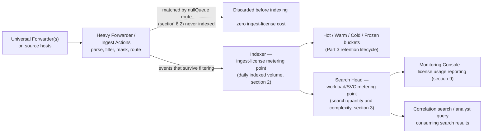

# Part 4 — Licensing and Ingest Economics

## Why this part exists

Part 2 covered where indexers, search heads, and forwarders sit relative to each other. Part 3 covered what happens to an event after it lands on an indexer — sourcetype assignment, and the hot/warm/cold/frozen bucket lifecycle that enforces retention. This part covers the question that sits underneath both: what does any of that actually cost, who pays for it, and which levers does a security team control before "reduce cost" quietly becomes "reduce visibility"? That question is platform-layer in mechanism (a license is a technical enforcement construct, metered against real ingest and compute numbers) and SOC-management-facing in consequence (a licensing decision is a budget line and a coverage decision at the same time), which is why this part sits at the boundary of Section A rather than fully inside either neighbor.

This part does not re-litigate index design or bucket retention mechanics — Part 3 owns those, and this part cites them wherever a cost lever depends on them. It also does not touch SPL syntax: nothing here needs `stats` or `transaction` beyond what's already covered in DEH Part 26 §2–3, and the one place a query would help illustrate a cost decision, this part points at Part 26 rather than re-deriving pipeline syntax.

**Evidentiary note, stated once and not repeated at every section:** no Splunk deployment exists in this book's author's lab, and licensing behavior specifically is not the kind of thing a lab of any size would surface convincingly — license economics show up at fleet scale, over months, against a real bill. Every platform-behavior claim below is either sourced from Splunk's own public pricing and documentation pages (cited in `REFERENCES.md`, retrieved 2026-09-15) or explicitly flagged as unverified against current documentation, per STYLE-GUIDE.md §9.4's disclosed constraint that `docs.splunk.com` itself was not reliably fetchable during this book's research. §5 documents one narrow, dated exception to that constraint — two `docs.splunk.com` Admin Manual pages whose content was retrieved indirectly and cross-checked before being cited — with the retrieval method disclosed there rather than glossed over.

---

## 1. What a Splunk license actually meters

**[CONCEPT]** For most of Splunk's history, a Splunk Enterprise license metered exactly one thing: the volume of data indexed per day, in gigabytes, against a fixed daily ceiling. That model — call it ingest-based licensing — is still the default most administrators picture when they hear "Splunk license," and it's still one of the models Splunk sells today. It is no longer the only one.

Splunk's own current pricing materials describe the platform as licensed under a small set of named models rather than one universal metric. The two that apply directly to the core Splunk Platform (Splunk Enterprise and Splunk Cloud Platform) are **ingest pricing** — data volume brought into the platform — and **workload pricing** — compute consumption metered in a Splunk-specific unit. A third model, **entity-based pricing**, exists in Splunk's portfolio but is scoped to adjacent products rather than core SIEM ingest — Splunk On-Call bills per seat, for instance — and is mentioned here only so a reader comparing a quote across Splunk's product line doesn't mistake a Splunk On-Call line item for a Splunk Platform ingest or workload charge.

> **Product Version Note**
> Splunk currently prices the Splunk Platform (Splunk Enterprise / Splunk Cloud Platform) under two models — ingest pricing and workload pricing — with a separate entity-based model used elsewhere in Splunk's broader portfolio (Splunk On-Call's per-seat pricing, Splunk Observability Cloud's per-host tiers) rather than for core platform ingest. As of 2026-09-15, verified against Splunk's own pricing overview and pricing FAQ pages (`REFERENCES.md` entries `[SPLUNK-PRICING-OVERVIEW]` and `[SPLUNK-PRICING-FAQ]`). What would make this stale: Splunk restructuring its published pricing page, retiring one of the two core-platform models, or extending entity-based pricing to core ingest in a way it doesn't currently cover.

The rest of this part treats these two models — ingest and workload — as the two real levers a SOC actually chooses between, and spends the bulk of its length on the cost decisions that apply regardless of which one a given deployment runs under.

### 1.1 Why this is a security-operations concern, not just a finance one

**[SOC MANAGEMENT]** A licensing model determines what a detection engineer is implicitly optimizing for every time they onboard a new log source or write a correlation search against a wide time window. Under ingest pricing, every gigabyte a new data source adds is a direct, visible cost line — a team under budget pressure develops a reflex to ask "do we need this feed" before onboarding it, which is exactly the right question, but only if it's asked deliberately rather than answered by whoever happens to be annoyed by the current month's usage report. Under workload pricing, the same reflex points somewhere else: a wide-lookback scheduled search run every five minutes against a high-cardinality field costs real money even if the data it searches was already "free" to ingest under that model. Neither model makes cost disappear; each one moves the pressure point to a different part of the platform, and a team that doesn't know which model it's under is optimizing blind.

---

## 2. Ingest-based licensing: volume measured at the index, not at the source

**[PLATFORM ENGINEER]** Under ingest pricing, the number that counts is the volume of data actually written to an index per day — measured on the uncompressed size of the events as indexed, not the size of the original log file on the source host, and not the size after Splunk's own on-disk compression shrinks it in a warm or cold bucket (Part 3 §3 covers that compression as a storage question, distinct from this licensing question). Two consequences follow directly from "measured at the index":

- **Volume that never reaches an indexer never counts.** Anything filtered, dropped, or routed away before the indexing stage — at a heavy forwarder, or via ingest-time filtering — is invisible to ingest-based license metering, because the metering point is the index itself, not the source. §6.2 below builds on exactly this fact.
- **Reformatting doesn't reduce the number by itself.** Stripping whitespace or reformatting a JSON blob before it's indexed can reduce the byte count that lands in the index, but the meaningful reduction almost always comes from *not indexing an event at all*, not from indexing a slightly smaller version of the same event. A field extraction happening at search time (DEH Part 26 §1.2 covers the search-time/index-time split this depends on) costs nothing against ingest volume either way, since it never touches what was already written to the index.

**[PLATFORM ENGINEER]** What ingest-based licensing does *not* meter is equally worth stating plainly, because it's the part administrators moving from another billing-by-seat product get wrong first: the number of users querying the data, the number of dashboards built against it, the number of correlation searches scheduled against it, and the number of concurrent searches running are not part of the ingest license ceiling at all. A SOC that hires five more analysts and triples its correlation-search count changes nothing about ingest-license consumption — it changes search concurrency and compute load instead, which Part 12 covers as a performance question and which is exactly the number workload-based licensing meters directly instead.

---

## 3. Workload-based licensing: SVC and what actually drives it

**[PLATFORM ENGINEER]** Splunk's workload-pricing model for Splunk Cloud Platform is metered in a unit Splunk calls **Splunk Virtual Compute (SVC)**. Splunk's own workload-pricing page defines an SVC as a unit of cloud compute, memory, and I/O resources — not a data-volume unit at all — and states that SVC consumption is driven primarily by search quantity and complexity *and* daily indexing volume, not by search activity in isolation.

> **Product Version Note**
> Workload pricing for Splunk Cloud Platform is metered in Splunk Virtual Compute (SVC) units, defined by Splunk as "a unit of cloud compute, memory and I/O resources." Splunk's own pricing documentation states SVC requirements are driven primarily by search quantity and complexity as well as daily indexing volume — indexing volume still matters under this model, it's just no longer the only number that matters. As of 2026-09-15, verified against Splunk's own workload-pricing page (`REFERENCES.md` entry `[SPLUNK-WORKLOAD-PRICING]`). What would make this stale: a change to what counts toward SVC consumption, a renamed unit, or workload pricing's terms diverging between Splunk Cloud Platform and self-managed Splunk Enterprise in a way that isn't reflected here.

> **Blind Spot**
> "Workload pricing decouples cost from ingest volume" is the pitch a team under ingest-license pressure wants to hear, and it's only half true. Splunk's own documentation names daily indexing volume as one of the two named drivers of SVC consumption, alongside search quantity and complexity — a team that migrates to workload pricing expecting ingest volume to stop mattering at all is optimizing against a number the new model still partly cares about, just no longer exclusively. The actual decision variable (§4) is the *ratio* of search activity to ingest volume for a given deployment, not which of the two numbers can supposedly be ignored.

**[PLATFORM ENGINEER]** The practical implication for a security team specifically: retaining a large volume of low-search-frequency data — the kind of raw telemetry kept mostly for retrospective investigation and compliance rather than daily correlation-search consumption — behaves differently under workload pricing than under ingest pricing, because the same data sitting mostly idle costs proportionally less against a compute-weighted meter than against a pure volume meter. Conversely, a small, high-value dataset queried constantly by many scheduled correlation searches and ad hoc analyst pivots (Part 19 covers that investigation pattern directly) can cost more under workload pricing than the same dataset's ingest volume alone would suggest. Part 12's search-concurrency and scheduling-priority material is the direct technical continuation of this cost driver — under workload pricing, a scheduling decision covered there is also, without anyone necessarily framing it that way, a cost decision.

---

## 4. Choosing between models — the decision variables that actually matter

**[SOC MANAGEMENT]** The table below states the comparison a SOC manager or platform owner is actually running when a renewal or a new deployment forces the ingest-vs-workload choice.

| Factor | Favors ingest pricing | Favors workload pricing |
|---|---|---|
| Search-to-ingest ratio | High-volume data, searched rarely (compliance retention, cold forensic archives) | Smaller, high-value datasets queried constantly by scheduled correlation searches and analysts |
| Growth pattern | Predictable, slow-growing ingest volume | Ingest volume growing faster than headcount/search load, or vice versa |
| Retention posture | Long raw retention with little acceleration or summarization | Retention leaning on data model acceleration (Part 10) and summary indexing (Part 11) to keep compute bounded |
| Budgeting preference | Cost as a flat, predictable function of data volume | Cost as a function of platform activity, harder to forecast without a workload baseline first |
| Contractual term | Comfortable with `GB/day` as the negotiated unit | Comfortable negotiating and tracking `SVC` as the billed unit — a less familiar unit to most procurement teams |

**[SOC MANAGEMENT]** None of these factors can be assessed honestly without a real usage baseline — a team switching pricing models on a guess about its own search-to-ingest ratio is choosing blind. Splunk's workload-pricing materials describe a calculator that estimates SVC needs from expected daily ingest and workload type; treat that estimate as a starting point for a negotiation, not as a substitute for the deployment's own Monitoring Console usage data (§9) once one exists.

> **SOC Management View**
> A licensing-model decision is not a one-time platform-team call, even though it's usually made in a platform-team conversation. It sets the shape of every future "should we onboard this feed" and "should we schedule this correlation search hourly or every five minutes" conversation a detection engineer has for the life of the contract term — usually one to three years. Involve whoever owns the detection-content roadmap (Part 14's correlation-search lifecycle, Part 15's risk-based alerting scoring cadence) before signing a multi-year term under either model; a model chosen purely on this year's ingest volume can become the wrong model the year RBA-driven search frequency triples without a matching ingest change.

---

## 5. License warnings and violations: the metering formula and the current thresholds

**[PLATFORM ENGINEER]** Splunk's license enforcement, going back many versions, has tracked usage against a rolling window rather than a single day's overage in isolation — the practical effect being that a single one-off spike (a misconfigured forwarder replaying an overnight backlog, a log source briefly misconfigured to double-ship) behaves differently under enforcement than the same volume sustained day after day. Stated as a formula, using the same per-indexer measurement point §2 already established:

```
Daily_Usage(pool, day) = SUM over indexer i in pool of RawPipelineBytes(i, day)

Warning(day) = 1 if Daily_Usage(pool, day) > Licensed_Daily_Volume(pool), else 0

InViolation(pool) = TRUE when SUM over d in rolling_window of Warning(d) >= violation_threshold
```

- `pool` — a Splunk license pool: a set of indexers (license peers) sharing one purchased daily-volume allocation, tracked centrally by the license manager.
- `i` — one indexer (license peer) belonging to that pool.
- `RawPipelineBytes(i, day)` — the raw, pre-compression byte volume indexer `i` placed into its indexing pipeline on a given day, measured midnight-to-midnight on the license manager's system clock (§2); data filtered or dropped before reaching this pipeline stage is never counted, which is exactly why §6.2's null-queue filtering reduces this number and search-time field extraction does not.
- `Licensed_Daily_Volume(pool)` — the daily GB ceiling purchased for that pool.
- `Warning(day)` — `1` if the pool's summed usage that day exceeded its ceiling, `0` otherwise.
- `rolling_window` / `violation_threshold` — the trailing period, in days, over which warning-days are counted, and the number of warning-days within it that puts the pool in violation. Both are license-type-specific, not one universal constant — see the Product Version Note below.

> **Product Version Note**
> `rolling_window` and `violation_threshold` vary by license type, per Splunk's own current Admin Manual page "About license violations": for a Splunk Enterprise license stack licensed at **100 GB/day or higher**, exceeding the daily ceiling generates a warning but — as documented — does **not** disable search at all. For a stack licensed **under 100 GB/day**, `violation_threshold = 45` warnings within `rolling_window = 60` days puts the pool in violation, and search (including scheduled reports and alerts) is blocked while in violation, though indexing continues uninterrupted. Trial, Dev/Test, and Developer licenses use `violation_threshold = 5` within a 30-day rolling window; the Free license uses `violation_threshold = 3` within a 30-day rolling window; both block search on violation, with no reset available for Trial or Free. Separately, a license peer unreachable from its license manager for 72 hours or more is itself placed in violation, with search blocked, independent of any indexing-volume warning. As of 2026-09-16, verified against Splunk's own Admin Manual page "About license violations" (`docs.splunk.com`, Splunk Enterprise 10.4 admin-manual tree; `REFERENCES.md` entry `[SPLUNK-DOCS-LICENSE-VIOLATIONS]`) — see the sourcing note directly below for exactly how this book reached a page its own research tooling normally can't. What would make this stale: Splunk changing either number, removing the 100 GB/day split, or further revising violation consequences for paid Enterprise/Cloud tiers — a policy area Splunk has already revised more than once.

**[PLATFORM ENGINEER]** The 100 GB/day split matters more than it looks like a footnote. It means the search-blocking "violation" most administrators picture — and this book itself pictured, unverified, until this section's research — mainly still applies to Trial, Dev/Test, Developer, and Free licenses, plus small production Enterprise stacks under 100 GB/day. A production SOC running a paid Enterprise or Cloud Platform pool at or above that volume gets warnings and, per Splunk's own General Terms (`REFERENCES.md` entry `[SPLUNK-GENERAL-TERMS]`), a right for Splunk to invoice for sustained overage at list price — not a search-blocking violation state. §9's operational-metric discipline (watch headroom before a warning banner ever appears) is worth exactly as much either way, since an invoice for overage is still an unbudgeted cost surprise, but it is a different failure mode than losing search access outright — a SOC manager sizing risk around "what happens if we go over" should know which of the two failure modes their own license actually carries before assuming either is the default.

**Sourcing note:** `docs.splunk.com` still returns HTTP 403 to this book's research tooling on a direct fetch, exactly as `STYLE-GUIDE.md` §9.4 already discloses for every other citation in this book. Unlike those other citations, this specific page's content was retrievable indirectly, through a text-extraction fetch of the same URL rather than a direct request, and cross-checked across four separate fetches for internal consistency (matching page title "About license violations | Splunk Enterprise," breadcrumb path, and a 2026-05-17 last-modified timestamp reported on every pass) before being treated as reliable enough to state as fact here. Treat this as a narrow, specific exception, not a claim that `docs.splunk.com` is now generally fetchable — every other unfetched `docs.splunk.com` reference elsewhere in this book still carries the same unresolved gap it did before.

> **Engineering Reality**
> The numbers above are Splunk's stated policy, not a guarantee about your own instance's history or contract. `Settings > Licensing` on a self-managed deployment, or the equivalent capacity/usage notification in Splunk Cloud Platform, shows current usage against the rolling window directly, and your own support contract can carry negotiated terms Splunk's general documentation doesn't reflect. Confirm which license type and volume tier your own pool actually falls under — that determines which row of the Product Version Note above applies to you — before assuming either the 45-in-60 or the 5-in-30 rule is the one your deployment lives under.

> **What Would Change My Mind**
> This section can now state Splunk's documented mechanics as a sourced fact rather than an acknowledged gap. What it still can't state is how that policy plays out against a real license manager's Usage Report over a real rolling window — whether warning-day counting has any documented edge case at a pool boundary, whether clock skew between a peer and the license manager has ever produced a disputed warning, and whether the 72-hour peer-disconnection rule interacts with the daily-volume rule in a way this page doesn't spell out. A real Splunk deployment's own Usage Report, observed across at least one full rolling window, is still the specific thing that would move this from "documented policy" to "verified in practice" (see Part 20).

---

## 6. The cost levers a security team actually controls

**[PLATFORM ENGINEER]** "Reduce license usage" has three concrete levers underneath it — beyond the model choice itself, already covered in §3–4 — that don't simply mean "ingest less security-relevant data and hope nothing important was in what got dropped." Each is a real design decision with a real tradeoff, not a free win.

### 6.1 Index design and retention tiering

**[PLATFORM ENGINEER]** Part 3 §1 already frames index design as a security-relevant decision for retention isolation and index-level RBAC; it's also the first and cheapest cost lever, because retention length is set per index, not globally. Splitting a single monolithic `security` index into separate indexes by data value and required retention — a short-retention index for high-volume, low-investigative-value telemetry (verbose firewall accept logs, for instance) alongside a long-retention index for what actually drives investigations (authentication, process execution, EDR telemetry) — doesn't reduce today's ingest volume at all, but it directly reduces the storage a bucket lifecycle (Part 3 §3) has to carry going forward, and it stops a compliance-driven long-retention requirement on one data type from silently forcing the same retention length, and the same storage cost, onto everything else sharing its index.

### 6.2 Filtering at the heavy forwarder or at ingest time

**[PLATFORM ENGINEER]** This is the lever that acts directly on ingest-based license consumption, because — as §2 states — volume that never reaches an indexer never counts against an ingest license. The long-standing mechanism for this is a `transforms.conf` stanza that routes matching events to Splunk's null queue at a heavy forwarder, before indexing:

CONCEPTUAL SAMPLE — illustrative filtering pattern; stanza names and the target event code are
representative, not a literal recommendation to drop 4634 specifically without checking what
depends on it first (see §7).

```ini
# props.conf (on the heavy forwarder)
[wineventlog:security]
TRANSFORMS-drop_noisy_events = drop_4634_logoff

# transforms.conf (on the heavy forwarder)
[drop_4634_logoff]
REGEX = EventCode=4634
DEST_KEY = queue
FORMAT = nullQueue
```

A newer, GUI-driven alternative to hand-writing `props.conf`/`transforms.conf` stanzas exists for filtering, masking, and routing data at ingest without deploying a dedicated heavy forwarder tier — Splunk has shipped this class of capability under the Ingest Actions name in recent Splunk Cloud Platform and Splunk Enterprise releases.

> **Product Version Note**
> Splunk offers a GUI-driven ingest-time filtering, masking, and routing capability under the name
> Ingest Actions, as an alternative to hand-written `transforms.conf` stanzas. This book's research
> tooling could not independently re-verify Ingest Actions' current feature scope or edition
> availability against a fetchable source as of 2026-09-15 (`docs.splunk.com` was not reliably
> fetchable during this book's research; see STYLE-GUIDE.md §9.4) — no dated citation backs the
> claim beyond the feature's existence. What would make this stale, or what would confirm it:
> a direct check of your own instance's current documentation for Ingest Actions' exact behavior,
> licensing tier, and deployment-type availability before designing a filtering strategy around it
> specifically, rather than the underlying `transforms.conf` mechanism, which is stable and has been
> for many major versions.

### 6.3 Summary indexing and acceleration as alternatives to keeping everything raw

**[PLATFORM ENGINEER]** Where §6.2 removes data before it's ever indexed, this lever changes what has to stay in *raw*, full-fidelity form once it is. Data model acceleration (Part 10) and summary indexing (Part 11) both let a detection keep working against a compact, pre-computed representation of a dataset without every downstream correlation search needing the full raw event volume retained at long retention just in case a query needs it later. This doesn't reduce today's ingest number either — the raw events still get indexed once — but it changes the retention-length decision in §6.1 from "keep everything raw for three years because some detection might need it" to "keep the accelerated summary for three years and the raw events for a shorter, cheaper window," which is a meaningfully different storage-cost shape at scale.

---

## 7. Detection Autopsy — the ingest filter that quietly starved a correlation search

**[PLATFORM ENGINEER]** This box describes a composite, commonly-reported operational pattern from Splunk practitioner discussion of license-cost reduction, not a single captured incident — no real Splunk deployment exists in this book's evidence base to draw one from (STYLE-GUIDE.md §9.2), and it's disclosed as composite rather than dressed up as a specific named case this book can't actually cite.

> **Detection Autopsy — "the filter that looked like noise reduction"**
>
> **The rule:** Under license pressure, a platform team adds a `transforms.conf` null-queue route (§6.2) dropping Windows Security Event ID 4662 ("An operation was performed on an object") at the heavy forwarder, well before it reaches the indexer. 4662 fires constantly in a typical Active Directory environment and, read in isolation as a raw event stream, looks like exactly the kind of low-value verbosity ingest-cost reviews target first.
>
> **Why it shipped:** Nobody on the platform team was actively using 4662 in a dashboard or a correlation search at the time of the change, and the immediate ingest-volume savings were real and visible the same week.
>
> **How it failed:** A detection engineer had, months earlier, built a correlation search against the CIM's Change Analysis data model — the CIM data model covering object, permission, and configuration change events — extending directory-object and ACL-change detection that depends specifically on 4662 for its Active-Directory coverage. That search stops firing. Nothing about its own execution looks wrong: it runs on schedule, returns zero results, and a correlation search returning zero results looks identical to "nothing suspicious happened" right up until an incident retrospective asks why it didn't catch something it was supposedly built to catch.
>
> **The fix:** Route every ingest-time filtering decision through whoever owns the correlation searches and data models built against that sourcetype — Part 7's CIM-onboarding review is the natural place for this check — before the `transforms.conf` change ships, not after a gap gets discovered the hard way. A filtering decision and a detection-coverage decision are the same decision here; treating them as two separate approvals (platform team signs off on cost, detection team finds out later) is the actual root cause, not the specific choice of 4662.

> **Blind Spot**
> An ingest-time filter produces no error, no warning, and no visible signal anywhere in Splunk that a class of event has stopped arriving — it simply stops arriving, and every downstream search built against it keeps running successfully, returning fewer or zero results, exactly as designed for the actual absence of the underlying activity. The only reliable way to catch this class of gap is a source-health or volume-anomaly check on the sourcetype itself (the same null-rate/parser-health pattern DEH Part 26 §1.2 names for a broken field extraction, applied here to a broken or newly-added ingest filter instead) — not trusting that a correlation search's own continued execution proves its inputs are still intact.

---

## 8. Where ingest is metered, and where it can still be reduced

**[PLATFORM ENGINEER]** The diagram below traces one event's path from source host to search results, marking the two distinct places cost actually gets measured — the ingest-license metering point at the indexer, and the workload/SVC metering point at the search head — against the one place upstream of both where a filtered event can be removed from the ingest count entirely before it's ever metered.






**Figure 4.1 — Ingest-license and workload/SVC metering points relative to the filtering decision.** *CONCEPTUAL.* Illustrates where ingest-based license volume is actually measured (at the indexer, after any heavy-forwarder-side filtering) versus where workload/SVC consumption is measured (at search execution), and where in the pipeline a filtering decision removes an event from ingest-license accounting entirely. This is a sequence/architecture sketch of documented expected data flow, not a capture from a live Splunk deployment or Monitoring Console — none exists in this book's evidence base (STYLE-GUIDE.md §9.2).

---

## 9. Treating license headroom as an operational metric

**[SOC MANAGEMENT]** Splunk ships a built-in app — the Monitoring Console — for observing the platform's own health, and license usage against the current model's ceiling (daily GB under ingest pricing, SVC consumption under workload pricing) is one of the standard things it reports on. The management discipline worth stating plainly: license headroom belongs on the same operational dashboard as analyst staffing levels and storage capacity, reviewed on a schedule, not discovered when a usage-warning banner appears in Splunk Web. A SOC that only looks at license usage reactively, after a warning, has already lost the ability to make a considered, prioritized decision among the levers in §6 — it makes whichever cut is fastest to implement instead, which is exactly how a decision like §7's 4662 filter gets made without the review it needed.

The table below summarizes the levers this part covered, for exactly that kind of prioritized, non-reactive review.

| Lever | Acts on | What it saves | Main risk if done carelessly | Cross-reference |
|---|---|---|---|---|
| Index design and retention tiering | Storage cost, going forward | Long-term bucket storage, not today's ingest volume | Splitting indexes without updating role-based access controls that assumed one index | Part 3 §1, §3 |
| Ingest-time filtering (`transforms.conf` null queue / Ingest Actions) | Ingest-license volume directly | Daily indexed GB, immediately | Silently starving a correlation search or data model that depended on the filtered event (§7) | Part 7 (CIM onboarding review) |
| Summary indexing / data model acceleration | Compute and long-term raw retention need | Query cost and how long raw fidelity must be kept | Summary/accelerated data going stale relative to raw if the underlying search or acceleration range isn't maintained | Part 10, Part 11 |
| Workload-vs-ingest model choice | Which number the SOC is optimizing against | Predictability, if the model matches the actual search-to-ingest ratio | Choosing a model on a guess instead of a Monitoring Console baseline (§4, §9) | Part 12 (search performance, the workload-side driver) |

---

**Cross-references:** DEH Part 26 §1.2 (search-time vs. index-time fields — the split underlying what "indexed volume" means for ingest-license metering, §2); this book's Part 2 (deployment architecture — where forwarders, heavy forwarders, and indexers sit in the topology this part's filtering lever depends on); Part 3 §1 and §3 (index design and bucket retention — the storage-cost side of §6.1); Part 7 (CIM-compliant onboarding — the review this part's §7 Detection Autopsy argues must gate any ingest-time filtering change); Part 10 and Part 11 (data model acceleration and summary indexing — the pre-computation alternatives in §6.3); Part 12 (search performance and workload management — the direct technical continuation of workload/SVC cost, §3); Part 13 (Enterprise Security architecture and editions — the separately licensed application layer sitting on top of the core platform license this part covers); Part 20 (validation gaps — where this part's §5 hedge and §9's Monitoring Console gap are tracked as open evidence items).
