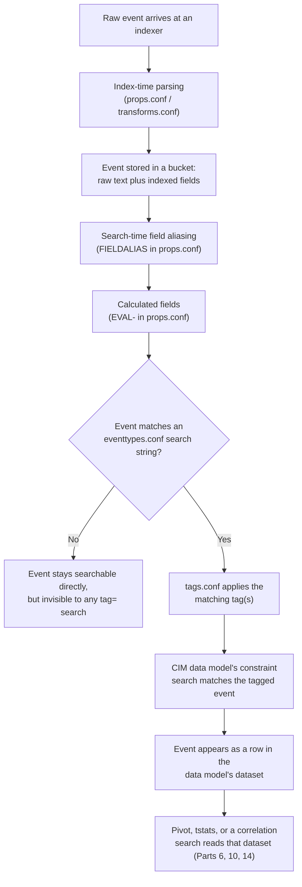

# Part 5 — The Common Information Model: What It Actually Standardizes

## Why this part exists

Parts 2–4 covered the platform Splunk gives you before a single security event has been categorized: indexers, buckets, licensing. This part covers the first thing that happens to a security event once it lands — not parsing (DEH Part 5, in the sibling volume, owns that layer generally), but the question of whether Splunk's own security tooling can recognize what kind of event it is at all.

That recognition problem is not new to Splunk, and this book doesn't pretend it is. DEH Part 6 §2.5 already introduces Splunk's Common Information Model (CIM) in one paragraph, as one of five vendor- or ecosystem-specific answers to the same translation problem ECS, OCSF, UDM, and ASIM each solve differently: a shared field vocabulary that lets a detection written once run against data from more than one source. DEH Part 6 deliberately doesn't go field-by-field into CIM, because CIM is Splunk-internal rather than cross-platform, and that part's job is the general shape of the translation problem, not any one vendor's specific implementation of it. This part is that implementation, in depth: what CIM actually standardizes, the specific configuration mechanism that does the standardizing, and — because the book index for this title asks the question directly — why "this sourcetype is CIM-compliant" is a claim you can test and fail, not a checkbox a vendor's add-on ticks for you.

**[CONCEPT]** The single idea this part keeps returning to: CIM is a naming and tagging *contract*, expressed entirely in ordinary Splunk configuration files, not a normalization engine that touches raw data. Nothing about a raw event changes when CIM is "applied" to it. What changes is which search-time knowledge objects exist to describe that event in CIM's vocabulary — and every one of those knowledge objects can be missing, wrong, or stale, exactly like any other configuration.

---

## 1. A naming-and-tagging contract, not a normalizer

**[CONCEPT]** The Splunk Common Information Model ships as the Splunk Common Information Model Add-on — a free Splunk-authored app distributed on Splunkbase, listed there as app ID 1621. Installing it does three things, and only three things: it adds a set of data model JSON definitions to the search head, it adds a default set of `eventtypes.conf` and `tags.conf` entries for the sourcetypes Splunk already expects to see in a typical deployment, and it adds documentation. It does not add a parser, a normalization pipeline, or anything that runs at index time. Every mechanism CIM actually uses — field aliases, calculated fields, eventtypes, tags, data model constraints — is a search-time knowledge object that already exists in Splunk with or without CIM installed. CIM's contribution is a *convention* for how to use those existing mechanisms consistently: agree that "the address that initiated the connection" is always called `src`, agree that a successful login event always carries the tag `authentication` and the tag `success`, and any search or dashboard built against that convention works against any sourcetype that follows it.

> **Product Version Note**
> The Splunk Common Information Model Add-on's current default version is `8.7.0`, released 2026-09-02, with listed compatibility against Splunk platform versions `9.4` through `10.5`. As of 2026-09-15, verified against the add-on's own Splunkbase listing (REFERENCES.md entry `[SPLUNKBASE-CIM-ADDON]`). `docs.splunk.com`'s CIM documentation pages returned an access error on every attempt made while researching this part, so the Splunkbase listing is the only source behind this specific version and compatibility claim — see REFERENCES.md for the full retrieval note. What would make this stale: any new CIM Add-on release, or a change to the supported-platform-version floor or ceiling on a future Splunkbase update.

**[PLATFORM ENGINEER]** This is the point where a reasonable assumption goes wrong, so it's worth stating the failure mode directly rather than gesturing at it: installing the add-on does not make an existing sourcetype CIM-compliant. It supplies default mappings for the sourcetypes Splunk itself anticipated — mostly its own products and a handful of long-standing, widely-deployed technology add-ons (TAs) that ship their own CIM-aligned configuration already. A custom log source, an internally built application's audit log, or a vendor's TA that predates or never bothered with CIM compliance gets none of that for free. Someone still has to write the field aliases, author the eventtype, and apply the tag — by hand, or by installing a TA that already did it. Part 7 covers that implementation work in depth; this part's job is making sure the mechanism it's implementing is understood first.

> **Engineering Reality**
> "We installed the CIM Add-on" is not the same claim as "our authentication data is CIM-compliant," and a reviewer or auditor who accepts the first as evidence for the second is accepting a checkbox instead of a test. The add-on is infrastructure the mapping work runs on top of, not a substitute for the mapping work. Budget CIM onboarding for a new source as real implementation effort — the field-aliasing and tagging work in Part 7, plus the compliance testing in §4 below — not as configuration that arrives free with an app install.

---

## 2. Where the contract actually lives on disk

**[PLATFORM ENGINEER]** CIM's naming convention has to attach to a real event somehow, and it does that through exactly two Splunk configuration files working together: `eventtypes.conf`, which turns a saved search filter into a named category, and `tags.conf`, which attaches one or more tags to that category. Everything a CIM data model search actually filters on — `tag=authentication`, `tag=network` `tag=communicate` — resolves back to these two files. There is no CIM-specific configuration file; CIM is built entirely out of generic Splunk knowledge objects used according to a shared naming agreement.

### `eventtypes.conf` — turning a raw search into a reusable category

**[PLATFORM ENGINEER]** An eventtype stanza is nothing more than a saved search string given a name. When an event matches that search string at search time, Splunk considers it a member of that eventtype — no data is copied or moved, and the eventtype's name becomes a searchable value in the built-in `eventtype` field for any event that matches.

```ini
# CONCEPTUAL SAMPLE — an illustrative eventtype for a hypothetical VPN concentrator
# sourcetype, not a real vendor's default configuration and not validated against a
# live Splunk instance.

# eventtypes.conf
[acme_vpn_authentication]
search = sourcetype="acme:vpn:concentrator" (result="success" OR result="failure")
```

This eventtype targets one invented sourcetype and the two raw values its login events actually carry. Its limitation is the same as any saved-search-based category: if the raw event's field names or values drift (a firmware update renames `result` to `status`, say), the eventtype stops matching silently, exactly the way a `FIELDALIAS` stops resolving in the failure pattern described in §4.

### `tags.conf` — where a CIM tag actually gets created

**[PLATFORM ENGINEER]** A tag is applied to an eventtype (or directly to a field-value pair) in `tags.conf`, and it is this tag — not the eventtype name — that CIM's own data model constraint searches actually filter on.

```ini
# CONCEPTUAL SAMPLE — continues the illustrative VPN example above; the eventtype
# name is invented, but the stanza format and the tag name (`authentication`) match
# the tag CIM's own Authentication data model constraint search filters on.

# tags.conf
[eventtype=acme_vpn_authentication]
authentication = enabled
```

**[DETECTION ENGINEER]** This is the entire mechanism. There is no separate "CIM engine" evaluating an event against a schema at search time; there is a search string in `eventtypes.conf` and a tag assignment in `tags.conf`, evaluated the same way any other saved search and tag would be. That matters for how you debug a CIM problem: if a data model isn't returning events you expect, the fault is in one of exactly two places — the eventtype's search string isn't matching the raw event, or the tag isn't attached to the eventtype that is matching. There's no third layer to suspect.

Getting the tag right isn't sufficient by itself, though — the data model's constraint search also expects specific *field* names and, for several fields, specific *values*, which is where field aliasing and calculated fields (`FIELDALIAS` and `EVAL-` stanzas in `props.conf`) do the rest of the mapping work. The distinction between the two matters and is a common source of the failure mode below: `FIELDALIAS` only renames a field — `result AS action` makes the raw value visible under a new name, unchanged. It does not translate the *value*. A raw field whose values already match CIM's controlled vocabulary needs nothing more than a rename. A raw field whose values don't (a VPN log reporting `permit`/`deny` instead of `success`/`failure`) needs an `EVAL-` calculated field instead, one that maps each raw value onto the vocabulary the data model actually constrains on. Part 7 covers authoring that field-level mapping end to end; the point to carry forward here is that a correctly tagged event with the wrong field values is still not CIM-compliant, a distinction §4 makes testable.

> **False Positive Trap**
> The Authentication data model's `action` field expects exactly two controlled values: `success` or `failure`. A VPN log that reports `result=permit` or `result=deny` isn't malformed data — it just isn't in CIM's controlled vocabulary yet. Alias `result` to `action` without also translating the *values* (`permit` → `success`, `deny` → `failure`), and every correlation search or dashboard panel filtering on `action=failure` silently returns zero rows against that source, forever, while the raw events sit in the index looking completely normal to anyone who searches them directly. The tag fired, the field exists, and the data model still lies about that source having no failed logins.

```ini
# CONCEPTUAL SAMPLE — the corrected mapping for the False Positive Trap above: an
# EVAL- calculated field replacing the plain FIELDALIAS, translating raw vendor
# values into CIM's controlled vocabulary rather than just renaming the field.
# Illustrative only, not validated against a live Splunk instance.

# props.conf
[acme:vpn:concentrator]
EVAL-action = case(result="permit", "success", result="deny", "failure")
```

This fixes the specific vocabulary mismatch above, but it doesn't make the mapping self-maintaining: a firmware update that adds a third raw value (`result=timeout`, say) leaves that value unmapped, `action` blank for those events, and the same silent zero-match failure recurring for a new reason. Value-mapping `EVAL-` stanzas need the same periodic review as the lookup tables Part 8 covers — a mapping that was complete on the day it was written can go stale the same way a lookup does.

---

## 3. From tagged events to a queryable data model

**[CONCEPT]** A CIM data model is a JSON definition describing one or more datasets — the Authentication data model (the CIM data model covering login and logoff events across log sources) is the simplest shape: a single root dataset whose *constraint* is a search string built on the `authentication` tag, plus a list of fields (some directly present after aliasing, some calculated) that the dataset promises to expose for any event matching that constraint. More elaborate data models nest child datasets under a root — the Endpoint data model (the CIM data model covering OS- and EDR-reported process, filesystem, registry, service, and port activity) splits its root into `Processes`, `Filesystem`, `Registry`, `Services`, and `Ports` child objects, each with its own narrower constraint layered on top of the parent's.

The table below lists the CIM data models most relevant to security operations content in this book. CIM ships roughly two dozen data models in total, covering domains (performance, inventory, JVM metrics) that fall outside this book's security scope; the table is a working subset, not the full manifest.

**Table 5.1 — CIM data models most relevant to security operations.** Use this table to decide which data model a new onboarding effort (Part 7) or correlation search (Part 14) should target.

| Data model | Root tag(s) | Typical source events |
|---|---|---|
| `Authentication` | `authentication` | Login/logoff success and failure across OS, VPN, and application auth logs |
| `Network Traffic` | `network`, `communicate` | Firewall and flow-log allow/deny decisions |
| `Web` | `web` | Proxy and web-server access logs |
| `Malware` | `malware`, `attack` | AV/EDR detection and remediation events |
| `Endpoint` (Processes, Filesystem, Registry, Services, Ports) | `process`, `report` (varies by child dataset) | EDR and OS-native process, file, and registry telemetry |
| `Change` (Change Analysis) | `change` | Config, account, and endpoint change events |
| `Email` | `email` | Mail gateway delivery, filtering, and header data |
| `Data Loss Prevention` | `dlp` | DLP-engine policy match events |
| `Vulnerabilities` | `vulnerability` | Scanner findings |
| `Certificates` | `certificate` | TLS certificate observation events |
| `Network Resolution` | `dns` | DNS query/response logs |
| `Alerts` | `alert` | Third-party alerting-tool output ingested for correlation |
| `Intrusion Detection` | `ids`, `attack` | IDS/IPS signature hits |
| `Ticket Management` | `ticketing` | Case/ticket lifecycle events from an external ITSM tool |

**[CONCEPT]** A data model becomes queryable two ways: through Pivot, a knowledge-object-driven query builder that lets an analyst work against a data model's fields without writing SPL directly, or through a direct search against the data model's generated dataset. Part 6 (this book) covers Pivot and data-model query mechanics in full; this part's concern stops at the boundary Part 6 picks up — what has to already be true about the underlying tags and fields before Pivot, or any other consumer, can return anything meaningful. An accelerated data model additionally gets its own `tsidx` summary that `tstats` can read directly without touching raw events at all; Part 10 owns acceleration mechanics and cost in full, and DEH Part 26 §1.3 names `tstats` as a working syntax entry without teaching it for exactly the reason DEH Part 26's own scope note gives — this book, and specifically Part 10, is where that forward reference resolves.

> **Blind Spot**
> `tag=authentication` and the Authentication data model itself only ever see events from a sourcetype someone has actually mapped into CIM, per §2. A perfectly healthy, fully indexed sourcetype that nobody has aliased and tagged is invisible to every tag-based search and every CIM-driven dashboard panel — not filtered out, simply never a candidate.

**[THREAT HUNTER]** A hunter running a tag-based sweep across "all authentication sources" is really sweeping "all authentication sources someone remembered to map into CIM," and in a large, organically grown environment those two sets are rarely the same size. A raw `index=* sourcetype=*login*` search will surface sources the tag-based sweep never will. Part 19 covers what to do when a pivot from a notable event or a data model hits exactly this gap mid-investigation.

**[SOC ANALYST]** The consequence for a triage-facing user is worth stating in one clause even though Part 16 owns Incident Review in depth: a blank field on a notable's event detail is frequently a CIM mapping gap upstream, not an absence of data at the source — worth checking before concluding a log source simply "doesn't have" the information a dashboard implies it should.

---

## 4. Testing a CIM-compliance claim instead of trusting it

**[DETECTION ENGINEER]** "This sourcetype is CIM-compliant" decomposes into three separately checkable claims, and each can be true or false independently of the other two:

1. **Tagging is correct.** The right events carry the right tag, and — just as important — no unrelated events carry it too (an over-broad eventtype search string tags things that aren't actually authentication events).
2. **Field coverage is complete.** Every field the target data model's dataset declares has either a raw field, a `FIELDALIAS`, or an `EVAL-` calculated field resolving to it for the tagged events — not just present as a column header when the field list is inspected, but populated with a non-null value across a representative sample of real events.
3. **Values are conformant.** Where the data model constrains a field to a controlled vocabulary (`action` restricted to `success`/`failure`/`allowed`/`blocked`, depending on the model), the mapped value is actually inside that vocabulary, not a raw vendor string that happens to occupy the right field.

None of these three requires a specialized validation tool — each is answerable by running the data model's own constraint search restricted to the target sourcetype and inspecting the results table for the fields in question. That's what makes the claim falsifiable rather than a vendor checkbox: a stakeholder asserting compliance can be asked to produce that table, for that sourcetype, and the answer is either present or it isn't.

> **Detection Test**
> **Setup:** In a real Splunk instance, open the target data model's dataset (Authentication, for a login source) restricted to one specific `sourcetype` under test, either through the Data Model Editor's preview or by running the underlying constraint search directly.
> **Action:** Table every field the dataset declares for that object, across a time range wide enough to include both success and failure events for that source.
> **Expected result:** Every declared field has a value, and every value-constrained field (`action`, in particular) shows only the vocabulary the model defines — not blank columns, and not raw vendor strings sitting in a field that looks populated but isn't conformant.
> This has not been run against a live Splunk instance for this book — no deployment exists in the author's lab (see STYLE-GUIDE.md §9.2). Treat it as the specific check to run against your own environment before accepting a compliance claim, not as a result already confirmed here.

> **Detection Autopsy**
> A widely reported failure class among Splunk practitioners — documented across TA upgrade release notes and Splunk community forum threads rather than any single incident this book can cite by name or capture from its own lab — is a technology-add-on upgrade that renames or restructures a field an existing `FIELDALIAS` depends on. The alias now points at a field that no longer exists in the raw event. Every correlation search and dashboard panel built on the affected data model keeps running on its schedule, returns zero matches, and raises no error, because a search head has no way to distinguish "this field legitimately has no matches right now" from "this alias silently stopped resolving after an upgrade." The fix is structural, not clever: version the site's own CIM-mapping `props.conf`/`tags.conf` alongside the TA release it depends on, and pair every field-mapping change with the §4 compliance check above rather than trusting a green dashboard as proof the mapping survived the upgrade.

**[PLATFORM ENGINEER]** One more distinction worth naming precisely: CIM compliance and data model *acceleration* are independent decisions. A sourcetype can be fully CIM-compliant and never accelerated — every search against it just runs slower over raw events, which Part 10 quantifies — and a data model can be accelerated while several of its constituent sourcetypes remain non-compliant, in which case acceleration simply builds a fast summary of an incomplete picture. Fixing compliance gaps first, then deciding whether the resulting dataset is large or frequently-queried enough to justify acceleration's storage cost, is the correct order of operations; Part 10 assumes that order and doesn't re-argue it.

**Figure 5.1 — From raw event to a CIM data model row.** *CONCEPTUAL.* Illustrates the sequence of index-time parsing and search-time knowledge objects — field aliases, calculated fields, eventtypes, tags — that has to succeed, in order, before a raw event becomes visible to a CIM data model search. This is a sequence diagram of documented expected behavior, not a capture from a live Splunk instance or job inspector; no such deployment exists in this book's evidence base (STYLE-GUIDE.md §9.2).






---

## 5. CIM as Enterprise Security's hard dependency

**[SOC MANAGEMENT]** Every part in Section E of this book (Enterprise Security, Parts 13–17) inherits the mapping work described here as a precondition, not an optional best practice. Enterprise Security's correlation searches, risk-based-alerting rules, and out-of-the-box dashboards are written against CIM data models, not against any specific vendor's raw field names — which is precisely what lets one correlation search cover a firewall, a VPN concentrator, and a cloud gateway simultaneously, but only for sources that actually cleared the compliance bar in §4. An ES deployment layered on top of poorly mapped data doesn't fail loudly; it produces the same silent zero-match behavior described in this part's Detection Autopsy box, just wearing Enterprise Security's UI instead of a bare dashboard panel. Staffing a CIM-onboarding effort (Part 7) is therefore not separable from staffing an ES rollout — the second doesn't function without the first having already happened for every source ES is expected to correlate.

> **Product Version Note**
> Splunk Enterprise Security is currently sold in two editions, Essentials and Premier, with User and Entity Behavior Analytics (UEBA), SOAR integration, and "Automated Threat Analysis" gated to Premier; Detection Studio and the AI Assistant for Security are listed as included in both editions. As of 2026-09-15, verified against Splunk's own Enterprise Security product page (REFERENCES.md entry `[SPLUNK-ES-PRODUCT-PAGE]`). This is recent edition restructuring, not a long-standing stable boundary — confirm which edition a given environment is actually licensed for before assuming any Premier-gated capability is available, and re-verify this split before treating it as still current more than a few release cycles out. The point that matters for *this* part: CIM compliance is a dependency of Enterprise Security under either edition — nothing about the Essentials/Premier split changes what §4 requires of the underlying data. Part 13 covers the edition split itself in full.

> **What Would Change My Mind**
> The largest unverified assumption in this part is that the mapping mechanism described here — aliases, eventtypes, tags, data model constraints — behaves exactly as documented once it's running against a real multi-terabyte-per-day index with a genuinely messy mix of vendor TAs, hand-built aliases, and years of accumulated `props.conf` cruft, rather than the clean two-file example in §2. A real Splunk deployment, instrumented over a real retention window and carrying that kind of accumulated mapping debt, is the specific evidence that could confirm or overturn any claim in this part about how CIM mapping actually behaves at scale. Nothing short of that observation would move this part's claims from "documented and internally consistent" to "observed" — see Part 20 for the full inventory of where this book's claims stand on that spectrum.

---

**Cross-references:** DEH Part 6 §2.5 (Splunk CIM as one of five vendor/ecosystem field-vocabulary schemas); DEH Part 26 §1.3 (`tstats` named as a working syntax entry, not taught); this book's Part 6 (data models and Pivot query mechanics), Part 7 (CIM-compliant data onboarding implementation), Part 10 (data model and report acceleration), Part 13 (Enterprise Security architecture and editions), Part 14 (correlation searches against CIM data models), Part 16 (Incident Review and notable-event field display), Part 19 (investigation-workflow pivots), Part 20 (validation-gap inventory).
