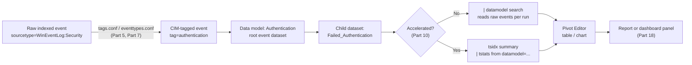

# Part 6 — Data Models and Pivot

## Why this part exists

Part 5 defined the Common Information Model (CIM) as a field-naming and tagging contract — `tags.conf` and `eventtypes.conf` stanzas, field aliases, and the discipline of making "CIM-compliant" a testable claim rather than a checkbox. A contract by itself doesn't answer a question. Something has to turn "every event tagged `authentication`" into a table you can filter, split, and count. That something is a **data model**: a hierarchical, named object that Splunk's knowledge-object layer builds on top of CIM's tags and field aliases, and that a separate feature — **Pivot** — lets an analyst query by pointing and clicking instead of typing SPL. This part covers both: what a data model actually is structurally, how the CIM Add-on's prebuilt models turn a tagging contract into a queryable dataset, and how Pivot generates a real search from a set of UI choices.

This part does not re-teach the query language underneath any of this. DEH Part 26 §1.1–1.3 already covers the SPL pipeline model, the `search`/`eval`/`where` commands, and the search-time-versus-index-time field split that determines whether a data model attribute is cheap or expensive to compute; where this part shows a generated search, it points to those sections rather than re-deriving them. DEH Part 23 already covers the general tradeoff between authoring speed and query control across languages — §5 below applies that same tradeoff inside a single tool, Pivot versus hand-written SPL against the same dataset, rather than restating DEH Part 23's cross-language argument. And this part does not cover **acceleration**: DEH Part 26 §1.3's own syntax table names `tstats` as the command that reads an accelerated data model's `tsidx` summary directly, then explicitly scopes it out ("not covered in depth here"). That forward reference is this book's Part 10's job to resolve, not this part's — Part 6 is about the dataset `tstats` would eventually read; Part 10 is about the summary-building mechanism and the command that reads it. Where acceleration matters to something said here, this part names it and points forward.

---

## 1. From CIM tag to queryable object

**[CONCEPT]** A Splunk **data model** is a knowledge object — stored as JSON, editable through Splunk's Data Model Editor under Settings, and, like a saved search or a lookup definition, something Splunk ships, an app ships, or an admin builds by hand. Structurally, a data model is a tree of **datasets**: one or more root datasets, each optionally carrying child datasets underneath it. Every dataset in the tree defines two things — a **constraint** (which events belong to this dataset) and a set of **fields** (what you can filter, split, or aggregate on once you're in it). A root dataset's constraint is usually a base search; the constraint that matters most for a CIM data model is almost always a `tag` value, because that's exactly the contract Part 5 described `tags.conf` as building. The root dataset for the Authentication data model (the CIM data model covering login, logoff, and authentication-decision events across log sources) constrains on `tag=authentication`, and every event that Part 7's onboarding work correctly tags that way becomes a row in that root dataset the moment the tag applies — no separate copy of the data, no reindexing, no new storage. A data model doesn't hold data; it holds a definition of how to find data that's already indexed.

That distinction matters because it's the same one DEH Part 26 §1.2 draws for search-time fields generally: a data model's fields are computed at query time from the same `_raw` text and the same field extractions every other search in the environment uses, unless a field is explicitly built as an index-time extraction. A data model doesn't get its own copy of the truth — it gets a named, reusable lens on the truth that already exists, and that lens is only as good as the tagging and field-aliasing work underneath it.

**Figure 6.1** below traces the path from a raw indexed event to a Pivot table, showing where Part 5's CIM contract, this part's data model, and Part 10's optional acceleration layer each sit.




**Figure 6.1 — From CIM tag to Pivot table.** *CONCEPTUAL.* Illustrates the expected path from a tagged raw event through a data model dataset to a Pivot-built table or dashboard panel, including the point where an accelerated data model's `tstats` path diverges from an unaccelerated `datamodel` search. This is a sequence diagram of documented expected behavior, not a capture from a live Splunk instance or job inspector — none exists in this book's evidence base (see `STYLE-GUIDE.md` §9.2).

---

## 2. Structure and inheritance

### 2.1 Object types: event, search, and transaction datasets

**[PLATFORM ENGINEER]** A root dataset is typed when it's created, and the type determines what kind of constraint it accepts and how child datasets under it behave. The table below orients the three root types plus the child-dataset relationship every CIM data model actually uses.

| Object type | Constraint shape | Typical use in a CIM data model |
|---|---|---|
| Event dataset | A base search (`tag=authentication`, an `index`/`sourcetype` filter, or both) | Root of nearly every CIM data model — Authentication, Web, Malware, Network Traffic all root on an event dataset |
| Search dataset | An arbitrary saved search, including one with `transforming` commands already applied | Less common in CIM's own shipped models; more often used in a custom, purpose-built model |
| Transaction dataset | Groups events from a child event dataset into sessions on a shared field and time window | Used where CIM itself needs to stitch related events — e.g., correlating a network session's start and end records |
| Child dataset | Inherits its parent's constraint and fields, then narrows the constraint further and/or adds fields | `Failed_Authentication` under `Authentication`; `Successful_Authentication` under the same root |

**[PLATFORM ENGINEER]** Inheritance is additive and one-directional: a child dataset automatically has every field its parent has, plus whatever fields it defines itself, and its constraint is always the parent's constraint **and** something narrower — a child dataset can never see an event its parent's constraint already excluded. This is the practical meaning of "hierarchical" here: `Failed_Authentication` doesn't redefine what counts as an authentication event, it just adds `action=failure` on top of the root's `tag=authentication` and inherits every field (`user`, `dest`, `src`, `app`, `authentication_method`) the root already exposes.

### 2.2 Attributes: how a dataset gets its fields

**[PLATFORM ENGINEER]** Within a dataset, each field is backed by one of a small set of attribute types, chosen when the field is added in the Data Model Editor.

| Attribute type | How the field's value is produced | Cost characteristic |
|---|---|---|
| Auto-Extracted | Whatever search-time field extraction already applies to the sourcetype (DEH Part 26 §1.2) | Cheapest — reuses extraction work that already exists |
| Eval Expression | An `eval`-style expression computed per event when the dataset is queried | Paid on every search unless the model is accelerated |
| Lookup | A field pulled in from a lookup table join, same mechanics Part 8 covers for lookups generally | Adds a lookup's own cost on top of the base search |
| Regular Expression | A `rex`-equivalent extraction run against another field at query time | Same drift risk DEH Part 26 §1.2's Detection Autopsy box describes for any search-time regex extraction |
| Geo IP | A built-in enrichment mapping an IP field to geographic attributes | Adds Splunk's bundled Geo IP lookup cost per event |

> **Engineering Reality**
> A data model is one shared object with many downstream dependents: every Pivot report built against it, every dashboard panel sourced from one of those reports, every hand-written `| datamodel` or `| tstats` search, and — per Part 14 — every correlation search written against the same dataset all read the same field and constraint definitions. Renaming a field, tightening a root constraint, or deleting a child dataset doesn't just change what the next person sees when they open the Data Model Editor. It silently changes the result of every saved artifact built on top of it, the next time each one runs, with no single place that lists everything downstream. Treat a change to a shared data model the way you'd treat a schema change to a table something else in production reads from: find out who depends on it before you touch it, not after a dashboard goes blank or a correlation search stops firing.

### `Authentication` — one CIM data model, walked from root to children

**[CONCEPT]** The Authentication data model's root event dataset constrains on `tag=authentication` and exposes fields including `user`, `dest`, `src`, `app`, `action`, and `authentication_method`. Two child datasets are the ones nearly every Authentication-based report actually uses: `Successful_Authentication` (root constraint plus `action=success`) and `Failed_Authentication` (root constraint plus `action=failure`). CIM's documentation describes several additional child datasets under the same root, following the same pattern of narrowing by a specific `action`, privilege level, or credential-security property — this part names the two above with confidence because they're the pair every Authentication-model example, including this book's own, is built around; treat any longer list of every child dataset's exact name as something to confirm against the CIM Add-on actually installed in a given environment rather than as a fixed roster this part can hand you. The **What Would Change My Mind** box below says exactly what would let this part upgrade that roster from "described from familiarity" to "observed."

> **Product Version Note**
> The Splunk Common Information Model Add-on — the downloadable app that ships the data model definitions this part describes — is versioned and released independently of Splunk Enterprise, Splunk Cloud Platform, and the Enterprise Security app. As of 2026-09-15, verified against the add-on's own Splunkbase listing (CIM Add-on `8.7.0`, released 2026-09-02; `REFERENCES.md` entry [SPLUNKBASE-CIM-ADDON]), the add-on states compatibility with Splunk Enterprise and Splunk Cloud Platform versions `9.4` through `10.5`. What would make this stale: any subsequent CIM Add-on release, a new minimum-platform-version floor, or a data model added, removed, or renamed in a later CIM major version — re-check the Splunkbase listing directly rather than trusting this note past a release cycle or two.

> **What Would Change My Mind**
> This part's platform-compatibility figures are verified against the CIM Add-on's own Splunkbase listing as of 2026-09-15 (`REFERENCES.md` entry [SPLUNKBASE-CIM-ADDON]) — but that listing doesn't enumerate individual data models or child datasets, so §2.3's Authentication child-dataset description beyond `Successful_Authentication`/`Failed_Authentication` rests on general familiarity with CIM's long-standing structure, not on a source this book could check line by line. A real Splunk instance with the current CIM Add-on installed would let this part cite an observed roster instead: running `| datamodel` with no arguments lists every installed model, and opening Authentication in the Data Model Editor lists its actual child datasets directly. That's the single most direct upgrade path available for this section specifically — not a general "get a lab" answer, a named command and a named UI screen.

---

## 3. Who edits a data model, and what it costs to get wrong

**[PLATFORM ENGINEER]** Editing a data model — adding a field, adjusting a constraint, adding a child dataset — happens in the Data Model Editor (Settings → Data Models), and creating or editing one requires the `admin` role or a role granted the relevant knowledge-object-management capabilities; viewing and running Pivot against an existing model requires far less. That asymmetry is deliberate: the model is meant to be a small number of maintained objects that a large number of analysts query safely, not something every analyst edits ad hoc. The same asymmetry is why the CIM Add-on ships its own models pre-built rather than expecting every environment to define Authentication from scratch — Part 7's onboarding work is about getting a new source's events tagged so they fall inside a model that already exists, not about building a new model per source.

**[PLATFORM ENGINEER]** A custom, non-CIM data model is a legitimate thing to build — a model scoped to one application's own log format, with fields that will never be part of CIM's shared vocabulary — but a data model built to extend or shadow a CIM model without going through Part 7's tagging discipline first produces the same downstream confusion a bad field alias does: two things that look interchangeable in the Pivot Editor's dataset picker but return different rows for the same question, because one inherits CIM's tag-based constraint and the other doesn't.

---

## 4. Pivot: querying a dataset without writing SPL

### 4.1 The Pivot Editor's building blocks

**[SOC ANALYST]** Pivot is the UI that turns a data model dataset into a report without the person building it typing a search. Opening Pivot against a specific dataset — say, `Failed_Authentication` — presents four kinds of choice: a **filter** (narrow further than the dataset's own constraint, e.g., `dest=domain-controller-*`), a **split** (a row or column grouping field, e.g., `src`), a **column value** (an aggregation — count, distinct count, average, sum, list, first/last value — applied to a chosen field), and a **format** (table, single value, or one of Splunk's standard chart types). None of this requires knowing `stats` syntax; DEH Part 26 §2 teaches what `stats` actually does under the hood, and Pivot's column-value choices map directly onto the same aggregation functions that section covers — Pivot doesn't introduce new aggregation semantics, it just presents `stats`'s functions as a dropdown instead of a clause you type.

**[SOC ANALYST]** The one hard boundary worth knowing before relying on Pivot for anything beyond a quick look: **a single Pivot report queries exactly one dataset from exactly one data model.** There is no join, in the Pivot Editor itself, between the Authentication data model and the Network Traffic data model (the CIM data model covering flow and session-level network events) to answer something like "which failed logins came from an IP that also appeared in a network-traffic block event." That kind of cross-model question is a hand-written SPL problem — a `join` or a shared-field correlation across two separate searches — not a Pivot problem, and reaching for Pivot on a question it structurally can't answer wastes time discovering that limit through the UI instead of recognizing it up front.

### 4.2 What Pivot actually runs

**[PLATFORM ENGINEER]** Pivot's "Open in Search" option, and the equivalent way to reach the same dataset from a hand-written search, is the `datamodel` command: it opens a named dataset and returns its rows exactly as if you'd run the dataset's own constraint as a search. The example below targets the same `Failed_Authentication` child dataset used above.

CONCEPTUAL SAMPLE — illustrative `datamodel` query shape, not a captured production search.
```spl
| datamodel Authentication Failed_Authentication search
| stats count by user, dest
```

This search opens `Failed_Authentication` directly — every event already satisfying the root's `tag=authentication` constraint and the child's `action=failure` constraint — then aggregates it with `stats`, exactly the way DEH Part 26 §2 describes `stats` collapsing events into summary rows by a group-by field list. Its main limitation is performance, not correctness: unless the Authentication data model is accelerated, `| datamodel ... search` reads and re-filters raw events on every run the same as any other unaccelerated search would, over whatever time range is scoped — Part 10 covers what changes once the model is accelerated and a `tstats` search reads its `tsidx` summary instead.

**[PLATFORM ENGINEER]** A dedicated `pivot` command also exists, accepting a dataset name plus the same aggregation and split-by choices the Pivot Editor exposes, and it's what the Editor generates under the hood for most report types. This part doesn't reproduce its full argument syntax here, because the Pivot Editor is how the overwhelming majority of Pivot users — including the analysts §4.1 is written for — actually interact with a data model; hand-typing an equivalent `pivot` command is rare enough in practice that showing its syntax without a live instance to verify the current argument order against would trade a real, checkable `datamodel` example for a lower-confidence one.

The table below summarizes when reaching for the Editor versus writing SPL by hand against the same dataset actually pays off.

| Situation | Pivot Editor | Hand-written `datamodel`/`stats` search |
|---|---|---|
| One dataset, standard aggregation (count, distinct count, average) | Fastest path — no syntax to recall | Equivalent result, more typing for no benefit |
| Question spans two data models | Not possible in Pivot itself | Required — separate searches joined or correlated by hand |
| Result needs post-aggregation filtering (`where count > 20`) | Supported via Pivot's own filter-after-aggregation option, more limited than `where` | Full `where`/`eval` expressiveness (DEH Part 26 §1.1) |
| Output feeds a scheduled correlation search or RBA rule (Part 14, Part 15) | Not the target use case | Required — a correlation search is SPL in `savedsearches.conf`, not a saved Pivot report |
| Analyst has no SPL background | Only realistic option | Not usable without someone who writes the search |

---

## 5. Pivot as a hunting tool

**[THREAT HUNTER]** Pivot's value to a hunter isn't the finished chart — it's the speed of reshaping a hypothesis without retyping a `stats` clause from scratch every time the question changes shape. Point the Pivot Editor at `Failed_Authentication`, split rows by `src`, add a distinct count of `user` as the column value, and "which sources tried the widest spread of distinct usernames" is answered in under a minute with no SPL typed. Swap the split-by field to `app` and rerun the same shape of question against a different angle on the same dataset.

> **Hunter's Note**
> The tradeoff DEH Part 23 names for query-language choice in general — authoring speed versus control over exactly what's being asked — shows up inside a single tool here. Pivot is fast precisely because it only lets you ask the questions its dataset's fields and its own filter/split/aggregate model can express; the moment a hunt needs a field the data model doesn't expose, a join across two models, or a conditional that Pivot's filter UI can't represent, the fast path stops being available and the honest move is to open the generated search and finish the thought in SPL — not to force the question into a shape Pivot happens to support.

---

## 6. Blind spots: what never reaches the Pivot table

**[PLATFORM ENGINEER]** A child dataset only ever returns events that already satisfied every constraint above it in the tree, and a CIM root dataset's constraint is almost always a `tag` value. An event whose CIM mapping never applied that tag — a newly onboarded log source missing its `eventtypes.conf` stanza, or a tag that stopped applying after the source's log format changed (the exact failure mode Part 7 names for CIM mapping drift) — doesn't appear in the Pivot Editor, doesn't produce an error, and looks identical to "this source genuinely produced zero matching events."

> **Blind Spot**
> A Pivot table showing zero failed-authentication events from a given host reads the same whether that host genuinely had zero failures or whether its logs never made it into the Authentication data model at all. Pivot has no built-in signal that distinguishes "the population is empty" from "the population never reached this dataset," because both look like an empty result set to the same query. The parser-health-monitor pattern DEH Part 26 §1.2's own Detection Autopsy box uses for a broken field extraction — watching a specific field's null rate independently of whether the detection built on top of it ever fires — is the same pattern that catches this failure mode for a data model: watch whether a source that should be tagging into the model still is, not just whether the Pivot report built on top of it still returns rows.

---

## 7. Licensing, editions, and where this sits relative to Enterprise Security

**[SOC MANAGEMENT]** Data models and Pivot are core Splunk platform features — they ship with Splunk Enterprise and Splunk Cloud Platform and work whether or not Enterprise Security is installed at all. The CIM Add-on that supplies the prebuilt Authentication, Network Traffic, Web, and other models is itself free content on Splunkbase, not something gated to a specific Splunk or Enterprise Security edition. What Enterprise Security adds on top is its own dependency on those same CIM models — its correlation searches, notable-event enrichment (Part 14, Part 17), and much of its own prebuilt dashboarding (Part 18) assume the CIM data models this part describes are populated and current, which is exactly why Part 13 treats CIM compliance as Enterprise Security's hard dependency rather than an optional best practice.

> **Product Version Note**
> Splunk Enterprise Security is currently sold in two editions — Essentials and Premier — with UEBA, SOAR integration, and "Automated Threat Analysis" gated to Premier; Essentials includes SIEM functionality, AI-assisted features, threat intelligence, Detection Studio, and Exposure Analytics in both editions. Data models and the Pivot Editor described in this part sit outside that gate entirely: both are core-platform features, not Enterprise Security features, and neither edition restricts access to either. As of 2026-09-15, verified against Splunk's own Enterprise Security product page (`REFERENCES.md` entry [SPLUNK-ES-PRODUCT-PAGE]). What would make this stale: Splunk folding data-model authoring or Pivot itself behind a licensing tier in a future restructuring, or a further edition split beyond Essentials/Premier — re-verify before assuming this boundary is permanent, the same caution the Part 13 Product Version Note gives the edition split itself.

---

## 8. What carries forward

**[CONCEPT]** Everything in this part depends on Part 5's CIM contract already being applied correctly and Part 7's onboarding work keeping it that way — a data model is a lens on tagged data, not a substitute for the tagging. Everything after this part builds on the dataset, not the tagging: Part 10 accelerates it and teaches `tstats`; Part 14 writes correlation searches against it; Part 18 builds dashboard panels on top of the reports this part's Pivot Editor produces. None of those parts re-explains what a root or child dataset is — that explanation lives here, once.

---

**Cross-references:** DEH V2 Part 26 §1.1–1.3, §2 (SPL pipeline model, search-time/index-time fields, `stats`, and the `tstats` forward reference this book's Part 10 resolves); DEH V2 Part 23 (query-language authoring-speed-versus-control tradeoff, applied in §5 to Pivot versus hand-written SPL); this book's Part 5 (Common Information Model), Part 7 (CIM-compliant data onboarding and mapping drift), Part 8 (lookup tables), Part 10 (data model and report acceleration, `tstats`), Part 13 (Enterprise Security's CIM dependency), Part 14 (correlation searches), Part 17 (asset and identity correlation), and Part 18 (dashboards and visualizations).
