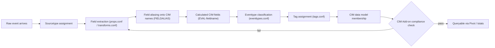

# Part 7 — Building CIM-Compliant Data Onboarding

## Why this part exists

**[CONCEPT]** Part 5 defined the Common Information Model as a field-naming and tagging contract, not a magic normalizer, and Part 6 showed how a CIM-compliant data model becomes a queryable dataset through Pivot and, eventually, `tstats`. Neither part had to answer the question this one does: given one new, real log source that has never touched Splunk before, what is the actual sequence of configuration work — file by file, stanza by stanza — that turns its raw events into something the Authentication, Network Traffic, or Endpoint data model will recognize as a member? This part is implementation-focused because "map the fields onto CIM" is where a design conversation about data models turns into a `props.conf` diff someone has to write, test, and maintain for as long as that source keeps sending data.

This part does not re-teach the search-time/index-time field distinction DEH Part 26 §1.2 already covers, or the general translation-problem framing DEH Part 6 (Normalisation) applies across ECS, OCSF, UDM, and ASIM — CIM is Splunk's specific answer to the same general problem, and Part 5 already positioned it that way. What this part adds is the mechanics: field extraction and aliasing, `tags.conf` and `eventtypes.conf` authoring, and validating a mapping against the CIM Add-on's own compliance tooling — and, just as importantly, what silently breaks when that mapping goes stale after a source-format change. That failure mode is Detection Debt's translation-layer problem, per DEH Part 23 §3, wearing Splunk's own clothes: a broken `FIELDALIAS` compiles cleanly, runs on every search, and returns a field that is quietly null forever, which looks identical to "this data source stopped producing the event" to anyone not specifically watching for it.

**Evidentiary note:** every configuration excerpt in this part is a hand-built illustration built around a fictitious `corp_vpn` source, marked `CONCEPTUAL SAMPLE` per STYLE-GUIDE.md §3 — none of it has run against a live Splunk instance, because none exists in this book's evidence base (STYLE-GUIDE.md §9.2). Where the underlying platform mechanism (a `props.conf` stanza key, a `tags.conf` format, the CIM's own tag vocabulary) is stated as fact rather than illustration, it reflects Splunk's own published `.conf` file reference and Common Information Model Add-on documentation, not this book's own testing.

---

## 1. The onboarding pipeline, end to end

**[CONCEPT]** "CIM-compliant" is not one configuration action — it is the cumulative result of five separate, independently-failable steps, each living in its own `.conf` file or add-on component, each maintained by whoever touches that source next. Skipping straight from "raw event" to "field aliasing" without stopping at sourcetype assignment, and skipping from aliasing straight to "it shows up in Pivot" without stopping at tagging, are two of the most common places a new source gets partially onboarded and then quietly abandoned once the most visible field looks right.

Figure 7.1 lays out the sequence this part covers, in order.






**Figure 7.1 — The CIM onboarding pipeline, from raw event to data-model membership.** *CONCEPTUAL.* Illustrates the expected sequence of configuration stages a new log source passes through before a correlation search or dashboard built against a CIM data model can see it; this is a sequence diagram of documented, expected configuration behavior, not a capture from a live Splunk instance or job inspector — none exists in this book's evidence base (STYLE-GUIDE.md §9.2).

**[PLATFORM ENGINEER]** Table 7.1 gives the same sequence as a working reference — which file each step lives in, and which role typically owns it in a mid-sized SOC. Use it to orient before the detailed sections below, not as a substitute for them.

| Step | Configuration mechanism | Typical owner |
|---|---|---|
| Sourcetype assignment | `props.conf` (`[sourcetype]` stanza), input configuration on the forwarder | Platform/onboarding engineer |
| Field extraction | `props.conf` (`EXTRACT-`, `REPORT-`) and `transforms.conf`, or a vendor-supplied Technology Add-on | Platform engineer, or the TA's maintainer |
| Field aliasing onto CIM names | `props.conf` (`FIELDALIAS-<class>`) | Platform/detection engineer, jointly |
| Calculated CIM fields | `props.conf` (`EVAL-<cim_field>`) | Detection engineer |
| Eventtype classification | `eventtypes.conf` | Detection engineer |
| Tag assignment | `tags.conf` | Detection engineer |
| Compliance validation | CIM Add-on's own validation views, or a `tstats`/`datamodel` spot check | Whoever owns the onboarding ticket |

This part covers extraction briefly (§2), since DEH Part 26 already owns the general field-extraction concept, and spends most of its depth on aliasing (§3), tagging (§4), and validation (§5) — the three steps that are specific to CIM and that Parts 5–6 named but did not walk through mechanically.

---

## 2. Field extraction: where this part's job begins

**[PLATFORM ENGINEER]** DEH Part 26 §1.2 establishes the distinction that matters here: an index-time field is written into an event's metadata once, permanently, at ingestion, while a search-time field is re-extracted from `_raw` on every search that needs it, using whatever extraction configuration is active *at the moment the search runs* — not whatever was active when the event was originally indexed. Everything this part does — aliasing, tagging, calculated fields — is a search-time construct built on top of whatever raw extraction already produced, which means every one of them inherits that same retroactive-but-fragile property: change a `FIELDALIAS` today and it applies to three years of already-indexed history the next time anyone searches it, and a regex-based extraction that breaks after a vendor format change breaks that same three years of history's ability to populate the field, going forward, from the moment it breaks.

Most onboarding work never touches raw extraction directly, because most sources arrive with a Splunkbase Technology Add-on (TA) that ships its own `props.conf`/`transforms.conf` extractions for its own sourcetypes — the Splunk Add-on for Unix and Linux, the Splunk Add-on for Microsoft Windows, and equivalents for major firewall and cloud platforms all extract their own raw fields before CIM compliance enters the picture at all. The onboarding engineer's actual job, for a TA-covered source, starts one step later: confirming which raw fields the TA already extracts, and aliasing *those* onto CIM names rather than re-deriving extraction that already exists. For a source with no TA — an internal application, a niche appliance, a home-built log shipper — extraction has to be built first, and it is built exactly the way DEH Part 26 describes a `rex`-equivalent working: a `props.conf` `EXTRACT-` stanza (or a `transforms.conf` regex referenced by `REPORT-`) pulling named capture groups out of `_raw`. This part assumes that step is either already handled by a TA or already covered by DEH Part 26's extraction mechanics, and picks up at what happens to those fields once they exist.

---

## 3. Field aliasing onto CIM field names

**[PLATFORM ENGINEER]** A raw field almost never arrives already named `src`, `user`, or `action` — the three Authentication-data-model fields nearly every correlation search in Part 14 and Part 15 filters or groups on. It arrives named whatever the source calls it: `remote_ip`, `login`, `result`, `SourceAddress`, `usr`. Field aliasing is the step that gives that field a second name, the CIM name, without touching the original.

### `FIELDALIAS` — renaming a field without duplicating it

**[PLATFORM ENGINEER]** `FIELDALIAS-<class>` is a `props.conf` key, scoped to a `[sourcetype]`, `[source]`, or `[host]` stanza, that maps one or more existing field names onto one or more alternate names at search time. Both names resolve to the same underlying value; nothing is copied or duplicated in the index. The block below hand-onboards a fictitious VPN concentrator's JSON access log — no CIM-aware TA exists for it, which is the ordinary case for an internally built or lower-volume vendor source:

```ini
# CONCEPTUAL SAMPLE — illustrative props.conf stanza for a hand-onboarded VPN sourcetype;
# not copied from any real Technology Add-on or observed in a live deployment.
[corp_vpn]
SHOULD_LINEMERGE = false
KV_MODE = json
FIELDALIAS-corp_vpn_auth = remote_ip AS src login AS user vpn_gateway AS dest
```

This one line does the entire renaming job for three fields in a single pass. `remote_ip`, `login`, and `vpn_gateway` still exist under their original names — a report built before onboarding that still refers to `login` keeps working — and `src`, `user`, and `dest` now exist alongside them, resolvable by any search, dashboard, or correlation search written against the Authentication data model's own field vocabulary.

### `EVAL-<cim_field>` — deriving a CIM field that doesn't already exist

**[PLATFORM ENGINEER]** Not every CIM field has a one-to-one raw equivalent to alias. The Authentication data model's `action` field takes, for a login/logoff event, one of two documented values — `success` or `failure` — and this VPN log's own `result` field uses vendor-specific codes (`ACCEPT`, `REJECT`, `ACCEPT_MFA_PENDING`) that don't map onto those two values by simple renaming. A calculated field, defined with `EVAL-<cim_field>` in the same `props.conf` stanza, derives the CIM value with an expression instead:

```ini
# CONCEPTUAL SAMPLE — continues the corp_vpn stanza above; illustrative only.
EVAL-action = case(result=="ACCEPT","success", result=="REJECT","failure", true(),null())
EVAL-app = "corp_vpn"
```

The `EVAL-app` line is worth noting on its own: not every CIM field needs source data to derive from at all. `app`, in the Authentication data model, is expected to identify which application or service produced the event, and for a single-purpose sourcetype like this one, a literal constant is a completely legitimate calculated field. DEH Part 26 §1.2's SPL-level `eval` and this `props.conf`-level `EVAL-` share expression syntax but not execution context: this one runs implicitly, once, on every event of this sourcetype at search time, rather than being written explicitly into a query.

Table 7.2 gives the full mapping for this example source, aliasing and calculated fields together, as a reference for what a completed field-mapping deliverable typically documents for a reviewer or a future maintainer.

| Raw Field (`corp_vpn`) | CIM Field (Authentication) | Mechanism |
|---|---|---|
| `remote_ip` | `src` | `FIELDALIAS` |
| `login` | `user` | `FIELDALIAS` |
| `vpn_gateway` | `dest` | `FIELDALIAS` |
| `result` (vendor code) | `action` (`success`/`failure`) | `EVAL-action` |
| — (no raw equivalent) | `app` (constant `"corp_vpn"`) | `EVAL-app` |

> **Blind Spot**
> A `FIELDALIAS` and an `EVAL-`-derived field both apply retroactively to already-indexed events the next time anyone searches them — but they are not identical in cost or fragility. An alias is a cheap rename with no expression to re-evaluate; a calculated field re-runs its `case()`/`if()` logic against every matching event on every search that needs it. A `case()` expression enumerating vendor codes, as above, silently stops classifying anything the day the vendor adds a new code (`ACCEPT_MFA_PENDING` in the example) that isn't in any branch — it falls through to the final `null()` and produces a record with no `action` at all, not a wrong one. Nothing errors. A dashboard counting `action=success` against `action=failure` simply undercounts both, forever, until someone notices the totals don't add up to the event count and goes looking for why.

---

## 4. `tags.conf` and `eventtypes.conf`: how an event earns data-model membership

**[PLATFORM ENGINEER]** Renaming fields onto CIM names is necessary but not sufficient. A CIM data model's datasets are not defined by field names alone — the Authentication data model's root dataset constrains itself, roughly, to events carrying `tag=authentication`, and its `Failed_Authentication` and `Successful_Authentication` child datasets narrow that further to `tag=authentication` combined with `tag=failure` or `tag=success` respectively, on top of the field set. An event with a perfectly aliased `src`/`user`/`action` but no matching tag is invisible to `| datamodel Authentication search` and to any `tstats` search run against it — it has the right fields and the wrong membership.

Two `.conf` files do this work together, and they are almost always authored as a pair.

### `eventtypes.conf` — giving a raw search a name to tag

**[PLATFORM ENGINEER]** An eventtype is nothing more than a saved search string with a name. It classifies events; it does not, by itself, connect that classification to CIM at all:

```ini
# CONCEPTUAL SAMPLE — illustrative eventtypes.conf entries for the corp_vpn sourcetype above.
[corp_vpn_auth_failed]
search = sourcetype=corp_vpn action=failure

[corp_vpn_auth_success]
search = sourcetype=corp_vpn action=success
```

Note that this search string filters on `action`, the CIM field aliased in §3 — an eventtype definition can reference either the raw or the CIM-aliased field name once aliasing is in place, and writing it against the CIM name rather than the vendor's own result code means the eventtype definition doesn't need to change again if the vendor renames or adds new result codes later; only the `EVAL-action` `case()` expression that produces `action` in the first place would need updating.

### `tags.conf` — where a named eventtype earns data-model membership

**[PLATFORM ENGINEER]** `tags.conf` attaches one or more tags to an eventtype (or, less commonly, directly to a specific field=value combination). This is the step that actually makes the CIM's constraint logic match:

```ini
# CONCEPTUAL SAMPLE — illustrative tags.conf entries tagging the eventtypes above so they
# satisfy the Authentication data model's Failed_Authentication and Successful_Authentication
# dataset constraints.
[eventtype=corp_vpn_auth_failed]
authentication = enabled
failure = enabled

[eventtype=corp_vpn_auth_success]
authentication = enabled
success = enabled
```

Once both files are in place, an event that used to be an opaque line of VPN concentrator JSON is, at search time: sourcetyped as `corp_vpn`; carrying `src`, `user`, `dest`, `action`, and `app` under CIM names; classified as one of two named eventtypes depending on its `action` value; and tagged such that it satisfies the Authentication data model's `Failed_Authentication` or `Successful_Authentication` dataset constraint. That last step is what makes it appear in Pivot against Authentication, in a `tstats` sweep against the accelerated data model (Part 10), and in the search body of any correlation search in Part 14 written against `datamodel=Authentication`.

> **Product Version Note**
> The Authentication data model's tag-based dataset constraints — a base dataset keyed on `tag=authentication`, with `Failed_Authentication` and `Successful_Authentication` child datasets adding `tag=failure` and `tag=success` respectively — are documented in Splunk's own Common Information Model Add-on reference. As of 2026-09-15, verified against the CIM Add-on's Splunkbase listing (default version `8.7.0`, released 2026-09-02; REFERENCES.md entry `[SPLUNKBASE-CIM-ADDON]`). `docs.splunk.com`'s own CIM reference pages were not reachable while researching this part (see REFERENCES.md's disclosed fallback note), so no claim is made here about how long this constraint shape has held across earlier CIM major versions — only that it holds as of the cited version. What would make this stale: a future CIM major-version release restructuring the Authentication data model's child datasets, or retiring or renaming a tag this mapping relies on — confirm the tag vocabulary against the CIM Add-on version actually installed in a given environment before trusting a mapping like this one as complete.

---

## 5. Validating against the CIM Add-on's own compliance checks

**[PLATFORM ENGINEER]** Writing the aliasing, eventtype, and tag configuration above is not the same claim as "this source is CIM-compliant" — that claim needs to be checked, not assumed, and checking it two different ways catches two different failure classes.

The Common Information Model Add-on (distributed on Splunkbase as `Splunk_SA_CIM`) ships its own validation tooling, built specifically to answer "does this sourcetype satisfy this data model's required fields" without hand-writing a search for every field on every dataset. Pointed at a chosen data model and a chosen sourcetype or eventtype, it reports field coverage — which required and recommended fields are populated, and at what rate — rather than a single pass/fail bit, which matters because a source can satisfy every *required* field and still be missing enough *recommended* fields that a downstream dashboard panel built against them comes up empty.

> **Product Version Note**
> The CIM Add-on ships built-in validation views for checking a source's field coverage against a chosen data model, distributed through its Splunkbase listing. As of 2026-09-15, verified against the CIM Add-on's Splunkbase listing (default version `8.7.0`, released 2026-09-02; REFERENCES.md entry `[SPLUNKBASE-CIM-ADDON]`). This book's research could not reach `docs.splunk.com` to confirm how many prior releases have shipped this capability, so no claim is made about its history — only that the current listed version has it. What would make this stale: the exact menu label and navigation path for this view are the kind of interface detail that has moved between past CIM Add-on releases and is reasonably likely to move again — confirm the current path against the specific installed version's own bundled documentation before writing an onboarding runbook that names one.

The second, complementary check doesn't depend on the CIM Add-on's UI at all: running a `tstats` count against the accelerated data model, scoped to the new sourcetype, and comparing it to the raw event count for the same time range and sourcetype. Part 6 covers what a data model actually is as a queryable object, and Part 10 covers `tstats` and acceleration mechanics in depth — this part only needs the outcome, not the syntax. If the raw count and the `tstats`-against-the-data-model count for the same window diverge by more than rounding, some fraction of this sourcetype's events are failing the tag or field constraint silently, and the gap is the thing to chase, not the two counts individually.

> **Detection Test**
> **Setup:** A sourcetype with field aliasing, calculated fields, eventtypes, and tags already configured per §3–§4, and read access to both the raw index and the target CIM data model.
> **Action:** Run a raw count of events for the sourcetype over a fixed time window, then run the CIM Add-on's own field-coverage validation for that sourcetype against the target data model, and separately compare a `tstats` count against the accelerated data model for the same sourcetype and window.
> **Expected result:** Field coverage at or near 100% for every field this part's mapping claims to populate, and the `tstats` count matching the raw count within a small margin explainable by acceleration lag rather than missing tag/field constraints. This has not been run against a live instance for this book — there is none — so treat the expected result as what the documented mechanism should produce, not a measured outcome.

---

## 6. What breaks when the mapping goes stale

**[PLATFORM ENGINEER]** Every mechanism in §3–§4 is a search-time construct anchored to specific raw field names and specific value strings — `remote_ip`, `result=="ACCEPT"` — and every one of them shares the exact fragility DEH Part 23 §3 names as Detection Debt's defining translation-layer failure mode: a broken mapping produces zero errors and zero alerts, which looks identical to "the technique isn't happening," or, in this part's own case, "the vendor stopped sending this field," when what actually happened is a config change on the vendor's side that nobody on the Splunk side knew to check for.

The pattern below is a well-documented CIM onboarding failure repeatedly reported in Splunk practitioner community discussion of TA and vendor firmware upgrades — not a captured incident from this book's own deployment, since none exists here.

> **Detection Autopsy — "the VPN authentication panel that went quietly blank after a firmware upgrade"**
>
> **The rule:** A VPN concentrator's JSON access log, onboarded per §3–§4 above, with `FIELDALIAS-corp_vpn_auth` renaming `remote_ip`/`login`/`vpn_gateway` onto `src`/`user`/`dest`, and `EVAL-action` deriving `success`/`failure` from a `result` field carrying a small, enumerated set of vendor codes.
>
> **Why it shipped:** The mapping was validated once, at onboarding time, against a live sample of the vendor's log output, and every code observed in that sample had a matching branch in the `case()` expression.
>
> **How it failed:** A vendor firmware upgrade added a new authentication-outcome code — for MFA-pending logins, say — that didn't exist when the mapping was written. Events carrying the new code fell through `case()`'s final branch to `EVAL-action`'s `null()` default. `action` came back empty for every one of them; `src`/`user`/`dest` kept populating normally because those aliases never depended on `result` at all; and any dashboard panel or correlation search filtering specifically on `action=success` or `action=failure` simply stopped counting that subset of logins — with no ingest error, no extraction error, and, critically, no drop in the sourcetype's overall event count, since the events were still arriving and still populating most fields correctly.
>
> **The fix:** the same pattern DEH Part 26 §1.1 already names for a broken regex extraction — a scheduled null-rate check on `action` for this specific sourcetype, alerting independently of whether any correlation search built on top of it ever fires, so a new vendor code is caught by a parser-health monitor within a day rather than discovered when someone finally asks why the VPN authentication panel's numbers look low.

**[DETECTION ENGINEER]** The blast radius of a broken mapping like this is never contained to the one panel or search someone happened to notice. Every correlation search in Part 14 and every risk-based-alerting rule in Part 15 written against the Authentication data model inherits whatever the mapping actually produces, not what the mapping was designed to produce — a correlation search counting failed logins per user across the whole Authentication data model undercounts silently for every source whose `action` field has quietly gone null, in exactly the same "zero errors, zero alerts, looks identical to nothing happening" shape DEH Part 23 §3 describes for a Sigma backend's stale field-mapping pipeline. The platform-layer failure and the operations-layer consequence are the same failure, one level apart.

> **Engineering Reality**
> "We onboarded this source, it's CIM-compliant" is a claim about a moment in time, not a durable property. A field mapping is validated against whatever the vendor's log format looked like on the day someone wrote it, and it stays correct only as long as that format doesn't change underneath it — which a TA upgrade, a vendor firmware update, or a source application's own new release can all do without any coordination with whoever owns the Splunk-side mapping. Treat every hand-built `EVAL-`/`FIELDALIAS` mapping the same way DEH treats a regex-based extraction: something that needs a monitored null-rate or field-coverage check running indefinitely, not a one-time validation step closed out on an onboarding ticket and never revisited.

---

## 7. Onboarding as maintained infrastructure, not a project

**[SOC MANAGEMENT]** The failure pattern in §6 is a staffing and ownership problem before it is a technical one. An onboarding project has a start date and an end date; a field mapping has neither — it needs an owner for as long as the source keeps sending data, the same way Part 8's lookup tables and Part 9's macros need a maintained owner rather than a one-time author. Budgeting onboarding as "N hours to map this source" and closing the ticket when the CIM Add-on's validation view shows green is the exact gap the Detection Autopsy above walks through: the validation passed on the day it was checked, and nobody was assigned to re-check it after that.

**[PLATFORM ENGINEER]** The practical version of that ownership, at minimum: a per-sourcetype null-rate or field-coverage check on every CIM field this part's mechanisms populate, alerting on its own schedule independent of any downstream correlation search; and a review trigger tied to any known upgrade event on the source side — a TA version bump, a vendor firmware release, an application deployment — that prompts a re-check of the mapping rather than waiting for someone to notice a dashboard looks wrong. Neither of these is exotic engineering; both require someone to own them past the onboarding ticket's close date.

> **What Would Change My Mind**
> Every claim in this part about what a stale mapping looks like in practice — the null-rate signature, the "still arriving, still mostly correct, one field quietly empty" shape of the failure — is drawn from Splunk's own documented `.conf` mechanics and DEH's own documented translation-layer failure pattern, not from watching it happen against a real Splunk instance ingesting a real, evolving VPN log over months. A real deployment, instrumented with the null-rate monitor this part recommends and observed across at least one vendor firmware upgrade or TA version bump, would either confirm this failure shape exactly as described or reveal a different, messier failure mode this book's evidence base has no way to have anticipated. That is the specific, concrete gap Part 20 names again alongside every other unverified claim in this book.

---

**Cross-references:** DEH V2 Part 26 §1.1–§1.2 (search-time vs. index-time fields, extraction cost); DEH V2 Part 23 §3 (Detection Debt's translation-layer failure mode, field-mapping completeness); this book's Part 5 (the Common Information Model as a field-naming and tagging contract), Part 6 (Data Models and Pivot), Part 8 (lookup tables as maintained infrastructure), Part 10 (Data Model and Report Acceleration, `tstats`), Part 14 (correlation searches built against CIM data models), Part 20 (validation gaps and the path to real evidence).
