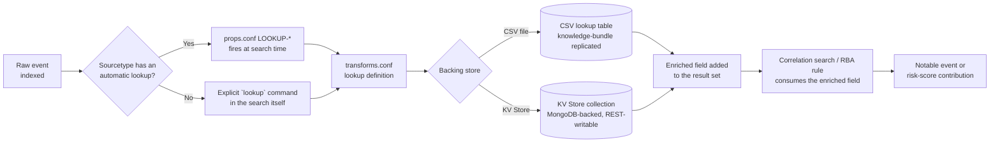

# Part 8 — Lookup Tables as Detection Infrastructure

## Why this part exists

**[CONCEPT]** DEH Part 26 §4.2 dissects a lateral-movement correlation search that excluded known
vulnerability-scanner hosts with a subsearch against a CMDB index — `NOT [ search index=cmdb
tag=scanner | fields host ]` — and shows exactly how that subsearch silently truncated past its
result-count cap, suppressing the exclusion for some scanner hosts and not others with no error
surfaced anywhere. Part 26 §4.3 states the fix in one sentence: replace the subsearch with a
`lookup` against a CSV export of the same data, "which has no comparable result-count cap and makes
the full exclusion list an inspectable, versioned artifact instead of a live query nobody thought to
check the size of." That sentence is where Part 26 stops, on purpose — its job is the SPL
language, and `lookup` is a command whose syntax it has now taught. This part starts exactly where
that sentence ends. Deciding a lookup beats a subsearch is a five-minute call once you know the
truncation mechanism Part 26 §4.1 documents. Building the table that `lookup` command actually
reads, wiring it into `transforms.conf` and `props.conf` so a search head resolves it correctly,
choosing whether it lives as a flat CSV file or a KV Store collection, and keeping its contents from
drifting out of date six weeks after the SOC stops thinking about it — that is a maintained
infrastructure problem, not a one-line syntax choice, and it is this part's whole subject.

This part does not re-teach the `lookup`, `inputlookup`, or `outputlookup` commands themselves —
Part 26 §4.1 and §4.3 already cover what each does and when a `lookup` beats a `join` or a
subsearch; a framing sentence pointing back there stands in for re-deriving that syntax anywhere
below. What follows instead: what a lookup table actually *is* as a platform object (§1); the two
`.conf` files that turn a file or collection into something SPL can query (§2); CSV lookups as
files with a real replication and editing story (§3); KV Store collections as the alternative built
for partial writes at scale (§4); the match-type and case-sensitivity decisions that determine
whether either one actually matches what you think it matches (§5); where a lookup sits in the path
from raw event to notable event (§6); and the ownership and review discipline that keeps a lookup
table from becoming exactly the kind of stale, silently-wrong reference data DEH Part 23 §3 already
named as Detection Debt's translation-layer failure mode (§7–8).

---

## 1. What a lookup table actually is, and the three shapes it comes in

**[CONCEPT]** A lookup table is a named, external mapping from one or more key fields to additional
output fields, resolved against a search's result set rather than stored inside the indexed event
stream itself. That single idea splits into three distinct platform objects that are easy to
conflate because they share a name:

- **The lookup table** — the actual data: a CSV file's rows and columns, or a KV Store collection's
  documents. This is the thing that goes stale, gets reviewed, and needs an owner.
- **The lookup definition** — the `` `transforms.conf` `` (and, for automatic lookups, `` `props.conf` ``)
  stanza that names the table, states its match behavior, and makes it addressable by a short name
  SPL can reference. This is configuration, not data.
- **The lookup invocation** — the `lookup`, `inputlookup`, or `outputlookup` command in an actual
  SPL search that reads from or writes to the table through its definition. DEH Part 26 §4 owns
  this layer; this part never re-teaches it.

Splunk supports three backing shapes for the table itself, and picking the wrong one for a given
use case is the single most common source of the problems §3 through §5 walk through in detail.

**Table 8.1 — The three lookup-table shapes and what each is actually for.** Use this table to
decide which shape a new reference dataset belongs in before writing a single `transforms.conf`
stanza; §3–§4 go into the CSV and KV Store rows in depth, and the third row is included for
completeness rather than as something this book's own examples build on further.

| Shape | Update pattern | Typical security use | Practical limit |
|---|---|---|---|
| CSV lookup file | Whole-file replace | Static or slow-changing allowlists, asset-criticality tables, MITRE technique-name references | Fine into the low tens of thousands of rows; whole-file replace cost grows with size |
| KV Store collection | Per-document create/update/delete via REST or SPL | Frequently-updated reference data — a risk-score cache, a dynamic asset-criticality table an external script maintains | Scales further than a CSV for write-heavy tables; adds a database dependency (§4) |
| External/scripted lookup | Computed on demand by an external script at search time | Enriching against a live external source (a threat-intel API) without pre-loading its full dataset | Adds per-search latency and an external-service failure mode; used sparingly in practice |

The rest of this part is organized around the first two rows, because they cover the overwhelming
majority of lookup tables an actual Splunk security deployment maintains. External/scripted lookups
exist and are documented, but they trade a maintained-artifact problem for a live-dependency
problem — the same tradeoff Part 26 §4.1 describes for a subsearch against a live index, just
moved outside Splunk entirely — and this book does not develop them further.

---

## 2. Defining a lookup: from file to searchable object

**[PLATFORM ENGINEER]** A CSV file sitting in an app's `lookups/` directory is not, by itself,
something SPL can query by name. Two `.conf` files turn it into one: `transforms.conf` names the
table and states how it matches, and — only if the lookup should apply automatically, without an
explicit `lookup` command — `props.conf` attaches it to a sourcetype.

### `transforms.conf` — the stanza that turns a file or collection into a lookup

**[PLATFORM ENGINEER]** The stanza below defines the same allowlist DEH Part 26 §5.2 reads from
in its worked SPL implementation of DET-26-01 (a process other than a known-good source opening a
memory-reading handle to `lsass.exe`, the Windows process holding credential material): a two-column
table of source-image paths and an allowlist flag.

```ini
# transforms.conf
[lsass_access_allowlist]
filename = lsass_access_allowlist.csv
case_sensitive_match = false
max_matches = 1
```

This is the whole of what makes `` `lsass_access_allowlist.csv` `` — the CSV lookup table file DEH
Part 26 §5.2's search reads via `` `lookup lsass_access_allowlist.csv SourceImage OUTPUT
is_allowlisted` `` — resolvable by name at all. `case_sensitive_match = false` and `max_matches = 1`
are the two settings that most often cause a lookup to behave differently than whoever wrote the
CSV expected; §5 covers both directly, because getting either wrong produces a silent mismatch, not
an error.

### `props.conf` — automatic lookups that run without being asked

**[PLATFORM ENGINEER]** A `LOOKUP-<class>` stanza in `props.conf` attaches a lookup definition to a
sourcetype so that every matching event gets the lookup applied automatically at search time — no
explicit `lookup` command required anywhere in the search that later reads the enriched field.

```ini
# props.conf
[XmlWinEventLog:Microsoft-Windows-Sysmon/Operational]
LOOKUP-lsass_allowlist = lsass_access_allowlist SourceImage OUTPUT is_allowlisted
```

With this stanza in place, any search against the `` `XmlWinEventLog:Microsoft-Windows-Sysmon/Operational` ``
sourcetype (the sourcetype Part 26 §5.1 names as the common landing spot for Sysmon telemetry
ingested through the Splunk Add-on for Sysmon) already has `is_allowlisted` populated before the
search body ever runs, and DET-26-01's explicit `lookup` line becomes redundant rather than
necessary — the automatic version and the explicit version produce the same enriched field, and a
detection engineer choosing between them is choosing where the cost is paid, not what the result
looks like.

> **Engineering Reality**
> An automatic lookup runs against *every* event of the matching sourcetype at search time, for
> every search that touches that sourcetype — including searches that never reference the looked-up
> field and would never have noticed it was missing. That cost is invisible in the SPL text itself;
> nothing in a search that doesn't mention `is_allowlisted` tells you the search is still paying to
> resolve it. A sourcetype carrying several automatic lookups, each one a moderately expensive
> match, adds real per-search overhead to a high-volume sourcetype that no single search's own text
> discloses — Part 12 covers diagnosing this kind of hidden cost with the Search Job Inspector.
> Attach an automatic lookup only to a sourcetype where the enrichment is genuinely needed by most
> searches against it; otherwise, an explicit `lookup` command in the specific searches that need it
> keeps the cost visible where a reviewer can actually see it.

---

## 3. CSV lookups: file semantics, replication, and editing at platform scale

**[PLATFORM ENGINEER]** A CSV lookup table file lives under an app's `lookups/` directory and is
distributed to every indexer or search peer that needs it as part of the **knowledge bundle** — the
full set of an app's knowledge objects (lookups, macros, saved searches, field extractions) that a
search head pushes out before dispatching a distributed search. That distribution mechanism has a
consequence worth stating plainly: a knowledge-bundle push replicates the *entire* lookup file, not
a diff against whatever version the peer already has. A ten-row allowlist and a two-hundred-thousand
row asset-criticality table cost the same *kind* of push — a full-file copy — just at very different
sizes, and a CSV lookup that's grown well past what it was originally sized for turns every bundle
replication cycle into a larger, slower push than the table's original design accounted for.

**[PLATFORM ENGINEER]** Editing the contents of an existing CSV lookup at the platform level is, by
default, a whole-file operation too: Splunk's own **Settings → Lookups → Lookup table files** page
lets you upload a new file that replaces the existing one, but it has no built-in mechanism for
editing a single row or cell in place. The free **Lookup Editor** app, widely used across Splunk
security deployments and available on Splunkbase, adds exactly that — inline cell editing, per-row
history, and lookup-level permissions — on top of the same underlying CSV file and the same
knowledge-bundle replication story described above; it changes how the file gets edited, not what
happens once it's saved. SPL's own `outputlookup` command (Part 26's territory, not re-taught
here) can also write a CSV lookup's contents directly from a search's result set, which is how a
scheduled search maintaining a dynamic table — a rolling list of hosts seen in the last 24 hours,
say — keeps a CSV lookup current without a human editing it by hand at all.

**[PLATFORM ENGINEER]** Because a CSV lookup file is, mechanically, just a file, it belongs in the
same version-controlled deployment pipeline as `savedsearches.conf` and `macros.conf` — Part 9
covers this discipline for macros in depth, and it applies to a lookup file with no meaningful
difference: a diff-able history of who changed which row and when, promoted across environments the
same way a correlation search's own `.conf` stanza is, rather than edited directly in a production
search head's filesystem with no record of the change.

### 3.1 What a truncation fix doesn't fix: staleness

**[DETECTION ENGINEER]** A CSV lookup solves Part 26 §4.2's truncation problem cleanly — but a
file that no longer truncates can still go stale, and staleness is a different failure mode with a
different fix.

> **Detection Autopsy — "the scanner allowlist that outlived the scanner"**
>
> **The rule:** A lateral-movement correlation search excludes source hosts listed in
> `` `scanner_allowlist.csv` `` (columns: `host`, `added_date`, `added_by`) from firing, so the
> vulnerability-scanner platform's own nightly broad-host-touching behavior doesn't page the SOC
> every night — exactly the fix Part 26 §4.3 recommends over a subsearch against a live CMDB
> index.
>
> **Why it shipped:** It's cheap, reviewable, and versioned — a static exclusion list checked into
> the same deployment pipeline as the correlation search itself, with no live-query truncation risk
> at all. It looked like a solved problem.
>
> **How it failed:** The scanner host was decommissioned during an infrastructure refresh, and its
> hostname and IP were reassigned to a new database server six weeks later. Nobody removed the old
> entry from `scanner_allowlist.csv` — no scheduled review owned that file, and its own presence in
> version control gave everyone false confidence that "it's tracked" meant "it's current." The
> correlation search kept silently suppressing anything from that host identifier, including the new
> database server's own genuine lateral-movement pattern, for three months after the reassignment.
>
> **The fix:** Two changes, not one. First, add an `added_date` column (already present above) and
> a companion scheduled search that flags any allowlist row past a fixed review window, rather than
> trusting version-control history alone to surface staleness. Second, tie removal from the
> allowlist to the same decommission workflow that removes a host from asset inventory — Part 17's
> Asset and Identity framework is exactly the system that already knows a host was decommissioned —
> instead of a manual "someone remembers to also update the lookup" step that has no owner and no
> trigger.

A staleness-review search of the kind the fix above calls for is a small, direct application of
`inputlookup`, `eval`, and `where` — all already taught in DEH's own SPL and query-language parts —
not new syntax this part is introducing:

```spl
| inputlookup scanner_allowlist.csv
| eval age_days=round((now()-strptime(added_date,"%Y-%m-%d"))/86400)
| where age_days > 180
```

This search's whole job is to surface any allowlist row older than roughly six months so a human
looks at it on a schedule; its main limitation is that it depends entirely on `added_date` having
been populated accurately when the row was added — a lookup table built without a date column in
the first place gives this search nothing to work with, which is itself an argument for building
that column in from the start rather than retrofitting it after the first staleness incident.

---

## 4. KV Store collections: partial writes, larger scale, and a separate backup problem

**[PLATFORM ENGINEER]** A **KV Store collection** is a MongoDB-backed set of documents, defined in
`collections.conf` and exposed to SPL through the same `lookup`/`inputlookup`/`outputlookup`
mechanism a CSV lookup uses — from a search's point of view, a KV-Store-backed lookup and a
CSV-backed lookup look nearly identical to invoke. What differs is underneath: a KV Store collection
supports **per-document create, update, and delete** through Splunk's REST API, without replacing
the whole table the way a CSV lookup's default editing model requires.

```ini
# collections.conf
[asset_criticality]
field.host = string
field.criticality = number
accelerated_fields.host_idx = {"host": 1}
```

```bash
curl -k -u admin:changeme \
  https://localhost:8089/servicesNS/nobody/search/storage/collections/data/asset_criticality/<_key> \
  -X POST -d '{"criticality": 90}'
```

**[PLATFORM ENGINEER]** That REST call updates one document's `criticality` field without touching
any other row in the collection — the exact operation a CSV lookup's whole-file-replace model
cannot do without rewriting the entire file. This is what makes KV Store the right shape for a
frequently-updated reference table: an external asset-criticality feed correcting one host's score
several times a day, or a risk-score cache an automation script updates continuously, both fit KV
Store's per-document write model far better than a CSV lookup's file-replace model. `accelerated_fields`
adds an index on a named field inside the collection, the KV Store equivalent of a database index,
which matters once a collection holds enough documents that an unindexed lookup against it becomes
its own performance problem — a concern Part 12 covers at the platform-performance level more
generally.

> **Product Version Note**
> Splunk Enterprise Security is currently sold in two editions — Essentials and Premier — with User
> and Entity Behavior Analytics (UEBA), SOAR integration, and "Automated Threat Analysis" gated to
> Premier; both of those Premier-only capabilities lean on KV-Store-backed state (behavioral
> baselines for UEBA, playbook and case state for SOAR) rather than CSV lookups, because both need
> the partial-write pattern described above at a scale a flat file doesn't comfortably reach. As of
> 2026-09-15, verified against Splunk's own Enterprise Security product page (Enterprise Security
> 8.7.0, released 2026-09-02; `REFERENCES.md` entry `[SPLUNK-ES-PRODUCT-PAGE]`). Part 13 covers this edition
> split in full; it's named here only because it's the clearest example of *why* a security team
> would reach for KV Store instead of a CSV lookup in the first place. Confirm which edition a given
> environment is actually licensed for before assuming either Premier capability — or the KV-Store
> volume it implies — is present.

> **Blind Spot**
> KV Store data is not part of the knowledge bundle a search head replicates to its search peers,
> and it is not backed up by the same configuration-backup process that protects `.conf` files and
> CSV lookups. A KV Store collection needs its own, separately-scheduled backup — Splunk exposes
> this through its own KV Store backup tooling, not through whatever process already backs up
> `$SPLUNK_HOME/etc`. A team that treats "we back up our Splunk config" as covering everything a
> lookup table might live in will discover the gap exactly once: after a KV Store collection is
> lost or corrupted and the asset-criticality table, risk-score cache, or ES Asset and Identity data
> it held turns out not to have been backed up at all.

Exact per-document and per-collection size caps for KV Store are set in `limits.conf`'s `[kvstore]`
stanza, and the specific default numbers have changed across Splunk releases; `docs.splunk.com`'s
own KV Store sizing page was not reliably fetchable by this book's research tooling (per
`STYLE-GUIDE.md` §9.4), so this part deliberately does not restate a specific byte figure it cannot
verify. Check the `[kvstore]` stanza's current documented defaults for the version actually
installed before sizing a new collection against a number carried over from a different release or
a different book.

---

## 5. Choosing between CSV and KV Store, and the match-type gotchas that bite either one

**[DETECTION ENGINEER]** §1's Table 8.1 named the update-pattern distinction; the table below turns
that into a decision a detection engineer can actually make when a new reference dataset needs a
home.

**Table 8.2 — CSV lookup vs. KV Store collection: which one fits a given reference table.** Read
each row as a question to ask about the specific dataset in front of you, not as a rule that applies
uniformly to every lookup in an environment.

| Question | Favors CSV lookup | Favors KV Store collection |
|---|---|---|
| How often does the data change? | Rarely — reviewed and edited on a schedule | Continuously — updated by automation or a live feed |
| Does an update touch one row or the whole table? | Whole-table edits are acceptable | Needs per-document partial updates |
| Does it need to be git-diffable, human-readable text? | Yes — plain CSV diffs cleanly in a pull request | No — inspected via SPL or the REST API, not a text diff |
| Does another Splunk app or ES capability expect a specific storage type? | — | Yes — e.g., ES's own Asset and Identity framework (Part 17) is KV-Store-backed |
| Realistic table size and write volume | Comfortably under tens of thousands of rows, low write rate | Larger tables, or high write rate, where whole-file replace becomes the bottleneck |

**[DETECTION ENGINEER]** Neither shape protects against a mismatch between how a lookup is defined
to match and how the field it's matching against is actually formatted, and that gap produces a
result that looks like a working lookup — no error, a clean search — that silently matches nothing,
or matches the wrong thing, for a specific subset of events. Three settings in `transforms.conf`
control this directly:

- **`case_sensitive_match`** — `true` by default for most match types; confirm this against the
  `transforms.conf.spec` for the Splunk version actually installed rather than assuming it carries
  over unchanged from an earlier release — `docs.splunk.com` was not reliably fetchable by this
  book's research tooling (`STYLE-GUIDE.md` §9.4), so this specific default is stated from general
  product familiarity, not a cited source, and should be treated accordingly. A field extraction upstream
  that starts emitting `C:\Windows\System32\lsass.exe` in a different case than the allowlist file
  was originally written in — a common side effect of a TA (Technology Add-on) upgrade that changes
  how a path gets normalized — produces exactly zero matches against rows that used to match, with
  no error anywhere in the search.
- **`match_type = WILDCARD(<field>)`** — enables `*`-style wildcard matching for a specific field
  instead of the default exact-string match; useful for a process-path allowlist that needs to match
  any version-numbered subdirectory without a row per version.
- **`match_type = CIDR(<field>)`** — enables CIDR-range matching for a field holding IP addresses,
  so a single row (`10.0.0.0/8`) can match every address in that range instead of needing one row
  per address. Without this setting, a lookup table's `10.0.0.0/8`-formatted column is compared as a
  literal string against an event's IP field and will not match any actual address in that range —
  the lookup runs cleanly, returns no match, and gives no indication that the CIDR notation was
  never being interpreted as a range in the first place.

> **False Positive Trap**
> An allowlist lookup that stops matching because of a case or match-type mismatch doesn't produce
> false positives directly — it produces the opposite failure, a detection that should have been
> suppressed and wasn't, which then gets triaged, closed as a false positive by an analyst who never
> sees the underlying cause, and quietly re-tuned by widening a threshold instead of fixing the
> lookup. The fix is not "raise the threshold until the noise stops" — that just makes a real
> positive matching the same pattern harder to catch too. Confirm the actual case and format of the
> field being matched against, in real search results, before assuming a `transforms.conf` stanza
> written months earlier still matches what an upstream TA or field extraction now produces.

---

## 6. Where a lookup sits in the enrichment path

**[CONCEPT]** Every lookup discussed above — CSV or KV Store, automatic or explicit — resolves at
the same point in a search's execution: after the event is already in the result set, before
whatever consumes the enriched field runs. Figure 8.1 draws that single convergence point across
both invocation paths and both storage shapes, because it is the one structural fact this part's
sections all depend on and none of them state as a picture until now.






**Figure 8.1 — Lookup resolution path from raw event to notable event.** *CONCEPTUAL.* Illustrates
the two lookup-invocation paths (automatic via `props.conf`, explicit via a `lookup` command) and
the two backing-store options (§3, §4) converging on the same enrichment point before a correlation
search or risk-based alerting rule (Part 14, Part 15) consumes the result. This is a diagram of
documented, expected SPL and platform behavior, not a capture from a live Splunk job inspector — no
Splunk deployment exists in this book's evidence base (`STYLE-GUIDE.md` §9.2).

---

## 7. Lookup tables as maintained infrastructure: ownership, review cadence, and versioning as code

**[SOC MANAGEMENT]** Everything in §3 through §5 solves a technical problem — replication cost,
partial writes, match-type correctness. None of it solves the organizational problem the Detection
Autopsy in §3.1 actually turned on: a lookup table with no assigned owner and no scheduled review
drifts silently, the same way any allowlist drifts, and Splunk's platform gives that drift no
warning of its own. A CSV file that matches nothing because of a case mismatch and a CSV file that
matches the wrong host because of a stale row both look, from the platform's point of view, like a
lookup working exactly as configured — because it is. The staleness is a content problem the
platform was never going to catch, and treating "it's in version control" as equivalent to "someone
reviews it" is the specific mistake the §3.1 Autopsy shows the cost of.

> **SOC Management View**
> A lookup table with no named owner is a liability the same way an unowned firewall rule or an
> unowned service account is: nobody notices it's wrong until it's already caused a gap, and by
> then the gap has usually existed for a while. Assign every detection-relevant lookup table an
> owner and a review cadence as a matter of policy — the same governance a correlation search
> itself gets under Part 14's content-lifecycle discipline — rather than treating a lookup file as a
> one-time setup artifact that doesn't need the same ongoing attention as the detection logic that
> reads from it. The cost of a scheduled quarterly review of a handful of allowlist lookups is
> trivial against the cost of a three-month blind spot on a reassigned host, and that comparison is
> the one to put in front of a team that treats lookup maintenance as optional cleanup work.

**[DETECTION ENGINEER]** In practice, this means applying the exact discipline Part 9 describes for
search macros to lookup table files as well: check them into the same version-controlled repository
as `savedsearches.conf` and `macros.conf`, promote changes across environments through the same
pipeline, and require a reviewed pull request for a change to a production allowlist the same way a
change to a correlation search's threshold would require one. A lookup file is not exempt from
code-review discipline just because its contents are data rather than SPL — the scanner-allowlist
failure in §3.1 was, in the end, a change-management failure (a decommission that never propagated)
wearing a technical costume.

> **What Would Change My Mind**
> This part recommends a scheduled review cadence and an ownership assignment for every
> detection-relevant lookup table, on the reasoning that unreviewed reference data drifts the same
> way any allowlist drifts. No measured incident rate from a real SOC backs the specific cadence
> recommended here — that would require observing actual lookup-staleness incidents against actual
> review intervals over a real retention window, which this book's evidence base (`STYLE-GUIDE.md`
> §9.2) cannot supply. If a real deployment's incident history showed staleness-driven gaps
> clustering well outside whatever cadence this part implies is sufficient, that's a direct reason
> to tighten it, not a reason to abandon scheduled review altogether.

---

## 8. Where lookups feed the rest of the platform

**[CONCEPT]** A lookup table built and maintained the way §1 through §7 describe doesn't stop at
enriching a single search's results. Part 14 covers a correlation search's adaptive response actions
writing back to a lookup — flagging a host as already investigated, for instance, so a second
correlation search's exclusion logic can read that flag on its own next run. Part 15 covers risk
objects consuming lookup-backed asset-criticality data directly, so a risk score for a given host
reflects that host's actual business importance rather than treating every asset identically. Part
17 covers the Asset and Identity framework specifically — Enterprise Security's own KV-Store-backed
system for exactly the kind of asset and identity enrichment §4's `asset_criticality` example
illustrates in miniature, built at a scale and with a maintenance workflow this part only sketches.
None of those three parts re-derives what a lookup table is or how `transforms.conf` and
`props.conf` wire one up — that grounding is this part's job, done once, so Parts 14, 15, and 17 can
each build on it without restating it.

---

**Cross-references:** DEH Part 26 §4.1–4.3 (subsearch truncation, the scanner-exclusion Detection
Autopsy, `lookup`/`join`/subsearch tradeoffs); DEH Part 23 §3 (Detection Debt's translation-layer
failure mode); this book's Part 9 (search macros — the sibling maintained-infrastructure discipline
this part's §7 applies to lookup files directly); Part 12 (search performance and the Job Inspector,
for diagnosing automatic-lookup and KV-Store-accelerated-field cost at scale); Part 13 (Enterprise
Security editions and the Essentials/Premier split referenced in §4's Product Version Note); Part 14
(correlation searches and adaptive response actions writing to lookups); Part 15 (risk-based
alerting consuming lookup-backed asset criticality); Part 17 (the Asset and Identity framework as
KV Store's canonical Enterprise Security application).
