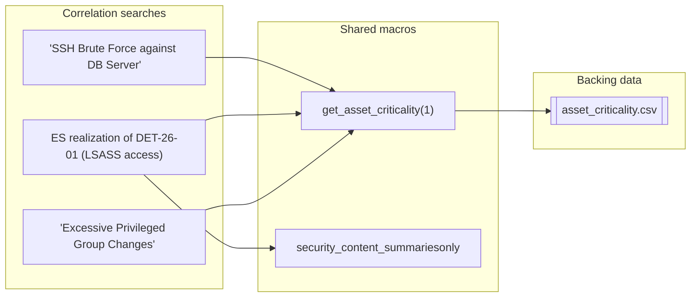

# Part 9 — Search Macros and Reusable Logic

## Why this part exists

This is an operations-layer part. Part 8 covered lookup tables — reusable *data* joined into a search. This part covers the other half of reusable detection infrastructure: reusable *search logic* itself, in the form of a search macro. Where a lookup answers "what do I know about this value," a macro answers "what expression, filter, or computation do I not want to retype in every correlation search that needs it." The two are frequently used together, and §5 below is explicit about when to reach for which.

This part assumes the reader already knows what `eval` computes per event and what a `lookup` does to a result set — DEH Part 26 §1.3 owns that syntax-level foundation, and this part does not re-teach it. What this part adds is Splunk-specific and platform-scoped: how a macro is actually defined on disk, how it differs from plain text substitution once `iseval` enters the picture, how it's shared and versioned as a knowledge object, and — the part's real payload — how an unowned, untested macro becomes one of the quietest and most expensive forms of detection debt a Splunk environment can accumulate, because nothing in Splunk's own UI shows you, by default, which correlation searches would break if you changed it. Part 10 picks up the other named-but-undeveloped thread from DEH Part 26 — `tstats` and data model acceleration — and this part's §6 hands off directly to it, since one of the two real macros examined here exists specifically to control accelerated-search behavior.

---

## 1. What a macro actually is

**[CONCEPT]** A Splunk search macro is a named, reusable fragment of search-language text, expanded by substitution before the search ever runs. That's the entire mechanism: Splunk stores a macro's definition, and when a search string contains a backtick-delimited invocation of that macro's name, Splunk replaces the invocation with the definition's text, then parses and dispatches the resulting, fully-expanded search — the same way a C preprocessor macro or a shell alias expands before the compiler or shell ever sees the substituted form. Nothing about a macro is evaluated per event by default; it's a text-substitution step that happens once, at search-parse time, before dispatch.

That single mechanism supports two genuinely different use patterns, and conflating them is the single most common source of confusion for someone new to macros:

- **A macro that expands to a piece of SPL** — a `search` clause, a `lookup` invocation, a `stats` fragment — dropped into the pipeline at the point where it's invoked. This is the common case, and it's what most hand-authored macros in a Splunk environment actually are.
- **A macro that expands to a *value*, computed from an eval expression** — a number, a string, a boolean — for use inside another command like `eval` or `where`. This is the `iseval` case, covered in §3, and it behaves differently enough from plain substitution that it's worth treating as its own topic rather than a variant of the first.

**[PLATFORM ENGINEER]** Macros live in `macros.conf`, are knowledge objects like lookups, saved searches, and eventtypes, and inherit the same app-scoping and permission model — private to the user who created it, shared within an app, or exported globally, controlled the same way any other knowledge object's sharing is controlled (via `default.meta`/`local.meta` `export` settings or the equivalent Splunk Web permissions dialog). A macro defined in one app is invisible to a search running in another app's context unless it's explicitly shared — a routine cause of "this correlation search worked in my sandbox app and throws an unknown-macro error once promoted," and one more reason Part 14's content-promotion discussion and this part's §7 on ownership are related concerns, not independent ones.

---

## 2. `macros.conf` — where a macro definition actually lives on disk

**[PLATFORM ENGINEER]** A macro's stanza name is the macro's own name, with one wrinkle: if the macro takes arguments, the stanza name carries the argument count in parentheses, because Splunk allows two macros with the same base name and different argument counts to coexist as distinct definitions.

CONCEPTUAL SAMPLE — `get_asset_criticality(1)` is an invented macro built as this part's running example, not a macro shipped by Splunk or captured from a real deployment; every later code block in this part that invokes it inherits the same status.

```ini
[get_asset_criticality(1)]
args = dest
definition = lookup asset_criticality.csv asset_id AS $dest$ OUTPUT criticality_tier, asset_owner
validation = isnotnull($dest$)
errormsg = get_asset_criticality requires a non-empty dest field or literal value as its argument
```

This macro takes one argument (`dest`), performs a lookup against `asset_criticality.csv` — the same lookup table this book's Part 8 uses as its running example — and outputs a criticality tier and an owner. Its main limitation is the one every lookup-backed macro shares: it enriches silently and fails silently. A lookup with no matching row does not error the search; it simply leaves `criticality_tier` and `asset_owner` unset for that event, and a downstream `where criticality_tier>=3` on an unset field drops the event instead of flagging a data problem. §7's Detection Autopsy walks through exactly this failure mode.

The table below summarizes the `macros.conf` keys this part actually uses — not an exhaustive spec, an orientation before the worked sections.

| Key | Purpose | Required | Example |
|---|---|---|---|
| `definition` | The text (or eval expression, if `iseval = true`) the macro expands to | Yes | `lookup asset_criticality.csv asset_id AS $dest$ OUTPUT criticality_tier` |
| `args` | Comma-separated argument names, referenced in `definition` as `$argname$` | Only if the stanza name has an arg count | `dest` |
| `validation` | An eval expression checked against the supplied arguments before expansion | No | `isnotnull($dest$)` |
| `errormsg` | The error text shown if `validation` evaluates to false | Only alongside `validation` | `get_asset_criticality requires a non-empty dest field...` |
| `iseval` | If `true`, treat `definition` as an eval expression evaluated once at parse time, not as literal SPL text | No — default is `false` | `iseval = 1` |
| `disabled` | Disables the macro without deleting its definition | No | `disabled = 1` |

Invocation in SPL is the mirror image of the stanza: backticks around the macro name, arguments as a comma-separated list matching the order in `args`.

CONCEPTUAL SAMPLE — invoking the invented `get_asset_criticality(1)` macro above; not captured from a real correlation search.

```spl
| `get_asset_criticality(dest)`
| where criticality_tier>=3
```

**[DETECTION ENGINEER]** Nothing here re-derives `lookup` or `where` syntax — DEH Part 26 §1.3 already covers both — this part's contribution is that the macro invocation itself is a first-class piece of the search string, expanded before anything else about the query is evaluated. That ordering matters: a macro's `validation` expression runs at parse time against whatever literal or field token was passed as an argument, before a single event has been read.

> **Engineering Reality**
> A macro invoked with no matching definition — wrong argument count, typo'd name, or a macro that exists but isn't shared into the calling app's context — fails the search at parse time with an "unknown macro" error, not a silent no-op. That's the good case: it's loud, and it's the first thing a broken promotion shows you. The bad case, covered in §7, is a macro that *does* expand successfully but against data that's changed underneath it — that failure mode is quiet, and it's the one worth actually planning for.

---

## 3. Eval-based macros: computing a value once, not per event

**[DETECTION ENGINEER]** Setting `iseval = true` changes what Splunk does with `definition`: instead of treating it as literal SPL text to splice in, Splunk evaluates it once, as an eval expression, at parse time, and substitutes the *result* into the search string. This is the detail that trips people up — an `iseval` macro's expression does not run per event the way an `eval` command in the pipeline does. It runs exactly once, before the search dispatches, using only its own arguments and any values available at parse time — never a per-event field pulled from the data the search hasn't read yet.

The practical use case that follows from that constraint is a parameterized constant, not a per-event classification:

CONCEPTUAL SAMPLE — `lookback_seconds(1)` is an invented `iseval` macro built to illustrate parse-time constant computation, not a macro shipped by Splunk or captured from a real deployment.

```ini
[lookback_seconds(1)]
args = hours
definition = $hours$ * 3600
iseval = 1
```

CONCEPTUAL SAMPLE — invoking the invented `lookback_seconds(1)` macro above; the `tstats` command itself is real syntax (Part 10 covers it in depth), but this specific search line is illustrative, not a capture from a real deployment.

```spl
| tstats count from datamodel=Authentication where earliest=-`lookback_seconds(4)`s
```

The macro computes `4 * 3600` once and substitutes the literal `14400`, so the dispatched search reads `earliest=-14400s` — a small convenience, but a real one, since it lets a correlation search's schedule window be expressed in hours in one place instead of forcing every author to do unit arithmetic by hand and get it wrong at 3 a.m.

A Blind Spot callout would be the wrong shape for what actually goes wrong with `iseval` macros in practice — the real trap is the opposite mistake: writing an `iseval` macro that *tries* to reference a per-event field like `date_hour` or a source-specific field, expecting per-event evaluation, and getting a parse-time error or a nonsensical constant instead, because that field doesn't exist yet at the point the macro expands. If you want per-event business-hours logic, that's a plain `eval` command in the pipeline, computed after the events are read — not an `iseval` macro, which by construction runs before there are any events to compute against.

**[PLATFORM ENGINEER]** Splunk's own published detection content gives a real, verified example of a non-`iseval` macro used for exactly the kind of small, repeated transform this section is about. The `security_content_ctime` macro, shipped as part of Splunk's Enterprise Security Content Update (ESCU) detections in the public `splunk/security_content` repository, is defined as:

```ini
[security_content_ctime(1)]
args = field
definition = convert timeformat="%Y-%m-%dT%H:%M:%S" ctime($field$)
```

One argument, one `convert` clause, invoked as `` `security_content_ctime(_time)` `` anywhere a detection needs a consistent ISO-8601 timestamp string instead of repeating the same `convert` clause in every rule. It is plain text substitution, not `iseval` — and it illustrates the more common of the two patterns from §1 well enough that it's worth recognizing on sight if it shows up in a vendor-supplied detection your environment has installed.

---

## 4. Nesting: a macro that expands to another macro's invocation

**[DETECTION ENGINEER]** A macro's `definition` can itself contain a backtick-delimited invocation of another macro, and Splunk expands nested invocations before dispatch the same way it expands the outer one — this is how a small number of primitive macros get composed into a more complex, still-reusable unit, and it's also exactly where "who depends on what" stops being visible from any single macro's own definition.

Splunk's own `security_content_summariesonly` macro, from the same `splunk/security_content` repository, is a real, verified example of this composition:

```ini
[security_content_summariesonly]
definition = summariesonly=`summariesonly_config` allow_old_summaries=`oldsummaries_config` fillnull_value=`fillnull_config`
```

Its own definition is nothing but three further macro invocations — `` `summariesonly_config` ``, `` `oldsummaries_config` ``, and `` `fillnull_config` `` — each presumably a small macro somewhere else in the same app that resolves to a single configured value. The composed macro exists to control `tstats`'s `summariesonly` behavior against an accelerated data model in one place across every correlation search that uses it, rather than three raw parameters repeated in every rule. Part 10 covers what `summariesonly` and accelerated-summary coverage actually mean at the `tstats` level; this part's point is narrower: read a macro's own definition and you may still be looking at three more macros you haven't read yet, and Splunk will expand all of them without complaint as long as there's no cycle. A macro that invokes itself, directly or through a chain, is a configuration error Splunk detects and refuses to expand rather than an infinite loop — but a three-hop chain like this one, spread across three separate `macros.conf` stanzas possibly owned by three different teams, is a real, non-pathological case that's already hard to trace by eye.

> **Product Version Note**
> `security_content_ctime` and `security_content_summariesonly` are real macros published in Splunk's `security_content` GitHub repository as supporting content for Enterprise Security Content Update (ESCU) detections, verified against that repository on 2026-09-15 (see `REFERENCES.md` entry `[SECURITY-CONTENT-REPO]`). ESCU's own detection and macro set changes on its own release cadence, independent of the core Splunk Enterprise or Enterprise Security version installed underneath it — treat any specific macro name from that repository as accurate to the retrieval date above, and re-check the repository directly before assuming a given environment's installed ESCU version still ships the exact same definition.

---

## 5. Macros, lookups, and subsearches: choosing the right reuse mechanism

**[PLATFORM ENGINEER]** DEH Part 26 §4.3 already covers the choice between a `lookup` and a subsearch for a filtering problem, and the reasoning there — a subsearch pays an extra, capped, independently-scheduled search's cost every time the outer search runs, where a lookup is a table join with no second search behind it — carries over unchanged. What that section doesn't cover, because it's out of DEH's scope, is where a *macro* fits alongside those two, since a macro isn't a data-reuse mechanism at all — it's a logic-reuse mechanism that can wrap either of the other two.

| Mechanism | Reuses | Evaluated | Best for | Main limitation |
|---|---|---|---|---|
| Search macro (SPL fragment) | A search-string fragment — a filter, a lookup call, a sequence of commands | Once, at parse time, via text substitution | Repeated query *shape* across many searches — a standard enrichment step, a standard time-window filter | No visibility into which searches use it (§7); breaks silently if the fragment it wraps changes underneath it |
| Search macro (`iseval`) | A computed constant derived from its own arguments | Once, at parse time, via eval | Unit conversion, small parameterized formulas — not per-event logic | Easy to mistake for per-event `eval`; cannot see fields the search hasn't read yet |
| Lookup (CSV or KV Store) | External reference data joined to the result set | Per search execution, against current table contents | Allowlists, enrichment tables, anything that changes without a code change | No versioning of its own beyond file/collection history; a lookup rename breaks every macro or query referencing the old name |
| Subsearch | An independently-run search whose results become a filter for the outer search | Per outer-search execution, as its own capped, scheduled search | Small, genuinely dynamic result sets that can't be pre-computed into a lookup | Result-count cap and extra search cost — DEH Part 26 §4.3 |

The practical rule: if what's being reused is *data that changes* — an allowlist, an asset inventory, a criticality rating — put it in a lookup and reference the lookup, directly or through a macro. If what's being reused is *query shape* — the same filter, the same enrichment call, the same threshold expression, written identically across a dozen correlation searches — put it in a macro. `get_asset_criticality(1)` from §2 is both at once, deliberately: the data lives in `asset_criticality.csv` (Part 8's concern), and the macro exists so that every correlation search wanting that enrichment writes one backtick-delimited line instead of the full `lookup ... AS ... OUTPUT ...` clause, and so that if the lookup's key field ever needs to change, there's exactly one place — the macro's `definition` — that needs to change to match, instead of every correlation search that inlined the lookup clause directly.

**[SOC ANALYST]** None of this changes what shows up in Incident Review — a notable event enriched via a macro-wrapped lookup looks identical to one enriched by an inline lookup clause. The distinction in this section is entirely a detection-engineering and platform-maintenance concern; an analyst working a notable has no reason to know or care which mechanism populated `criticality_tier`, only that it's there and current.

---

## 6. Sharing, precedence, and where a macro lands in the search-head layer stack

**[PLATFORM ENGINEER]** A macro is layered configuration like any other `.conf` file: an app's `default/macros.conf` ships the vendor or team default, a `local/macros.conf` in the same app or in a higher-precedence app overrides it, and Splunk's configuration-merging rules (same precedence order as every other `.conf` file — a subject Part 2 covers for deployment architecture generally) decide which definition actually wins when more than one exists for the same stanza name. `splunk btool macros list --debug` shows the effective, merged definition after that precedence resolves, along with which file it actually came from — the right first diagnostic step when a macro behaves differently than its `default/macros.conf` definition suggests it should, because something in `local/` or a higher-precedence app is quietly overriding it.

In a search head cluster, a macro's definition has to reach every cluster member the same way any other knowledge object does — bundled and pushed by the deployer as part of the cluster's configuration bundle, not hand-edited on one member and expected to replicate on its own. A macro that works on the search head where it was authored and throws an unknown-macro error on a scheduled correlation search running on a different cluster member is very often exactly this: a bundle push that hasn't happened yet, not a macro-syntax problem at all. Part 2 covers the deployer and bundle-push mechanics directly; this part's point is narrower — a macro's `.conf` file is subject to the same clustering discipline every other knowledge object is, and it's easy to forget that a macro is a knowledge object at all, since it doesn't show up in Incident Review the way a notable or a risk score does.

Sharing scope follows the same permission model as any other knowledge object: private to its author, shared within the owning app, or exported globally (`export = system` in the relevant `.meta` file, or the equivalent toggle in Splunk Web's permissions dialog). A macro exported only within its authoring app is invisible to a search dispatched from a different app's context — including, commonly, a correlation search that was developed in a sandbox app and then promoted into the Enterprise Security app's context per Part 14's content-lifecycle discussion, without anyone re-checking the macro's sharing setting during that move.

---

## 7. Macro sprawl as detection debt

**[PLATFORM ENGINEER]** Splunk ships no native, always-on dependency graph showing which saved searches, dashboards, or correlation searches invoke a given macro. `btool` and the REST interface for knowledge objects will enumerate every macro that *exists*; neither one answers "what breaks if I change this macro's definition." That direction of the dependency graph — from the shared macro outward to everything that calls it — has to be built by the team that owns the environment, typically by grepping `savedsearches.conf`, dashboard XML/JSON, and any other macro's `definition` for the backtick-delimited invocation of the macro in question. This gap in Splunk's own tooling is real and structural; the specific incident walked through below is a conceptual illustration of what that gap allows to happen, not a captured event from a real deployment.

> **Blind Spot**
> Splunk's own tooling tells you every macro that exists and, via `btool`, exactly which file each one's effective definition came from. It tells you nothing about which correlation searches, dashboards, or other macros actually invoke a given macro. A shared macro's blast radius is invisible from inside Splunk itself — it has to be reconstructed externally, by searching configuration files for the macro's own name, every time someone wants to change it safely.

> **Detection Autopsy — the asset-criticality macro that went quietly dark**
>
> *CONCEPTUAL — a scenario built on this part's own invented running-example macro (`get_asset_criticality(1)`), not a documented public incident or a capture from a real deployment; per STYLE-GUIDE.md §9.2, no Splunk instance backs this book's evidence base.*
>
> **The rule:** Several correlation searches, including an Enterprise Security realization of DET-26-01 (the LSASS memory-access analytic DEH Part 26 §5 builds as raw SPL), invoke `` `get_asset_criticality(dest)` `` to enrich every match with a criticality tier, then filter with `where criticality_tier>=3` so a hit against a low-value test host doesn't generate a notable.
>
> **Why it shipped:** Centralizing the enrichment in one macro, backed by one lookup, looked like exactly the kind of DRY discipline Part 8 recommends — one place to maintain the criticality data, one place to maintain the join logic, both reused everywhere the concept was needed.
>
> **How it failed:** An unrelated CIM-onboarding cleanup (Part 7's subject) renamed the asset inventory's key field from `asset_id` to `ci_id` as part of a broader identity-normalization pass, and updated most of the lookups that referenced it — but not `asset_criticality.csv`, which nobody flagged as depending on that field name because no artifact in Splunk showed that `get_asset_criticality(1)` was the thing actually consuming it. The macro kept expanding without error. The `lookup` command inside it kept running without error. It simply stopped matching any row, `criticality_tier` came back unset on every event, and `where criticality_tier>=3` silently dropped everything — including real LSASS-access hits against genuinely critical hosts. Every correlation search invoking the macro went quiet at the same time, with no error, no failed-search notification, and no change to any of those searches' own version history.
>
> **The fix:** A scheduled sanity search asserting that `` `get_asset_criticality(dest)` `` returns a non-null `criticality_tier` for a small set of known-good, permanently-criticality-rated hosts, alerting if it ever comes back empty — the macro-testing discipline covered in §8 — plus explicit ownership of the macro and its backing lookup recorded somewhere a field-rename PR would actually surface it, covered next.

**[SOC MANAGEMENT]** The failure above isn't a testing gap in the abstract — it's a staffing and ownership gap. `get_asset_criticality(1)` had no assigned owner, so a field-rename change elsewhere had no reason to check whether anything depended on the old field name through an indirection nobody was tracking. Treat every shared macro that more than one correlation search depends on the way you'd treat a shared library in application code: it needs a named owner, a change-review step before its definition or its backing lookup's schema changes, and a place that owner is recorded — a `CODEOWNERS`-style file in the detection-content repository DEH Part 22 already assumes exists, not tribal knowledge held by whoever wrote the macro first and may have since left the team.

---

## 8. Testing and versioning macros as code

**[DETECTION ENGINEER]** DEH Part 22's detection-as-code discipline — version control, pull-request review, lint/syntax validation, and CI-gated promotion before a detection reaches production — applies to a macro at least as strongly as it applies to a correlation search, and arguably more strongly, because a macro has no notable-event history, no urgency field, and no dashboard panel of its own to make a silent behavior change visible after the fact. A correlation search that starts misbehaving eventually shows up as a spike or a drought in Incident Review's own metrics; a macro that starts misbehaving shows up as several *unrelated* correlation searches misbehaving at once, in a way that doesn't obviously point back to the one shared file that actually changed.

Three concrete practices follow directly from treating a macro as maintained infrastructure rather than a one-off convenience:

- **Version-control every `macros.conf` alongside the correlation searches that depend on it**, in the same repository and the same review process DEH Part 22 describes for detection content generally — a macro's `definition` changing is exactly the kind of diff a reviewer should be able to see and reason about, not something buried in a `local/` directory nobody diffs.
- **Write a small canary search per shared macro** — the fix described in the Detection Autopsy above generalizes: a scheduled, low-volume search that invokes the macro against a small set of known-good inputs and asserts the output looks right, alerting on drift rather than waiting for a downstream correlation search's silence to be noticed by an analyst wondering why a normally-noisy rule went quiet.
- **Record, in the macro's own `macros.conf` comments or its entry in the detection-content repository, every correlation search and dashboard known to invoke it** — a manually maintained reverse-dependency list is a poor substitute for tooling Splunk doesn't provide (per the Blind Spot above), but a poor substitute maintained honestly beats no record at all, and it's the artifact that turns "grep everything before you change this" into "check this list first."

> **What Would Change My Mind**
> This section's claim — that macro ownership and canary testing meaningfully reduce the risk described in the Detection Autopsy above — is argued from mechanism, not measured. What would move it from argued to demonstrated is a real Splunk environment tracked over at least one full schema-change cycle: one cohort of shared macros with assigned owners and canary searches, one cohort without, and a comparison of how long a silent enrichment failure went undetected in each. No deployment in this book's evidence base can supply that comparison; it would need a real SOC's change history to measure, which is exactly the gap Part 20 closes this book out by naming.

---






**Figure 9.1 — Shared-macro dependency fan-in.** *CONCEPTUAL.* Illustrates how three unrelated correlation searches can share one macro, and how that macro in turn depends on one lookup table — so a single edit to `get_asset_criticality(1)`'s definition, or to `asset_criticality.csv`'s key field, changes the behavior of all three correlation searches at once with no diff appearing in any of their own version history. This is an illustrative dependency sketch, not a capture from a real Splunk deployment or a dependency-graph tool — no such tool ships natively with Splunk, which is precisely the Blind Spot named in §7.

---

## 9. Worked walkthrough: `get_asset_criticality(1)` end to end

**[DETECTION ENGINEER]** Pulling the sections above into one sequence, using the macro this part has returned to throughout:

1. **Definition** (§2): `[get_asset_criticality(1)]` in `macros.conf`, one argument (`dest`), a `lookup` clause against `asset_criticality.csv`, a `validation` expression rejecting a null argument before expansion even attempts the lookup.
2. **Choice of mechanism** (§5): the criticality data lives in a lookup because it changes independently of any search; the macro exists purely so the join-and-filter shape doesn't get retyped in every correlation search that wants it.
3. **Invocation**, e.g. inside the Enterprise Security realization of DET-26-01 discussed in Part 14:

CONCEPTUAL SAMPLE — invoking this part's own invented running-example macro; illustrates where the line would sit inside a real correlation search, not a capture of one.

```spl
| `get_asset_criticality(dest)`
| where criticality_tier>=3
```

One sentence on what this targets: it's the enrichment-and-filter step that keeps a raw LSASS-access match from generating a notable against a low-criticality test host. Its main limitation is the one the Detection Autopsy in §7 already walked through in full — a silent, non-erroring failure mode if the lookup's key field or the macro's own `$dest$` reference ever drift apart.

4. **Sharing and layering** (§6): exported at the app level so both the sandbox correlation search under development and its promoted counterpart in the Enterprise Security app's context can resolve the same macro name to the same definition, and pushed through the search head cluster's deployer bundle like any other knowledge object rather than hand-edited on one cluster member.
5. **Ownership and testing** (§7–§8): a named owner recorded alongside the macro, and a canary search asserting `criticality_tier` never silently goes null against a fixed set of known-critical hosts — the concrete artifact that would have caught the failure in §7's Detection Autopsy before an analyst noticed a normally-active rule had gone quiet.

**[SOC ANALYST]** From Incident Review, none of the five steps above are visible — a notable either shows a populated `criticality_tier` field or it doesn't. An analyst who notices a notable missing an expected enrichment field that peer notables usually carry has just found a live instance of exactly the failure mode this part spends most of its length on, and the right escalation is to the macro's owner (step 5), not a manual re-run of the lookup by hand.

---

**Cross-references:** DEH Part 26 §1.3 (SPL syntax fundamentals — `eval`, `lookup`, `where` — assumed throughout), DEH Part 26 §4.3 (lookup-vs-subsearch tradeoff, extended in §5 above to include macros), DEH Part 23 §1 and §6 (DET-23-01 and its cross-language carry-forward convention, continued here via DET-26-01), DEH Part 22 (detection-as-code discipline, applied to macros in §8). Within this book: Part 8 (lookup tables as detection infrastructure, backing `asset_criticality.csv`), Part 10 (data model acceleration and `tstats`, the mechanism `security_content_summariesonly` controls), Part 14 (correlation-search anatomy and content-lifecycle promotion), Part 17 (asset and identity correlation, extending the criticality-enrichment pattern), Part 20 (validation gaps, including the untested claim in §8's What Would Change My Mind).
