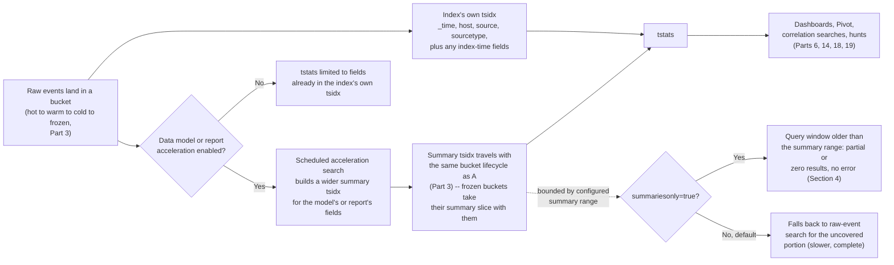

# Part 10 — Data Model and Report Acceleration

## Why this part exists

This is a platform-layer part. It answers a question DEH Part 26 §1.3 raises by name and deliberately leaves open: that part's SPL command table lists `tstats` as a command that "aggregates directly over indexed/accelerated fields without reading raw events," tags it "named where scale matters; not covered in depth here," and its own opening section states plainly that "a full accelerated-search treatment belongs in a dedicated performance-engineering appendix, not here." This part is that appendix. It also resolves the same forward reference DEH Part 23 leaves standing when it carries the canonical DET-23-01 analytic (MITRE T1003.001, OS Credential Dumping: LSASS Memory) through to DEH Part 26 §5's SPL realization as DET-26-01 — a search this part comes back to below, once there's a concrete reason to.

Two Splunk features do the same underlying trick for different scopes, and this part covers both: **data model acceleration**, which pre-computes a shared summary that any number of searches can read against a whole data model, and **report acceleration**, which pre-computes a summary for exactly one saved report. Both are pre-computation decisions made before a query ever runs, which is why this part sits next to Part 11 (summary indexing, a third pre-computation strategy with different tradeoffs) rather than next to Part 12 (search performance and tuning, which covers what happens when a query runs against whatever pre-computation already exists). This part assumes Part 3's bucket lifecycle (hot/warm/cold/frozen) and Part 6's data model structure as background — it cites both rather than re-deriving them — and it feeds directly into Part 14's correlation searches and Part 18's dashboards, both of which lean on the mechanism built here to stay fast at scale.

## 1. One mechanism, two features: the accelerated summary

**[CONCEPT]** Every Splunk index already keeps a `tsidx` file alongside each bucket's compressed raw-data journal — a lightweight, time-bucketed index of a small, fixed set of fields (`_time`, `host`, `source`, `sourcetype`, and anything explicitly configured for index-time extraction) that lets Splunk locate matching events without scanning every raw event first. Data model acceleration and report acceleration both extend that same idea deliberately: instead of relying only on the handful of fields every index already tracks, Splunk builds and maintains a *second*, purpose-built `tsidx` summary that captures a wider, chosen set of fields — the fields a specific data model defines, or the fields a specific report's search computes — so that a search targeting exactly that field set never has to touch `_raw` at all.

The payoff is the same shape in both cases: a search that would otherwise decompress and re-parse every matching raw event, on every run, instead reads a pre-built summary that already has the answer in a compact, indexed form. The cost is the same shape too — disk to store the summary, and scheduled work to keep it current as new data arrives. Neither feature makes data appear that wasn't already indexed; both are strictly an optimization over data Splunk already has, applied selectively to the fields and time range someone decided were worth summarizing in advance.

### 1.1 What actually gets pre-computed

**[CONCEPT]** For a data model, the fields that get summarized are exactly the fields the data model's own object hierarchy defines — the auto-extracted, calculated, and hierarchically-inherited fields visible in the data model editor (Part 6 covers that structure in full). A field an analyst adds later with an ad hoc `eval` downstream of a search against that data model was never part of the summary; it still works, but it runs as ordinary per-event computation over whatever (already-reduced) result set the summary handed back, not as something the summary itself can filter or group on.

For a report, what gets summarized is whatever a single saved search's transforming command computes — a `stats`, `chart`, or `timechart` result, keyed however that one search's `by` clause keys it. That's a narrower, more literal scope than a data model's: the summary is good for that report's exact aggregation, and for any other search Splunk can recognize as a subset or "roll-up" of it, not for an arbitrary new question against the same raw data.






**Figure 10.1 — From raw bucket to accelerated summary to `tstats`.** *CONCEPTUAL.* Illustrates the expected data flow from an indexed event, through the index's own built-in `tsidx` and the optional wider acceleration summary, to the point where `tstats` reads either one and where the summary-range blind spot (§4) actually sits in that path. This is a diagram of documented expected mechanism, not a capture from a live Splunk deployment or its Job Inspector — none exists in this book's evidence base (STYLE-GUIDE.md §9.2).

## 2. Data model acceleration: a summary many searches can share

**[PLATFORM ENGINEER]** Data model acceleration is enabled per data model — in Splunk Web, from the data model's edit menu, or directly in `datamodels.conf` — and once enabled, it applies to every dataset built on that model's indexed-event root, not to one query. That's the feature's whole value proposition: a correlation search, a dashboard panel, an analyst's ad hoc Pivot, and a threat hunter's exploratory sweep can all read the same summary, built once on a schedule, instead of each paying its own raw-event scan cost independently. Part 13 will come back to this from the Enterprise Security side — ES's own out-of-the-box correlation searches are written as `tstats`-first content against a fixed set of CIM data models, and enabling acceleration on those specific data models is a step ES's own setup workflow prompts an administrator through directly, not an optional tuning exercise left for later.

### 2.1 Turning it on: scope, summary range, and the backfill cost

**[PLATFORM ENGINEER]** Enabling acceleration requires choosing a summary range — how far back the summary covers, from a short recent window out to "all time" — and that choice is a real tradeoff, not a default to leave alone. A wider range means more historical coverage for any `tstats` search built later, at the cost of more disk and, the first time it's enabled or widened, a backfill: Splunk has to build summary data for everything already sitting in matching buckets across the newly-covered range, and that backfill runs as real search work competing for the same scheduler and concurrency slots Part 12 covers for ordinary searches. Turning on a multi-year summary range against a large existing index for the first time is not a quiet background operation — plan it for a maintenance window, not a Tuesday afternoon.

```ini
# CONCEPTUAL SAMPLE — illustrative datamodels.conf stanza shape, not a captured
# configuration from any real Splunk instance. acceleration.earliest_time is shown
# as an administrator's chosen value here, not a Splunk-shipped default.
[Authentication]
acceleration = true
acceleration.earliest_time = -3mon
```

This stanza targets `datamodels.conf`'s own `[Authentication]` object — the CIM data model covering login/logoff events across log sources, introduced properly in Part 5 and structured in Part 6 — and its main limitation is exactly the tradeoff above: three months of summary range is cheaper to store and faster to backfill than a year, but it also means any `tstats` search reaching back further than three months either pays a raw-event fallback cost — Splunk's default, `summariesonly=false` — or, if it runs with `summariesonly=true`, is blind to anything older than three months, silently, with no error (§4 below covers exactly this). `datamodels.conf` also exposes an acceleration schedule and a summary-size ceiling (`acceleration.cron_schedule`, `acceleration.max_summary_size`), and this book's own research pass could not confirm current default values for either against a fetchable source — check your installed version's `datamodels.conf.spec` directly rather than trusting a number repeated from memory.

> **Engineering Reality**
> An accelerated data model's summary is additional storage on top of the raw index it summarizes, not instead of it — deleting the raw data doesn't happen, and the summary doesn't replace retention (Part 3), it rides alongside it. That storage doesn't count against your Splunk ingest license, because it isn't newly-ingested external data; it's a derived structure built from data already licensed once at ingest (Part 4 covers licensing mechanics in full). But "doesn't count against the license" is not the same as "free" — budget disk for it explicitly, and budget scheduler capacity for the recurring acceleration searches that keep it current, especially once a handful of ES-shipped CIM data models are all accelerated on the same search head at once.

**[SOC MANAGEMENT]** The decision to accelerate a data model is a cost decision before it's a performance one: more summary range and more accelerated data models both mean more disk and more recurring scheduled search load, and neither line item shows up on the ingest-license side of the ledger Part 4 walks through. A SOC that budgets only for license cost and ignores accelerated-summary storage and scheduler headroom will find the gap the first time a search head's disk fills up or its scheduled-search queue backs up, not before.

### tstats — searching a summary without touching raw events

**[PLATFORM ENGINEER]** `tstats` is the command DEH Part 26 §1.3 names and deliberately doesn't teach the syntax of, and this is where that forward reference resolves: `tstats` reads directly from `tsidx` files — either the small set of fields every index already tracks, or, when a `from datamodel=<name>` clause targets an accelerated data model, that data model's own wider summary — and it never decompresses or re-parses `_raw` to do it. That's the entire source of its speed advantage over an equivalent `stats` search: it skips search-time field extraction (DEH Part 26 §1.2's index-time/search-time split) entirely, because every field it can see was already written into a `tsidx` structure ahead of time. The direct consequence is symmetric with that same split: `tstats` can only filter or aggregate on a field that exists in one of those structures. Point it at a field that exists only as a search-time extraction — the overwhelming majority of fields in most Splunk environments, by Part 26 §1.2's own Engineering Reality guidance — and `tstats` simply can't see it, no matter how reliably that field shows up in an ordinary `search | stats` query against the same events.

The query below counts failed authentication events per user and destination host by reading only the `Authentication` data model's accelerated summary, never touching a raw Windows Security Event Log record, a syslog line, or any other source feeding that data model.

```spl
| tstats count from datamodel=Authentication where Authentication.action="failure" by Authentication.user, Authentication.dest
| rename Authentication.* as *
```

Its main limitation is the one §4 covers in depth: written as shown, with no `summariesonly` clause, this query runs under Splunk's default, `summariesonly=false`, and falls back to a raw-event scan for any time range outside the `Authentication` data model's configured summary range — slower for the uncovered portion, but complete. Add `summariesonly=true` to the search — directly, or inherited silently through a macro like `security_content_summariesonly` (Part 9 §4) — and that fallback disappears: the query returns nothing for the uncovered portion instead, with no error. And if the `Authentication` data model isn't accelerated in a given environment at all, `tstats` still runs, but falls back to whatever subset of its fields happen to already be indexed at the platform level — a much smaller, much less useful field set than Pivot (Part 6) normally exposes over that same data model.

DET-26-01, DEH Part 26 §5's SPL realization of the canonical LSASS-memory-access analytic, is a concrete illustration of the same tradeoff from the other direction. As written, that rule filters and groups on `SourceImage`, `TargetImage`, and `GrantedAccess` — all three search-time fields, extracted fresh from Sysmon's Event ID 10 payload on every run, exactly as Part 26 §1.2's Engineering Reality box recommends for fields like these. That's the right default. It also means DET-26-01 cannot be rewritten as a `tstats` sweep without first promoting those three fields to index-time extraction and capturing them in an accelerated data model — a deliberate, budgeted storage decision (Part 26 §1.2 again: "treat every one you add as a deliberate storage-cost decision, not a default"), not a free syntax swap. An analyst who wants to run DET-26-01's logic as a fast, long-lookback hunt across months of history rather than a scheduled correlation search over a short recent window (Part 19 covers exactly this kind of pivot) runs into this constraint directly: the fields have to already be in a summary before `tstats` can use them, full stop.

## 3. Report acceleration: the same trick, scoped to one search

**[PLATFORM ENGINEER]** Report acceleration solves a narrower problem than data model acceleration, and the two are easy to conflate because they're configured in similarly-named places and both produce a `tsidx`-backed summary under the hood. The difference that matters operationally: report acceleration is transparent to whoever runs the search it accelerates. It's enabled on one specific saved report — from Splunk Web's Searches, Reports, and Alerts settings, or via a report's own `auto_summarize` settings — and it only applies to a search built around a transforming command (`stats`, `chart`, `timechart`, and similar). Once enabled, Splunk builds and maintains a summary for that report's exact aggregation on a schedule, and any later search that Splunk recognizes as an exact match or a subset "roll-up" of the accelerated report's own search automatically reads the summary instead of raw events — the person running that later search doesn't invoke a special command or even necessarily know acceleration is involved. Splunk's own search UI has long prompted an admin to consider accelerating a report it's identified as slow and frequently re-run, which is the practical signal that a report is a good acceleration candidate in the first place: repeated cost against a narrow, stable aggregation.

Data model acceleration is the opposite shape on that same axis: it produces one shared summary that many different, not-yet-written `tstats` queries and Pivot definitions can all draw on, but every one of those queries has to be written to use it deliberately — nothing about a plain `stats` search against raw events automatically redirects to a data model's accelerated summary just because one exists.

### 3.1 Why it's not a smaller version of data model acceleration

**[PLATFORM ENGINEER]** Because the two features solve different problems, accelerating both a report and the data model underneath the same events is a real, avoidable failure mode, not a belt-and-suspenders safety margin. Each accelerated object gets its own scheduled maintenance search and its own storage footprint; layering a report's summary on top of a data model summary that already covers the same fields and time range doubles the disk and scheduler cost for a workload that only needed one summary to begin with. Before accelerating a report, check whether the aggregation it computes is already expressible as a `tstats` search against an existing accelerated data model — if it is, that's usually the cheaper, more reusable choice, since one data model summary can serve the report's need and every other `tstats` query that touches the same fields, where the report's own summary can only ever serve that one report.

## 4. The summary-range blind spot

> **Blind Spot**
> `tstats`'s `summariesonly` argument decides what happens when a query against an accelerated data model reaches past the summary's configured coverage, and the two settings behave completely differently. Splunk's documented default, `summariesonly=false` — what every plain `tstats ... from datamodel=...` search in this part has used so far, since none of them set the argument explicitly — falls back to a raw-event scan for whatever portion of the requested time range the summary doesn't cover, as long as the raw data itself still exists (§4.1 covers the case where it doesn't). That fallback costs exactly the raw-scan time `tstats` normally exists to avoid, but the result is complete: nothing is silently dropped.
>
> `summariesonly=true` is the setting that actually produces the blind spot this callout is named for. With it set, `tstats` restricts itself to the accelerated summary only and never falls back to raw events — so a query reaching past the summary's coverage does not fail, warn, or degrade gracefully, it simply returns whatever the summary has for the portion of the range it *does* cover, silently, with no indication anywhere in the results that part of the window was never searched at all. A three-month summary range queried over the last six months with `summariesonly=true` doesn't error on the missing three months; it returns three months of real counts that look exactly as complete as six months of real counts would, and nothing in the output distinguishes "zero events matched" from "this half of the window was never in scope." This isn't an obscure setting nobody actually uses: Splunk's own ESCU detection content sets it deliberately, via the `security_content_summariesonly` macro this book's Part 9 §4 and Part 15 §5 both cite, specifically to guarantee summary-only performance and avoid ever paying the raw-scan fallback cost — accepting this blind spot as the price of that guarantee. A correlation search (Part 14) or an ad hoc hunt (Part 19) built on `tstats` with `summariesonly=true` set — explicitly, or inherited silently through a macro like this one — takes on this blind spot automatically, and takes it on silently; that combination is the single most consequential operational fact about accelerated search in this entire part, and it is easy to miss precisely because nothing about it looks like a failure.

**[PLATFORM ENGINEER]** The practical defense is procedural, not technical: whoever builds a `tstats`-based correlation search or dashboard panel has to know which `summariesonly` setting it runs with, and the summary range of every data model it touches. Under the default `summariesonly=false`, a query that reaches past the summary's coverage degrades to slower-but-complete rather than silently incomplete — the safer failure mode, but not a free pass, since a search that was supposed to be fast because it's summary-only can quietly turn into a full raw scan the moment its time range drifts past the summary's coverage, with nothing flagging that it happened. Under `summariesonly=true`, there is no such safety net: whoever writes or inherits that search has to consciously bound its time range inside the summary's coverage, or explicitly decide, and document, that the search is only ever meant to run over a shorter recent window than the summary supports. A summary range is configuration, and configuration drifts; a data model's range that was three months when a correlation search was written can be quietly shortened later by someone trying to cut storage cost (§2.1's Engineering Reality tradeoff, made in the other direction), and the correlation search's own schedule and lookback window don't change to match, regardless of which `summariesonly` setting it uses. Nothing forces the two to stay in sync.

### 4.1 A second, quieter version: retention outruns the range

**[PLATFORM ENGINEER]** The summary-range gap has a second form that has nothing to do with the range setting itself. A data model's accelerated summary is stored as `tsidx` files that live alongside the buckets of the indexes it draws from (Part 3's hot/warm/cold/frozen lifecycle), not in some separate, independently-retained location — so a bucket that ages into frozen and is deleted or archived under an index's own retention policy takes its slice of the accelerated summary with it, regardless of what the data model's own `acceleration.earliest_time` setting claims to cover. Configuring a one-year summary range on a data model whose underlying index only retains ninety days of raw data doesn't produce a year of summary; it produces, at most, ninety days, because the summary can never outlive the raw buckets it was built from. A wider summary-range setting than the index's own retention isn't wrong exactly, but it's a number that promises coverage the platform underneath it was never configured to hold — check both settings together, not just the one that lives in the data model editor.

Unlike the range gap §4 describes, this form has no `summariesonly` escape hatch. §4's `summariesonly=false` fallback works at all because the raw events are still sitting in a bucket somewhere for `tstats` to scan when the summary doesn't cover a requested range. Here, the raw events themselves are gone — frozen and deleted or archived under the index's own retention policy — so there is nothing left for any `tstats` search to fall back to, no matter how `summariesonly` is set. This is the actually unconditional version of the blind spot: no query-side setting changes the outcome, because the gap sits in the data itself, not in how the query reads it.

## 5. Choosing a pre-computation strategy

**[PLATFORM ENGINEER]** The table below supports a real, recurring decision — which of Splunk's pre-computation mechanisms to reach for when a specific search or dashboard is too slow against raw events, and none of the four options is a strict upgrade over the others.

| Mechanism | What it pre-computes | Reusable across queries | Where the summary lives | Best fit |
|---|---|---|---|---|
| Data model acceleration | Every field defined in one data model's object hierarchy | Yes — any `tstats`/Pivot query against that model | `tsidx` alongside the source indexes' own buckets | Shared infrastructure many correlation searches and dashboards draw on (Parts 14, 18) |
| Report acceleration | One saved report's exact transforming-command aggregation | Only that report and searches Splunk recognizes as a subset of it | `tsidx` tied to the report definition | A single slow, frequently-rerun report with no matching data model already accelerated |
| Summary indexing (Part 11) | Whatever a scheduled search's `collect`/`sistats` explicitly writes out | Yes, but only for the exact rows written — no re-aggregation flexibility later | A dedicated summary index, retained on its own schedule | Long-horizon trend reporting where raw-event retention would be prohibitively expensive |
| Plain `tstats` on raw indexes | Nothing extra — only the fields every index already tracks (`_time`, `host`, `source`, `sourcetype`, index-time fields) | Yes, for free | The index's own existing `tsidx` | A quick count/aggregation on already-indexed fields with zero setup cost |

> **Product Version Note**
> Splunk Enterprise Security is currently sold in two editions — Essentials and Premier — with UEBA, SOAR integration, and Automated Threat Analysis gated to Premier; Essentials includes SIEM, Threat Intelligence, Detection Studio, and Exposure Analytics. As of 2026-09-15, verified against Splunk's own Enterprise Security product page and the Enterprise Security and Common Information Model Add-on Splunkbase listings (ES `8.7.0` and CIM Add-on `8.7.0`, both listed with a 2026-09-02 release date; REFERENCES.md entries [SPLUNK-ES-PRODUCT-PAGE], [ES-SPLUNKBASE], [SPLUNKBASE-CIM-ADDON]). This edition split, and which specific CIM data models ES's own setup workflow prompts an administrator to accelerate by default, are both recent, actively-restructured product surface — re-verify both before assuming this book's description still matches the ES release a given environment runs.

## 6. What would actually confirm this

**[PLATFORM ENGINEER]** Every mechanism claim in this part — the `tsidx` summary structure, the acceleration schedule and backfill cost, the summary-range blind spot — is reasoned from Splunk's own documented behavior, consistent with this book's evidence-class default (STYLE-GUIDE.md §9.2), not observed against a running Splunk instance.

> **What Would Change My Mind**
> Every specific number this part avoided stating — the real default acceleration cadence and summary-size ceiling in a current `datamodels.conf.spec`, the actual speed multiplier `tstats` delivers over an equivalent `stats` search on a specific data shape, how long a real multi-year backfill takes against a real multi-terabyte index — has one concrete answer: a real Splunk instance, with a real accelerated data model, observed through its own Job Inspector and `acceleration.log` over a real retention window. That instance doesn't exist in this book's evidence base (STYLE-GUIDE.md §9.2), and no amount of familiarity with the documented mechanism substitutes for watching it actually run. If you have that instance, the check is direct: compare a `tstats` query's Job Inspector timeline against the equivalent raw `stats` search's timeline over the same time range, and read the acceleration summary's actual on-disk size against the raw index it summarizes before trusting any ratio this part might have implied but didn't state.

**Cross-references:** DEH Part 26 §1.2–§1.3, §5 (search-time/index-time fields, the `tstats` forward reference, DET-26-01); DEH Part 23 (DET-23-01, the canonical analytic DET-26-01 implements); this book's Part 3 (bucket lifecycle), Part 4 (licensing and ingest economics), Part 5–6 (CIM and data model structure), Part 11 (summary indexing), Part 12 (search performance and tuning), Part 13 (Enterprise Security architecture and editions), Part 14 (correlation searches), Part 18 (dashboards), Part 19 (investigation workflows).
