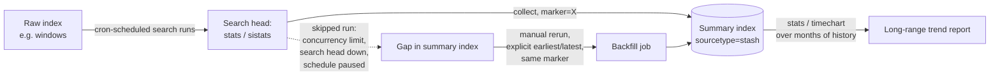

# Part 11 — Summary Indexing and Other Pre-Computation Patterns

## Why this part exists

Part 10 covered data model acceleration: the `tsidx` summary Splunk builds and maintains for you, transparently, behind an accelerated data model, and the `tstats` command that reads it directly — the exact gap DEH Part 26 §1.3 named and stepped around ("`tstats` ... not covered in depth here") and DEH Part 26 §2's own `stats` treatment left for a "dedicated performance-engineering appendix." This part covers the *other* Splunk pre-computation strategy: summary indexing, built with the `collect` command and its `si`-prefixed siblings (`sistats`, `sitimechart`, `sichart`, `sitop`, `sirare`), scheduled through an ordinary saved search rather than maintained by an internal Splunk process. Both strategies solve the same underlying problem — a query that's too expensive to re-run over raw events every time someone needs the answer — and both trade something for the speed they buy. Part 10's tradeoff is disk (the `tsidx` summary sits alongside the raw index) and a bounded acceleration window. This part's tradeoff is different in kind, not just degree: a summary index is a second, ordinary index that exists only because a scheduled search wrote into it, and every property that makes a scheduled search fallible — it can be paused, skipped under concurrency pressure, or silently misconfigured — becomes a property of the summary index too.

This part assumes DEH Part 26's SPL fundamentals throughout — `stats` syntax and aggregation-function semantics (DEH Part 26 §2), and the search-pipeline cost model that makes "run this once, read the result many times" worth doing in the first place (DEH Part 26 §1.1). It does not re-teach either. It also assumes the general query-language vocabulary DEH Part 23 establishes — an analytic's translation into a specific platform's query syntax is a distinct, lossy step (DEH Part 23 §3) — because a summary-indexing search is exactly that kind of platform-specific realization of a query someone already had reasons to run. What this part owns that neither DEH part does, and that Part 10 doesn't either: the mechanics of `collect`/`sistats`/`sitimechart`, how a summary-indexing search actually gets scheduled, and — the scope note that BOOK-INDEX.md gives this part specifically — the staleness and backfill risk a self-maintained summary index carries that Splunk's own accelerated `tsidx` summary does not.

---

## Two pre-computation strategies, one goal

**[CONCEPT]** Both data model acceleration and summary indexing exist to answer the same question cheaply: "what happened over a time range too large, or a search too expensive, to re-scan raw events every time someone asks." They get there by different routes. Data model acceleration (Part 10) is Splunk-managed — you flip a setting on a data model, and Splunk's own acceleration process builds and refreshes a `tsidx` summary over a configured window, transparently, without you writing or scheduling anything yourself. Summary indexing is search-managed — you write a search that computes something (a daily count, a per-user aggregate, a rare-value list) and explicitly tell Splunk to run that search on a schedule and write its results into a separate index, using `collect` or an `si`-prefixed command. Nothing happens automatically; the summary index only contains what a scheduled search actually wrote into it, when that search actually ran.

That difference in ownership is the whole story for everything else in this part. An accelerated data model's `tsidx` summary is infrastructure Splunk maintains for you inside a window it tracks; a summary index is infrastructure *you* maintain, using the same scheduling and execution machinery as any other saved search, with every failure mode a saved search can have — a skipped run, a paused schedule, a field that silently stops existing after a source's `sourcetype` changes upstream (Part 7's onboarding-drift problem, recurring here in a different shape).

The table below is the decision reference this part and Part 10 jointly support — use it to pick a strategy, not to relearn either one's mechanics from scratch.

| Dimension | Data model acceleration (Part 10) | Summary indexing (this part) |
|---|---|---|
| What builds and maintains it | Splunk's internal acceleration process | A saved search you write, own, and schedule |
| Query-time command | `tstats` | `stats`/`timechart`, run again over the already-summarized data — or finished with `stats` after `sistats` (see below) |
| Where the result lives | A `tsidx` summary stored alongside the raw index | A separate, ordinary index (its own bucket lifecycle, per Part 3) |
| Coverage window | Bounded by the data model's configured summary range | Bounded only by the summary index's own retention policy |
| Behavior on a missed run | Splunk's acceleration process catches up within the summary range on its own schedule | No automatic catch-up — a skipped scheduled search leaves a permanent gap unless someone reruns it explicitly |
| Best fit | Ad hoc pivoting and dashboards against current, CIM-mapped data | Trend reporting beyond the acceleration window, or an aggregate that must survive the raw data aging out of retention entirely |

**[PLATFORM ENGINEER]** The "best fit" row is doing real work: summary indexing's actual reason to exist, once data model acceleration and report acceleration are on the table as alternatives, is retention outlasting the raw data. An accelerated data model's summary only covers data still inside its configured acceleration range and still inside the raw index's own retention — once a bucket rolls to frozen and is deleted (Part 3), both the raw events and anything the acceleration process built from them are gone. A summary index that was populated *while the raw data still existed* keeps its aggregated rows independently, on its own retention clock, because it's a separate index with separate buckets. If a security team needs a year of daily failed-login counts by user but can only afford ninety days of raw authentication-log retention, summary indexing — not acceleration — is the mechanism that makes that possible, because the aggregate is computed and written while the raw data is still there to compute it from, then kept long after the raw data is gone.

---

## `collect` — writing search results into a summary index

**[PLATFORM ENGINEER]** `collect` is the primitive summary-indexing command: it takes whatever result set reaches it in the pipeline and writes each row into a target index as a new event, with each field serialized as a `key=value` pair. Splunk gives that written event a `sourcetype` of `stash` by default (overridable), which exists specifically to mark an event as summary-index output rather than naturally-ingested machine data — a `stash`-sourcetyped event never went through a forwarder or a parsing pipeline; it was written directly by a search. The target index itself is an ordinary index — commonly named `summary` by convention, though nothing forces that name — and needs to exist and be writable before any search tries to `collect` into it, the same as any other index (Part 3).

A minimal illustrative example — a daily count of authentication failures by user, small enough to keep for a year even if the raw `windows` index (the CIM-mapped index holding Windows Security-log events, first introduced in Part 3) only keeps ninety days:

```spl
index=windows sourcetype=WinEventLog:Security EventCode=4625
| stats count as failure_count by user
| collect index=summary_auth marker="daily_auth_failures"
```

*CONCEPTUAL SAMPLE — illustrative index/marker names, not captured from a running system.*

**[PLATFORM ENGINEER]** The `marker` argument is worth calling out explicitly: it tags every event this search writes with a fixed key=value pair, which is the mechanism a later search uses to select "just the output of this particular summary-indexing search" out of a summary index that, in any real deployment, accumulates output from more than one scheduled search over time. Skipping the marker is the single most common way a summary index becomes unusable months later — without it, a query against `index=summary_auth` has no reliable way to tell one search's output apart from another's once several summary-indexing searches share the same target index.

> **Engineering Reality**
> `collect` writes whatever reaches it in the pipeline, including any field the upstream search happens to produce — internal fields like `_raw`, `_time`, and Splunk's own search-metadata fields (`info_min_time`, `info_max_time`, `info_search_time` among them) ride along unless the search explicitly strips them first. A summary-indexing search built by copying a working ad hoc search and appending `| collect` without reviewing the field list first routinely writes several megabytes of metadata noise per run alongside the two or three fields anyone actually wanted — multiply that by a daily schedule over a year and the "small" summary index is not small. Review the field list immediately before the `collect` command, not after the summary index has already grown.

---

## `sistats` and `sitimechart` — pre-aggregating without losing the ability to finish the math

**[PLATFORM ENGINEER]** `stats` and `timechart` (DEH Part 26 §2 teaches `stats` syntax and function semantics; `timechart` is its time-bucketed sibling) both produce a *final* aggregated answer — a `count`, an `avg`, a `dc()` — computed once, over whatever event population reached the command. That's a problem for summary indexing specifically: if a scheduled search runs `stats avg(bytes) by dest` once a day and `collect`s the result, and a later search reads three months of those daily summary rows back out and tries to average them again with a second `stats avg(...)`, the answer is wrong for almost every function except `count` and `sum` — an average of daily averages is not the same number as the true average across the full three-month event population, and the error compounds for anything involving distinct counts or percentiles.

`sistats` (and its siblings, `sitimechart`, `sichart`, `sitop`, `sirare`) exist to solve exactly that problem. Rather than writing the *final* computed value, an `si`-prefixed command writes the intermediate calculation state a later `stats`/`timechart` pass needs to finish the aggregation correctly — the running sum and count behind an average, the partial structure behind a distinct count — carried in a set of internal fields Splunk generates for that purpose. The practical rule that follows: if a summary-indexing search's whole purpose is to let someone re-aggregate later with different grouping or a wider time window, use the `si`-prefixed command and finish the math with a plain `stats`/`timechart` pass at query time; if the search's output is the final answer and nobody will ever re-aggregate it further, plain `stats` piped into `collect` is simpler and produces a smaller, more directly readable summary index.

```spl
index=firewall sourcetype=vendor:fw:traffic
| sistats avg(bytes_out) as avg_bytes_out, dc(dest_ip) as distinct_destinations by src_ip
| collect index=summary_fw marker="fw_traffic_by_src"
```

*CONCEPTUAL SAMPLE — illustrative index and sourcetype names, not captured from a running system.*

A query against the resulting summary index finishes the aggregation the same way it would against the original data, substituting `stats` for `sistats` and reading from the summary index instead of the raw one:

```spl
index=summary_fw marker="fw_traffic_by_src" earliest=-90d
| stats avg(avg_bytes_out) as avg_bytes_out, dc(distinct_destinations) as distinct_destinations by src_ip
```

*CONCEPTUAL SAMPLE — illustrative field and index names, not captured from a running system.*

**[DETECTION ENGINEER]** The distinction matters most for exactly the aggregation functions a detection or a trend report actually leans on — distinct-count and average, per DEH Part 26 §2.1's list of the `stats` functions that come up constantly in detection logic. A rule or report that needs "how many distinct source IPs hit this host per day, summed over ninety days" gets a correct answer from `sistats` re-aggregated with `stats`; the same logic built on plain `stats` piped straight into `collect` gives a plausible-looking but arithmetically wrong number the moment someone re-aggregates across more than one summary-indexing run, and nothing about the query's syntax signals that it's wrong.

---

## savedsearches.conf — the stanza that turns a scheduled search into a summary-indexing job

**[PLATFORM ENGINEER]** A summary-indexing search is, mechanically, an ordinary scheduled saved search with one extra property: Splunk's "Enable summary indexing" action, which lets a search's SPL end at a plain aggregation (no explicit `collect`) while the action itself handles writing the result into the target summary index on every scheduled run. That action is stored the same way any other saved-search setting is — as a stanza in `savedsearches.conf` — and it composes with everything Part 12 covers for scheduled searches generally: cron schedule, skip-if-already-running behavior, and priority relative to every other scheduled search competing for the same search-head concurrency slots.

```ini
[Daily Failed Auth Count by User]
search = index=windows sourcetype=WinEventLog:Security EventCode=4625 | stats count as failure_count by user
cron_schedule = 5 0 * * *
dispatch.earliest_time = -1d@d
dispatch.latest_time = @d
action.summary_index = 1
action.summary_index._name = summary_auth
action.summary_index.marker = daily_auth_failures
```

*CONCEPTUAL SAMPLE — illustrative stanza name and search, not captured from a running system.*

**[PLATFORM ENGINEER]** `dispatch.earliest_time`/`dispatch.latest_time` deserve deliberate attention here in a way they don't for an ordinary alerting search, because they define the exact time window this run's data covers — get them wrong (an off-by-one boundary, a time zone mismatch between the scheduling cron and the data's own timestamps) and the summary index either double-counts a boundary event on two consecutive runs or silently skips it on both. `dispatch.latest_time = @d` (midnight, snapped to the day) paired with `dispatch.earliest_time = -1d@d` (midnight the day before) is the conventional non-overlapping daily window; any other pairing needs to be checked by hand for a gap or an overlap before it ships, not assumed correct because it looks similar to the last one that worked.

---

## The staleness problem: what a summary index can't tell you that a live accelerated search can

**[PLATFORM ENGINEER]** Part 10 already establishes that an accelerated data model's `tsidx` summary is maintained continuously by Splunk's own internal process, inside a configured window, and that Splunk itself is responsible for keeping that summary current relative to the raw data arriving underneath it. A summary index has no equivalent guarantee, because nothing but the scheduled search itself is responsible for keeping it current — and a scheduled search is a fallible thing, not a managed platform service.

> **Engineering Reality**
> A summary-indexing search that gets skipped — the search head was down for maintenance during its scheduled window, it hit a concurrent-search limit and Splunk deferred it (Part 12 covers the skipped-search mechanics behind this), or someone paused it during an unrelated change and forgot to resume it — leaves a permanent, silent gap in the summary index. Nothing about the summary index itself records that the gap exists; a query against it for that date range simply returns fewer rows, or none, with no error and no obvious signal that data is missing rather than genuinely absent. A dashboard panel built on that summary index shows a trend with an unexplained dip, and unless someone happens to cross-check against the raw data for that specific window, the dip reads as a real finding rather than a missed scheduled run.

The fix, when a gap is found, is a manual backfill: rerun the same search logic with explicit `earliest`/`latest` values covering the missed window and `collect` the result into the same summary index with the same marker, so the backfilled rows are indistinguishable from what the scheduled run would have written. That's a deliberate, by-hand operation every time — there is no Splunk process that notices a summary index has a hole and fills it automatically the way the acceleration process behind an accelerated data model can rebuild inside its own summary range. A team that treats a summary index the way it treats an accelerated data model — trusting it to self-heal — finds out it doesn't at the exact moment a gap actually matters, usually while investigating why a trend report disagrees with a raw-data spot check.

> **What Would Change My Mind**
> This section treats "a skipped summary-indexing run is a silent, permanent gap with no built-in detection" as the default failure mode. That would need revising if a specific deployment had independently built monitoring for it — a scheduled search auditing `_internal` for skipped-run events tied to summary-indexing searches specifically, alerting when a marker's expected daily row count doesn't appear — because that monitoring, while not something Splunk provides out of the box for this purpose, is buildable with the same platform primitives this part already covers. No such monitoring is verified as deployed anywhere in this book's own evidence base; if a reader has built and can point to one working reliably at scale, that's the concrete observation that would move this from "the default risk" to "a solved problem with a known pattern," and this section would need to say so.

**Figure 11.1 — Summary index build, query, and backfill flow.** *CONCEPTUAL.* Illustrates the expected data flow from a raw index through a scheduled summary-indexing search into a summary index, the later query path that reads it back, and the manual backfill loop a skipped run requires. This is a sequence/flow sketch of documented expected behavior, not a capture from a live Splunk job inspector or a real deployment — none exists in this book's evidence base (STYLE-GUIDE.md §9.2).




---

## Duplicate data: the other failure mode backfill creates if you're not careful

**[PLATFORM ENGINEER]** Backfilling a gap fixes one failure mode and, handled carelessly, creates the opposite one: if the backfill's `earliest`/`latest` window overlaps a window the scheduled search already covered on a run that actually succeeded, the summary index now has two sets of rows for the same period under the same marker, and any later query summing or averaging over that marker double-counts the overlap. This is easy to get right in principle — backfill exactly the confirmed-missing window, no more — and easy to get wrong in practice, because confirming the exact missing window requires checking the search's own execution history (Part 12's Search Job Inspector, or the `_internal` index's scheduler logs) rather than guessing a round-numbered window like "the whole missing day" when only six hours of it were actually missed.

The same overlap risk shows up without any backfill involved, in a subtler form: a summary-indexing search whose `dispatch.earliest_time`/`dispatch.latest_time` window is set even slightly wider than its own schedule interval — a daily search configured to look back 25 hours "just to be safe" — writes an hour of overlap into the summary index on every single run, every day, indefinitely. Nobody notices immediately because the daily counts still look approximately right; the error accumulates quietly until a long-range report (the exact use case summary indexing exists for) is off by a margin nobody can explain without re-deriving the schedule's own overlap by hand. A summary-indexing search's earliest/latest window should be checked against its cron schedule as a matched pair, on first deployment and again any time either one changes — not treated as two independent settings that happen to be near each other in the same stanza.

---

## When summary indexing still earns its keep

**[SOC MANAGEMENT]** Given the staleness and overlap risk above, the honest framing for a manager evaluating this pattern is: summary indexing is infrastructure your team now owns and has to operate, not a feature Splunk operates for you the way it operates data model acceleration — and "owns and operates" means someone's on-call rotation is implicitly responsible for noticing a gap, backfilling it correctly, and reviewing scheduled-search health, even if nobody wrote that responsibility down when the search was first deployed. That's a real, ongoing cost, and it's the cost that should be weighed against report acceleration and data model acceleration (Part 10) before summary indexing is the answer by default.

> **Product Version Note**
> Splunk currently prices Splunk Enterprise and Splunk Cloud Platform under three named models — Ingest Pricing (by GB/day ingested), Workload Pricing (by compute capacity consumed running searches), and Entity Pricing (for Observability Cloud, by monitored host count). As of 2026-09-15, verified against Splunk's own pricing FAQ page (REFERENCES.md entry [SPLUNK-PRICING-FAQ]). Which model an environment runs under changes what a summary-indexing search actually costs day to day: under Ingest Pricing, everything a `collect` call writes counts against the same daily ingest license as any naturally-arriving data, so a chatty summary-indexing search (see the Engineering Reality box above on stray metadata fields) is a direct license cost, not just a storage inconvenience. Under Workload Pricing, the recurring scheduled search consumes compute capacity instead, and the summary index's own storage becomes the secondary cost. Confirm which model a given environment is licensed under (Part 4 covers this in depth) before assuming either cost story applies. What would make this stale: Splunk restructuring its pricing-model names or eligibility again, which it has done before.

**[PLATFORM ENGINEER]** With that cost honestly on the table, summary indexing still wins in one specific, recurring situation that neither data model acceleration nor report acceleration can substitute for: retention that needs to outlast the raw data. An accelerated data model's summary is only ever as old as the raw index still standing behind it (Part 3's bucket lifecycle) and only ever as wide as its own configured acceleration window (Part 10) — once a bucket freezes and is deleted, so is anything built from it. A summary index populated while the raw data still existed keeps its own aggregated rows on its own retention clock, in its own buckets, entirely independent of what happens to the raw index afterward. A security team asked for a year-over-year trend of authentication-failure volume, running on ninety days of raw log retention, has exactly one platform-native way to answer that honestly: a summary-indexing search that ran daily for the last year, whether or not the raw events behind any given day still exist. That's the case worth the operational cost this section has spent most of its length naming — not "summary indexing is generally the right default," but "summary indexing is the specific tool for outliving your own raw-data retention," and every other use case should be checked against Part 10's acceleration options first.

---

## Cross-references

Part 10 (Data Model and Report Acceleration) for the `tsidx`-summary alternative this part is contrasted against throughout; Part 12 (Search Performance and Tuning at Scale) for the scheduled-search concurrency and skipped-search mechanics behind this part's staleness risk, and for the Search Job Inspector referenced above; Part 3 (Indexes, Sourcetypes, and the Bucket Lifecycle) for the summary index's own retention and bucket behavior as an ordinary index; Part 4 (Licensing and Ingest Economics) for the full ingest-vs-workload cost tradeoff this part's Product Version Note only introduces; DEH Part 26 §2 for `stats` syntax and function semantics, and §1.3 for the `tstats` forward reference Part 10 resolves; DEH Part 23 §3 for the general translation-loss framing behind why a summary-indexing search is a platform-specific realization of a query, not a syntax-neutral one.
