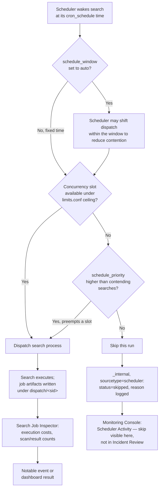

# Part 12 — Search Performance and Tuning at Scale

## Why this part exists

DEH Part 26 §1.1 makes one claim about SPL that this part exists to scale up: "cost is paid in the order commands appear, left to right" — filter early, and every later pipeline stage inherits a smaller working set. That claim is true and complete at the level of one search running once. It stops being complete the moment a search head is running two hundred scheduled correlation searches, a dozen dashboards' worth of ad hoc queries, and whatever an analyst is typing into the search bar right now, all competing for the same finite pool of CPU, memory, and search-process slots. At fleet scale, the question isn't just "how much does this search cost" — it's "does this search get to run at all before the next one is due," and if it doesn't, what happens to the detection depending on it. Nobody notices a slow search the way they notice a search that silently never ran.

This part is platform layer, in the Section D performance-at-scale group alongside Part 10 (data model and report acceleration) and Part 11 (summary indexing). Part 10 already owns `tstats` and accelerated-search mechanics — the pre-computation decisions made before a query ever runs. This part is about what happens *when* a query runs: concurrency limits, scheduling priority, workload isolation, and the diagnostic tooling that tells you which of those three actually explains a slow or missing search result. It does not re-teach SPL syntax (DEH Part 26 owns that), the analytic-vs-detection-rule vocabulary (DEH Part 23 owns that), or accelerated-search internals (Part 10 owns that) — it assumes a reader who already has a working correlation search or dashboard panel and needs to know why it's slow, why it sometimes doesn't run, and what to check first.

**[CONCEPT]** Two distinctions run through everything below and are worth stating once, up front, rather than re-deriving in every section. First: a search can fail to produce a result for two entirely different reasons that look identical to an analyst staring at an empty dashboard panel — it ran and found nothing, or it never ran at all. Second: "performance problem" on a Splunk search head is almost never one undifferentiated thing called "slow" — it's a specific, named contention point (CPU-bound concurrency ceiling, memory pressure from a `transaction` or `stats` command holding too much state, disk I/O against cold buckets, or a scheduler queue backed up behind higher-priority work), and the fix for one of those does nothing for the others. The rest of this part is organized around naming which contention point you're actually looking at before reaching for a fix.

---

## 1. `limits.conf` — where the platform actually caps concurrent searches

**[PLATFORM ENGINEER]** Every Splunk search head enforces a ceiling on how many searches can run at once, and that ceiling is not infinite no matter how much hardware you throw at it — it is a deliberately configured number, computed from settings in `limits.conf` (inline-coded per this book's Splunk-object convention — the file that holds most of the platform's resource-behavior tuning knobs), because an unbounded number of concurrent searches would let a handful of runaway queries starve the instance's memory and CPU for everyone else. The mechanism, at a level of detail stable across Splunk Enterprise's `[search]` and `[scheduler]` stanzas: a base concurrency figure is derived from the number of CPU cores on the search head (a `max_searches_per_cpu`-style multiplier), with an additional fixed floor and, separately, a percentage of that total explicitly reserved for the scheduler (`scheduler_max_searches_perc`-style setting) so that a burst of ad hoc searches from analysts can't starve every scheduled correlation search on the box, and vice versa.

```ini
# CONCEPTUAL SAMPLE — illustrative limits.conf shape, not a captured or verified current default
[search]
max_searches_per_cpu = 1
base_max_searches = 6

[scheduler]
max_searches_perc = 50
max_rt_search_multiplier = 1
```

> **Product Version Note**
> `limits.conf` has carried concurrency-governing settings under the `[search]` and `[scheduler]` stanzas across many major Splunk Enterprise releases, and the mechanism described above — a per-CPU multiplier plus a fixed floor, with a scheduler-reserved percentage of the total — reflects that long-standing design. The specific setting names and numeric defaults shown in the example above are illustrative, not verified against current documentation: `docs.splunk.com` returned HTTP 403 on every retrieval attempt made while drafting this part (2026-09-15; see `REFERENCES.md`), and no alternate public source covers `limits.conf` internals at this depth. Confirm the actual stanza names and current defaults for your installed version against the Admin Manual or `btool` output on a real search head before tuning any of them — what would make this stale is exactly a version bump that renames or re-defaults one of these settings, which Splunk has done before across major releases.

**[PLATFORM ENGINEER]** The practical consequence for a SOC running Enterprise Security is that "add more correlation searches" is not a cost-free operation just because each individual search is cheap — every additional scheduled search is one more claimant on the same fixed concurrency ceiling, and the ceiling doesn't grow just because detection content did. This is DEH Part 26 §1.1's cost principle at fleet scale: the cost of one query is paid left to right within that query; the cost of a fleet of queries is paid against a shared, finite concurrency budget, and a search head that "has room" for fifty correlation searches doesn't necessarily have room for two hundred, no matter how efficiently each one is individually written.

---

## 2. Skipped searches: the failure mode that doesn't look like a failure

**[PLATFORM ENGINEER]** When the scheduler wants to dispatch a scheduled search and the concurrency ceiling from §1 has no free slot, Splunk doesn't queue the search and run it late by default — it skips that scheduled run entirely and waits for the next scheduled time. A skipped search is not an error in the conventional sense: nothing crashes, nothing throws an exception a monitoring tool would catch, and the search's own saved-search object shows no red status. Splunk records the skip as an entry in the `_internal` index (the platform's own index for its internal operational logs, distinct from any customer data index) under the `scheduler` sourcetype (Splunk's own record of every scheduled search dispatch decision, one entry per attempt, successful or not), with a status field and a reason string identifying the specific limit that blocked the run.

> **Blind Spot**
> A correlation search that gets skipped produces exactly the same visible result, to an analyst watching Incident Review, as a correlation search that ran cleanly and genuinely found nothing: zero new notables. There is no dashboard panel most SOCs check by default that distinguishes "this detection ran across the last hour and the environment was clean" from "this detection did not run for the last three scheduled intervals because eleven other searches with higher priority got the concurrency slots first." A detection engineer who only monitors notable-event volume, not scheduler health, can watch a correlation search go quiet for entirely the wrong reason and read it as good news.

**[PLATFORM ENGINEER]** The instance's Monitoring Console (Splunk's built-in operational-health app, formerly branded the Distributed Management Console) surfaces scheduler activity and skip counts in its own dashboards rather than requiring an analyst to hand-query `_internal` every time, and checking it on a schedule — not just when someone notices a detection has gone quiet — is the actual fix for the blind spot above. A search skipped once during a genuine load spike is a capacity signal worth watching; a search skipped on a recurring schedule is a detection silently disabled by contention, and the two look identical in Incident Review.

**Figure 12.1 — A scheduled search's dispatch decision, from wake-up to result or skip.** *CONCEPTUAL.* Illustrates the expected sequence a scheduler-dispatched search goes through on a Splunk search head, synthesized from the mechanisms named in §1–§4: a concurrency check against `limits.conf`'s ceiling, a priority/window adjustment where one applies, and a resulting execute-or-skip outcome that either produces Job Inspector artifacts or a `scheduler` sourcetype skip record. This is a diagram of documented expected platform behavior, not a capture from a live scheduler or a real Enterprise Security instance — none exists in this book's evidence base (STYLE-GUIDE.md §9.2).






---

## 3. `schedule_priority` and `schedule_window` — telling the scheduler which searches matter more

**[PLATFORM ENGINEER]** `savedsearches.conf` (the `.conf` file holding every scheduled report's and correlation search's own configuration stanza, one stanza per saved search, inline-coded per this book's convention) exposes two settings that directly shape how a given search competes for the concurrency slots described in §1: `schedule_priority`, which accepts values including a default tier and elevated tiers that let a specific search preempt lower-priority contenders for a slot, and `schedule_window`, which lets the scheduler shift a search's actual dispatch time within a window (including an `auto` setting that hands the decision entirely to the scheduler) instead of insisting on the exact cron-specified minute.

```ini
# CONCEPTUAL SAMPLE — illustrative savedsearches.conf stanza, not a captured real correlation search
[Excessive Failed Logins by Host - Rule]
cron_schedule = */5 * * * *
schedule_priority = highest
schedule_window = auto
dispatch.earliest_time = -10m
dispatch.latest_time = now
```

**[DETECTION ENGINEER]** The reason this matters past pure platform administration: a correlation search that implements a security-critical analytic and a dashboard's background refresh query are not equally important if both are competing for the last open concurrency slot, and the platform has no way to know that on its own — `schedule_priority` is the mechanism by which a detection engineer tells it. Part 14 covers correlation-search anatomy in depth; the point to carry forward from here is narrower: a correlation search's `.conf` stanza is not just "what it searches for," it's also "how hard it fights for a slot when the search head is under load," and leaving every correlation search at default priority means the scheduler breaks ties by whatever internal ordering it uses, not by which detection actually matters most to the SOC running it.

**[PLATFORM ENGINEER]** `schedule_window`'s `auto` setting exists specifically to reduce the "everything scheduled at the top of the hour" contention spike that a large content library produces when every correlation search's cron expression independently lands on `0 * * * *` or similar round numbers — letting the scheduler spread dispatch times across a tolerance window instead of forcing every search through the exact same sixty-second slice cuts the peak concurrency demand without changing what any individual search actually does.

---

## 4. The Search Job Inspector: reading the diagnostic Splunk already gives you

**[PLATFORM ENGINEER]** The Search Job Inspector is a built-in, long-standing diagnostic view attached to every search job Splunk runs — reached from the small inspector icon next to a completed or running search in the Search app — that breaks a search's actual execution down by pipeline component rather than reporting only a final duration. Where DEH Part 26 §1.1's cost model describes, in the abstract, that cost accumulates left to right through a pipeline, the Job Inspector is the tool that shows you the real, measured number for each stage of one specific run: how much wall-clock time was spent in the initial `search`/index-scan phase versus in `eval`, `stats`, `transaction`, or any other command in the pipeline, alongside how many raw events were scanned versus how many results were actually returned.

| Job Inspector section | What it shows | What it's diagnostic for |
|---|---|---|
| Execution costs | Per-command duration and invocation count across the pipeline | Which specific pipe stage — not "the search" generically — is where time is actually going |
| Search job properties | `scanCount`, `eventCount`, `resultCount`, whether the job ran as real-time | Whether a slow search is slow because it scanned too much raw data, not because a downstream command is inefficient |
| `search.log` | Component-level log lines for the job's own execution, including optimization decisions the search processor made | Whether an expected optimization (index-time filtering, a bloom-filter skip) actually applied, or the search silently fell back to a full scan |
| Search type / distribution | Whether the job ran as a `streaming`, `reporting`, or non-streamable search, and across how many indexers | Whether a search that "should" scale well got demoted to a non-distributable pattern by a specific command choice |

**[DETECTION ENGINEER]** For a correlation search specifically, the Job Inspector is the first place to look before assuming a detection is "just slow" — a search whose execution costs show the overwhelming majority of time in the initial scan phase, with `scanCount` far larger than `resultCount`, is telling you the filter (the part of the search DEH Part 26 §1.1 says should run first and cheapest) isn't narrow enough, not that the aggregation logic downstream needs work. Optimizing a `stats` clause when the real cost is an unfiltered index scan fixes nothing measurable.

> **Detection Test**
> **What to check, against your own instance:** open the Job Inspector for a specific scheduled correlation search's most recent completed run (Job Inspector is available from the search's job history, not only from an ad hoc search you run yourself).
> **What to look at:** the execution-costs breakdown and the `scanCount`-to-`resultCount` ratio.
> **What would confirm a filtering problem rather than an aggregation problem:** `scanCount` in the millions against a `resultCount` in the dozens, with the largest single execution-cost line item attributed to the base search/scan phase rather than to `stats`, `eval`, or `transaction`.
> This has not been run against a real instance for this book — no Splunk deployment exists in this book's evidence base (STYLE-GUIDE.md §9.2) — so treat the procedure as a documented starting point to run yourself, not a result reported here.

---

## 5. Workload Management: resource pools instead of hope

**[PLATFORM ENGINEER]** Concurrency limits and scheduling priority both govern *whether* and *when* a search runs; they say nothing about how much CPU and memory it's allowed to consume once it's running, which means a single badly-written search that gets a slot can still starve every other process on the instance for the duration of its run. Splunk Enterprise's Workload Management feature addresses that gap directly: a policy-based mechanism for reserving system resources — CPU and memory — for categories of work (ingestion versus search, or finer-grained pools an administrator defines) rather than letting every process compete for the same undifferentiated resource pool.

> **Product Version Note**
> Splunk Enterprise's Workload Management feature — a policy-based mechanism for reserving system resources (CPU and memory) for ingestion versus search workloads — is real, documented platform behavior, but this claim's exact wording could not be re-verified against a reachable, citable source while fixing this section: `docs.splunk.com` returned no accessible page during drafting (2026-09-15), and no `www.splunk.com` product page could be located stating it in those terms either, so no `REFERENCES.md` entry backs a direct quote here and none is claimed. What this book also could not independently verify, for the same reason: the specific operating-system requirement (Workload Management has historically been documented as a Linux-only capability enforced via Linux cgroups, with no Windows equivalent) and whether it applies identically, partially, or not at all to Splunk Cloud Platform versus self-managed Splunk Enterprise. Confirm the feature's current existence, scope, and OS requirement against current documentation for your deployment before assuming Workload Management is available to you at all.

**[SOC MANAGEMENT]** The management-facing framing of this feature: Workload Management is a licensing- and platform-tier decision as much as a technical one. If a SOC's Splunk instance runs on Splunk Cloud Platform, resource-pool administration may sit largely or entirely with the vendor rather than the customer, in which case the actual lever available to a SOC lead frustrated by search contention is content hygiene (fewer, cheaper, better-prioritized searches per §1–§3) rather than a workload-pool configuration change nobody on the customer side can make. Knowing which side of that line your deployment sits on — before promising a SOC that "we'll just carve out a resource pool for detections" — is worth confirming against your specific contract and platform, not assumed from Splunk Enterprise's on-prem documentation.

---

## 6. Search head clustering: scheduling doesn't stay on one box

**[PLATFORM ENGINEER]** Part 2 covers indexer/search-head clustering topology in full; the piece relevant here is narrower — on a search head cluster (SHC), the concurrency ceiling and scheduling decisions from §1–§3 aren't necessarily evaluated against one machine's resources in isolation. A SHC has a single elected captain member that coordinates cluster-wide scheduling state, and Splunk's scheduler has, across the product's history, moved toward distributing the actual execution of scheduled searches across multiple cluster members rather than concentrating every scheduled run on the captain alone.

> **Product Version Note**
> Distributing scheduled-search execution across SHC members rather than running every scheduled search on the captain is real, documented Splunk behavior, but exactly which release introduced it as default and how much administrative configuration is required to enable or tune it are details this book could not verify against current documentation — `docs.splunk.com` was unreachable during drafting (2026-09-15), and no alternate source in `REFERENCES.md` covers SHC scheduler internals at this depth. If you administer a search head cluster, confirm your specific version's default scheduling-distribution behavior directly against the Distributed Search Manual before assuming load is spread the way a newer cluster's defaults might spread it.

**[PLATFORM ENGINEER]** The operational upshot regardless of the exact version boundary: a skipped search on a clustered search head is not necessarily explained by "this one member is busy" — the concurrency ceiling and priority contention described in §1–§3 apply at the scope the scheduler is actually distributing work across, and diagnosing a skip pattern on a SHC without accounting for that scope is a common way to chase the wrong member's resource graphs.

---

## 7. Real-time search: the cost that doesn't amortize

**[PLATFORM ENGINEER]** Every search discussed so far dispatches, runs for a bounded duration, and releases its resources. A real-time search is structurally different: it opens and holds a continuous pipeline against incoming data for as long as the search stays open, which for an "all time" real-time dashboard panel can mean indefinitely. That difference matters for exactly the concurrency and workload concerns this part has built up — a real-time search doesn't compete for one slot and free it; it occupies a slot, and a meaningful share of the resources behind it, for the entire time a dashboard tab with that panel stays open, which is a materially different and larger claim on the same fixed concurrency and workload budget than a five-minute scheduled search that runs, finishes, and gets out of the way.

**[PLATFORM ENGINEER]** `limits.conf`'s `[realtime]` stanza carries a setting that disables real-time search collection instance-wide, and Splunk's own guidance across multiple product generations has steered administrators toward scheduled searches on a short interval (near-real-time, effectively) rather than genuine real-time search wherever the use case tolerates even a small delay, precisely because of the sustained resource cost above. A SOC dashboard panel that "needs" real-time freshness almost always tolerates a 30-to-60-second staleness window in practice; a panel scheduled every 30 seconds instead of run real-time gets most of the perceived freshness at a fraction of the sustained cost.

> **Engineering Reality**
> "We need real-time visibility" is a requirements statement analysts make constantly and rarely mean literally. Before enabling a real-time search or dashboard panel, ask what staleness window the use case actually tolerates — an analyst glancing at a dashboard once every few minutes gets no perceptible benefit from a panel that's technically live to the second, and the platform pays the sustained-resource cost of that liveness the entire time the panel is open regardless of how often anyone is actually looking at it.

---

## 8. Role-based concurrency quotas: the governance angle nobody budgets for

**[PLATFORM ENGINEER]** Everything above governs instance-wide and search-specific contention. `authorize.conf` (the `.conf` file defining Splunk's role-based access model, inline-coded per convention) separately caps how many concurrent search jobs a given role's users can hold open at once, through settings scoped to historical searches and, separately, to real-time searches — a per-role quota, distinct from the system-wide ceiling §1 describes, that governs one role's *share* of that ceiling rather than the ceiling itself.

**[SOC MANAGEMENT]** The failure mode this produces has nothing to do with detection logic and everything to do with role design: a threat hunter running several exploratory ad hoc searches at once, or a dashboard that opens more panels than a role's quota permits, can hit a per-role concurrency quota and get jobs silently queued or rejected — a governance decision made when the role was provisioned, surfacing months later as "search is broken" tickets that have nothing to do with the query itself. A SOC lead who owns role design should treat per-role search quotas as a capacity-planning decision tied to how each role actually uses Splunk, not a security-hardening default left wherever the platform installer set it.

The table below summarizes where to look first for each of this part's named contention points, as a triage starting point rather than an exhaustive diagnostic tree.

| Symptom | Likely contention point | Where to check first |
|---|---|---|
| Correlation search shows zero notables, but the underlying query returns results when run ad hoc | Skipped scheduled run (§2) | `_internal`, `sourcetype=scheduler`, filtered to the search's name; Monitoring Console Scheduler Activity |
| One correlation search consistently slow, others on the same schedule are fine | Inefficient pipeline stage within that specific search | Search Job Inspector execution costs (§4), `scanCount`-to-`resultCount` ratio |
| Everything scheduled near the top of the hour degrades together, then recovers | Concurrency-ceiling contention from clustered cron times (§1, §3) | `schedule_window = auto` candidacy; stagger `cron_schedule` values across affected searches |
| Dashboard panel is fine at first, then the whole search head degrades the longer it's open | Real-time search holding resources indefinitely (§7) | Whether the panel is genuinely real-time vs. a short-interval scheduled search |
| A specific team's searches queue or fail, others' don't | Per-role concurrency quota (§8) | `authorize.conf` role definition for `srchJobsQuota`/real-time equivalent |
| Search head cluster member's resource graphs look idle while searches still skip | Scheduling distributed to a different cluster member (§6) | Cluster-wide scheduler state via the captain, not one member's local view |

> **Detection Autopsy — "the correlation-search fleet that ate its own concurrency budget"**
> The scenario below is a composite, illustrative pattern consistent with widely-discussed Splunk scheduling behavior — cron expressions clustering at round-number times causing a concurrency spike — not a specific cited incident; no single documented case was retrieved and verified against a source in `REFERENCES.md` for this box, and none is presented as one.
>
> **The setup:** a content team deploys forty correlation searches over several months, each authored independently, each defaulting to an hourly cron schedule with no explicit minute offset — every one of them lands on `0 * * * *`.
> **Why it shipped this way:** each search was tested individually, ran fine in isolation, and nobody reviewing one new correlation search at a time had visibility into what the other thirty-nine were already scheduled to do at the same minute mark.
> **How it failed:** at the top of every hour, all forty searches attempt to dispatch simultaneously, exceeding the search head's concurrency ceiling (§1); the lowest-`schedule_priority` searches in the batch get skipped, and because no one search fails loudly, the pattern surfaces only as an intermittent, hard-to-reproduce gap in a handful of detections' notable volume — worse at the top of the hour, invisible the rest of the time.
> **The fix:** stagger `cron_schedule` offsets across the content library (or set `schedule_window = auto` per §3 and let the scheduler do it), and add a Monitoring Console check for skip-rate spikes tied to the top of the hour specifically, rather than treating "detections are working" and "detections' scheduled runs aren't being skipped" as the same claim.

> **What Would Change My Mind**
> Everything in this part about *how much* headroom a given concurrency ceiling, workload pool, or SHC scheduling policy actually provides under real production load is a documented mechanism, not a measured number — this book has no Splunk deployment to instrument. A real Splunk environment, running a realistic correlation-search content library at realistic ingest volume, with Monitoring Console skip-rate and Job Inspector execution-cost data collected over a real retention window (weeks, not a single synthetic burst), would be the specific evidence needed to turn this part's mechanism-level claims into measured guidance — how many correlation searches a given search-head sizing can actually sustain before skip rate crosses some tolerable threshold is exactly the kind of number that only exists once someone runs it and watches.

---

**Cross-references:** DEH Part 26 §1.1 (SPL pipeline cost model — "cost is paid left to right" — extended here from single-query to fleet-scale concurrency contention) and §1.3 (scope note naming `tstats`/administration as out of depth for DEH, which this book's Section D fulfills); DEH Part 23 (Query Language Strategy — analytic-vs-detection-rule vocabulary this part assumes without re-deriving); Part 2 (Splunk Deployment Architecture — search head clustering topology behind §6); Part 10 (Data Model and Report Acceleration — `tstats` mechanics and accelerated-search cost, distinct from the runtime concurrency/scheduling concerns owned here); Part 13 (Enterprise Security Architecture, Editions, and the CIM Dependency — edition gating context for platform features like Workload Management); Part 14 (Correlation Searches — `schedule_priority`/`schedule_window` as lifecycle decisions for a specific detection); Part 18 (Dashboards and Visualizations — real-time vs. scheduled panel cost from §7 applied to dashboard design).
