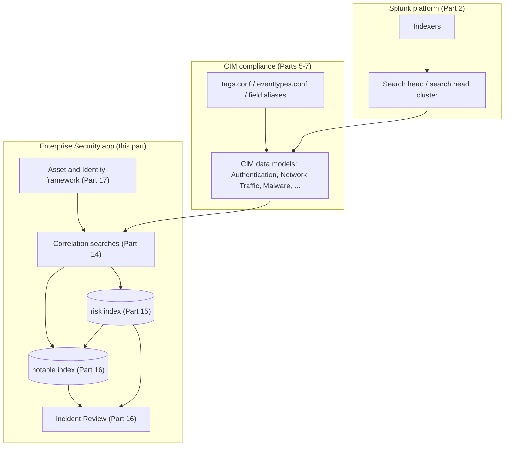

# Part 13 — Enterprise Security Architecture, Editions, and the CIM Dependency

## Why this part exists

Parts 1 through 12 covered the Splunk platform itself — deployment topology, index and bucket design, licensing, the Common Information Model (CIM), data models and Pivot, lookups and macros, and acceleration and search performance at scale. None of that is Splunk Enterprise Security (ES). ES is the first premium, security-specific app this book covers, and Section E (Parts 13–17) treats it as five separate audiences rather than one mega-chapter: architecture and editions (here), correlation-search mechanics (Part 14), risk-based alerting (Part 15), analyst-facing triage in Incident Review (Part 16), and asset/identity enrichment (Part 17). This part's job is narrow and foundational: establish what ES actually is as a piece of software sitting on top of the platform, what its current commercial edition structure gates, and — the point every later part in this section leans on — why ES's own correlation searches and dashboards have no data to run against until the CIM-compliance work from Parts 5–7 has actually been done, not just scheduled.

This part does not teach SPL syntax. When a correlation search's search body comes up below, this book points to DEH Part 26 (Splunk SPL) for the pipeline mechanics — the `search`/`stats`/`where` syntax, and the search-time-vs-index-time field split DEH Part 26 §1.2 covers in depth — rather than re-deriving it. DEH Part 26's own scope note states plainly that it "does not cover Splunk administration, index/bucket lifecycle management, or `tstats`/data-model acceleration in depth... a full accelerated-search treatment belongs in a dedicated performance-engineering appendix, not here." This book is that appendix, and Section E is where the appendix turns from platform plumbing into the specific security-operations product built on top of it. Where this part needs the Sigma-versus-native-authoring vocabulary DEH Part 23 (Query Language Strategy) establishes — relevant once ES's own shipped content and DEH's canonical DET-23-01 analytic come up together in §6 below — it points there rather than re-explaining the tradeoff.

---

## 1. Enterprise Security is an app, not a separate product

**[CONCEPT]** The single most consequential architectural fact about Splunk Enterprise Security is one a reader coming from a different SIEM's marketing material can easily miss: ES is not a distinct system that happens to share a vendor with Splunk Enterprise. It is a Splunk app — installed onto a search head exactly the way a much smaller app would be, distributed through Splunkbase, versioned independently of Splunk Enterprise itself — that assumes the platform described in Parts 2–12 already exists underneath it and adds a security-specific layer on top. An indexer holding ES-relevant data is, from the indexer's own point of view, an ordinary indexer. It doesn't run ES software; it stores events the way it stores anything else. Everything that makes those events usable as "security operations data" — the data models, the correlation searches, the notable-event and risk-scoring machinery, the Incident Review dashboard — lives at the search layer, in the ES app itself and the several supporting apps it installs alongside it.

That has a direct practical consequence this book returns to repeatedly in Parts 14–17: nothing about installing ES changes how data arrives at an indexer or what fields it has. ES's correlation searches query CIM data models (Part 6), and a CIM data model is only as complete as the field aliasing, tagging, and eventtype work described in Part 7 has actually made it for a given sourcetype. Installing ES does not retroactively CIM-map a single log source. §3 below makes this dependency explicit because it is the one architectural fact in this part every later Section E part assumes the reader already has.

**Figure 13.1** sketches the layering this section describes: the platform (Part 2) at the bottom, the CIM-compliance layer (Parts 5–7) as the connective tissue, and the ES app's own components — correlation searches, the notable and risk indexes, the Asset and Identity framework, and Incident Review — sitting on top and depending on everything underneath being in place.

**Figure 13.1 — Enterprise Security as a layer on top of the platform and the CIM.** *CONCEPTUAL.* Illustrates the dependency order this part argues for: the ES app's correlation searches, risk and notable indexes, Asset and Identity framework, and Incident Review view all sit downstream of CIM-compliant data models, which in turn sit downstream of the raw indexed data described in Part 2. This is an architectural sketch of documented expected structure, not a capture from a live ES instance — none exists in this book's evidence base (see STYLE-GUIDE.md §9.2).

**[PLATFORM ENGINEER]** Mechanically, "installing ES" means installing more than one thing. The ES app itself (distributed on Splunkbase as `Splunk Enterprise Security Suite`) depends on a set of supporting add-ons — a Common Information Model add-on providing the CIM's field-alias and tag definitions (Part 5 owns this in depth), and a cluster of domain-specific supporting add-ons covering access protection, endpoint protection, identity management, network protection, and threat intelligence. None of this is optional a la carte installation for a working ES deployment; the domain add-ons ship the base set of correlation searches, lookups, and macros the rest of Section E assumes exist. A reader auditing "what did installing ES actually add to this search head" should expect to find far more than one app in the list — this is one deployment unit from a licensing and support standpoint, not one file.

---

## 2. Editions: Essentials and Premier, and what each gates

**[SOC MANAGEMENT]** Splunk sells Enterprise Security in more than one commercial edition, and which edition a given environment is licensed for determines which of the capabilities described in Parts 14–17 are actually available to turn on — not a matter of configuration skill, a matter of what the license permits the app to expose. The table below states the current split as this book found it; the Product Version Note immediately after it is not decorative here — this specific fact is exactly the kind of thing this callout exists to flag.

| Capability area | Gated to | Notes |
|---|---|---|
| Core correlation searches, notable events, Incident Review | `Essentials` | Base tier; everything Parts 14 and 16 cover as "standard ES" assumes this tier only |
| Risk-based alerting, risk index, Asset and Identity framework | `Essentials` | Part 15 and Part 17's subject matter — not Premier-gated as of this writing |
| User and Entity Behavior Analytics (UEBA) | `Premier` | Statistical/ML-driven anomaly detection layered on top of correlation-search logic; out of this book's scope beyond naming the gate |
| SOAR (Security Orchestration, Automation, and Response) integration | `Premier` | Adaptive-response actions that hand off to a SOAR playbook, not just a notable, require Premier licensing |
| "Automated Threat Analysis" | `Premier` | Marketed AI-assisted triage/analysis capability; treat the specific feature name and scope as subject to change per the Product Version Note below |

> **Product Version Note**
> Splunk Enterprise Security is currently sold in two editions — Essentials and Premier — with
> UEBA, SOAR integration, and "Automated Threat Analysis" gated to Premier, while core SIEM
> functionality, AI features, Threat Intelligence, Detection Studio, and Exposure Analytics ship
> in both editions. As of 2026-09-15, verified against Splunk's own Enterprise Security product
> page (REFERENCES.md entry [SPLUNK-ES-PRODUCT-PAGE]). This edition split is recent restructuring, not a
> stable, long-standing feature boundary — confirm which edition a given environment is licensed
> for before assuming any Premier-gated capability (UEBA, SOAR) is available, and re-verify this
> split before treating it as still accurate more than a few release cycles out.

**[SOC MANAGEMENT]** The practical reading for a SOC manager scoping a deployment: everything Parts 14 through 17 of this book cover — correlation searches, risk-based alerting, the risk and notable indexes, Incident Review, and the Asset and Identity framework — lives in the Essentials tier as of the date above. Nothing in this book's own Section E content is Premier-gated. That's a deliberate scoping choice on this book's part as much as a description of the license boundary: UEBA's anomaly-detection modeling and SOAR's playbook-orchestration surface are different enough disciplines (statistical baselining, orchestration-platform administration) that they earn separate treatment rather than a rushed mention here, and this book does not cover either in depth. Treat their absence from Parts 14–17 as a scoping decision, not an oversight — if your environment is Premier-licensed and actively using UEBA or SOAR playbooks triggered from ES notables, this book's coverage of your actual operational surface is incomplete by design.

---

## 3. The CIM dependency: a hard dependency, not a best practice

**[PLATFORM ENGINEER]** Part 7 frames CIM compliance as a maintained, testable property of a data source — something that can silently go stale after a TA upgrade the same way any field mapping can. This part's contribution is narrower and more blunt: for Enterprise Security specifically, CIM compliance is not a best practice a team can defer while getting other things working first. ES's own correlation searches, by design, query CIM data models — the Authentication data model (the CIM data model covering login/logoff events across log sources, introduced in Part 6), the Network Traffic data model, the Malware data model, and the rest of the CIM's standard set — not raw sourcetypes directly. A correlation search written against the Authentication data model returns nothing for a log source that hasn't been tagged into that data model, and it returns nothing the same way an empty result set from any other cause looks: no error, no warning badge, just zero matches.

That "not a best practice" framing has a specific consequence for how a new deployment should be sequenced, which is why this part sits ahead of Parts 14–17 rather than after them: standing up ES's correlation searches and dashboards before the underlying sourcetypes are CIM-mapped produces a deployment that looks complete — the app is installed, the searches are scheduled, the dashboards render — and generates almost no notable events, which is very easy to misread as "this environment is unusually quiet" rather than "this environment's data isn't reaching the data models these searches actually query."

> **Detection Autopsy — the Enterprise Security dashboard that shipped empty**
>
> **The rule:** A newly onboarded firewall log source, ingested and confirmed searchable at
> `index=network sourcetype=vendor_fw`, with several of ES's out-of-the-box Network Traffic
> correlation searches enabled against it on the assumption that "ingested and searchable" meant
> "ready for ES."
>
> **Why it shipped:** The data looked complete in a raw search — source and destination IPs,
> ports, action fields were all visible in `_raw` and extracted as search-time fields with
> vendor-native names. Nobody ran the data model's own field-coverage check before enabling the
> correlation searches against it.
>
> **How it failed:** The vendor's native field names (`src_addr`, `dst_addr`, `svc_port`) were
> never aliased to the CIM's Network Traffic field names (`src`, `dest`, `dest_port`) via
> `tags.conf`/field aliasing, so the sourcetype was never actually a member of the Network
> Traffic data model despite being fully ingested and fully searchable on its own terms. Every
> correlation search and every dashboard panel built against that data model returned zero
> results for this source — not an error, just silence — for months, read internally as "this
> firewall generates very little that matters."
>
> **The fix:** A field-mapping validation pass (Part 7's CIM Add-on compliance check) run against
> the sourcetype before enabling any correlation search against it, plus a standing dashboard
> panel showing per-sourcetype event volume actually reaching each data model — so a
> zero-coverage source is visible as a mapping gap, not silently absorbed into "normal."
>
> This is a commonly reported operational failure pattern among Splunk ES practitioners, not a
> specific cited incident this book can point to by name — no real ES deployment backs this
> account in this book's own evidence base (see STYLE-GUIDE.md §9.2). Treat it as illustrative
> of a documented failure class, not a captured postmortem.

**[PLATFORM ENGINEER]** The corollary worth stating plainly: onboarding order matters more for ES than it does for a raw Splunk search. A team that's used to "index it, then search it" as the full onboarding lifecycle has to add a third, mandatory step before anything ES-side touches that data — map it into the CIM data model the intended correlation searches actually query, and verify that mapping against real events from that source, not just against the CIM Add-on's own sample data. Parts 5–7 own how to do that work; this part's job is only to make clear that skipping it doesn't produce a smaller, degraded version of ES — it produces an ES deployment that looks fully operational and detects nothing from the unmapped source.

---

## 4. What Enterprise Security actually installs

**[CONCEPT]** Beyond the correlation-search and CIM machinery described above, ES's installation brings a specific, named set of components that Parts 14 through 17 each pick up and go deep on. This part's job is to name them once, map each to the part that owns it, and move on — not to explain their internals here.

| Component | What it is | Owning part |
|---|---|---|
| Correlation searches | Scheduled SPL searches against CIM data models that generate notable events or risk-score contributions | Part 14 |
| `risk` index | The index Enterprise Security writes every risk-scoring event into when a correlation search contributes to a risk object instead of firing a notable directly | Part 15 |
| `notable` index | The index Enterprise Security writes each notable event's metadata (status, owner, urgency, severity) into | Part 16 |
| Incident Review | The analyst-facing dashboard for working notable events, filtering by urgency/severity/status/owner | Part 16 |
| Asset and Identity framework | Enrichment of notables and risk objects with asset criticality and identity context from maintained lookup tables | Part 17 |
| Threat intelligence framework | Ingestion and matching of threat-intel indicators (IPs, domains, hashes) against event data | Not covered in depth in this book — named here for completeness |

### `notable` and `risk` — the two indexes every Enterprise Security install writes to

**[PLATFORM ENGINEER]** Two of the table's rows deserve a slightly longer first mention because Parts 15 and 16 both assume the reader already knows they're separate, retained datasets rather than an abstraction that only exists inside a dashboard. The `notable` index (Enterprise Security's own index for notable-event metadata) is where a traditional, per-match correlation search's output actually lives once it fires — a notable event is a real, retained, searchable record, not a transient UI state. The `risk` index (Enterprise Security's own index for risk-scoring events) is the newer of the two conceptually, introduced alongside risk-based alerting, and it retains every individual risk-score contribution against a risk object — a user, a host, or an IP — whether or not that contribution ever crosses the threshold that generates a notable. Part 15 covers why that distinction matters operationally: an analyst investigating a notable generated by risk-based alerting is looking at an aggregated threshold crossing with a trail of individual `risk` index events behind it, not a single self-contained record the way a traditional notable is.

> **Engineering Reality**
> Both indexes are ordinary Splunk indexes from a licensing and retention standpoint — they consume
> license-metered ingest the same as any other index-writing process, and their retention is
> governed by the same hot/warm/cold/frozen bucket lifecycle Part 3 covers for any other index, not
> by some ES-internal exemption. A retention policy set too short on the `notable` or `risk` index
> ages out investigation history exactly the way an aggressively short retention policy ages out any
> other index's data — this is a decision worth making deliberately during ES sizing, not one to
> discover during an audit that needs six-month-old notable history that was never kept.

---

## 5. Dedicating a search head to Enterprise Security

**[PLATFORM ENGINEER]** Splunk's own deployment guidance for ES has been consistent on one point across releases even as other details have shifted: ES is meant to run on a search head, or search head cluster, dedicated to it — not co-located with IT Service Intelligence (ITSI) or other premium apps on the same search head, and not shoehorned onto a general-purpose search head that's also serving unrelated ad hoc search traffic. Two separate, concrete reasons drive this, both of which matter more as an environment scales past a pilot deployment:

- **Resource contention.** ES's own scheduled correlation searches (Part 14) run continuously against the same search-head resources Part 12 covers for general search performance and concurrency limits. A search head also serving ITSI's own scheduled searches, or a large population of unrelated ad hoc analyst queries, competes with ES's correlation-search schedule for the same concurrent-search slots — and a skipped correlation search is a silent detection gap in exactly the way Part 12 already treats a skipped search generally, just with security-specific consequences.
- **App-version compatibility.** ES, ITSI, and other premium apps each certify against specific ranges of the underlying Splunk Enterprise/Cloud Platform version and specific versions of shared dependencies like the CIM Add-on. Running more than one premium app on the same search head means every version bump has to satisfy every app's compatibility matrix simultaneously, not just one — a maintenance-window constraint that compounds with every additional app sharing the box.

**[PLATFORM ENGINEER]** Neither of these is a hard technical prohibition — nothing stops an administrator from installing ES alongside other apps on a shared search head, and small pilot or lab deployments routinely do exactly that. The distinction is between "will run" and "is Splunk's own recommended production pattern," and a team scoping a real deployment should plan for a dedicated search head or search head cluster as the default, not the exception, budgeting the additional infrastructure into the sizing conversation Part 4's licensing content already frames as a cost lever a security team controls.

---

## 6. The content authoring surface: ES Content Update and the correlation-search editor

**[DETECTION ENGINEER]** ES does not ship as a blank slate expecting every correlation search to be hand-authored from zero. A separate Splunkbase app — commonly referred to by its short name, ESCU (Enterprise Security Content Update) — ships and maintains a large, versioned library of pre-built correlation searches mapped to CIM data models and, where applicable, to MITRE ATT&CK techniques. Part 14 covers the content-lifecycle mechanics this implies in depth: versioning correlation searches as code, promoting content across environments, and treating an ESCU update the way any other maintained detection-content release is treated rather than as a one-time import. This part's job is only to name that ESCU exists as the primary distribution channel for pre-built content, distinct from an organization's own custom correlation searches, and distinct again from Sigma-authored content translated into SPL — DEH Part 23's Sigma-versus-native-authoring framing applies directly here: an ESCU-shipped search is native-authored and Splunk-maintained, while a Sigma rule like DET-23-01 (Part 23 §1's canonical suspicious-LSASS-access analytic, mapped to T1003.001 (OS Credential Dumping: LSASS Memory)) translated into an SPL correlation search is a different provenance entirely, and Part 14 keeps that provenance distinction explicit when it turns DET-23-01 into a scheduled ES correlation search using DEH Part 26's DET-26-01 SPL rendering as the literal search body.

> **Product Version Note**
> Splunk has, within the current release cycle, introduced a newer correlation-search and
> detection-content authoring surface branded "Detection Studio," positioned alongside — and in
> some released documentation, as a successor to — the classic Content Management page for
> building and editing correlation searches. As of 2026-09-15, verified against Splunk's
> Enterprise Security product page (REFERENCES.md entry [SPLUNK-ES-PRODUCT-PAGE]). What would make this
> stale: a further rename, a full replacement of the classic editor rather than a parallel
> surface, or a change in which edition (Essentials vs. Premier) either surface ships under —
> confirm the current authoring surface's name and scope against your own installed ES version
> before writing internal documentation that assumes either name is permanent.

**[DETECTION ENGINEER]** For this part's purposes, the naming churn above is a symptom worth flagging rather than a detail worth chasing: whatever the authoring UI is called in a given release, the underlying artifact it produces is unchanged — a `savedsearches.conf` stanza with a search body, a schedule, throttling settings, and adaptive-response actions, which is exactly what Part 14 teaches from the ground up regardless of which editor produced it. Part 19 picks this same naming-churn theme back up from the investigation-workflow angle, where it matters more, because an analyst's actual pivot path through ES's tooling is more sensitive to a renamed or relocated feature than a detection engineer's `.conf`-level view of the same underlying object.

---

## 7. What this part hasn't verified

**[SOC MANAGEMENT]** Everything in this part is sourced from Splunk's own public product pages and Splunkbase listings, not from a running ES instance — consistent with STYLE-GUIDE.md §9's structural evidence-class default for this book, and worth restating plainly here because Section E's remaining four parts all build on this part's architectural claims without re-verifying them independently. The edition split in §2, the dedicated-search-head guidance in §5, and the Detection Studio naming in §6 are all the kind of claim this book's Product Version Note exists to flag, not settled fact immune to the next release cycle.

> **What Would Change My Mind**
> This part's claim that CIM-compliance failure is silent and low-signal (§3) rests on how ES's
> data-model-driven correlation searches behave when a data model has zero matching events —
> reasoned from Splunk's own documented search behavior, not observed against a real ES
> deployment. If a real Enterprise Security instance, actually stood up and instrumented, showed
> that an unmapped sourcetype produces some visible warning signal this book hasn't found in
> Splunk's own documentation — a health-check panel, a Monitoring Console alert specific to
> zero-coverage data models — this part's framing of that failure mode as purely silent would
> need to soften accordingly. A real Splunk lab, observed over a real onboarding cycle, is the
> specific missing evidence that would move this from documented-behavior inference to confirmed
> operational fact.

---

**Cross-references:** DEH Part 23 §1/§6 (Query Language Strategy, DET-23-01) · DEH Part 26 (Splunk SPL, DET-26-01) · Part 4 (licensing and ingest economics) · Parts 5–7 (the Common Information Model) · Part 10 (data model acceleration) · Part 12 (search performance and concurrency limits) · Parts 14–17 (correlation searches, risk-based alerting, notable events and Incident Review, asset and identity correlation) · Part 19 (Splunk-specific investigation workflows) · Part 20 (validation gaps and the path to real evidence).
