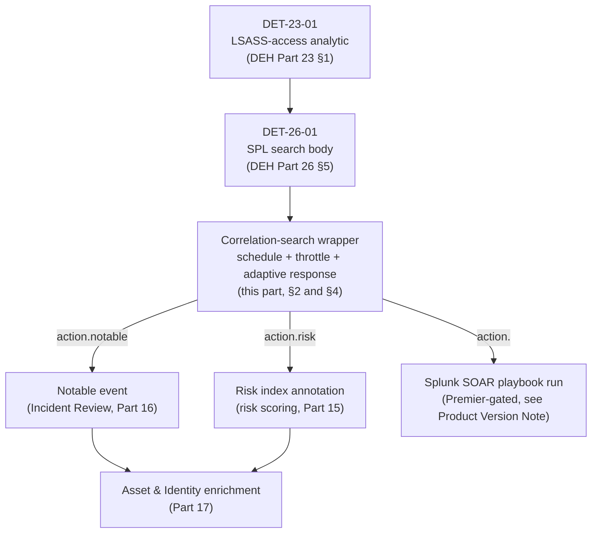
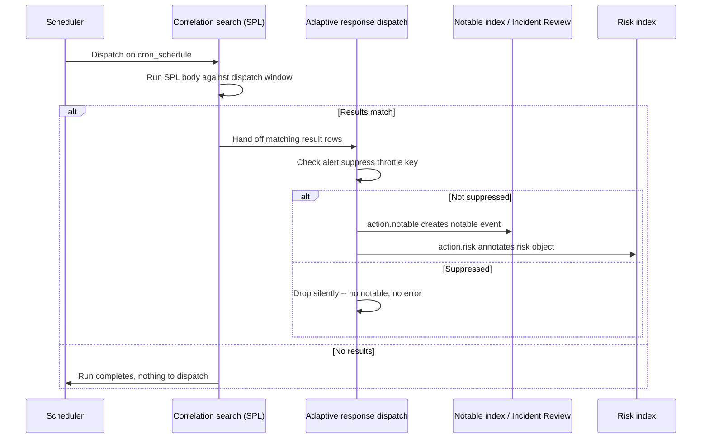
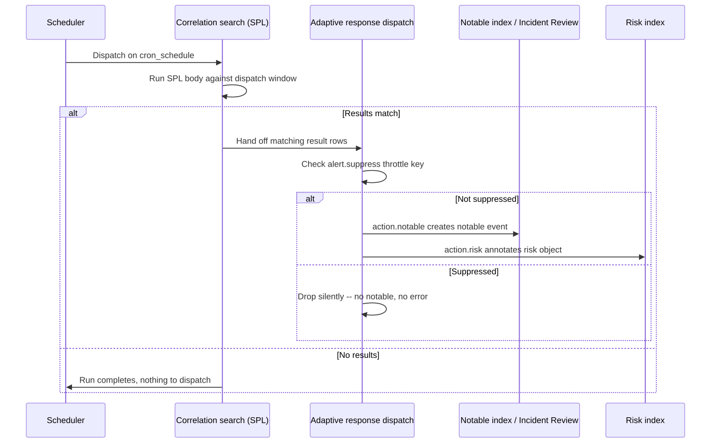

# Part 14 — Correlation Searches: From Analytic to Notable Event, and Their Lifecycle

## Why this part exists

**[CONCEPT]** A correlation search is the object that turns a written-down piece of detection logic into something Enterprise Security acts on: a scheduled search, wrapped in Enterprise-Security-specific configuration, that inspects its own results and — on a match — can create a notable event, annotate a risk object, fire a Splunk SOAR playbook, or all three. Nothing about the SPL inside it is special. What makes it a correlation search rather than an ordinary saved search or alert is entirely the wrapper: the schedule, the throttle, and the adaptive response actions attached to it. This part is about that wrapper, and about what happens to it after someone first saves it.

DEH Part 23 §1 defined this book's running LSASS-access analytic, DET-23-01, at the platform-independent layer: a process outside a maintained allowlist opening a handle to `lsass.exe` (the Local Security Authority Subsystem Service, the Windows process holding credential material in memory) with memory-read rights. DEH Part 26 §5 carried that into Splunk as DET-26-01, a working SPL search against Sysmon Event ID 10 telemetry. Neither part teaches this book anything about what happens once that SPL body needs to run on a schedule, suppress its own noise, and generate something an analyst actually sees — that gap is this part's subject, and §4 below takes DET-26-01's own query, unmodified, and wraps it into exactly that.

This part does not re-teach SPL syntax (DEH Part 26 owns that), does not re-teach how a risk score accumulates toward a notable threshold (this book's own Part 15 owns risk-based alerting mechanics), does not re-teach how an analyst works a notable in Incident Review (Part 16), and does not re-derive the Enterprise Security edition split or CIM dependency in general (Part 13 owns ES's own architecture; Parts 5–7 own CIM). What it does own: the correlation-search object itself — its anatomy, its scheduling and throttling behavior, the adaptive response framework that fires on a match, and the content-lifecycle discipline of building, versioning, and promoting one across environments, extending DEH Part 22's detection-as-code discipline to Splunk's own packaging mechanism.

---

## 1. Correlation search, saved search, alert: three objects that look alike

**[CONCEPT]** Every correlation search is a saved search under the hood — Splunk's own configuration model doesn't have a separate object type for it. What distinguishes the three is which optional pieces of `savedsearches.conf` configuration are turned on, and whether Enterprise Security is installed to interpret them at all.

A plain saved search just stores a query and, optionally, a schedule; it does nothing on its own beyond making results available when someone opens it or a dashboard panel runs it. A standard alert adds an alert action — email, a webhook, a script — that fires when the search's results satisfy a trigger condition, entirely independent of Enterprise Security; alerting is a core Splunk platform feature, not an ES one. A correlation search is a saved search with `action.correlationsearch.enabled` set and, almost always, at least one Enterprise-Security-specific adaptive response action attached (§3) — and it only behaves as one if Enterprise Security is installed on the search head evaluating it, since the app supplies the code that interprets `action.correlationsearch.*` settings and renders the result in its own Content Management and Incident Review interfaces.

The table below is the decision point this section supports: which object to reach for depends on whether the output needs to become an Enterprise-Security-tracked security event or just needs to notify someone.

| Object Type | Where Defined | Fires On | Typical Output | Requires ES? |
|---|---|---|---|---|
| Saved search / report | `savedsearches.conf`, no alert action | Manual run or schedule | A results table, a dashboard panel refresh | No |
| Standard alert | `savedsearches.conf`, `alert.*` + a non-ES `action.*` | Schedule or real-time trigger | Email, webhook, scripted action | No |
| Correlation search (notable) | `savedsearches.conf`, `action.correlationsearch.enabled=1` + `action.notable` | Schedule, evaluated against a match condition | A notable event in Incident Review | Yes |
| Correlation search (RBA) | `savedsearches.conf`, `action.correlationsearch.enabled=1` + `action.risk` | Schedule, evaluated per matching entity | A risk-score annotation on a risk object, in the risk index | Yes |

**[PLATFORM ENGINEER]** The last two rows are not mutually exclusive on a single correlation search — a search can carry both `action.notable` and `action.risk` at once, generating a notable and annotating a risk object from the same match in the same run. Part 15 covers what happens to that risk annotation afterward (the risk index, the risk-score accumulation, and threshold-based notable generation for RBA specifically); this part's concern stops at the fact that both adaptive response actions exist and can be attached side by side.

---

## 2. The anatomy of a correlation search

### savedsearches.conf — where a correlation search actually lives on disk

**[PLATFORM ENGINEER]** A correlation search's title, query, schedule, and every adaptive response action attached to it are all one stanza in `savedsearches.conf` (the Splunk configuration file, part of an app's `default/` or `local/` directory, that stores every saved search the platform knows about). The Enterprise Security web UI's correlation-search editor is a form over this file — every field it exposes is a key in the underlying stanza, and nothing the UI does is reachable any other way than by writing the equivalent key-value pairs directly.

```ini
# CONCEPTUAL SAMPLE — illustrative stanza shape, not reproduced from a specific ES instance
# (none exists in this book's evidence base). Confirm exact parameter names against your
# own ES version's Content Management > Edit page before treating any key below as final.
[Example Correlation Search]
disabled = 0
cron_schedule = */5 * * * *
enableSched = 1
dispatch.earliest_time = -10m
dispatch.latest_time = now
action.correlationsearch.enabled = 1
action.correlationsearch.label = Example Correlation Search
alert.suppress = 1
alert.suppress.period = 1h
alert.suppress.fields = host
action.notable = 1
```

This shape is what every correlation search in this part builds on — the SPL search string itself sits above the stanza, unchanged from however it was authored, and everything below `[Example Correlation Search]` is Enterprise-Security-specific wrapper. §4 below fills this same stanza shape in with DET-26-01's real query and a real set of parameters.

### 2.1 Scheduling and the dispatch window

**[PLATFORM ENGINEER]** `cron_schedule` sets how often the search runs, in standard cron syntax; `dispatch.earliest_time`/`dispatch.latest_time` set the lookback window each run actually searches, independent of how often it runs. The two are easy to conflate and don't have to match — a search scheduled every five minutes (`*/5 * * * *`) with a ten-minute lookback (`dispatch.earliest_time = -10m`) deliberately overlaps its own previous run's window, which is the standard way to guard against a run that dispatches late or a source that ingests with lag, at the cost of re-evaluating some events the previous run already saw.

> **Engineering Reality**
> An overlapping lookback doesn't duplicate a match by itself, because `action.notable` and `action.risk` don't track "have I already alerted on this specific event" across separate runs — that tracking is exactly what `alert.suppress` (below) does, and only within the field combination you throttle on. A ten-minute lookback on a five-minute schedule with no throttle configured re-fires a notable for the same underlying event on every run that still sees it in its window — which, for a five-minute overlap, is one extra notable per match, not an unbounded pile-up, but still one more than most reviewers expect the first time they see it happen. Set a throttle window at least as long as the overlap, or Part 12's scheduling-priority guidance starts fighting a correlation search that's quietly running twice as often as its analyst-facing behavior suggests.

### alert.suppress — throttling a correlation search without touching its logic

**[DETECTION ENGINEER]** `alert.suppress` (paired with `alert.suppress.period` and `alert.suppress.fields`, all in the same `savedsearches.conf` stanza) suppresses the *alert action* — the notable creation, the risk annotation, the SOAR playbook trigger — for a configured period, keyed on the field combination named in `alert.suppress.fields`, without changing what the underlying SPL matches on the next run. This is the mechanism most Splunk documentation calls throttling, and it is the direct, platform-specific analog of DEH's general Correlation-Window and Suppression concepts (see TERMINOLOGY.md, cited via DEH Part 22) applied to Enterprise Security's own alerting layer rather than to detection logic itself.

> **Blind Spot**
> Throttling suppresses the notification, not the search. If the "Suspicious LSASS Memory Access - Non-Allowlisted Process" correlation search (built in full in §4) throttles on `ComputerName` alone for one hour, and a second, genuinely different `SourceImage` matches on the same host forty minutes into that window, no second notable appears — the throttle key matched, so Enterprise Security treats it as "already alerted" regardless of whether the specific process, user, or access pattern that matched is the same one that triggered the first notable. Throttling on too few fields is a silent coverage gap with the same shape as Detection Debt's translation-layer failure (DEH Part 23 §3): the search keeps matching, correctly, on every run — the alert just never reaches anyone a second time. Throttle on the narrowest field combination that still controls the noise you're actually trying to suppress, not the broadest one that's convenient to configure.

---

## 3. Adaptive Response Actions: how a match becomes a notable, a risk score, or a SOAR playbook run

**[DETECTION ENGINEER]** Adaptive response actions are the Enterprise-Security-specific alert actions a correlation search dispatches on a match, configured as `action.<name>` keys in the same stanza (§2) alongside `action.<name>.param.*` keys for that action's own settings. The two this book uses most are `action.notable` (creates a notable event — the row an analyst actually works in Incident Review) and `action.risk` (writes a risk-score annotation to the risk index, the summary index Enterprise Security uses to accumulate scores against a risk object independently of whether any single match produces a notable on its own). Beyond those two, Enterprise Security ships adaptive response actions for sending email, running a script, enriching against threat intelligence, and — where Splunk SOAR is licensed — dispatching a SOAR playbook directly from the match.






**Figure 14.1 — DET-23-01 through DET-26-01 to a deployed correlation search.** *CONCEPTUAL.* Illustrates how the platform-independent LSASS-access analytic and its Splunk SPL realization are wrapped into a scheduled, throttled correlation search whose adaptive response actions fan out into this book's own downstream parts. This is a structural diagram of the book's cross-part design, not a capture of any real deployment.

> **Product Version Note**
> Splunk Enterprise Security is currently sold in two editions — Essentials and Premier — with SOAR (Security Orchestration, Automation, and Response), UEBA (User and Entity Behavior Analytics), and Automated Threat Analysis gated to Premier; the SIEM core, Threat Intelligence, Detection Studio, and Exposure Analytics ship in both editions. This means a SOAR-playbook adaptive response action, specifically, depends on which edition an environment is licensed for — `action.notable` and `action.risk` do not carry the same gating and are available in both. As of 2026-09-15, verified against Splunk's own Enterprise Security product page (REFERENCES.md entry [ES-PRODUCT-PAGE]). What would make this stale: an edition restructure, a feature moving between tiers, or either edition being renamed — this split is recent enough that re-verifying it before relying on it more than a few release cycles out is the safer default.

**[DETECTION ENGINEER]** Which adaptive response actions to attach to a given correlation search is itself a design decision, not a default to accept uniformly across every search. A notable-only correlation search puts every match in front of an analyst regardless of how confident the underlying signal is; an RBA-annotating one (Part 15) defers that decision to accumulated risk score instead. Most correlation searches in a mature ES deployment carry `action.risk` and reserve `action.notable` for the subset of analytics where a single match is, on its own, worth an analyst's immediate attention — DET-26-01 is a reasonable candidate for exactly that treatment, which §4 below reflects.

---

## 4. DET-26-01, deployed as a scheduled correlation search

**[DETECTION ENGINEER]** DEH Part 26 §5 built DET-26-01 as a working SPL search against Sysmon Event ID 10 telemetry, targeting a source process outside the `lsass_access_allowlist.csv` lookup (the maintained CSV lookup this book's own Part 8 covers as detection infrastructure) opening `lsass.exe` with memory-read rights. **MITRE:** T1003.001 (OS Credential Dumping: LSASS Memory). This section wraps that same query, unchanged, into a real correlation search — DET-26-01 itself is not renumbered or redefined here; what follows is DET-26-01, deployed as a scheduled correlation search, per this book's own ID discipline (STYLE-GUIDE.md §0).

### 4.1 The savedsearches.conf stanza

**[DETECTION ENGINEER]** The query below targets the same telemetry and the same allowlist DET-26-01 already defines; its only dependency beyond what DEH Part 26 §5 already names is that the lookup and the field names resolve identically inside whichever Enterprise-Security-managed app this stanza ships in.

```spl
index=windows sourcetype="XmlWinEventLog:Microsoft-Windows-Sysmon/Operational" EventCode=10 TargetImage="*\\lsass.exe"
| search GrantedAccess IN ("0x1010", "0x1410", "0x1438", "0x143a", "0x1fffff")
| lookup lsass_access_allowlist.csv SourceImage OUTPUT is_allowlisted
| where isnull(is_allowlisted)
| stats count, values(GrantedAccess) as granted_access_values, earliest(_time) as first_seen, latest(_time) as last_seen by ComputerName, SourceImage, TargetImage
```

This query's limitation is unchanged from DEH Part 26 §5 — it depends on Sysmon's Event ID 10 rule group actually logging accesses to `lsass.exe`, and an attacker who injects into an allowlisted binary inherits that binary's exemption. The correlation-search wrapper below adds a second limitation on top of it: scheduling and throttling behavior, not the underlying detection logic, decide how often and how visibly a real match actually surfaces.

```ini
# CONCEPTUAL SAMPLE — illustrative correlation-search stanza wrapping DET-26-01's own SPL body
# verbatim; not validated against a live Enterprise Security instance, since none exists in
# this book's evidence base. Confirm every action.notable/action.risk parameter name against
# your own ES version before deploying.
[Suspicious LSASS Memory Access - Non-Allowlisted Process]
disabled = 0
cron_schedule = */5 * * * *
enableSched = 1
dispatch.earliest_time = -10m
dispatch.latest_time = now
action.correlationsearch.enabled = 1
action.correlationsearch.label = Suspicious LSASS Memory Access - Non-Allowlisted Process
action.correlationsearch.annotations = {"mitre_attack": ["T1003.001"]}
alert.suppress = 1
alert.suppress.period = 1h
alert.suppress.fields = ComputerName,SourceImage
alert.digest_mode = 1
action.notable = 1
action.notable.param.rule_title = Suspicious LSASS Memory Access - Non-Allowlisted Process
action.notable.param.rule_description = A process outside the maintained SourceImage allowlist opened lsass.exe with access rights consistent with memory reading.
action.notable.param.security_domain = endpoint
action.notable.param.severity = high
action.notable.param.drilldown_search = index=windows sourcetype="XmlWinEventLog:Microsoft-Windows-Sysmon/Operational" EventCode=10 ComputerName="$ComputerName$" SourceImage="$SourceImage$"
action.risk = 1
action.risk.param._risk_object_1 = ComputerName
action.risk.param._risk_object_type_1 = system
action.risk.param._risk_score_1 = 80
```

The "Suspicious LSASS Memory Access - Non-Allowlisted Process" correlation search — the throttle key above (§4.2) is the choice actually worth scrutinizing, not the schedule or the severity mapping, both of which are ordinary defaults for a high-confidence endpoint analytic.

### 4.2 What breaks in production: the throttle-field mismatch

**[DETECTION ENGINEER]** The throttle key chosen in §4.1 — `ComputerName,SourceImage` — is a deliberate choice, not the obvious default a first pass at this stanza tends to reach for. The autopsy below shows what an under-scoped throttle key costs.

> **Detection Autopsy — "throttle on the host, not the process"**
>
> This box is a conceptual illustration built from the documented mechanics of `alert.suppress.fields` (§2, above) rather than a cited incident from a specific practitioner talk or known-issues report — no real Enterprise Security deployment backs it in this book's evidence base, and it's presented here as a synthesized, plausible failure rather than a captured one.
>
> **The rule:** The LSASS-access correlation search above, initially shipped with `alert.suppress.fields = ComputerName` alone — dropping `SourceImage` from the throttle key — to cut down on repeat notables from a single noisy host during initial tuning.
>
> **Why it shipped:** Early testing against a single lab host produced one legitimate match and, twenty minutes later, a second notable from the same host and the same `SourceImage` — an artifact of the ten-minute overlapping lookback (§2.1) re-seeing the same event before its own suppression window had been configured yet. Narrowing the throttle key to `ComputerName` alone looked like the fix, and it did stop the duplicate.
>
> **How it failed:** Three weeks later, a genuinely different `SourceImage` — a second, unrelated tool — accessed `lsass.exe` on the same host thirty-five minutes after the first tool's match, well inside the one-hour suppression window. Because the throttle key was `ComputerName` only, Enterprise Security treated the second access as already alerted-on and suppressed it silently. No notable, no error, no record in Incident Review that a second access had even occurred — the correlation search's own search results (visible only in its ad hoc search history, not in any notable) were the only place the second match existed at all.
>
> **The fix:** Restoring `SourceImage` to the throttle key (`alert.suppress.fields = ComputerName,SourceImage`, as shown in §4.1) so the suppression key matches the actual dimension of duplication the ten-minute-overlap problem was really about — the same event re-seen by the same search run overlap, not a second, distinct source process on the same host. The overlap-duplicate problem (§2.1) gets solved by making the throttle *period* comfortably longer than the lookback overlap, not by making the throttle *key* coarser than the entity the analytic is actually trying to distinguish.

### 4.3 Confirming this against a real instance

**[DETECTION ENGINEER]** The autopsy in §4.2 is a synthesized failure, not a measured one — the check below is what actually distinguishes a correctly-scoped throttle key from an over-broad one on a real search head, and it is stated as a test to run, not a result already observed here.

> **Detection Test**
> This book has no live Enterprise Security deployment to run the check below against — it states what to run against your own instance to confirm the wrapper behaves as designed, not a reproducible result already observed here.
> **Setup:** The stanza in §4.1 deployed to a search head running Enterprise Security, with Sysmon Event ID 10 telemetry flowing into the target index and `lsass_access_allowlist.csv` populated per DEH Part 26 §5.
> **Action:** Trigger DET-26-01's underlying match twice from two different, non-allowlisted `SourceImage` values on the same `ComputerName`, roughly ten minutes apart — the same test action DEH Part 26 §5's own Detection Test names, run twice with different tools.
> **Expected result:** Two notables in Incident Review, one per distinct `SourceImage`, each carrying a risk-index annotation against the same `ComputerName` risk object — and, in the correlation search's own Job Inspector output, a run duration and result count consistent with the SPL query alone, confirming the wrapper's schedule and throttle are the only added latency, not the search logic itself. If only one notable appears, the throttle key is collapsing two distinct entities into one suppression bucket — check `alert.suppress.fields` before assuming the search itself stopped matching.

---

## 5. ES Content Update — Splunk's packaged correlation-search content, and why editing it directly is a trap

**[PLATFORM ENGINEER]** Splunk ships pre-built correlation searches, rather than leaving every organization to author DET-26-01-style rules from a blank stanza, as a packaged Splunkbase app: ES Content Update (commonly abbreviated ESCU), maintained by Splunk's own Threat Research Team and distributed with detections mapped to MITRE ATT&CK technique IDs, with the underlying detection definitions also published on Splunk's public `security_content` GitHub repository.

> **Product Version Note**
> ES Content Update is currently at version `6.6.0`, released 2026-09-09, and describes itself as delivering "pre-packaged Security Content" that "provide[s] regular Security Content updates to help security practitioners address ongoing time-sensitive threats" — content that can generate notable and risk events directly against an Enterprise Security instance once installed. As of 2026-09-15, verified against the app's own Splunkbase listing (REFERENCES.md entry [ESCU-SPLUNKBASE]). What would make this stale: ESCU ships on a sub-quarterly cadence, faster than most of the version-specific claims in this book — treat any content count or version number named here as provisional the moment it's read, and check Splunkbase directly before citing a specific figure to anyone else.

**[PLATFORM ENGINEER]** The trap named in this section's own heading is specific and mechanical, not a vague caution about vendor content: ESCU's correlation searches live inside the ESCU app itself, and every ESCU upgrade replaces that app's `default/savedsearches.conf` wholesale. A change made by editing one of ESCU's own correlation searches directly — adjusting a threshold, adding a field to a `where` clause, tightening a throttle — lives in the app's `local/` directory if made through Enterprise Security's own editor (Splunk's standard default/local layering keeps hand edits out of `default/`), which survives an ESCU upgrade in the sense that the file isn't deleted — but the search that actually runs is whichever the platform resolves after layering `local/` over the new `default/`, and a threshold tuned against last quarter's ESCU logic can silently stop matching, over-match, or point at a field ESCU's own upgrade renamed, with no upgrade-time warning that the local customization and the new default have drifted apart.

> **Engineering Reality**
> The fix Splunk's own ESCU documentation and most practitioner guidance converge on is the same one DEH Part 22 §1 names for any vendor console that allows a direct, unreviewed edit: treat ESCU's shipped content as a read-only reference, not an editing surface. Clone the specific correlation search you need to tune into your own app (a locally maintained content app, version-controlled the same way DEH Part 22 describes for any other detection), retarget it under a new title so it doesn't collide with ESCU's own stanza name, and disable the ESCU original rather than editing it in place. An upgrade then only ever touches ESCU's own app; your tuned version is a separate, git-tracked object nothing but your own deployment pipeline can change.

---

## 6. Versioning correlation searches as code, and promoting them across environments

**[PLATFORM ENGINEER]** DEH Part 22 §1 makes the general case for a git-based rule repository over direct console edits: the console becomes a deployment target, not an editing surface, and the file in version control is the rule's actual source of truth. Applied to a correlation search specifically, that file is the `savedsearches.conf` stanza itself (plus any lookup or macro it depends on — Part 8 and Part 9 cover those as their own maintained artifacts) checked into the same app-based layout Splunk already expects: one custom app per logical content package, `default/savedsearches.conf` holding every correlation search that app ships, deployed to search heads the same way any other Splunk app is deployed — by an indexer/search-head-cluster deployer push, or by exporting the app as a `.tar.gz`/`.spl` package and installing it, never by an analyst editing the live stanza through Enterprise Security's own Content Management page in production.

**[DETECTION ENGINEER]** The version-bump discipline DEH Part 22 §8 sets for any Detection Rule applies directly here — a correlation search's own semantic version lives in its metadata (the same `Version` field DEH Part 22 §4's metadata table defines), bumped on every merged change to the stanza, independent of whatever build number the app package itself carries. Promoting a change across environments then follows the same three-role review gate DEH Part 22 §3 requires generically: author opens a pull request against the app repository, a reviewer confirms the changed stanza still matches the analytic's stated logic and that any threshold or throttle change is deliberate, and a merge-approver ships the resulting app package to a staging search head first — one running real (or realistically shaped) telemetry — before production.

**[PLATFORM ENGINEER]** What "staging" means concretely for a correlation search is narrower than for most software: there is no unit-test framework that runs SPL against synthetic events the way DEH Part 22 §6 describes for a generic detection-testing pipeline. The realistic staging check is running the search manually against a staging search head's own indexed data, confirming the result count and field shapes look like what the Job Inspector would show in production, and — where a true-positive fixture exists (a captured, known-good matching event, the same discipline DEH Part 22 §6 requires generally) — confirming the search still matches it after the change. A correlation search that "looks right" in a code review but has never actually run against real data before reaching production is the SIEM-specific version of the untested-deploy failure mode DEH Part 22 §1 names for any detection pipeline.

The table below anchors the lifecycle states a correlation search moves through to the concrete Splunk-side action each one implies — the decision this table supports is when a given search is actually allowed to fire against production telemetry, not just what label its metadata carries.

| Lifecycle State | What It Means | Concrete Splunk Action |
|---|---|---|
| Draft | Stanza written, not yet reviewed | `disabled = 1` in the dev app; not deployed to any shared search head |
| In review | Pull request open against the content-app repository | Deployed to a staging search head only, `disabled = 0` there, production untouched |
| Released | Reviewed, tested against staging data, merge-approved | Deployed to production via app package or deployer push, `disabled = 0`, `action.correlationsearch.enabled = 1` |
| Tuning | Released, under active threshold/throttle adjustment | Change flows through the same PR gate as a new search — never a live edit through Content Management |
| Deprecated | Superseded by a newer version or an RBA-based replacement | `disabled = 1` in production first; stanza removed from the app only after a retention period with no open notables referencing it |

**[SOC MANAGEMENT]** The deprecated row is where content lifecycle most often gets skipped in practice — disabling a superseded correlation search costs nothing and is easy to remember; actually removing its stanza from the app once nothing references it takes a deliberate cleanup pass nobody schedules unless the search-count-versus-concurrency-budget conversation in §7 below forces it.

---

## 7. SOC management view: content sprawl and the concurrency budget

**[SOC MANAGEMENT]** §6's lifecycle table treats each correlation search as an individually managed object; at fleet scale, the more consequential decision is how many of them exist at once.

> **SOC Management View**
> Every enabled correlation search, ESCU's included, competes for the same finite scheduled-search concurrency budget Part 12 covers in depth — installing ESCU and enabling its full content library without first checking which of its correlation searches assume CIM fields your own environment doesn't populate (Parts 5–7's own subject) produces two costs at once: searches that silently never match because their required fields aren't there, and searches that do run on schedule, consuming concurrency slots, for detections that structurally cannot fire in your environment. Treat "install ESCU" and "our correlation-search count went up by several hundred" as the same decision, not two separate ones — each enabled search is a recurring compute cost and a recurring maintenance obligation (§6) whether or not it was authored in-house. A content-adoption review that checks required-field coverage (§5's CIM dependency, made concrete) before enabling a new batch of ESCU content is cheaper than discovering the gap during an incident review, and it is the direct correlation-search-specific instance of the same rule-count-versus-validated-coverage distinction DEH Part 1 warns against in general.






**Figure 14.2 — Correlation search to notable event, sequence.** *CONCEPTUAL.* Illustrates the expected sequence from a scheduled correlation search's SPL execution through the throttle check, adaptive-response dispatch, and notable-event/risk-index creation, including the silent-suppression path the `alert.suppress` section (§2) and §4.2 both name. This is a sequence diagram of documented expected behavior, not a capture from a live Splunk job inspector or a real Enterprise Security instance — none exists in this book's evidence base (see STYLE-GUIDE.md §9.2).

---

## Closing: where this hands off

**[CONCEPT]** A notable-generating correlation search like the one built in §4 is the simplest, most direct version of turning an analytic into something an analyst sees — one match, one notable, immediately. Part 15 covers the alternative most mature Enterprise Security deployments actually converge on for high-volume analytics: annotate a risk object on every match via `action.risk` instead, and let accumulated score across many correlation searches — not any single one — decide when a notable is actually warranted. Every mechanic this part covers (the stanza, the schedule, the throttle, the ESCU-versus-custom-content lifecycle) applies identically to an RBA-oriented correlation search; only the adaptive response action attached, and what happens after it fires, changes.

**Cross-references:** DEH Part 22 (Detection as Code) §1, §3, §4, §6, §8; DEH Part 23 (Query Language Strategy) §1; DEH Part 26 (Splunk SPL) §5; this book's Part 5–7 (Common Information Model), Part 8 (Lookup Tables as Detection Infrastructure), Part 12 (Search Performance and Tuning at Scale), Part 13 (Enterprise Security Architecture, Editions, and the CIM Dependency), Part 15 (Risk-Based Alerting), Part 16 (Notable Events and the Incident Review Workflow), Part 17 (Asset and Identity Correlation).
