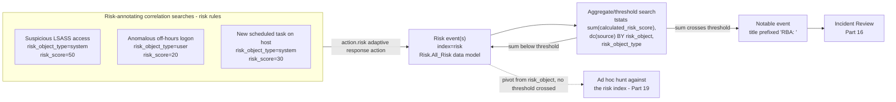

# Part 15 — Risk-Based Alerting: Risk Objects, Risk Scores, and the Risk Index

## Why this part exists

**[CONCEPT]** Part 14 covers a correlation search's full anatomy: the `savedsearches.conf` stanza,
its schedule, its throttling, and its adaptive response actions — including the oldest and simplest
one, `action.notable`, which turns a single search result row into a single notable event. That
model has a scaling problem this part exists to name and solve: a real attacker's actual kill chain
rarely trips one high-confidence analytic in isolation. It trips several weak ones — an off-hours
logon, a new scheduled task, a process touching `lsass.exe` from an unfamiliar path — none of which
is confident enough on its own to justify a stand-alone notable without flooding the queue, but which
together, on the same host or the same user in the same window, are a real signal a triage queue
should surface. Risk-Based Alerting (RBA) is Splunk Enterprise Security's answer: stop generating a
notable on every match, and instead let each match add a scored contribution to a **risk object** —
a specific user, host, or other entity — then generate a notable only once that object's accumulated
risk crosses a threshold.

This part is operations-layer, and it sits directly downstream of Part 14's correlation-search
mechanics: everything RBA does still runs as a scheduled search with a `savedsearches.conf` stanza,
an adaptive response action, and — for the aggregate step — the same `tstats`-driven aggregation
Part 10 covers as this book's realization of the forward reference in DEH Part 26 §1.3. This part
does not re-teach `tstats` syntax, `stats` aggregation functions, or the `where` command — Part
26 §§2–4 own those, and Part 10 owns `tstats` mechanics specifically; where this part shows a query,
the framing sentence states what it targets and points back rather than re-deriving the command. It
also does not re-teach the Analytic-vs-Detection-Rule distinction (DEH Part 23 §1) — it assumes
DET-23-01, the canonical LSASS-access analytic carried through DEH Parts 24–29 and this book's own
Part 14, and shows what changes when that same analytic is deployed as a risk rule instead of (or
alongside) a notable-generating correlation search.

**MITRE:** T1003.001 (OS Credential Dumping: LSASS Memory) — DET-23-01's technique, reused here
without re-derivation.

Every specific mechanism named below — field names, `.conf` stanza keys, the risk index's default
name — is sourced from Splunk's own public GitHub repositories for its Enterprise Security Content
Update (ESCU) package and its `contentctl` build tooling, since `docs.splunk.com` remains unreachable
to this book's own research tooling (`STYLE-GUIDE.md` §9.4; `REFERENCES.md`'s sourcing note). No
Splunk instance backs any of it; every artifact below is `OFFICIAL REFERENCE`, cited, or explicitly
marked `CONCEPTUAL SAMPLE`.

---

## 1. One match, one notable — and why that stops scaling

**[CONCEPT]** A traditional correlation search (Part 14) with `action.notable = 1` does exactly one
thing on a match: it writes one notable event, once, per matching result (subject to throttling).
That's the right model for a rule with a low false-positive rate and a clear, single-event story — an
audit log clear, a domain-admin group modification. It's the wrong model for a large class of
genuinely useful analytics that are individually weak: a login at 3 a.m. local time, a process that
isn't normally seen on that host, a new outbound connection to a rarely-contacted ASN. Each of those,
alone, is too common to page anyone on. Enabled as traditional per-event notables, a SOC either
drowns in noise or — more commonly — never turns them on at all, which means the actual multi-step
behavior they'd have caught together goes completely dark.

This isn't just an intuition about noisy rules; it's a specific, formally studied problem. When the
population of genuinely malicious events is a tiny fraction of total activity, even an analytic with
a respectable-looking false-positive *rate* in isolation still produces mostly false alarms in
absolute *count* once it runs continuously against real-world traffic — the base-rate fallacy,
applied to intrusion detection specifically by Stefan Axelsson's widely-cited analysis of why this
makes single-analytic detection so hard to operate at low alert volume (`REFERENCES.md` entry
`[AXELSSON-BASE-RATE-FALLACY]`). Aggregating several individually weak analytics' contributions
before ever generating a notable — RBA's whole mechanism, below — is one concrete, Splunk-specific
answer to exactly that problem, not merely a noise-reduction convenience layered on top of it.

Stated as the Bayesian update it is, the base-rate fallacy is this: the detection rate an analyst
actually cares about is not the detector's own false-positive rate, but the probability an alarm is
real given that it fired at all — and that probability is pulled down hard by a low base rate no
matter how good the detector's isolated false-positive rate looks.

```
P(I|A) = [ P(A|I) × P(I) ] / [ P(A|I) × P(I) + P(A|¬I) × P(¬I) ]
```

- **P(I)** — the base rate: the fraction of all events that are a genuine intrusion, before any
  detector runs.
- **P(A|I)** — the detector's true positive rate: given a genuine intrusion, the probability it
  alarms.
- **P(A|¬I)** — the detector's false positive rate: given no intrusion, the probability it still
  alarms.
- **P(¬I)** — the complement of the base rate, `1 - P(I)`.
- **P(I|A)** — the number an analyst actually needs: given that an alarm fired, the probability it
  corresponds to a genuine intrusion.

Risk-Based Alerting changes the unit of output. A risk-annotating correlation search — Splunk's own
terminology calls it a **risk rule** — does not create a notable on a match. It appends one **risk
event** to a dedicated, retained dataset (§4 below), scored and attributed to a specific risk object.
A separate aggregation search then reads that accumulated history back and decides, on its own
schedule, whether any one risk object's accumulated score (or some other threshold condition, §5) has
crossed a line worth a human's attention. The weak individual signals never disappear from view —
they're still queryable risk history — but none of them, alone, forces a notable.

> **Product Version Note**
> Splunk's own Enterprise Security product page states, in its Risk-Based Alerting feature callout,
> that RBA can "reduce your alert volumes by up to 90%," and its Essentials/Premier edition
> comparison on that same page does not list Risk-Based Alerting among the capabilities marked
> Premier-only (UEBA, SOAR integration, and Automated Threat Analysis are the callouts marked
> Premier-only there). As of 2026-09-15, verified against
> `www.splunk.com/en_us/products/enterprise-security.html` (`REFERENCES.md` entry
> `[SPLUNK-ES-PRODUCT-PAGE]`). What would make this stale: a revised edition comparison that moves RBA
> behind a paywall it isn't behind today, or a marketing refresh that drops or revises the 90% figure
> without a version bump to flag it — re-verify both before repeating either claim more than a few
> release cycles out. §6 below treats the figure itself on its own terms.

Figure 15.1 lays out the full mechanism this part covers piece by piece: risk rules writing scored
risk events into a shared dataset, an aggregate search reading that dataset back, and a notable
generated only once a threshold trips.






**Figure 15.1 — Correlation search to risk event to (maybe) a notable.** *CONCEPTUAL.* Illustrates
the expected sequence from a risk-annotating correlation search's match, through the `action.risk`
adaptive response action and the risk index, to an aggregate search's threshold decision. This is a
sequence diagram of documented expected behavior, not a capture from a live Enterprise Security
instance or job inspector — none exists in this book's evidence base (`STYLE-GUIDE.md` §9.2).

---

## 2. Risk objects and risk object types

**[DETECTION ENGINEER]** A **risk object** is the entity a risk event is attributed to — the thing
whose accumulated score the aggregate search in §5 will eventually threshold on. Every risk event
carries two fields naming it: `risk_object` (the actual value — a hostname, a username) and
`risk_object_type`, which is not a free-text field but one of a small, fixed set. Splunk's own
published ESCU detections — the `security_content` GitHub repository behind the Enterprise Security
Content Update app — use exactly three values across the risk rules they ship: `system`, `user`, and
`other`.

**Table 15.1 — `risk_object_type` values observed in Splunk's own published ESCU content.** Use this
table to decide which type a new risk rule should assign; guessing a fourth value is not supported by
any example this book could verify.

| `risk_object_type` | Typical `risk_object` Value | Example ESCU Detection | Notes |
|---|---|---|---|
| `system` | Hostname/asset identifier (`dest`) | "Access LSASS Memory for Dump Creation" | Host-centric; the default for endpoint-telemetry risk rules |
| `user` | Username or identity string | "Okta Risk Threshold Exceeded" | Identity-centric; pairs with Part 17's identity resolution |
| `other` | Anything not cleanly a host or a user | "Windows Post Exploitation Risk Behavior" | Catch-all — an aggregate search's own output, a cloud resource ID, or an unresolved IP |

*Sourced from Splunk's public `security_content` repository (`REFERENCES.md` entry
`[SECURITY-CONTENT-REPO]`); §4 below covers what "ESCU" is and how Part 14 treats it as this book's
content-lifecycle mechanism.*

An IP address is the case worth calling out by name, since this part's own scope names it alongside
user and host: it does not get its own `risk_object_type`. An IP that Part 17's asset framework has
already resolved to a known host is scored as `system`, using the resolved hostname as `risk_object`
rather than the raw address, so that the same physical machine's risk accumulates under one identity
regardless of which telemetry source reported which representation of it. An IP with no asset match —
a scanner, an unmanaged device, an external address — has nothing more specific to fall back to, and
lands in `other`. That fallback is itself a signal worth watching, not a rounding error: a
`risk_object_type=other` entry whose `risk_object` is a bare IP is, by construction, an asset your
identity/asset framework doesn't recognize, and a SOC that never looks at its `other`-typed risk
events is quietly ignoring exactly the unmanaged-asset population most likely to be unmonitored in
every other way too.

---

## 3. From a search match to a risk event

**[DETECTION ENGINEER]** The adaptive response action that turns a match into a risk event is
`action.risk`, configured on the risk rule's own `savedsearches.conf` stanza — the same file and the
same stanza-per-search model Part 14 covers for `action.notable`. Converting an existing correlation
search into a risk rule does not change its search body at all; it changes what happens after a
match, by adding the action described below.

### `action.risk` — turning a correlation-search match into a risk event, not a notable

**[DETECTION ENGINEER]** A risk rule sets `action.risk = 1` and supplies two parameters:
`action.risk.param._risk_message`, a template string that can reference search fields with `$field$`
syntax, and `action.risk.param._risk`, a JSON array of one or more objects, each naming either a risk
object (`risk_object_field`, `risk_object_type`, `risk_score`) or a threat object
(`threat_object_field`, `threat_object_type` — a non-scored entity worth recording alongside the risk
object, such as the specific process image involved, without itself accumulating risk).

The example below adapts this structure to DET-26-01 — the SPL realization of DET-23-01 that DEH Part
26 §5.2 builds against Sysmon Event ID 10 telemetry (one clause, not a re-derivation; see that section
for the query itself).

```ini
# CONCEPTUAL SAMPLE — a composite stanza built from real, individually-cited ESCU parameter
# names and values (REFERENCES.md entries [SECURITY-CONTENT-REPO], [CONTENTCTL-REPO]); no
# single file in Splunk's published content uses this exact stanza name or combination, so
# this is illustrative, not a literal reproduction of one source file.
[DET-26-01 - Suspicious LSASS Access - Risk Rule]
action.risk = 1
action.risk.param._risk = [{"risk_object_field": "dest", "risk_object_type": "system", "risk_score": 50}, {"threat_object_field": "TargetImage", "threat_object_type": "process"}]
action.risk.param._risk_message = Process $SourceImage$ requested memory-read access to $TargetImage$ on $dest$, matching DET-26-01's GrantedAccess/allowlist logic
action.risk.param.verbose = 0
```

The `risk_score = 50` value above is not an invented illustration — it is the actual score Splunk's
own "Access LSASS Memory for Dump Creation" ESCU detection assigns its `system`-typed risk object,
entity field `dest` (`REFERENCES.md` entry `[SECURITY-CONTENT-REPO]`). This stanza's main limitation
is the one DEH Part 26 §5.2 already names for DET-26-01 itself: it depends on Sysmon's Event ID 10
rule group actually logging accesses to `lsass.exe`, and on a maintained `SourceImage` allowlist to
keep EDR/AV noise from dominating the risk it writes — a risk rule that fires constantly on legitimate
AV scanning behavior pollutes every downstream aggregate in §5 exactly as badly as an unfiltered
notable would have.

> **Engineering Reality**
> "Risk-Based Alerting" is not a separate kind of correlation search with its own file format — it's
> `action.risk` on an ordinary `savedsearches.conf` stanza, and nothing stops the same stanza from
> also carrying `action.notable = 1` at the same time. Splunk's own ESCU build tooling (`contentctl`)
> renders both actions onto one stanza when a detection's deployment config enables both, and
> prefixes the resulting notable's title with `RBA: ` specifically when the detection is authored as
> a risk-based Correlation type (`REFERENCES.md` entry `[CONTENTCTL-REPO]`). A rule carrying both
> actions generates a notable on every single match *and* contributes to the aggregate threshold in
> §5 — a legitimate choice for a genuinely high-confidence analytic, but one that defeats RBA's whole
> alert-volume argument if applied to a weak one. Decide, per rule, whether it should ever stand alone
> as a notable; don't assume "it's a risk rule" and "it never pages anyone directly" are the same
> fact.

> **Product Version Note**
> The parameter names shown above (`action.risk.param._risk`, `action.risk.param._risk_message`) are
> drawn from Splunk's own public `contentctl` repository — the tooling that compiles ESCU's
> YAML-authored detections into the `.conf` stanzas Enterprise Security actually loads — not from a
> fetched `docs.splunk.com` admin-manual page, which returned HTTP 403 on every retrieval attempt for
> this book (`STYLE-GUIDE.md` §9.4). As of 2026-09-15, verified against `github.com/splunk/contentctl`
> (`REFERENCES.md` entry `[CONTENTCTL-REPO]`). What would make this stale: Enterprise Security
> renaming these underlying `.conf` keys in a future release (unlikely on the timescale of a single
> release, since a rename breaks every existing stanza using the old key, but not impossible), or this
> book confirming the exact current label Splunk Web's adaptive-response-action picker shows for the
> same action — informally referred to as "Risk Analysis" in Splunk's own community and partner
> materials, but not verified against a fetchable source here.

---

## 4. The risk index and the Risk data model

**[PLATFORM ENGINEER]** Every risk event `action.risk` writes lands in a dedicated index — by
default, and in every one of Splunk's own published ESCU detections this book could verify, the risk
index (`index=risk`). Splunk ships this as a macro rather than a hardcoded literal in its own
content: the `risk_index` macro in the `security_content` repository resolves, by default, to exactly
`index=risk` (`REFERENCES.md` entry `[SECURITY-CONTENT-REPO]`), and ESCU's own guidance is to override
that macro's definition, not the individual searches, if an environment routes risk events somewhere
else. That's the correct pattern for the same reason a hardcoded index name anywhere else in a
detection is a maintenance liability — Part 8's lookup-versioning argument and Part 9's macro-sprawl
argument both apply here directly. Treat `risk_index` as exactly the kind of shared macro Part 9
covers, not a one-off convenience.

The risk index is a retained dataset in its own right, subject to the same bucket-lifecycle and
retention decisions Part 3 covers for any other index — this part does not re-teach hot/warm/cold/
frozen mechanics, only names the one consequence specific to risk: retention here is a
detection-coverage decision, not just a storage-cost one.

> **Blind Spot**
> The risk index's retention window and the raw source data's retention window are independent
> settings, and nothing forces them to match. If the risk index is retained for 90 days while the raw
> Sysmon/Windows Event Log data behind it is retained for a full year, an aggregate search with a
> 180-day lookback (§5) will silently stop seeing risk events older than 90 days even though the
> underlying evidence that generated them is still fully queryable — the aggregate's threshold
> decision quietly narrows to a shorter effective window than its own `earliest_time` implies, with no
> error and no obviously missing data, since the raw source events are still there for anyone who
> thinks to check them directly. Size the risk index's retention to at least the longest lookback
> window any aggregate search built on top of it actually uses, not to whatever the platform's default
> retention happens to be.

Splunk builds a CIM-adjacent dataset over the risk index the same way it builds any other CIM data
model (Part 6) over a CIM-tagged source — the Risk data model, referenced in SPL as `Risk.All_Risk`
(that dataset's own path within the model). Every field named in §2 and §3 above — `risk_object`,
`risk_object_type`, `calculated_risk_score` (the risk index's own name for the per-event score
`action.risk.param._risk`'s `risk_score` value becomes once written), `risk_message`, and MITRE
annotation fields (`annotations.mitre_attack.mitre_technique_id`, `annotations.mitre_attack.mitre_tactic_id`) —
is queryable through that data model, which means the aggregate searches in §5 can use `tstats`
against it exactly the way Part 10 covers for any other accelerated data model, rather than a slower
`datamodel` search or a raw `index=risk` scan. Whether that acceleration is actually turned on for the
Risk data model in a given environment is Part 10's question, not this part's; confirm it rather than
assuming it, since an unaccelerated Risk data model still works, just at raw-search cost on every
aggregate run.

> **Product Version Note**
> The risk index defaults to `index=risk`, and the data model it feeds is queryable as
> `Risk.All_Risk`, with per-event fields including `calculated_risk_score`, `risk_object`,
> `risk_object_type`, `risk_message`, and the `annotations.mitre_attack.*` MITRE fields. All of
> these names are confirmed from Splunk's own published ESCU/`security_content` macros and
> detections (the `risk_index` macro's default definition and the `datamodel=Risk.All_Risk`
> pattern used in shipped risk-threshold detections), not from a fetched `docs.splunk.com`
> reference page (`STYLE-GUIDE.md` §9.4). As of 2026-09-15, verified against
> `github.com/splunk/security_content` (`REFERENCES.md` entry `[SECURITY-CONTENT-REPO]`). What
> would make this stale: Splunk renaming the index, the data model, or any of these fields in a
> future Enterprise Security release, or a given environment's own ESCU deployment overriding the
> `risk_index` macro to point elsewhere per this section's own guidance — confirm all of these
> against the actual environment before writing an aggregate search against any of them.

---

## 5. The aggregate search: from accumulated risk to a notable

**[DETECTION ENGINEER]** The second half of RBA is a search that reads the risk index back, groups
by risk object, and decides whether the accumulated picture for any one object is now worth a
notable. The query below adapts Splunk's own published "Windows Post Exploitation Risk Behavior" ESCU
detection, trimmed for clarity (`REFERENCES.md` entry `[SECURITY-CONTENT-REPO]`); it targets the Risk
data model directly, using the `tstats` aggregation Part 10 covers in depth rather than re-deriving it
here.

```spl
| tstats `security_content_summariesonly`
    sum(All_Risk.calculated_risk_score) as risk_score,
    dc(source) as source_count,
    values(All_Risk.annotations.mitre_attack.mitre_technique_id) as technique_ids
    FROM datamodel=Risk.All_Risk
    BY All_Risk.risk_object, All_Risk.risk_object_type
| `drop_dm_object_name("All_Risk")`
| where source_count >= 4
```

This search's main limitation is the same tradeoff every threshold carries: `source_count >= 4`
rewards *diversity* of contributing analytics on one object over any single analytic's raw match
count, which is a deliberate design choice, not an arbitrary one — see Table 15.2 for the
alternatives and what each one actually rewards. `security_content_summariesonly` is Splunk's own
convention macro restricting the `tstats` search to the accelerated summary only, skipping any risk
events written since the data model's last acceleration pass; a risk event that landed in the last
few minutes and hasn't yet been folded into the `tsidx` summary won't count toward the threshold on
this particular run, which is a real, small, and usually acceptable staleness window rather than a
bug.

**Table 15.2 — Threshold strategies for an aggregate search, and what each one actually rewards.**
Use this table when deciding what condition should trip a notable, not just what number to set it to.

| Threshold Strategy | What It Rewards | Failure Mode to Watch For |
|---|---|---|
| Sum of `calculated_risk_score` | Total accumulated confidence, regardless of source diversity | A single noisy, high-volume rule can cross the threshold alone — see the False Positive Trap below |
| Distinct contributing analytic count (`dc(source)`) | Breadth — many *different* weak signals agreeing on one object | A genuinely severe but narrowly-observed technique may never cross a count-based bar |
| Distinct MITRE technique/tactic count | Kill-chain diversity specifically, independent of raw score | Two sub-techniques of one parent technique can double-count as "diverse" when they aren't |

> **False Positive Trap**
> A sum-of-score threshold treats ten matches from one noisy, low-confidence rule as identical to ten
> matches from ten different rules — repetition and diversity both add up to the same number. A
> single business-critical server that a low-confidence "unusual process" rule fires on dozens of
> times a day (a legitimate, noisy backup agent behaving in a way that rule's author didn't
> anticipate) can single-handedly cross a sum-based threshold with zero real diversity of evidence
> behind it, generating a notable that looks like a multi-signal escalation but is actually one rule
> complaining about itself repeatedly. The fix is either a distinct-source-count condition (Table
> 15.2's second row) instead of or alongside a raw score sum, or a per-source-search cap on how much
> any single rule can contribute to one object's total in a given window — not simply raising the sum
> threshold, which just delays the same failure to a slightly higher number.

---

## 6. Splunk's own alert-volume-reduction claim, examined

**[SOC MANAGEMENT]** §1's Product Version Note already states the number and its source plainly:
Splunk's own Enterprise Security product page claims RBA can reduce alert volume by up to 90%. It's
worth being explicit about what that figure is and isn't, because it's the single most quoted RBA
statistic and also the one furthest from anything this book can independently check.

It is a vendor's own marketing claim, published on a page whose purpose is to sell the product, with
no methodology, no baseline-environment description, and no independent replication cited alongside
it. It is plausible on its face — moving from one notable per weak match to one notable per crossed
threshold mechanically reduces notable *count* by construction, for any environment running enough
weak analytics to make the comparison meaningful — but "plausible" and "measured, in your environment,
under your own threshold choices" are different claims, and only the second one should drive a
staffing or tooling decision.

> **What Would Change My Mind**
> This book cannot measure a before/after notable count for RBA adoption, because no Enterprise
> Security deployment exists in its evidence base (`STYLE-GUIDE.md` §9.2). What would move the 90%
> figure from "vendor claim, plausible on its face" to something this book could treat as verified: a
> real Enterprise Security instance, run for a comparable retention window with a fixed, unchanged set
> of underlying analytics, first with every analytic wired to `action.notable` directly and then
> re-wired to `action.risk` plus one or more aggregate threshold searches — comparing total notable
> count across the two configurations against the same underlying event population. Absent that, the
> honest statement is narrower than the marketing page's: RBA's *mechanism* for reducing notable count
> is sound and explainable (§1), and Splunk's own number for the *size* of that reduction is
> unverified here, not false — those are two different confidence levels, and collapsing them into one
> would overstate what this part actually knows.

Threshold design is also a management decision, not only an engineering one, in one specific way worth
naming directly: every threshold in Table 15.2 trades detection latency against notable volume. A
higher sum threshold or a stricter distinct-count requirement produces fewer, higher-confidence
notables at the cost of taking longer (more contributing risk events) to surface a genuinely
fast-moving attacker — and nobody but the SOC that owns the triage queue can decide where that
tradeoff should sit for a given risk appetite. Splunk's own documentation and marketing can supply the
mechanism; it cannot supply the org-specific answer to "how much detection latency is this SOC willing
to accept in exchange for how much less noise."

---

## 7. Where risk-based alerting hands off

**[CONCEPT]** This part covered the mechanism — risk objects and their types, `action.risk` as the
annotation step, the risk index and Risk data model as the retained dataset underneath it, and the
aggregate search's threshold logic as the step that finally produces (or withholds) a notable. Three
parts pick up directly from here. Part 14 is where a risk rule's own scheduling, throttling, and
content-lifecycle management live, exactly as they would for any other correlation search — this part
deliberately didn't repeat that. Part 16 is where the resulting notable actually gets worked: an
RBA-generated notable arrives in Incident Review with multiple contributing risk events behind it
rather than one, and triaging that shape of notable is a genuinely different task from triaging a
traditional single-event one. Part 17 is where `risk_object` values that are raw usernames or
unresolved IPs get enriched with asset criticality and identity context before a human ever sees
them — the exact gap §2 named for `other`-typed risk objects that are really just unmanaged assets
waiting to be resolved.

---

**Cross-references:** DEH Part 23 §1 (DET-23-01); DEH Part 26 §1.3 (`tstats` forward reference), §5.2
(DET-26-01's SPL body); this book's Part 3 (bucket lifecycle and retention), Part 6 (CIM data models),
Part 8 (lookup tables as maintained infrastructure), Part 9 (search macros and macro sprawl), Part 10
(`tstats` and data model acceleration), Part 13 (Enterprise Security editions), Part 14
(correlation-search anatomy and content lifecycle), Part 16 (notable events and Incident Review), Part
17 (asset and identity correlation), Part 19 (investigation workflows).
