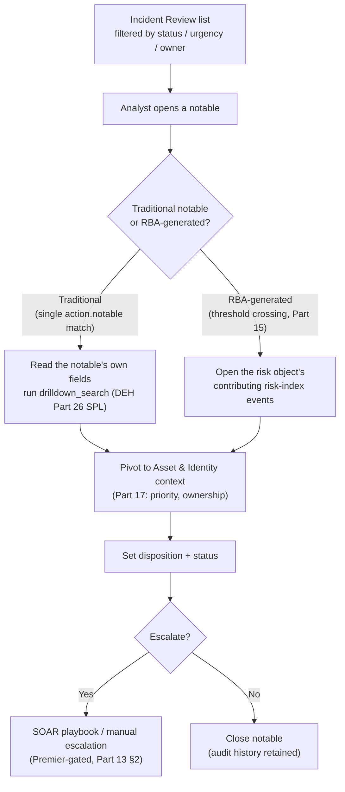

# Part 16 — Notable Events and the Incident Review Workflow

## Why this part exists

**[CONCEPT]** Part 14 built a correlation search and watched it fire `action.notable`. Part 15 (Risk-Based Alerting) covers the alternative path — `action.risk` annotating a risk object until an accumulated score crosses a threshold and Enterprise Security generates a notable on its own. Both paths land in the same place: a row in the `notable` index (the Enterprise Security index holding notable-event metadata, introduced in Part 13 §4) that an analyst has to actually work. This part is about that row — what fields it carries, how Enterprise Security decides how urgently to present it, and what an analyst does with it inside Incident Review (Enterprise Security's own analyst-facing dashboard for working notable events, named in Part 13 §4's component table). It is the first part in Section E written from the triage seat rather than the content-authoring seat.

This part does not re-teach how a correlation search is built (Part 14), does not re-teach risk-score accumulation or threshold mechanics (Part 15), and does not re-teach SPL syntax — where a drilldown search's own query surfaces below, DEH Part 26 §1 (Splunk SPL, the search-time/index-time field split and pipeline mechanics) is the pointer, not a re-derivation. What it does own: notable-event fields and computed urgency, the status/ownership/disposition workflow an analyst actually clicks through, and — the section this part exists to write — the concrete difference between triaging a traditional, one-match-one-notable event and triaging an RBA-generated notable that represents a threshold crossing with several contributing events behind it, not one.

**Evidentiary note, restated per STYLE-GUIDE.md §9.2:** no Enterprise Security instance exists in this book's evidence base. Every mechanic below is sourced from Splunk's own public product materials (cited in `REFERENCES.md`) or marked `CONCEPTUAL` as an illustrative reconstruction; nothing here is a screenshot or a captured Job Inspector output from a running deployment.

---

## 1. What a notable event actually is

**[CONCEPT]** A notable event is a retained, searchable record — one row, with its own fields — that Enterprise Security writes to the `notable` index the moment a correlation search's `action.notable` adaptive response action fires (Part 14 §3) or an RBA threshold crossing generates one (Part 15). It is not a transient UI state that disappears if nobody looks at it; closing a browser tab open to Incident Review does not delete or resolve anything, because the notable already exists as an indexed event independent of whoever is currently viewing it. That distinction matters operationally: a notable an analyst never opens still consumes license-metered ingest and retention exactly as Part 13 §4's Engineering Reality box describes, and it still counts toward whatever backlog metric a SOC manager tracks (§7 below) whether or not a human has touched it.

The table below is the reference this part leans on for the rest of its sections — it states what each core notable field is and, just as importantly, which layer actually sets its value, since that determines whether an analyst can change it directly or has to go fix something upstream instead.

| Field | What it holds | Set by |
|---|---|---|
| `rule_name` | The firing correlation search's title (e.g., "Suspicious LSASS Memory Access - Non-Allowlisted Process", Part 14 §4.1) | The correlation search's own definition — fixed at author time |
| `security_domain` | A coarse category (`access`, `endpoint`, `network`, `identity`, `audit`, `threat`) used for Incident Review filtering | `action.notable.param.security_domain` in the stanza |
| `severity` | The correlation search author's own confidence/impact rating (`informational`/`low`/`medium`/`high`/`critical`) | `action.notable.param.severity` in the stanza |
| `urgency` | Enterprise Security's own computed field, combining `severity` with the affected asset's or identity's `priority` rating | Computed by Enterprise Security; not directly settable — see §2 |
| `status` | The workflow state an analyst moves the notable through | Analyst action inside Incident Review (§3) |
| `owner` | Which analyst (or `unassigned`) is currently responsible for the notable | Analyst action, or an assignment rule |
| `disposition` | The analyst's own closing categorization — true positive, benign positive, false positive, undetermined | Analyst action, usually set at or near closure |
| `drilldown_search` | A parameterized SPL query, defined at authoring time, that pivots from the notable's own fields back into raw or data-model search | `action.notable.param.drilldown_search` in the stanza (Part 14 §4.1) |

**[SOC ANALYST]** Two of these rows are worth flagging before the sections below go deeper: `urgency` is computed, not authored — no correlation search sets it directly — and `drilldown_search` is the field that turns a notable from a static record into an actual investigation starting point. An analyst who only ever reads the notable's own summary fields and never runs its drilldown search is triaging on a paraphrase of the underlying event, not the event itself.

**[PLATFORM ENGINEER]** A notable's `rule_name` is not a unique identifier for the notable itself — every run of the same correlation search that matches produces its own separate notable record, each with its own `event_id`, even against the same underlying host or user. Nothing about writing a new notable checks whether an earlier, still-open notable already covers the same condition; that's exactly what `alert.suppress` throttling (Part 14 §2.2) exists to prevent at the correlation-search layer, before a duplicate notable is ever created. A notable that has already been written is a permanent record from that point forward — an analyst closing it, or an administrator later disabling the correlation search that created it, does not retroactively remove it from the `notable` index, which is the direct implication of §6's retention discussion below.

---

## 2. Severity, priority, and urgency: the field that decides sort order

**[SOC ANALYST]** Incident Review's default view sorts by `urgency`, not `severity` — a deliberate design choice, because `severity` alone only reflects how bad the correlation search author thought the pattern was in the abstract, with no knowledge of which specific host, user, or IP actually matched on a given run. Enterprise Security corrects for that by combining `severity` with `priority` — a rating (`critical`/`high`/`medium`/`low`/`unknown`) attached to the specific asset or identity the notable's risk object refers to, maintained by the Asset and Identity framework this book's Part 17 owns in depth — into the single `urgency` value Incident Review actually sorts on.

> **Blind Spot**
> The exact default mapping from a given `severity`/`priority` pair to a resulting `urgency` band is Enterprise Security's own shipped lookup, and this book cannot reproduce its specific cell values with confidence — `docs.splunk.com` was not reachable during this book's research (per `REFERENCES.md`'s sourcing note), and asserting a precise matrix from general familiarity with the product rather than a checked source is exactly what STYLE-GUIDE.md §9.4 rules out. What is safe to state, because it follows from the fields' own definitions rather than a specific lookup value: urgency is a function of both fields, so a `critical`-severity notable against an asset the Asset and Identity framework has never rated (`priority = unknown`) does not automatically rank above a `high`-severity notable against a rating of `critical`. If Part 17's asset-criticality data is stale or incomplete — the exact failure mode Part 17 itself names — the urgency an analyst is sorting by is wrong in a way that looks like a ranking decision, not a data-quality one, and the wrong notable gets picked up first.

**[SOC ANALYST]** The practical consequence for an analyst working a queue: `urgency` is only as trustworthy as the Asset and Identity data behind it. A queue sorted by urgency with a large fraction of notables carrying `priority = unknown` is a queue where the sort order isn't actually doing its job — treat a spike in `unknown`-priority notables as an Asset and Identity coverage gap to escalate (Part 17), not as a property of the underlying detections that fired.

**[SOC ANALYST]** A related habit worth building deliberately rather than discovering the need for it during an incident: filter Incident Review by `security_domain` and `status` together before trusting `urgency` alone to decide what to work next. Two notables tied on `urgency` are not necessarily equally worth an analyst's next fifteen minutes — one might sit in the `identity` domain against a service account already known to be mid-rotation, the other in `endpoint` against a workstation with no other open notables in the last quarter. Urgency collapses severity and priority into a single number precisely so a queue can be sorted at all, and any single-number sort loses information the underlying fields still carry; an analyst who only ever reads the sorted number back is discarding context the notable's own record still has.

---

## 3. Status, ownership, and disposition: the fields an analyst actually changes

**[SOC ANALYST]** `status` tracks where a notable is in an analyst's workflow, and `owner` tracks who's responsible for moving it there. Both are ordinary editable fields on the notable record, changed from within Incident Review, and — like every other field change on a notable — the change itself is retained in the notable's own audit history rather than overwriting the prior value silently, so a later reviewer can see who touched a given notable, when, and what they changed it to.

```text
CONCEPTUAL SAMPLE -- an illustrative status set, not independently re-verified against current
Splunk documentation for this book (docs.splunk.com was unreachable; see REFERENCES.md). Treat
this as a plausible starting point, not a guaranteed default -- confirm the actual status list
against your own instance's Incident Review Settings before training analysts against it.

Unassigned -> New -> In Progress -> Pending -> Resolved -> Closed
```

**[SOC ANALYST]** Whatever the exact shipped default list is, the workflow shape it represents is stable and worth stating plainly: a notable starts with no owner and moves through an active-investigation state, an optional waiting state (for a notable blocked on something outside the analyst's control — a pending user confirmation, a scheduled patch), and a terminal state. Enterprise Security lets an administrator edit this status list per deployment, so a SOC that has customized it should treat its own Incident Review Settings page as authoritative over any generic list, including the one above.

**[SOC ANALYST]** `disposition` is a separate field from `status`, and conflating the two is a common new-analyst mistake: `status = Closed` says the workflow is finished; `disposition` says what the notable actually turned out to be — a true positive, a benign positive (real activity, but expected and not a concern), or a false positive, and if false, why. Splunk markets Enterprise Security's own risk-based alerting specifically on reducing false-positive volume relative to per-event notables (§5 below revisits this claim directly), which makes disposition data the actual measurement surface for whether that's happening in a given deployment — a notable closed with `status = Closed` and no disposition set tells a SOC manager nothing about whether the underlying detection is worth keeping.

> **Product Version Note**
> Splunk's own current Enterprise Security product page lists an "AI Assistant for Security," marketed for triage-support tasks including alert explanation and prioritization, as included in *both* the Essentials and Premier editions — not gated to either tier specifically — positioned alongside, not replacing, the classic Incident Review status/owner/disposition workflow described above. As of 2026-09-15, verified against Splunk's own Enterprise Security product page (`REFERENCES.md` entry `[SPLUNK-ES-PRODUCT-PAGE]`; consistent with this same source's treatment in Part 5 §5 and Part 13 §2). What would make this stale: a rename of this capability, a move of automated triage output into a new field this part doesn't cover, or a future edition-gating change moving it behind Premier specifically — confirm which triage surface (the fields described in this part, an AI-generated explanation layered on top of them, or both) your own licensed edition actually exposes before writing internal runbooks that assume one or the other.

---

## 4. Working a notable in Incident Review

**[SOC ANALYST]** Incident Review presents notables as a filterable, sortable table — by `status`, `urgency`, `owner`, `security_domain`, time range, and free-text search against the notable's own fields — with each row expanding into the notable's full field set, its `drilldown_search` result, and, where the firing correlation search attached one, a MITRE ATT&CK annotation (`action.correlationsearch.annotations`, Part 14 §4.1) rendered as a technique reference rather than a bare ID buried in a field value. Opening the "Suspicious LSASS Memory Access - Non-Allowlisted Process" notable built in Part 14 §4 shows exactly this shape: `severity = high`, `security_domain = endpoint`, a MITRE annotation resolving to T1003.001 (OS Credential Dumping: LSASS Memory), and a `drilldown_search` that reruns Part 14 §4.1's SPL body scoped to that specific `ComputerName` and `SourceImage` — the same query DEH Part 26 §1 covers the pipeline mechanics of, not re-derived here.

**[SOC ANALYST]** Because that same correlation search carries both `action.notable` and `action.risk` (Part 14 §3's point that the two are not mutually exclusive), opening this particular notable and pivoting sideways to the affected `ComputerName`'s risk-object view shows the same match contributing an 80-point risk-score annotation at the same time it produced this notable. That is the exception, not the rule, for how most correlation searches in a mature deployment are configured (Part 14 §3), and it is exactly the seam §5 below walks through in the other direction: what an analyst sees when a notable exists *only* because accumulated risk crossed a threshold, with no single correlation search run responsible for it directly.






**Figure 16.1 — An analyst's pivot path through Incident Review.** *CONCEPTUAL.* Illustrates the branch between working a traditional, single-match notable and working an RBA-generated notable's contributing events, both converging on Asset and Identity context before disposition and closure. This is a structural diagram of documented expected workflow, not a capture from a live Incident Review instance — none exists in this book's evidence base (see STYLE-GUIDE.md §9.2).

**[SOC ANALYST]** Bulk actions matter operationally the way they don't in a single-notable walkthrough: Incident Review supports selecting multiple notables and applying a status change, an owner assignment, or a comment across all of them at once, which is the only realistic way a queue in the hundreds gets worked rather than clicked through one row at a time. A comment added to a notable — free text, timestamped, attributed to the commenting analyst — is itself part of that notable's retained record, and is frequently the only place a shift-handoff note ("confirmed benign — scheduled patch job, see change ticket 4471") survives for the next analyst who opens the same notable after a status of `Pending`.

---

## 5. Traditional notable vs. RBA-generated notable: what's actually different at triage time

**[SOC ANALYST]** This is the distinction the rest of this part has been building toward, and it is a real difference in what an analyst is looking at, not a cosmetic one. A traditional notable corresponds to one correlation search run matching once; everything the analyst needs to evaluate that match — the query, the matched fields, the drilldown search — is attached directly to that one notable. An RBA-generated notable corresponds to a *risk object's* accumulated score crossing a configured threshold (Part 15's subject); the notable itself doesn't represent one underlying event, it represents the moment the threshold was crossed, and the actual evidence behind it — the individual risk-index events, potentially written by several different correlation searches over some window of time — has to be pulled up separately.

The table below is the one this section exists to support: it states, side by side, what an analyst is actually holding in each case.

| | Traditional notable | RBA-generated notable |
|---|---|---|
| Trigger | One correlation search run matches once (`action.notable`) | A risk object's accumulated score crosses a threshold (Part 15) |
| Underlying evidence | One matched event, described directly in the notable's own fields | Multiple risk-index events, possibly from different correlation searches, over a scoring window |
| Where the evidence lives | The notable's `drilldown_search` result | The risk object's contributing risk-index events — a separate pivot, not the notable's own fields |
| Confidence per component | Usually high — the search that fired is often deliberately narrow (Part 14 §3) | Individually often low — RBA is designed to let several weak signals jointly justify one notable |
| False-positive review | Confirm or refute the one matched event | Confirm or refute the *combination* — one contributing event being benign doesn't mean the others are |
| Typical severity source | Set once, by the firing search's author | No single `severity` — urgency reflects the risk object's accumulated score and priority, not one search's rating |

> **False Positive Trap**
> An analyst opens an RBA-generated notable, clicks into the *first* contributing risk-index event listed, recognizes it as a known-benign pattern — a scheduled vulnerability scanner, a routine admin script — and dispositions the entire notable as a false positive on the strength of that one event. If four other contributing events pushed the same risk object over threshold, none of them individually benign, closing the notable on the first event checked closes all of them at once, with no record that the other four were ever actually reviewed. This is the RBA-specific version of a per-event false-positive review habit that works fine against a traditional notable — where there genuinely is only one event to check — and fails silently against an RBA one, where "check the notable" and "check every contributing event" are not the same action. The fix is procedural, not technical: an RBA-notable triage checklist that requires opening the full contributing-events list before setting disposition, not just the first entry Incident Review happens to render.

**[SOC MANAGEMENT]** Splunk's own Enterprise Security materials describe risk-based alerting's promise in exactly the terms Part 15 covers in depth — high-fidelity alerting intended to reduce false-positive notable volume relative to a per-event model. That is a vendor claim about *volume*, and this part's own contribution is narrower: even where RBA genuinely does reduce how many notables an analyst sees, each surviving RBA notable can take *longer* to triage correctly than a traditional one, because confirming or refuting a threshold crossing means reviewing every contributing event, not one. A mean-time-to-triage metric that doesn't distinguish traditional notables from RBA-generated ones will show a confusing mix of effects after an RBA rollout — fewer notables, but not proportionally less analyst time per notable — and a SOC manager reading only the aggregate count risks concluding RBA "isn't saving as much time as promised" when the real story is that the remaining notables are each doing more work.

---

## 6. Closing a notable, and what the audit trail is actually for

**[SOC ANALYST]** Closing a notable means setting `status` to its terminal value and `disposition` to whatever the investigation concluded — not just the former. A comment recorded at closure (§4) is the cheapest artifact a SOC produces that pays off later: when the same `rule_name` fires again against the same asset three months later, the prior notable's own closing comment, retrievable by searching the `notable` index directly, is often the fastest way to confirm whether this is the same known-benign pattern recurring or something that actually needs fresh eyes.

**[SOC ANALYST]** Reopening a closed notable is a normal, supported action, not an exception path — a status of `Closed` is not a lock. A notable dispositioned as benign positive last month, revisited after a related notable surfaces new context, can have its status moved back to `In Progress` with a fresh comment explaining why, and the prior disposition and comment stay attached rather than being overwritten. That reversibility is precisely why the audit trail matters more than the current-state fields alone: two analysts looking at the same notable a week apart should be able to reconstruct not just what it is now, but what it was believed to be at each point in between, and why the belief changed.

**[PLATFORM ENGINEER]** None of this history is free. Part 13 §4's Engineering Reality box already makes the point generally — the `notable` index is an ordinary Splunk index from a licensing and retention standpoint, governed by the same hot/warm/cold/frozen bucket lifecycle Part 3 covers for any other index. A retention policy tuned for raw event data's compliance window, applied unthinkingly to the `notable` index, can age out six months of disposition history — exactly the history this section just argued is operationally valuable — well before a compliance or insurance-audit request asks for it. Size `notable`-index retention as its own decision, not an inherited default from whatever retention policy the raw telemetry indexes use.

---

## 7. SOC management view: measuring the queue, not just the notable

> **SOC Management View**
> The metrics worth tracking against a notable queue — backlog by `urgency` band, mean time to disposition, per-analyst throughput — are only meaningful if they're read alongside the traditional/RBA split §5 establishes. A rising mean-time-to-disposition figure immediately after an RBA rollout is not, on its own, evidence that analysts have gotten slower or that the new content is worse; it may simply reflect that a larger share of the queue now requires reviewing several contributing events per notable instead of one. Track the two notable types' triage time separately for at least one full reporting cycle before drawing a conclusion from either the aggregate number or a naive before/after comparison — the alternative is discovering, well into a staffing conversation, that the metric everyone has been managing against was never measuring one consistent thing.

---

## Closing: where this hands off

**[CONCEPT]** This part covered the notable-event record itself and the workflow an analyst runs it through — urgency's dependency on Asset and Identity data, the status/owner/disposition fields, and the structural difference between a traditional and an RBA-generated notable at triage time. Three parts pick up threads this one deliberately left for them: Part 15 covers how a risk score actually accumulates toward the threshold that generates the RBA notables §5 describes; Part 17 covers the Asset and Identity framework whose priority data §2's urgency computation depends on, and what happens when that data goes stale; and Part 19 covers the broader Splunk-specific investigation pivot — from a notable, into raw search, into asset and identity context, and beyond — including the same authoring-surface naming churn Part 13 §6 already flagged, extended here to whatever an analyst's own triage surface is called in a given release.

**Cross-references:** DEH Part 26 (Splunk SPL) §1; Part 13 (Enterprise Security Architecture, Editions, and the CIM Dependency) §4, §5; Part 14 (Correlation Searches) §3, §4; Part 15 (Risk-Based Alerting); Part 17 (Asset and Identity Correlation); Part 19 (Splunk-Specific Investigation Workflows); Part 3 (Indexes, Sourcetypes, and the Bucket Lifecycle).
