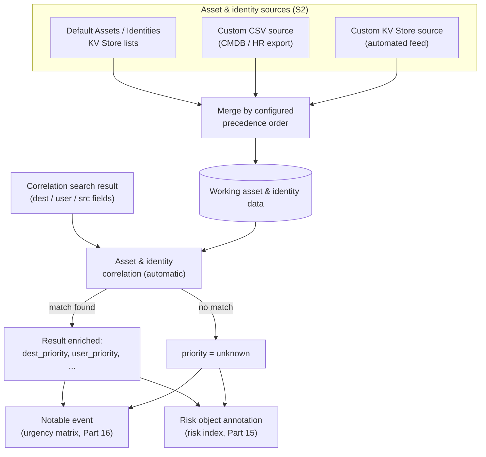

# Part 17 — Asset and Identity Correlation

## Why this part exists

**[CONCEPT]** A correlation search (Part 14) matches on raw or CIM-normalized fields — a hostname, an IP, a username — and neither the search nor the risk object (Part 15) it annotates knows, on its own, whether that hostname is a domain controller or a decommissioned test box, or whether that username belongs to a database administrator or a contractor whose access expired last quarter. The Asset and Identity framework is the Enterprise Security component that closes that gap: it maintains a maintained, queryable record of what an asset or identity actually *is* — its criticality, its owner, its business unit — and merges that context onto a notable event or a risk object at the point of enrichment, so that "a match happened" and "how much this match should matter" become two separate, separately-maintained facts rather than one search trying to encode both.

This part does not re-teach what a risk object or a risk score is — Part 15 owns that mechanism, and this part assumes the reader already knows a risk object is a user, a host, or an IP that accumulates score across matches. It does not re-teach how a notable event's urgency field is computed from a severity-by-priority matrix — Part 16 owns that computation in depth; this part's concern is narrower and sits one layer upstream: where the *priority* input to that matrix actually comes from, how it gets there, and what happens when the data feeding it is wrong. It does not re-teach the Common Information Model's field-naming contract either — Parts 5–7 own CIM in general, and §1 below states the one clause of connection this part needs from that material before moving past it. What this part owns: the Asset and Identity framework itself as a maintained data source (§1–§2), how its output actually reaches a notable event or risk object (§3), the expiration mechanics meant to keep it current (§4), the specific staleness failure mode this book's own Part 8 already named as the framework's job to prevent for *other* lookups — and that the framework itself is not immune to (§5) — and the hunting and management practices built on top of it (§6–§7).

---

## 1. What the framework actually is, and what CIM already promised

**[CONCEPT]** Splunk's Common Information Model defines a standard field set not only for events (Authentication, Network Traffic, and the rest of the data models Part 6 covers) but also for two non-event, lookup-backed entities: an **asset** (a host, device, or system) and an **identity** (a person or account). CIM's own documentation specifies the expected field names — `priority`, `category`, `bunit` (business unit), `owner` for an asset; `identity`, `priority`, `category`, `bunit`, `watchlist` for an identity — the same way it specifies `src`/`dest`/`action` for the Network Traffic data model. Parts 5–7 own that field-naming contract in general; what's specific to this part is that Enterprise Security ships a whole operational framework — configuration UI, storage, a merge process, and an automatic enrichment step — built specifically to populate and maintain lookup data that conforms to that contract. CIM says what the fields should be called. The Asset and Identity framework is the part of Enterprise Security that actually keeps a real, current table of those fields and attaches it to your data.

**[CONCEPT]** The distinction matters because it's easy to conflate "my asset/identity data is CIM-compliant" (a field-naming question, Part 7's territory) with "my asset/identity data is current" (a maintenance question, this part's territory). A lookup table with every CIM-standard column named correctly and populated with data from eighteen months ago is fully CIM-compliant and still wrong. Nothing about compliant field naming tells Enterprise Security, or the analyst reading a notable, whether the `priority` value in a given row still describes the host it's attached to.

**Table 17.1 — Core asset and identity fields.** Use this table to decide what a new asset or identity source actually needs to populate before it's useful to Enterprise Security; `priority` is the single field the rest of this part returns to most, because it's the one that reaches a notable's urgency computation (§3).

| Field | Framework | What It Captures | Typical Values |
|---|---|---|---|
| `ip`, `mac`, `dns`, `nt_host` | Asset | Identifiers Enterprise Security matches against a raw event's host-like fields | IP address, MAC address, DNS name, NetBIOS host name |
| `owner` | Asset | The person or team accountable for the asset | Free text, or a name matching an identity's `identity` field |
| `priority` | Asset, Identity | The criticality value that feeds a notable's urgency computation (Part 16) | `critical`, `high`, `medium`, `low`, `unknown` |
| `category` | Asset, Identity | A deployment-defined grouping label | Free text (`domain_controller`, `finance`, `contractor`) |
| `bunit` | Asset, Identity | The business unit the asset or identity belongs to | Free text, deployment-defined |
| `identity`, `nick` | Identity | Login IDs and aliases Enterprise Security matches against a raw event's user-like fields | Username, login alias |
| `email`, `phone` | Identity | Contact information surfaced to an analyst working a notable | Email address, phone number |
| `watchlist` | Identity | Flags a person Enterprise Security should treat as heightened-risk regardless of `priority` | Boolean |
| `startDate`, `endDate` | Identity | The validity window for the identity — used with the expiration settings in §4 | Date |

**[PLATFORM ENGINEER]** `priority`'s five values are worth naming precisely because `unknown` is not a placeholder for "not yet configured" — it is what Enterprise Security assigns to any raw event's host or user field that matches nothing in the merged asset or identity data at all. A host with genuinely no asset entry and a host with a stale, wrong asset entry produce two different failure shapes downstream: the first shows up as `unknown` priority, visibly under-contextualized; the second shows up as a confidently wrong `critical` or `low`, which looks like real, current context and isn't. §5 is built entirely around that second, more dangerous shape.

---

## 2. Assets and Identities — sources, the merge, and where the data actually lives

### `Assets` and `Identities` — the two default KV Store collections everything else merges into

**[PLATFORM ENGINEER]** Enterprise Security ships with two default, hand-editable lists — `Assets` and `Identities` — reachable from the app's own asset-and-identity management page, and backed by the same KV Store mechanism Part 8 §4 covers generally: a MongoDB-backed collection, edited a row at a time through the UI or the REST API rather than replaced wholesale the way a CSV lookup is. For a small environment, hand-maintaining these two lists directly — adding a row per critical server, per VIP identity — is a legitimate, if labor-intensive, way to run the framework. For anything past a handful of entries, an organization instead configures one or more **additional sources**: a CSV lookup exported from a CMDB or HR system, or a separate KV Store collection an external script keeps current, each mapped to the same standard field set named in Table 17.1. Enterprise Security merges every configured source — the two defaults plus however many additional ones are configured — into the working asset and identity data that correlation searches and notables actually draw on, resolving conflicts between sources (two sources disagreeing about one host's `priority`) according to a precedence order set on the same management page.

**Table 17.2 — Asset and identity source shapes.** Use this table the same way Part 8's Table 8.1 is used for a general-purpose lookup: match the update pattern a given feed actually has to the source shape built for it, rather than defaulting to whichever shape is most familiar.

| Source Shape | Update Pattern | Typical Feed | Expiration Available |
|---|---|---|---|
| Default `Assets`/`Identities` list | One row at a time, edited in the ES UI or via REST | A handful of manually tracked critical hosts or VIP identities | Configurable per source |
| Custom CSV lookup source | Whole-file replace | A scheduled CMDB or HR export dropped into the app's `lookups/` directory | Configurable per source |
| Custom KV Store source | Per-document create/update/delete via REST or SPL | An automated feed from a CMDB or identity-provider API kept continuously current | Configurable per source |

**[PLATFORM ENGINEER]** Every row in Table 17.2 is a maintained artifact in exactly the sense Part 8 §7 already argues for a general lookup table — a file or a collection with an owner, a review cadence, and a place in a version-controlled deployment pipeline, not a one-time import. Part 8's own Detection Autopsy (§3.1 of that part, "the scanner allowlist that outlived the scanner") names this framework specifically as the system that should already know when a host is decommissioned. §5 below is this part's answer to that forward reference — and the uncomfortable finding is that the framework knowing about a decommission and the framework's own source data actually reflecting it are still two different facts, exactly the way Part 8 draws that distinction for any other lookup.

> **Product Version Note**
> Risk-based alerting, the risk index, and the Asset and Identity framework covered in this part are
> all licensed under Enterprise Security's `Essentials` edition, not gated to `Premier` — the
> Premier-only capabilities are User and Entity Behavior Analytics (UEBA), Splunk SOAR integration,
> and "Automated Threat Analysis." As of 2026-09-15, verified against Splunk's own Enterprise
> Security product page (`REFERENCES.md` entry `[SPLUNK-ES-PRODUCT-PAGE]`; the same split Part 13 §2
> documents for Section E generally). What would make this stale: an edition restructure that moves
> asset/identity correlation behind a higher tier, or a rename of either edition — confirm this
> against the specific license an environment is running before assuming the framework is available
> by default.

---

## 3. From a raw field to `dest_priority`: how enrichment actually reaches a notable

**[DETECTION ENGINEER]** Once a source's data is merged (§2), Enterprise Security applies asset and identity correlation automatically to any CIM-aliased host or user field a correlation search's results carry — `src`, `dest`, `dvc`, `src_user`, `user`, and the other Network Traffic and Authentication data-model fields Parts 5–7 already establish. The mechanism adds a matching set of fields for each role a given field played in the match, prefixed by that field's own name: a result carrying `dest` gets `dest_priority`, `dest_category`, `dest_bunit`, and `dest_owner` if `dest` matched an asset entry; a result carrying `user` gets `user_priority`, `user_category`, `user_bunit`, and `user_watchlist` if `user` matched an identity entry. A single event with both a matched `dest` and a matched `user` field carries both prefix families at once, independently — a notable can be enriched with asset context, identity context, or both, depending on which of its own fields the underlying event actually populated.

```text
# CONCEPTUAL SAMPLE — illustrative field shape after asset/identity correlation runs against a
# result carrying dest and user; exact field availability depends on which sources (§2) actually
# have a matching entry, and this has not been validated against a live Enterprise Security
# instance (none exists in this book's evidence base).
dest=db-prod-07.internal
dest_priority=critical
dest_category=database
dest_bunit=finance
dest_owner=dba-team
user=svc_backup
user_priority=medium
user_category=service_account
user_watchlist=false
```

**[DETECTION ENGINEER]** The "Suspicious LSASS Memory Access - Non-Allowlisted Process" correlation search Part 14 §4 built around DET-26-01 gives a concrete case: its `action.risk.param._risk_object_1 = ComputerName` line makes `ComputerName` the risk object every match annotates. Once that same host's `ComputerName` value has a matching entry in the merged asset data, every notable and every risk-index event referencing it carries a `ComputerName`-derived priority alongside the risk score — a match against a host whose asset entry says `critical` reads differently to an analyst than the identical match against a host whose asset entry says `low`, even though DET-26-01's own SPL body and the correlation search's severity setting are unchanged between the two.

**[DETECTION ENGINEER]** That `priority` value is also one of the two inputs — the correlation search's own configured severity is the other — to the severity-by-priority matrix Enterprise Security uses to compute a notable's `urgency` field. Part 16 owns that matrix and the analyst-facing consequences of a given urgency value in depth; this part's point is narrower: `priority` is not a cosmetic annotation sitting next to a notable, it is a direct, load-bearing input into the single field most SOCs sort Incident Review by. Getting it wrong doesn't just mislabel a notable — it mis-sorts the analyst's own queue.






**Figure 17.1 — Asset and identity data from source to a notable's urgency input.** *CONCEPTUAL.* Illustrates the merge of configured sources into working asset and identity data, the automatic correlation step that enriches a correlation search's own result fields, and the two paths — a real match or a fallback to `unknown` — that reach a notable event and a risk object. This is a diagram of documented expected mechanics, not a capture from a live Enterprise Security instance; none exists in this book's evidence base (STYLE-GUIDE.md §9.2).

---

## 4. Expiration settings, and what they only partly solve

**[PLATFORM ENGINEER]** Each configured source (§2) can have an expiration window enabled — a duration after which an entry Enterprise Security hasn't seen refreshed in that source is dropped from the merged working data rather than retained indefinitely. This exists specifically to bound the risk Table 17.1's `startDate`/`endDate` fields hint at: an identity whose `endDate` has passed, or an asset entry a CMDB export stopped including because the underlying feed removed the row, ages out of the merged data instead of sitting there unchanged forever.

**[PLATFORM ENGINEER]** Expiration solves exactly one shape of staleness: an entry that stops being *present* in its source. It does nothing for an entry that stays present but goes *wrong* — a CMDB export that still lists a host, still refreshes on schedule, and still says `priority=critical`, because nobody edited that one field when the host's actual role changed. A row that keeps refreshing on time looks, from the expiration mechanism's point of view, exactly like current, correct data. It is current. It is not correct. That gap is §5's whole subject.

> **Engineering Reality**
> Expiration windows are configured per source, not globally, and a common mistake is assuming a
> short expiration on one custom CSV source protects the whole merged dataset — it doesn't touch the
> default `Assets`/`Identities` lists (§2) or any other configured source at all. An organization
> running a fast-refreshing CMDB feed alongside a hand-maintained default list of "known critical
> servers" someone typed in eighteen months ago and never revisited has two very different staleness
> profiles sitting in the same merged working data, and only one of them is protected by an
> expiration window at all.

---

## 5. The decommissioned-host failure mode: a wrong-priority alert, not a missing one

**[PLATFORM ENGINEER]** Consider a host decommissioned during an infrastructure refresh and its hostname and IP reassigned six weeks later to a new, genuinely low-value development box — the same reassignment pattern Part 8 §3.1's Detection Autopsy already walked through for a scanner-exclusion lookup. That lookup's failure mode was silence: a correlation search kept suppressing a host it should have stopped suppressing, and the notable that should have fired never did. The Asset and Identity framework's failure mode, when its own source data goes stale the same way, looks nothing like silence.

> **Blind Spot**
> If the old asset entry is simply removed once a host is decommissioned — the seemingly-safe,
> conservative cleanup step — the reassigned host's next genuine match falls back to `priority=unknown`
> (§1). That's a real degradation (a critical-looking match now sorts lower in Incident Review than it
> should), but it's at least a *visible* one: an analyst who knows to distrust an `unknown`-priority
> notable on a host they'd expect to have asset coverage has a signal to act on. The more common
> failure is the opposite: the old entry is never removed, never updated, and never expires, because
> no expiration window is configured on the source that carries it (§4) or because the entry was
> hand-typed into the default `Assets` list years ago and nobody's process for decommissioning a host
> ever touches that list at all.

> **False Positive Trap**
> A stale `critical`-priority asset entry attached to a now-low-value host doesn't stop a correlation
> search from matching, and it doesn't stop a notable from firing — DET-26-01, deployed as the
> correlation search Part 14 §4 built, still fires exactly when its own SPL logic says it should. What
> changes is the `priority` value merged onto that notable, and therefore its `urgency` (Part 16). A
> notable against the reassigned host gets sorted, worked, and possibly escalated as if it were still
> hitting the decommissioned critical production system it used to be — full analyst attention spent
> on a development box's alert, at exactly the priority a genuinely critical host's alert should have
> gotten instead. The reverse direction is just as real and harder to notice: a genuinely critical host
> stood up under a hostname or IP that an old, stale entry still marks `low` or `medium` gets
> systematically under-triaged, and nothing in Incident Review flags that the priority value driving
> that sort order is eighteen months out of date. Neither direction produces a missing alert an
> analyst would go looking for. Both produce a present, correctly-firing notable carrying the wrong
> weight — which an analyst has no reason to question unless they already suspect the asset data
> itself, not the detection, is the thing that's wrong.

**[DETECTION ENGINEER]** The fix mirrors Part 8 §3.1's own fix for the scanner allowlist, applied to whichever source (§2) actually carries the stale entry: tie asset-list maintenance to the same decommission and reassignment workflow that already exists for infrastructure change management, rather than treating "someone remembers to update Enterprise Security too" as a step with no owner and no trigger. Where the underlying source is a CMDB-fed CSV or KV Store feed, that often means confirming the CMDB's own decommission process actually removes or reclassifies the row — not just assuming an automated feed is current because it's automated — and, where the source is one of the hand-maintained default lists, assigning the same review-and-ownership discipline Part 8 §7 recommends for any manually maintained lookup, because a hand-typed `Assets` entry has exactly the same no-owner failure mode as a hand-typed CSV allowlist and none of the mechanical protections (expiration, an automated refresh) that a fed source at least has available to configure.

---

## 6. Threat hunter workflow: pivoting through asset and identity context

**[THREAT HUNTER]** Asset and identity data is as useful for deciding where to look next as it is for triaging what already fired. A hunter starting from a risk object (Part 15) with a moderate, sub-threshold accumulated score can pivot into that object's current asset or identity context — its `category`, its `bunit`, its `watchlist` flag — before deciding whether the object is worth escalating into an active hunt, the same way an analyst would use it to triage a notable, just earlier in the investigation and without a notable having fired yet.

> **Hunter's Note**
> A risk object's `watchlist` flag (identity) or an unusually specific `category` value (asset) is
> worth pivoting on directly, independent of accumulated score: a moderate-score risk object that
> also happens to be a `watchlist`-flagged identity, or an asset tagged `category=domain_controller`,
> is a stronger hunt candidate than the same score against an ordinary workstation or a non-watchlisted
> account — the framework's own enrichment fields are a legitimate prioritization signal for a hunt
> queue, not only for Incident Review's own urgency sort. The caveat is §5's own finding: pivot on
> asset/identity context as a *signal to look closer*, not as a substitute for confirming the
> underlying host or identity role directly when a hunt is about to consume real analyst time — the
> same staleness risk that produces a wrong-priority notable produces a wrong-priority hunt lead.

---

## 7. SOC management: keeping asset and identity data current

> **SOC Management View**
> The Asset and Identity framework's entire value proposition is that it turns "how important is
> this?" from a question every correlation search would otherwise have to answer for itself into a
> single, centrally maintained answer every correlation search and every notable inherits. That
> centralization is also what makes staleness expensive in a way it wouldn't be if criticality were
> scattered, redundantly, across individual detections: one stale asset entry doesn't just mis-sort
> one detection's output, it mis-sorts every correlation search's output that happens to touch that
> host or identity, silently, until someone corrects the one row responsible. Budget asset and
> identity data maintenance as a standing operational cost with a named owner and a review cadence —
> the same governance Part 8 §7 argues for a general lookup table, applied here to the single lookup
> dataset with the broadest blast radius in the whole Enterprise Security deployment — rather than a
> one-time onboarding task closed out when the framework was first configured.

**[SOC MANAGEMENT]** In practice, that ownership question usually lands on whichever team already owns the CMDB or identity-provider data a source (§2) is fed from, not the detection-engineering team that builds correlation searches — the asset/identity data's accuracy is a data-quality problem inherited from an upstream system of record, not a Splunk configuration problem Enterprise Security itself can solve. A SOC that treats a wrong-priority notable as a detection-engineering bug to fix in the correlation search is fixing the wrong layer; the correlation search matched correctly, and the fix belongs in whichever source's data was wrong, with a feedback path back to that source's own owner when a stale entry is found — not a one-off manual correction inside Enterprise Security that the next feed refresh silently overwrites anyway.

---

## Closing: where this hands off

**[CONCEPT]** Everything a correlation search (Part 14) or a risk-based alerting rule (Part 15) matches on is telemetry about an event. The Asset and Identity framework is the one piece of Enterprise Security whose entire job is telemetry about the *thing the event happened to* — and it inherits, in its own maintenance discipline, exactly the staleness risk Part 8 already named for lookup tables generally, at a scale where getting it wrong mis-prioritizes every notable and every risk object touching the affected host or identity, not just one detection's output. Part 16 picks this up from the analyst's side: what a wrong or stale `priority` value actually looks like inside Incident Review, and how an analyst working a notable can tell the difference between "this is genuinely low-urgency" and "this urgency value is wrong because the asset data behind it is stale" before that distinction costs triage time on the wrong alert.

**Cross-references:** DEH Part 26 (Splunk SPL) §5; this book's Parts 5–7 (the Common Information Model); Part 8 (Lookup Tables as Detection Infrastructure) §3.1, §4, §7; Part 13 (Enterprise Security Architecture, Editions, and the CIM Dependency) §2, §4; Part 14 (Correlation Searches) §4; Part 15 (Risk-Based Alerting); Part 16 (Notable Events and the Incident Review Workflow).
