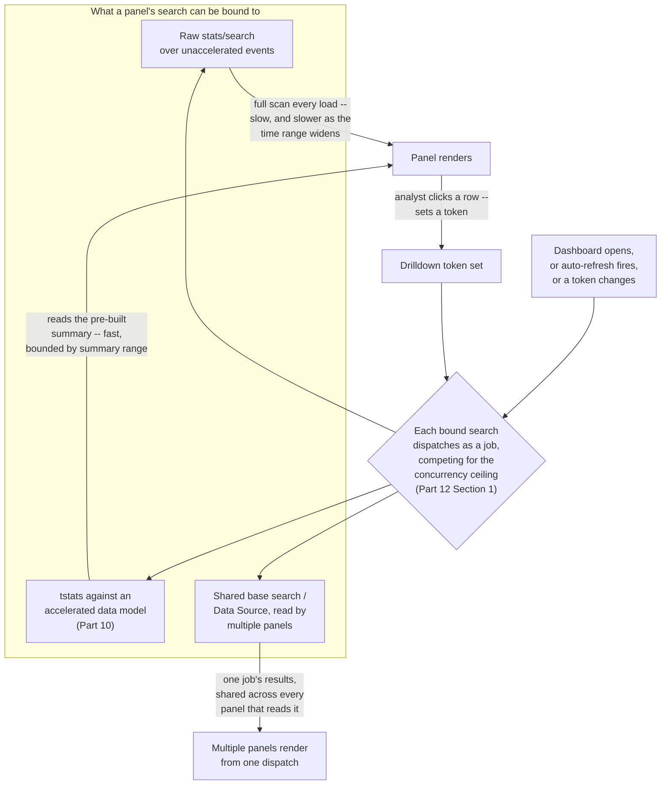

# Part 18 — Dashboards and Visualizations for Security Operations

## Why this part exists

Every part in Sections C through E of this book — lookups and macros (Parts 8–9), acceleration and performance (Parts 10–12), and Enterprise Security's correlation searches, risk scoring, notable events, and asset/identity enrichment (Parts 13–17) — ultimately produces something a person has to look at. A dashboard is the rendering layer sitting on top of all of it: a saved arrangement of panels, each panel bound to a search, each search paying the same concurrency and acceleration costs Parts 10 and 12 already cover, and each panel's visual design either helping or actively working against the SOC analyst trying to read it under time pressure. This part is operations layer, and it is deliberately narrower than it might sound: it covers the dashboard as a Splunk object — how a panel is actually built and bound to data, what a dashboard load actually costs the search head, and what design choices make a panel readable at a glance versus merely present — not the specific analyst-facing workflow of any one named dashboard. Part 16 already owns Incident Review, Enterprise Security's own notable-event triage dashboard, in depth; this part's panel-design guidance applies to Incident Review too, but Part 16 is where its urgency/severity fields and ownership workflow get taught. Part 19 owns the analyst's actual pivot path across several dashboards and views during an investigation; this part is where the container those pivots land on comes from.

This part does not teach SPL. Every panel in either dashboard technology this part covers is, underneath its visualization, an ordinary Splunk search — `stats`, `timechart`, `top`, whatever a panel's author chose — and DEH Part 26 already owns that syntax in full. Where a panel's search body matters below, this part states the one sentence of context needed and points to DEH Part 26 rather than re-deriving pipeline mechanics. This part also assumes Part 6's data model and Pivot coverage, Part 10's data model and report acceleration, and Part 12's search concurrency and scheduling mechanics as background it cites rather than repeats — a dashboard panel is, from the search head's point of view, just another search competing for the same finite resources Part 12 already named, and a slow or accelerated panel is the same mechanism Part 10 covers, applied to a visualization instead of an ad hoc query.

---

## 1. One dashboard shape, two technologies that produce it

**[CONCEPT]** Strip away the visual chrome and a Splunk dashboard is a small, specific thing: a saved view — a named knowledge object, stored and permissioned exactly the way a saved search, a macro (Part 9), or a lookup definition (Part 8) is stored, with the same private/app/global sharing model — that arranges one or more panels on a layout. Each panel pairs exactly two things: a search (inline SPL, a reference to a saved report, or a shared base search) and a visualization type (a table, a line chart, a single-value tile, a choropleth map) that renders that search's results. Some dashboards add input controls — a time-range picker, a dropdown populated from a lookup, a text field — that set tokens a panel's search can reference, turning a static view into something an analyst can filter without editing the underlying search.

That shape has been implemented by exactly two Splunk technologies, and this part's central practical job is naming both clearly enough that a reader can tell, from a dashboard's own source view, which one they're looking at before trying to edit it. **Simple XML** — also called Classic dashboards in Splunk's own current terminology — defines a dashboard as an XML document: a `<dashboard>` or `<form>` root element containing `<row>` and `<panel>` elements, each panel holding a visualization element (`<chart>`, `<table>`, `<single>`, and others) bound to a `<search>`. **Dashboard Studio** defines the same shape as a JSON document instead, edited primarily through a visual canvas builder rather than hand-written markup, with its own broader set of visualization types and two selectable layout modes — a freeform, pixel-positioned "Absolute" canvas and a responsive "Grid" canvas. Both are stored as the same kind of knowledge object, in the same part of an app's directory structure, subject to the same permission and promotion mechanics Part 9 already covers for macros; the difference that matters day to day is entirely in the source format, the editing surface, and the visualization/interaction feature set each one exposes — not in what a dashboard fundamentally is.

**Figure 18.1** traces what actually happens between a dashboard loading in a browser and a panel rendering, for both an unaccelerated and an accelerated panel search, and where a drilldown token re-triggers the cycle.






**Figure 18.1 — From dashboard load to rendered panel, and the drilldown loop.** *CONCEPTUAL.* Illustrates the expected dispatch path a panel's search follows on load, refresh, or drilldown, and where an unaccelerated versus accelerated search binding and a shared base search change that path's cost. This is a sketch of documented expected mechanism, not a capture from a live Splunk search head or Job Inspector — none exists in this book's evidence base (STYLE-GUIDE.md §9.2).

---

## 2. Simple XML and Dashboard Studio: what's actually different

**[PLATFORM ENGINEER]** The table below is the working reference for deciding which technology a given dashboard should use, or for orienting quickly inside one you didn't build. It is not exhaustive of either technology's feature surface — it names the dimensions that actually change how you'd build or troubleshoot a panel.

| Dimension | Simple XML (Classic) | Dashboard Studio |
|---|---|---|
| Definition format | XML view definition | JSON view definition |
| Primary editing surface | Drag-and-drop classic editor, or hand-edited XML source | Visual canvas builder (Absolute or Grid layout), or JSON source editor |
| Layout model | Fixed row-and-panel flow, top to bottom | Freeform "Absolute" canvas, or a responsive "Grid" canvas |
| Panel search binding | Inline `<search>`, a saved-report reference, or a shared base search read by later panels via `<search base="...">` post-process chaining | A named data source (`ds`) definition, bindable to one or more visualizations |
| Drilldown/token model | `<drilldown>` and `<change>` blocks setting tokens consumed by other panels' searches | An equivalent token/interaction model, configured through the visual builder rather than hand-written condition blocks |
| Migration path | Native format; no conversion needed | Splunk provides a Classic-to-Studio conversion path; not every classic panel or custom visualization converts cleanly |
| Support status | Fully supported; existing Classic dashboards continue to run unmodified | Positioned by Splunk as the current recommended surface for building new dashboards |

> **Product Version Note**
> Splunk has, over several recent major releases, positioned Dashboard Studio as the recommended
> experience for building *new* dashboards, while Classic (Simple XML) dashboards remain fully
> supported and continue to run without migration — this book could not verify, as of 2026-09-15,
> the exact release that made Dashboard Studio the default creation path in Splunk Web, or
> whether that default varies between Splunk Enterprise and Splunk Cloud Platform, against a
> reachable source: `docs.splunk.com` returned an HTTP 403 to this book's research tooling on
> every retrieval attempt made while drafting this part, and no product page or Splunkbase
> listing in `REFERENCES.md` covers dashboard-technology default behavior at this level of
> specificity. Treat "Dashboard Studio is the modern default, Classic is legacy-but-still-real"
> as directionally correct and treat any specific version number attached to that claim as
> unverified. What would make this stale: a further release narrowing or removing Classic
> dashboard creation from Splunk Web entirely, which Splunk has not done as of this writing but
> has not ruled out either — confirm against your installed version's own dashboard-creation menu
> before asserting which technology is the default for a specific environment.

**[PLATFORM ENGINEER]** The practical reading for a team maintaining an existing dashboard library: neither technology is going away on its own, and "which one is this dashboard" is the first question to answer before touching it, not an afterthought. A Classic dashboard's XML source is visible from its own edit menu; a Dashboard Studio dashboard's JSON source is visible the same way. Guessing wrong — editing a Classic dashboard's panel as though it exposed Dashboard Studio's data-source model, or vice versa — produces confusing, technology-specific error messages that read like a broken dashboard rather than a wrong assumption about which format it's written in.

---

## 3. Panel searches, base searches, and what one dashboard load actually costs

**[PLATFORM ENGINEER]** A dashboard with ten panels, each bound to its own independent search, dispatches ten separate search jobs the moment it loads — and dispatches ten more on every auto-refresh cycle, and ten more for every analyst who opens the same dashboard in a separate browser tab. Part 12 §1 already established that a search head enforces a finite concurrency ceiling on how many searches can run at once; a dashboard is not exempt from that ceiling just because its searches are short and its panels look lightweight individually. A "SOC overview" dashboard left open on a wallboard, auto-refreshing every thirty seconds, with ten independently-searched panels, is a standing, recurring claim on the same concurrency budget Part 12 covers for scheduled correlation searches — and it competes for the same slots.

**[PLATFORM ENGINEER]** Simple XML's long-standing answer to that multiplication problem is the **base search**: one panel's `<search>` is given an `id`, and subsequent panels reference it with `<search base="...">` plus a post-process SPL fragment, rather than each declaring an independent search from raw events. Splunk dispatches the base search once; every panel chained to it as a post-process search runs its own additional aggregation, but against the base search's already-returned result rows, not against a fresh scan of the underlying index. That collapses ten independent jobs into one expensive job plus several cheap ones, which is the single highest-leverage change available to a dashboard author before touching acceleration at all.

```xml
<!-- CONCEPTUAL SAMPLE -- illustrative Simple XML fragment, not captured from a
     running dashboard. Shows one base search feeding two panels via post-process. -->
<panel>
  <table>
    <search id="base_auth_failures">
      <query>index=windows sourcetype=WinEventLog:Security EventCode=4625
| stats count by user, dest</query>
      <earliest>-24h</earliest>
    </search>
  </table>
</panel>
<panel>
  <chart>
    <search base="base_auth_failures">
      <query>| stats sum(count) as failures by dest | sort - failures | head 10</query>
    </search>
  </chart>
</panel>
```

**[PLATFORM ENGINEER]** Post-process search has a real limitation worth knowing before relying on it for every panel in a dense dashboard: the SPL available to a post-process fragment is restricted relative to what the base search itself can run, and a post-process search operates against a capped subset of the base search's returned rows rather than its full underlying event population — this book's own research pass could not confirm the current default row-cap value against a reachable source, so check the relevant `limits.conf` stanza and your installed version's documentation directly before assuming a specific number, the same caution Part 10 §2.1 raises for `datamodels.conf`'s own undocumented-here defaults. Dashboard Studio's equivalent concept — a named data source referenced by more than one visualization — aims at the same problem from a different angle, sharing one dispatched job's results across every bound visualization; this book has not independently verified whether that sharing is implemented as the same kind of post-process chaining Classic dashboards use internally or as a different caching mechanism, and treats the practical outcome (fewer independent dispatches than one-search-per-panel) as the confirmed part, not the internal mechanism.

> **Engineering Reality**
> "The dashboard is slow" is almost never one problem. A dashboard with ten independently-searched
> panels can be slow because the search head is out of concurrency slots (Part 12 §1), because one
> specific panel's search is unfiltered and scanning far more raw data than it needs to (Part 12
> §4's Job Inspector guidance applies to a panel's search exactly the way it applies to any other
> search job), or because nobody chained the panels into a shared base search and every refresh
> multiplies a fixable one-search cost by the panel count. Check the Job Inspector for the specific
> slow panel's own job — not the dashboard as a whole — before assuming the fix is acceleration,
> a base search, or a smaller time range; each of those three fixes a different bottleneck.

---

## 4. Tokens and drilldowns: how one panel filters another

**[SOC ANALYST]** The interaction pattern that makes a dashboard more than a static report — click a row in one panel, and a second panel updates to show detail scoped to whatever was clicked — runs on tokens in both dashboard technologies. An input control (a dropdown, a time picker) or a drilldown action on a panel sets a named token to some value (a host, a user, a source IP); any other panel's search that references that token by name re-dispatches with that value substituted in, the moment the token changes. This is the mechanism behind the single most common SOC-dashboard layout: an overview panel showing many entities at once (top talkers, top failed-login users, top alerting hosts), with a detail panel below it that stays empty or shows an aggregate view until an analyst clicks one row in the overview, at which point the detail panel narrows to that one entity.

**[SOC ANALYST]** Part 17's asset and identity correlation is a natural token target: a drilldown from a notable-event-style overview panel into a token holding a specific host or user is exactly the pivot point where an analyst would next want that entity's asset criticality or identity context pulled in, whether that context arrives as a separate panel on the same dashboard or as a link into a dedicated asset-lookup view. Part 19 covers the fuller version of that pivot path across multiple views; this part's contribution is narrower — the token is the mechanism, and it's the same mechanism whether the next panel is a simple `stats` breakdown or a lookup-enriched detail view.

**[DETECTION ENGINEER]** Where a token's raw value needs transformation before a downstream panel's search can use it cleanly — stripping a domain suffix from a token holding a fully-qualified hostname, or building a wildcard pattern from a token holding a partial IP — that transformation is ordinary `eval`/`rex` work inside the receiving panel's search, and DEH Part 26 owns that syntax; this part's job is only to flag that the transformation happens in the panel's SPL, not in some token-specific syntax unique to dashboards.

---

## 5. Accelerated searches: what actually keeps a panel from timing out at scale

**[PLATFORM ENGINEER]** Part 10 covers data model and report acceleration as a general pre-computation strategy; a dashboard is one of the two workloads (alongside Enterprise Security's own correlation searches) that benefits from it the most directly, because a dashboard's whole reason to exist is being opened and refreshed repeatedly by more than one person. A panel built as a plain `stats` search over three months of raw authentication events re-scans that entire three months, from `_raw`, every single time anyone opens the dashboard or the auto-refresh interval elapses. The same panel rewritten as a `tstats` search against the accelerated `Authentication` data model (the CIM data model covering login/logoff events across log sources, introduced in Part 5 and structured in Part 6) reads a pre-built summary instead — the exact mechanism Part 10 §2 describes — and that speed difference compounds every time the same dashboard is opened again, by the same analyst or a different one, in a way a single ad hoc query's speed difference never does.

**[PLATFORM ENGINEER]** That compounding is the specific reason acceleration is a dashboard-design decision, not just a query-optimization afterthought: a correlation search runs on its own fixed schedule regardless of whether anyone's looking, but a dashboard panel's cost is paid once per view, and a popular SOC-overview dashboard left open on several analysts' second monitors all shift can rack up far more repeated executions of the same expensive raw scan than a correlation search running once every five minutes ever would. Before building a dashboard panel meant to be viewed constantly throughout a shift, check whether the data model it needs is already accelerated (Part 10 §2), and if it isn't, weigh that acceleration's storage and backfill cost (Part 10 §2.1) against the alternative — an expensive raw search, paid over and over, by every viewer, every refresh, indefinitely.

> **Blind Spot**
> Part 10 §4 names the summary-range blind spot: a `tstats` search against an accelerated data
> model returns silently incomplete results, with no error, for any time range extending past the
> model's configured summary coverage. On a dashboard, that failure mode has a specific, easy-to-miss
> shape: a trend panel with a time-range picker lets an analyst widen the window past the underlying
> data model's summary range with one click, and the panel simply renders a shorter, real trend that
> looks exactly as complete as a longer one would — a chart with six months of real, correctly-computed
> data looks the same as a chart that silently dropped everything before the summary range began. A
> dashboard is worse exposure for this blind spot than a one-off query, specifically because a
> dashboard's time-range picker invites exactly the widening that triggers it, repeatedly, from
> whichever analyst happens to be looking that day.

> **Detection Autopsy — the trend panel that quietly lost its own history**
>
> **The rule:** a SOC-overview dashboard's "failed authentication trend, last 12 months" panel,
> built as `tstats` against the accelerated `Authentication` data model, rendering a clean monthly
> line chart every time anyone opened the dashboard.
>
> **Why it shipped:** the panel was built and validated while the data model's
> `acceleration.earliest_time` was configured for a full year of coverage, and the chart's own
> visual output — a smooth twelve-month line — gave no indication of how far back the underlying
> summary actually reached; it looked the same whether the summary covered twelve months or three.
>
> **How it failed:** a platform-engineering change months later, made to cut acceleration storage
> cost (Part 10 §2.1's tradeoff, applied in the cost-cutting direction), shortened the data model's
> summary range to three months. Nobody updated the dashboard, because nothing about the dashboard
> referenced the summary range explicitly, and the panel kept rendering — now showing three months
> of real data as if it were still twelve, with the oldest nine months simply absent and no visual
> cue distinguishing "quiet quarter" from "never summarized."
>
> **The fix:** a standing convention that any panel whose usefulness depends on a specific summary
> range states that dependency next to the panel — in its title or description text, not buried in
> `datamodels.conf` — so a later acceleration-range change is caught by a dashboard-review step, not
> discovered by an analyst wondering why a trend that used to show a full year now looks unusually
> flat before month four. This is a documented failure pattern consistent with the summary-range
> mechanics Part 10 §4 already establishes, not a specific cited incident — no real Splunk deployment
> backs this account in this book's own evidence base (STYLE-GUIDE.md §9.2).

---

## 6. Panel-design patterns for SOC consumption

**[SOC ANALYST]** Not every SOC dashboard is built for the same kind of looking. A **wallboard** — a dashboard displayed on a shared monitor, glanced at from across a room, never clicked — needs a small number of high-contrast, immediately legible panels: single-value tiles with color thresholds (green/amber/red against a defined severity band), simple trend lines, nothing that requires reading a table's fine print from six feet away. An **investigative dashboard** — one an analyst opens, sits with, and interacts with during active triage — can and should carry more density, more tables, and more drilldown-driven detail panels, because the reading pattern is close-up and deliberate rather than a passing glance. Building one dashboard trying to serve both purposes at once routinely serves neither: a wallboard cluttered with detail tables nobody at a distance can read, or an investigative dashboard stripped down to wallboard-style single-value tiles that force an analyst into raw search for anything specific.

| Dimension | Wallboard (passive viewing) | Investigative dashboard (analyst-driven) |
|---|---|---|
| Panel density | Low — a handful of large, high-contrast panels | Higher — tables and detail panels an analyst reads up close |
| Interactivity | None assumed; no drilldowns designed to be clicked | Token-driven drilldowns (§4) as the primary navigation pattern |
| Refresh behavior | Short auto-refresh interval, but real-time search avoided per Part 12 §7's sustained-cost warning | Refreshed on demand or on a longer interval; real-time reserved for genuinely time-critical panels only |
| Visualization choice | Single-value tiles with color thresholds, simple trend lines | Tables, multi-series charts, and Trellis-split panels breaking one chart into a grid of per-entity small multiples |
| Primary failure mode if misdesigned | Panels nobody can read from a distance; color thresholds set arbitrarily rather than against a defined severity band | Overview panels with no drilldown path, forcing analysts into raw search for routine detail lookups |

**[SOC ANALYST]** The color-threshold row deserves one specific caution: a single-value tile's red/amber/green boundary is a claim about what "bad" means for that specific metric, and setting it without reference to an actual severity definition — copying a default threshold, or picking round numbers that felt reasonable when the panel was built — produces a wallboard that looks alarming or looks calm for reasons that have nothing to do with the SOC's actual risk tolerance. Tie a threshold to something Part 16 already defines (a notable's urgency/severity banding) or to a documented SOC-specific baseline, not to whatever number made the panel look right in a screenshot during a demo.

**[PLATFORM ENGINEER]** Trellis layout — splitting one visualization into a grid of smaller multiples, one per value of a chosen split-by field, instead of overlaying every series on a single chart — is a long-standing Splunk visualization option well suited to exactly the "one panel per host" or "one panel per analyst queue" pattern an investigative dashboard often wants, without hand-building a separate panel and separate search for every entity. This book has not verified Trellis's current feature parity between Simple XML and Dashboard Studio in detail; treat it as available in some form in both, and confirm the specific configuration surface against whichever technology a given dashboard uses (§2 above) before assuming identical behavior across the two.

---

## 7. SOC Management View: dashboard sprawl as an unbudgeted cost

> **SOC Management View**
> A correlation search's cost is visible in one place — its own `savedsearches.conf` schedule,
> auditable and countable (Part 14). A dashboard's cost is not visible the same way, because it
> isn't paid on a schedule; it's paid every time someone opens a browser tab, and Splunk does not
> hand a SOC manager a single report titled "how many dashboard tabs are open right now, and what
> are they costing the search head." A SOC that has carefully tuned its correlation-search
> concurrency budget (Part 12 §1) can still watch that same budget erode from an unrelated
> direction — a popular, unaccelerated, frequently-refreshed dashboard that a dozen analysts each
> keep open all shift, none of whom individually did anything wrong. Budgeting for dashboards means
> budgeting for a workload with no fixed schedule and no simple headcount, which is a genuinely
> harder planning problem than budgeting for a content library of scheduled searches — treat "how
> many dashboards do we have, and which ones are accelerated versus raw" as a standing inventory
> question, not a one-time build decision, the same discipline Part 4 already asks for around
> ingest and licensing generally.

**[SOC MANAGEMENT]** The practical lever available here is the same one named throughout this part: acceleration (§5) turns a dashboard's per-view cost from "pays for a raw scan every time" into "reads a bounded, shared summary," and a base search or shared data source (§3) turns a ten-panel dashboard's per-view cost from ten dispatches into one expensive dispatch plus several cheap ones. Neither fix is free — acceleration costs storage and backfill time (Part 10 §2.1), and a shared base search constrains what a chained panel's SPL can do (§3) — but both are cheaper, in the long run, than discovering a dashboard-driven concurrency problem the same way a skipped correlation search is usually discovered: after the fact, during an investigation into why something that should have been visible wasn't.

---

## 8. Dashboards as maintained knowledge objects

**[PLATFORM ENGINEER]** A dashboard is a knowledge object with the same permission model Part 9 describes for macros and Part 8 describes for lookups: an owner, a sharing level (private to that user, shared across one app, or shared globally across the instance), and the same promotion-across-environments question every other piece of detection or reporting content faces — a dashboard built and tested in a development search head has to be deliberately migrated to production, not assumed to appear there automatically because it works locally. Treat a dashboard the way Part 14 treats a correlation search: something with a lifecycle, not a one-time build.

**[PLATFORM ENGINEER]** The drift risk that follows is the same shape Part 9 already names for macro sprawl, applied to panels instead of shared logic: a dashboard panel referencing a saved report, a macro, or a lookup by name has no built-in mechanism that warns its owner when that referenced object is renamed, re-scoped, or deleted elsewhere. The panel doesn't error loudly — it returns an empty result or a Splunk error message an analyst reads as "the dashboard is broken today" rather than "someone renamed a macro three panels' worth of dependencies away, and this dashboard was never checked." A dashboard library of any real size benefits from the same discipline Part 9 recommends for macros: know what depends on what, and review dependent dashboards before renaming or removing a shared object out from under them.

---

## 9. What this part hasn't verified

> **What Would Change My Mind**
> This part's central technology-comparison claim — that Dashboard Studio is positioned as the
> current recommended path for new dashboards while Classic dashboards remain fully supported —
> is stated with real confidence, because it's consistent with the general direction Splunk's own
> product messaging has taken across recent releases. The specific version boundary, the exact
> feature-parity gaps between the two technologies (Trellis behavior, post-process versus
> data-source result-sharing internals, §3 and §6 above), and the actual concurrency and Job
> Inspector cost difference a real accelerated versus unaccelerated dashboard panel produces under
> real analyst load are all claims this part could not verify against a reachable, current source
> during drafting, and all rest on documented mechanism rather than a measured result — no Splunk
> deployment exists in this book's evidence base (STYLE-GUIDE.md §9.2). A real Splunk instance,
> with a real dashboard library, observed through its own Job Inspector and Monitoring Console
> under real multi-analyst viewing load over a real shift, is the specific missing evidence that
> would move this part's cost claims from "documented mechanism, reasoned through" to "measured and
> confirmed" — and it's exactly the kind of observation Part 20 names as outstanding across this
> book as a whole.

---

**Cross-references:** DEH Part 26 (Splunk SPL — panel search syntax this part assumes rather than re-teaches) · Part 5–6 (the Common Information Model and data models — the `Authentication` data model used in §5's example) · Part 8–9 (lookup tables and macros — the knowledge-object permission and drift model §8 extends to dashboards) · Part 10 (data model and report acceleration — the mechanism behind §5's panel-speed argument and the summary-range blind spot in §5's Detection Autopsy) · Part 12 (search performance and tuning at scale — the concurrency ceiling, Job Inspector, and real-time search cost §3, §6, and §7 all lean on directly) · Part 14 (correlation searches — the content-lifecycle discipline §8 mirrors for dashboards) · Part 16 (notable events and Incident Review — the flagship ES dashboard this part's panel-design guidance applies to without re-teaching its triage workflow) · Part 17 (asset and identity correlation — a natural drilldown target from §4's token mechanism) · Part 19 (Splunk-specific investigation workflows — the fuller multi-view pivot path this part's single-dashboard scope feeds into) · Part 20 (validation gaps and the path to real evidence).
