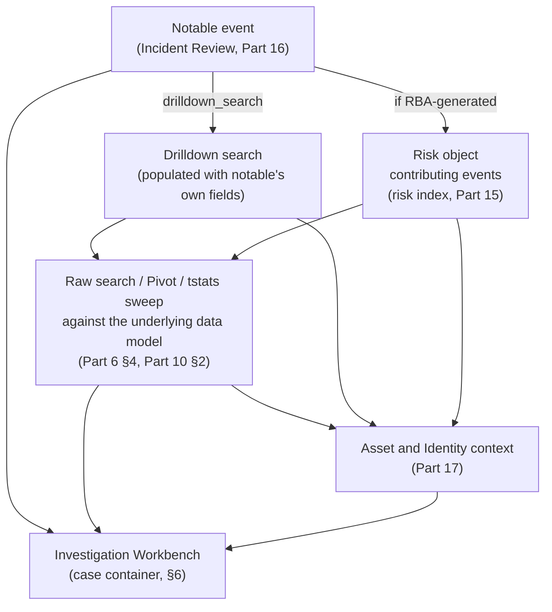

# Part 19 — Splunk-Specific Investigation Workflows

## Why this part exists

**[CONCEPT]** Parts 14 through 17 each built one piece of Enterprise Security's investigation surface in isolation: how a correlation search turns a match into a notable or a risk-score contribution (Part 14), how risk-based alerting accumulates score against a risk object instead of firing one notable per match (Part 15), how an analyst works a notable inside Incident Review (Part 16), and how the Asset and Identity framework enriches that notable with host and user context (Part 17). None of those parts followed the actual path an analyst's mouse and keyboard take once a notable lands in their queue. This part follows that path — from the notable itself, into a risk object's contributing events if the notable is risk-based, out into a raw search against the underlying data model, sideways into asset and identity context, and, where the investigation grows past one notable, into a case container that holds all of it together. Nothing here is a new mechanism; everything here already exists in Parts 14–17. This part's contribution is the sequence, and the specific points in that sequence where Splunk's own tooling has renamed or relocated itself across recent Enterprise Security releases — a risk Part 13 §6 named in advance and handed forward to here.

This part does not re-teach SPL syntax (DEH Part 26 owns that), does not re-derive how a correlation search's adaptive response actions are configured (Part 14), does not re-explain risk-score accumulation mechanics (Part 15), and does not re-teach the Asset and Identity framework's own enrichment logic (Part 17) — each gets a one-clause pointer where the pivot path touches it. What follows assumes DET-26-01, deployed as the "Suspicious LSASS Memory Access - Non-Allowlisted Process" correlation search built in Part 14 §4, as the running example throughout, the same way Part 14 assumed DEH Part 23's DET-23-01 and DEH Part 26's DET-26-01 without renumbering either.

---

## 1. The pivot path, end to end

**[SOC ANALYST]** An analyst who opens a notable in Incident Review (the analyst-facing dashboard for working notable events, introduced in Part 16) is looking at one row: a title, an urgency and severity, an owner and status field, and a handful of fields the correlation search's own results carried into the notable. Everything past that row is a pivot — a deliberate action that leaves the notable and goes looking at something else the notable points to. Five pivots recur often enough across a real Enterprise Security deployment to name as a single path, even though not every investigation uses all five and a traditional per-event notable skips the second one entirely:

1. **Notable → drilldown search.** The analyst runs the search the correlation search's own author built for exactly this notable, populated with this notable's own field values (§2).
2. **Notable → contributing events**, if and only if the notable was generated by risk-based alerting rather than a traditional per-match correlation search — the analyst needs to see which of the risk object's several contributing events actually crossed the threshold, not just the aggregate score (§3).
3. **Drilldown or contributing-events result → raw search against the underlying data model**, when the notable's own fields aren't enough and the analyst needs to see everything else the same host, user, or process touched, via Pivot, ad hoc SPL, or a `tstats` sweep against an accelerated data model (§4).
4. **Any of the above → asset and identity context**, pulling in the host's criticality rating or the user's department and manager from the Asset and Identity framework (§5, Part 17's subject in depth).
5. **The whole investigation → a case container**, once more than one notable, more than one analyst, or more than one shift is involved and the investigation has outgrown a single Incident Review row (§6).






**Figure 19.1 — The Enterprise Security investigation pivot path.** *CONCEPTUAL.* Illustrates the sequence of pivots an analyst or threat hunter follows outward from a single notable event, through its drilldown search or risk-object contributing events, into raw search against the underlying CIM data model, sideways into asset and identity context, and — where the investigation spans more than one notable — into a case container. This is a structural diagram of documented expected navigation, not a capture from a live Enterprise Security instance; no such instance exists in this book's evidence base (see STYLE-GUIDE.md §9.2).

**[THREAT HUNTER]** The same five pivots run in reverse for a threat hunter who starts from a hypothesis instead of a notable — Pivot or an ad hoc `tstats` sweep first, a candidate notable-worthy pattern second, asset and identity context to decide whether it's worth escalating third. §4 covers that direction explicitly; the path itself doesn't change shape depending on which end you start from.

---

## 2. From a notable to its own drilldown search

### action.notable.param.drilldown_search — the analyst's first click

**[SOC ANALYST]** Every notable in Incident Review carries a drilldown link, and what that link actually runs depends entirely on whether the correlation search that generated the notable defined one. Part 14 §4.1 already showed the concrete case: the "Suspicious LSASS Memory Access - Non-Allowlisted Process" correlation search's stanza sets `action.notable.param.drilldown_search` to a query that substitutes the notable's own `ComputerName` and `SourceImage` field values in place of the token syntax (`$ComputerName$`, `$SourceImage$`) the stanza defines them with. Clicking that notable's drilldown in Incident Review dispatches exactly that search, with those two tokens filled in from the specific notable's own fields — not a generic re-run of the correlation search's full query, and not a search the analyst has to write by hand.

**[SOC ANALYST]** When a correlation search's author never sets `action.notable.param.drilldown_search`, Enterprise Security falls back to a default drilldown built from the notable's own indexed fields and the correlation search's original time range — usable, but generic, and it re-runs the correlation search's full query rather than a query an analyst actually wants at triage time (which is almost always narrower: this host, this process, not every host the correlation search ever matches). A correlation search with no custom drilldown is not broken; it just hands the analyst a blunter first pivot than one that was deliberately authored, which is why Part 14 §4.1's example sets one explicitly rather than relying on the default.

> **Hunter's Note**
> A drilldown search is scoped to convince an analyst the notable is real, not to bound the investigation. If the LSASS-access notable's drilldown comes back confirming the match, don't stop at the drilldown's own time window — widen `dispatch.earliest_time` well past the notable's own and check whether the same `SourceImage` touched any other `ComputerName` in that window before you close it as a single-host event. The drilldown search answers "did this notable's own claim actually happen"; it was never scoped to answer "is this contained to one host," and treating a confirmed drilldown as proof of scope is the single most common way a real lateral-movement pattern gets missed at the first pivot.

**[PLATFORM ENGINEER]** Mechanically, the drilldown search dispatches as an ordinary ad hoc search against whatever indexes and sourcetypes its own SPL names — it consumes a search-slot the same way any other search does (Part 12's concurrency-limit content applies to it identically), and it is not itself accelerated or otherwise privileged just because a notable launched it. A drilldown search written against raw `index=windows` data, rather than against the accelerated data model the correlation search itself queried, pays the same non-accelerated search cost Part 10 covers for any raw search over a wide time range — worth remembering before widening a drilldown's time range across a busy index and being surprised at how long it takes to return.

---

## 3. Contributing events: pivoting from a risk object to what actually fired

**[DETECTION ENGINEER]** A traditional, notable-generating correlation search's notable is self-contained: the fields on the notable are the fields the search's own matching result row carried, and there is nothing further to look up to know what fired. A risk-based notable is different in a way Part 15 covers in depth and this section only needs the consequence of: the notable exists because a risk object's *accumulated* score crossed a threshold, and that accumulation is the sum of however many separate risk-index events — each written by whatever correlation search actually matched — landed against that risk object inside the accumulation window. The notable itself typically carries the risk object's identity and its total score, not the individual matches behind it. Finding out what actually fired is a second pivot, not something already sitting on the notable.

**[SOC ANALYST]** That second pivot is a search against the `risk` index (the Enterprise Security index every risk-scoring adaptive response action writes to, introduced in Part 13 §4 and covered as a retained dataset in its own right in Part 15), filtered to the specific risk object named on the notable and a time window that covers the accumulation period the risk-based correlation search actually used — not an arbitrarily wide window, for the reason the Blind Spot box below names.

```spl
index=risk risk_object="WIN-DB01" earliest=-24h
| stats count, values(source) as contributing_searches, sum(risk_score) as total_risk_score
    by risk_object, risk_object_type
```

This query targets the same `risk` index Enterprise Security's own Risk Analysis dashboard reads from; its limitation is that a raw `index=risk` search over a wide window pays the unaccelerated search cost Part 10 §2 covers, where the dashboard's own panels are more likely built against an accelerated summary for exactly that reason — treat this query as the ad hoc, investigation-time version of what a dashboard panel does at scale, not a replacement for one.

> **Blind Spot**
> A risk object accumulates score continuously, not only inside the specific window that happened to cross the threshold this particular time. Searching `index=risk` over a window wider than the accumulation period a risk-based correlation search actually used pulls in risk events from correlation searches that never contributed to *this* threshold crossing — a risk object that crossed its threshold on Tuesday from three specific matches can show a dozen unrelated risk events from the preceding week in a loosely-windowed search, and an analyst who reads all dozen as "contributing" to Tuesday's notable is misattributing cause to events the actual RBA correlation search's own window never counted. Confirm the accumulation window a given risk-based correlation search actually uses (Part 15's subject) before treating every risk-index hit in a convenient time range as evidence behind the specific notable in front of you.

**[THREAT HUNTER]** The same `index=risk` search is a hunting entry point independent of any notable: a risk object with a rising score that hasn't yet crossed its threshold is, by construction, not a notable yet — searching `index=risk` directly for a specific host or user ahead of any notable existing is the only way to see that accumulation building, and it's the risk-based-alerting-specific version of the general principle that waiting for the alert is not the same discipline as hunting for the pattern the alert is built to eventually catch.

---

## 4. From a data model to raw search: Pivot, ad hoc SPL, and a tstats sweep

**[THREAT HUNTER]** Once a drilldown or a contributing-events search confirms a notable is worth pursuing further, the next pivot leaves both the notable and the risk index behind and goes straight at the underlying CIM data model (Part 6) the correlation search itself queried — the Authentication data model, the Endpoint data model, or whichever data model the analytic's own field selection targets. This part does not re-teach how a data model is structured or how Pivot builds a query against one; Part 6 §4 owns Pivot's own building blocks, and Part 10 §2 owns the `tstats` command that reads an accelerated data model's `tsidx` summary directly rather than touching raw events. What this section adds is only the investigation-specific framing: which of the three query paths — Pivot, ad hoc SPL against the raw data, or a `tstats` sweep against the accelerated summary — fits an analyst mid-investigation, and why the answer usually isn't the same one that fits the correlation search itself.

| Query path | Fits when | Cost profile | Owning part |
|---|---|---|---|
| Pivot against the data model | Analyst doesn't write SPL directly, or needs a fast visual sweep across a dataset's own fields | Same cost as the SPL Pivot generates underneath — no shortcut, just a UI over it | Part 6 §4 |
| Ad hoc SPL against raw indexed data | The field the analyst needs isn't in the data model yet, or the investigation needs `_raw` itself | Unaccelerated; scales with the raw event volume in the searched window | DEH Part 26 (syntax); Part 10 §2 (cost vs. acceleration) |
| `tstats` against an accelerated data model | The data model is already accelerated and the investigation only needs the model's own summarized fields, not `_raw` | Reads the `tsidx` summary directly; far cheaper than raw search over the same window, bounded by the summary's own range (Part 10 §4) | Part 10 §2, §4 |

**[THREAT HUNTER]** The table above is the decision this section supports: an analyst confirming a single notable's own claim usually reaches for Pivot or a narrow ad hoc search, because the investigation is bounded and the field it needs is already on the notable. A hunter sweeping the same data model across every host for the same pattern, with no single notable bounding the search, reaches for `tstats` instead — the same data, at the scale where the raw-search cost difference actually matters. Both are the same underlying data model; only the query path and the scope of the question change.

> **Detection Test**
> This book has no live Enterprise Security deployment to run the check below against — it states what to run against your own instance, not a result already observed here.
> **Setup:** The "Suspicious LSASS Memory Access - Non-Allowlisted Process" correlation search (Part 14 §4) deployed, with its target sourcetype tagged into whichever CIM data model your own Endpoint or Authentication mapping uses for process-access events.
> **Action:** From a confirmed notable, run a `tstats` sweep against that same accelerated data model for the same `SourceImage` across every `ComputerName` in the summary's range, rather than the single host the notable named.
> **Expected result:** A result count and field shape consistent with what the Job Inspector reports for a `tstats`-backed search against that data model — materially faster than the equivalent raw search over the same window — and, if the same `SourceImage` shows up against a second host the original notable never named, evidence the investigation's scope was wider than one notable suggested. If the sweep takes as long as a raw search, the data model likely isn't actually accelerated for the range being searched; check Part 10 §4's summary-range guidance before assuming the sweep itself is broken.

---

## 5. Asset and identity context along the way

**[SOC ANALYST]** Every pivot above eventually needs an answer to a question none of the data model's own fields carry: how much does this host or user matter, and who owns it. That's the Asset and Identity framework's job, covered in depth in Part 17 — this section names only where it enters the pivot path, not how its own enrichment lookups are built or maintained. In Incident Review itself, a notable's host and user fields typically carry an inline asset/identity context panel already populated from the framework's own lookups (asset criticality, category, and owner for a host; department, manager, and title for a user) without a separate search — the enrichment already happened at notable-creation time, via the same correlation-search machinery Part 17 covers. The pivot an analyst actually performs is usually a *verification* pivot: confirming the inline criticality rating is still current, not running a fresh lookup from scratch, because Part 17's own Blind Spot content covers exactly how that inline rating goes stale (a decommissioned host that never left the asset lookup, reassigned and carrying an old, wrong criticality rating into every notable that touches it afterward).

**[SOC ANALYST]** The practical consequence for this part's pivot path: asset and identity context is available earliest, not latest, in the sequence Figure 19.1 draws — it's already sitting on the notable before the analyst clicks anything, which is exactly why it's easy to skip verifying it and treat an inline criticality badge as settled fact rather than a lookup value with its own staleness risk. Part 17 owns the fix (a review cadence for the underlying asset/identity lookup data); this part's job is only to flag that "asset context is already there" and "asset context is current" are two different claims, and the pivot path above never actually forces an analyst to check the second one unless they deliberately do.

---

## 6. Building a case around more than one notable

### Investigation Workbench — building a timeline and artifact set around a notable

**[SOC ANALYST]** Once an investigation spans more than one notable — the LSASS-access notable plus a second notable from a different correlation search against the same host, discovered via the `tstats` sweep in §4 — Incident Review's own row-per-notable view stops being the right unit of work. Enterprise Security has, across a long span of releases, shipped a case-management surface, commonly referred to by its documented name Investigation Workbench, for exactly this situation: a container an analyst builds around a set of notables and other artifacts (raw search results, external indicators, free-text notes) with its own timeline of analyst actions, its own status and collaborator assignment, and its own boundary distinct from any single notable's own status field in Incident Review.

> **Product Version Note**
> Enterprise Security has documented a dedicated case-management surface under the name Investigation Workbench across multiple past releases, supporting notable/artifact aggregation, a timeline view, and collaborator assignment on a container broader than one notable. This book's own research for this part could not freshly verify Investigation Workbench's current name or feature scope against a reachable source as of 2026-09-15: Splunk's own documentation domain (`docs.splunk.com`) was not reliably fetchable by this book's research tooling, per STYLE-GUIDE.md §9.4's disclosed fallback policy, and neither the current Enterprise Security product page nor the Enterprise Security Splunkbase listing — both retrieved successfully on 2026-09-15 — name Investigation Workbench, Incident Review, or Mission Control anywhere in their own marketing copy (REFERENCES.md entries [SPLUNK-ES-PRODUCT-PAGE], [ES-SPLUNKBASE]); those two pages instead foreground Detection Studio, an "AI Assistant," risk-based alerting, SOAR, and UEBA as the current headline capabilities. That silence is evidence about what Splunk is marketing right now, not evidence that Investigation Workbench has been renamed or removed — treat the feature's continued existence as likely given its long documentation history, but confirm its current name and location against your own installed ES version's own in-product help before writing an internal runbook that names it.

**[SOC ANALYST]** Artifacts added to an investigation — a captured asset-criticality value, a specific search result, a note pasted from a raw event — are a snapshot at the moment they were added, not a live query. The same staleness risk Part 17 names for an inline asset/identity badge in Incident Review (§5 above) applies again here, one layer further removed: a criticality rating pinned into an investigation's artifact list six weeks ago doesn't update itself when the underlying asset lookup changes, and a closed-then-reopened investigation can end up presenting an analyst with a stale snapshot next to fields elsewhere in the same UI that have since moved on. Treat an investigation's own artifacts as a dated record of what was true when captured, not a live view — the same discipline Part 8 asks of any maintained lookup, applied to a case file instead of a CSV.

---

## 7. The investigation surface's own naming churn

**[SOC MANAGEMENT]** Part 13 §6 named this theme in advance from the correlation-search-authoring side: whatever a given release calls the surface for building a correlation search, the underlying `savedsearches.conf` stanza it produces is unchanged. The investigation side of the same theme matters more in practice, because an analyst's actual workflow — which menu item to click, which surface a screenshot in last year's training material still points at — is far more sensitive to a renamed or relocated UI feature than a detection engineer's `.conf`-level view of the object underneath it. Two confirmed data points from this book's own research anchor that claim rather than leaving it as an assertion:

- Splunk's Enterprise Security product page and Splunkbase listing, both retrieved 2026-09-15, market "AI Assistant" as delivering "instant, tailored investigation guidance, simplified query creation, clear summaries, and automated reports" (REFERENCES.md entry [SPLUNK-ES-PRODUCT-PAGE]) — a capability squarely inside this part's own subject (query creation and investigation guidance) branded and marketed as new, sitting alongside, not replacing, the investigation surfaces this part describes.
- The same two pages name Detection Studio, AI Assistant, risk-based alerting, SOAR, and UEBA as the product's headline capabilities and do not mention Incident Review, Investigation Workbench, or a previously-marketed unified case-management surface once branded Mission Control anywhere in their current copy.

> **Product Version Note**
> Splunk has marketed an "AI Assistant" for Enterprise Security offering investigation guidance, query-building assistance, and automated summarization, positioned by Splunk's own product materials as available across both current editions (Essentials and Premier — see Part 13 §2's edition table). As of 2026-09-15, verified against Splunk's own Enterprise Security product page and Splunkbase listing (REFERENCES.md entries [SPLUNK-ES-PRODUCT-PAGE], [ES-SPLUNKBASE]). What would make this stale: an edition-gating change moving the AI Assistant behind Premier specifically, a rename, or a scope change from "guidance and summarization" to something Splunk markets as replacing rather than assisting the pivot path this part describes — none of which this book's evidence base can currently rule in or out for a future release.

**[SOC MANAGEMENT]** The staffing consequence is direct: a SOC that trains analysts once, against one release's menu layout and feature names, and never revisits that training is the specific failure mode this naming churn creates, independent of whether the underlying pivot path in Figure 19.1 has actually changed shape. Budget investigation-workflow training as a recurring cost tied to Enterprise Security's own upgrade cadence, not a one-time onboarding task — the mechanics in §1 through §6 above are stable across the churn; the menu labels and screenshots pointing analysts at them are not, and a training deck two major releases out of date is a real, if minor, source of the same kind of friction Part 12 names for a search-concurrency bottleneck: not a failure, just a cost nobody scheduled.

---

## 8. SOC management view: measuring pivot friction, not just notable volume

> **SOC Management View**
> Every metric this book has named so far for Enterprise Security's own health — notable volume (Part 15), search concurrency (Part 12), CIM coverage (Parts 5–7) — measures the platform. None of them measure how long an analyst actually spends moving through the pivot path this part describes before reaching a disposition. Mean-time-to-triage figures that only start the clock at notable creation and stop it at status change miss every minute spent in a drilldown search, a contributing-events lookup, a `tstats` sweep, or an Investigation Workbench artifact review in between — and a SOC that only ever tunes correlation-search thresholds to manage analyst load is optimizing the input side of a process whose actual bottleneck, on plenty of real deployments, is the pivot path itself: how many clicks and separate searches it takes to go from "notable exists" to "disposition made." Instrumenting the pivot path's own friction — even something as coarse as counting how many separate searches an analyst runs per closed notable — is the specific, checkable measurement most SOC-management notable-volume metrics never capture.

**[SOC MANAGEMENT]** The practical lever available here doesn't require new tooling: Splunk's own audit logging already records every search an analyst dispatches, so "searches run per closed notable" is a query against data the platform is already collecting, not a new instrumentation project. Baseline it before, not after, a release that renames or relocates the investigation surfaces in §7 — a friction count taken against one release's menu layout doesn't compare cleanly to one taken after the surfaces analysts click through have moved, and treating the two counts as directly comparable without checking §7's naming churn first risks reading a UI change as a training win or a training failure it isn't.

---

## Closing: where this hands off

**[CONCEPT]** This part traced one path through machinery Parts 14–17 each built independently: a notable's drilldown search, a risk object's contributing events, a raw or accelerated sweep against the data model underneath, asset and identity context riding along for most of it, and a case container once the investigation outgrows one notable. None of the five pivots in Figure 19.1 is new; what's new here is naming them as one sequence and flagging, honestly, where this book could and couldn't verify the current name of the surface an analyst actually clicks through to run each one. Part 20 closes the book by taking that same honesty inventory — what's verified, what's conceptual, what a real Enterprise Security deployment would be needed to confirm — across every part in this book at once, this part's Investigation Workbench and Mission Control uncertainty included.

**Cross-references:** DEH Part 26 (Splunk SPL); this book's Part 6 §4 (Pivot), Part 8 (Lookup Tables as Detection Infrastructure), Part 10 §2/§4 (`tstats` and the summary-range blind spot), Part 12 (Search Performance and Tuning at Scale), Part 13 §4/§6 (Enterprise Security Architecture and the naming-churn theme), Part 14 §4 (the "Suspicious LSASS Memory Access - Non-Allowlisted Process" correlation search), Part 15 (Risk-Based Alerting), Part 16 (Notable Events and the Incident Review Workflow), Part 17 (Asset and Identity Correlation), Part 20 (Validation Gaps and the Path to Real Evidence).
