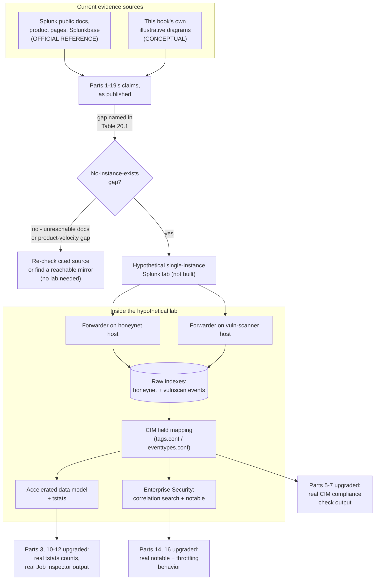

# Part 20 — What This Book Doesn't Know Yet: Validation Gaps and the Path to Real Evidence

## Why this part exists

**[CONCEPT]** Part 1 §3 made a promise this part exists to keep: "Part 20 closes the book by inventorying every one of those notes and marks in one place, organized by what specific observation would upgrade each claim." Nineteen parts later, that inventory is due. This part does not introduce a single new platform mechanism, correlation search, or dashboard pattern — every technical claim it needs was already made, once, in Parts 1–19, each carrying its own Product Version Note or evidence-class tag per `STYLE-GUIDE.md` §6.9 and §9. What this part adds is synthesis: pulling those scattered notes into one place, sorted by what kind of gap they actually represent, so a reader planning to act on this book's guidance can see in a single pass which claims are load-bearing documentation, which are this book's own labeled illustrations, and — for every one of them — what specific, checkable observation would move it from "documented" to "verified."

That structure mirrors DEH's own closing pattern. DEH's Part 40 (Detection Autopsy) and Part 43 (Detection Debt) both close out earlier material as synthesis rather than new subject matter; this part plays the same role here, made more load-bearing by this book's evidentiary position than either DEH capstone needed to be, because this book's gap isn't "some detections decay" — it's "no claim in this book has been checked against a running instance of the product it's about."

---

## 1. What this part does, and does not, do

**[SOC MANAGEMENT]** This part is a ledger, not a lab report. It does not run a `tstats` search, inspect a Job Inspector output, or observe a notable event fire, because none of those things has happened anywhere in this book's evidence base — Part 1 §3 stated that constraint as a structural fact, and this part inherits it rather than quietly working around it in its own closing pages. Concretely:

- It does not re-derive any platform mechanic already taught in Parts 2–19. If a claim needs restating to make sense in the ledger below, it gets one clause, not a paragraph — the same non-duplication discipline `STYLE-GUIDE.md` §0 holds this book to against DEH applies just as hard to this book citing itself.
- It does not mint new detection IDs, new correlation searches, or new CIM mappings. Where a gap references a specific artifact (DET-23-01 as a correlation search, the `Authentication` data model's field set), it points at the part that owns that artifact rather than reproducing it.
- It does not pretend a lab build-out closes every gap it names. §6 below is explicit about which gaps a modest, single-instance lab could plausibly close and which ones — multi-tenant licensing economics at real enterprise ingest volume, RBA's marketed alert-reduction figure at real SOC operating scale, search-head-cluster contention under real analyst load — would still be out of reach even with real infrastructure, because the lab this book could plausibly stand up is not the deployment size those specific claims describe.

**[SOC MANAGEMENT]** One more scope note, because it's easy to misread a validation-gaps chapter as an apology: naming a gap honestly is not the same claim as "this book's guidance is unreliable." Splunk's own public documentation, product pages, and Splunkbase listings are real evidence — a reasonable, checkable basis for a platform-operations claim, just not the same kind of evidence as a captured `_internal` log line from a system that actually ran the thing. This part's job is keeping those two kinds of evidence from blurring together in a reader's memory six months after finishing the book, not discrediting the first kind for lacking the second.

---

## 2. The evidence-class ledger, Parts 1–19

**[PLATFORM ENGINEER]** `STYLE-GUIDE.md` §9.2 states this book's evidence-class default plainly: zero `CONTROLLED LAB EXAMPLE` and zero `REAL LAB EXAMPLE` tags anywhere in the book, because no Splunk instance exists in the author's lab to produce either. Every figure and every version-specific claim in Parts 1–19 therefore sits in one of two classes — `OFFICIAL REFERENCE` (traceable to a cited Splunk source in `REFERENCES.md`) or `CONCEPTUAL` (this book's own labeled illustration, making no claim of capture from a running system). Table 20.1 is not exhaustive of every sentence in nineteen parts — that would be the whole book restated — but it is representative of the specific gap pattern each part carries, one row per part, so a reader can locate the exact kind of unverified claim a given part is most exposed on before relying on it for a production decision.

Table 20.1 supports one specific decision: if a reader can stand up only a limited amount of real Splunk infrastructure, which part's claims does that infrastructure actually get to move off `CONCEPTUAL`/`OFFICIAL REFERENCE` and onto something checked.

**Table 20.1 — Representative validation gap by part.**

| Part | Layer | Representative claim resting on documented, not observed, evidence | What would upgrade it |
|---|---|---|---|
| 1 | Bridging | The platform-layer/operations-layer split and the DEH non-duplication boundary | Not upgradable by a lab — this is a structural framing choice, not a platform-behavior claim |
| 2 | Platform | Indexer/search-head clustering topology and replication/search factor tradeoffs | A multi-node cluster under real query load; a single-instance lab cannot exercise this at all |
| 3 | Platform | Hot/warm/cold/frozen bucket rollover timing and index-level RBAC enforcement | A real index observed through at least one full bucket rollover cycle |
| 4 | Platform, SOC management | Current ingest vs. workload (SVC) pricing mechanics; license-violation thresholds are now sourced to Splunk's own documentation (Part 4 §5), but how that documented policy plays out against a real license manager's `Usage Report` over a real rolling window is still unobserved | A real billing relationship's `Settings > Licensing > Usage Report`, observed across a rolling window |
| 5 | Platform | `Authentication`/`Network Traffic` data model field sets and CIM's `tags.conf`/`eventtypes.conf` mechanism | A real CIM Add-on compliance check run against a real sourcetype |
| 6 | Platform | Data model inheritance and Pivot's generated-SPL behavior | A real Pivot session compared against its own generated search |
| 7 | Platform | Field-aliasing and tag mapping surviving (or not) a TA upgrade | A real TA version bump observed against a previously-mapped source |
| 8 | Operations | CSV lookup vs. KV Store collection behavior under concurrent write load | A real lookup under simultaneous correlation-search and manual-edit access |
| 9 | Operations | Macro-argument substitution edge cases and macro-sprawl detection via search-log analysis | A real `_internal` search log queried for macro-expansion frequency |
| 10 | Platform | `tsidx` summary storage overhead and summary-range coverage gaps | An actual accelerated data model's on-disk summary size and a real `tstats` result count |
| 11 | Platform | Summary-index backfill mechanics and staleness after a skipped run | A real summary-indexing search observed through one missed and one backfilled run |
| 12 | Platform | `limits.conf` concurrency defaults, explicitly flagged illustrative in Part 12 itself (`docs.splunk.com` unreachable during research) | `btool` output from a real search head, or the current Admin Manual once reachable |
| 13 | Operations | ES Essentials/Premier edition gating and Detection Studio's current naming and scope | Re-check against Splunk's own product page at time of use; a real ES install's own About page |
| 14 | Operations | Correlation-search throttling behavior and ES Content Update's packaged-detection install flow | A real correlation search observed firing, throttling, and suppressing across a scheduled window |
| 15 | Operations | Splunk's own marketed "up to 90%" notable-volume reduction from risk-based alerting | A real SOC's before/after notable count over a comparable retention window — a vendor figure, not measurable from documentation alone |
| 16 | Operations | Urgency/severity computation and Incident Review's ownership/status workflow | A real notable worked end-to-end in a real Incident Review instance |
| 17 | Operations | Asset and Identity framework staleness after a host decommission | A real asset lookup observed against a real decommissioning event |
| 18 | Operations | Simple XML vs. Dashboard Studio's current default status for new dashboards | Re-check against the current product documentation at time of use; a real dashboard created in a current release |
| 19 | Operations | The exact pivot-path UI naming from notable to risk object to raw search across recent ES releases | A real analyst's click-path captured against a currently-installed ES version |
| 20 | Capstone | This ledger itself | Every row above, closed one at a time |

> **Engineering Reality**
> Table 20.1's pattern is not random. Every platform-layer row (2–3, 5–7, 10–12) names a mechanism-level default, a storage number, or a config stanza — exactly the kind of fact that changes least often release to release, but is also the kind of fact this book's research could verify least directly, because `docs.splunk.com` refused every retrieval attempt made during this book's research (recorded per part in each affected part's own `REFERENCES.md` note). Every operations-layer row (13–19) names an edition boundary, a UI surface, or a marketed figure — the kind of fact that changes *most* often release to release, and the reason this book's ninth callout exists at all. The platform layer's gap is "documentation was unreachable"; the operations layer's gap is "the product moved since the documentation was written." Those are different failure modes with different fixes, and conflating them in a single "not verified" shrug would hide which fix — a working docs mirror, or a re-check against a current release — actually closes a given gap.

---

## 3. Where the gaps cluster: three distinct failure modes, not one

**[PLATFORM ENGINEER]** Sorting Table 20.1 by cause rather than by part number surfaces three genuinely different reasons a claim in this book is unverified, and each one has a different remedy:

**Unreachable-documentation gaps.** Several parts — 12 most explicitly, but also portions of 3 and 10 — state plainly that `docs.splunk.com` returned an HTTP error on every attempt made during that part's research, and that a Splunkbase listing, product page, or established general knowledge of the mechanism was used instead where it could substitute. This is the gap category a working documentation mirror or a different research tool closes without needing any Splunk instance at all — it is a research-access problem, not an evidence-class problem, and conflating the two would misdirect effort toward standing up infrastructure to fix what a reachable copy of the Admin Manual would fix directly.

**No-instance-exists gaps.** This is the majority of the ledger, and the one Part 1 §3 named as this book's central structural fact: a `tstats` result count, a Job Inspector output, a real notable's contributing-event list, a real bucket rollover — none of these can be produced by better documentation access, because they are not documentation claims. They are observations a running system produces, and the only remedy is a running system. §4 below is about what the smallest version of that system would need to look like.

**Product-velocity gaps.** Rows 4, 13, 15, 18, and 19 share a different shape: the underlying fact (an edition split, a UI surface's name, a marketed percentage) was genuinely, correctly checked against a live, cited source as of 2026-09-15 — but Splunk's own release cadence for Enterprise Security specifically makes that fact's shelf life short by design, not by research failure. A lab wouldn't fully fix this either, unless it stayed continuously current with every ES release — the actual remedy is the Product Version Note discipline itself, applied at the moment of use rather than at the moment of authoring: re-check the cited source before trusting the note, every time, not just once at publication.

> **Product Version Note**
> The single fact recurring most often across Table 20.1's operations-layer rows is Splunk Enterprise Security's current Essentials/Premier edition split — UEBA, SOAR integration, and "Automated Threat Analysis" gated to Premier; AI capabilities, SIEM, Threat Intelligence, Detection Studio, and Exposure Analytics shipping in both. As of 2026-09-15, verified against Splunk's own Enterprise Security product page and the Enterprise Security app's Splunkbase listing (ES 8.7.0, released 2026-09-02; `REFERENCES.md` entries `[ES-PRODUCT-PAGE]` and `[ES-SPLUNKBASE]`), and restated identically in Parts 1, 13, and 14 rather than re-derived each time. What would make this stale: Splunk restructuring the two-edition model itself, moving a capability across the Essentials/Premier boundary, or retiring either edition name — any of which would require updating all three of those parts and this row together, not just one.

---

## 4. What a real Splunk lab would actually need to look like

**[PLATFORM ENGINEER]** The no-instance-exists category from §3 is the one this book can actually describe a concrete remedy for, because the author's home lab already has the two ingredients a minimal Splunk stand-up would need to point at: a honeynet with live indicator enrichment and a vulnerability-scanner platform, both producing real, continuously-generated log traffic today, documented separately from this book. Neither requires Splunk to exist for its own purposes — both would simply become data sources a Splunk instance ingests, the same way any other log source would.

A lab sized to close the largest number of Table 20.1's rows, without requiring a multi-node cluster this book has no plan to build, would need:

1. **One Splunk Enterprise instance**, non-clustered, licensed under a trial or developer license rather than a production entitlement — sufficient to exercise indexing, search, data models, and the Enterprise Security app, but not sufficient to validate Part 2's clustering claims or Part 4's real ingest-volume billing behavior at any meaningful scale.
2. **A universal forwarder on each of the honeynet and vulnerability-scanner hosts**, sending real telemetry into two raw indexes — closing the "no-instance-exists" half of Parts 3, 5–7, and 10–12's gaps directly, because those parts' claims are about mechanism behavior, not about volume or cluster topology.
3. **CIM field mapping work against those two real sources** — the literal implementation task Part 7 already describes in the abstract, now with a real sourcetype to map instead of an illustrative one, closing Part 5–7's compliance-check gaps specifically.
4. **The Enterprise Security app, installed against that mapped data**, with one or two correlation searches (a natural candidate: DET-26-01's SPL body, already carried through DEH Parts 24–29 and this book's own Part 14 §4, wrapped exactly the way Part 14 describes) — closing Part 14's scheduling/throttling gaps and Part 16's Incident Review gaps for whatever volume of real notables that traffic actually produces.

> **Product Version Note**
> This section assumes Splunk currently offers a trial or developer licensing path suitable for a single, non-production instance of the kind described above. The exact current terms of that licensing path — duration, ingest ceiling, which features are entitled under it — were not independently re-verified for this part; Splunk has changed its no-cost/low-cost licensing offerings before (Splunk Free's own deprecation for new customers is public history). Confirm current trial/developer license terms against Splunk's own site before planning a build-out on the strength of this section alone.

**Figure 20.1 — Path from documented claim to verified claim.** *CONCEPTUAL.* Illustrates the two evidence streams feeding this book's current claims (Splunk's own public documentation and this book's labeled illustrative diagrams), the hypothetical single-instance lab described above that does not currently exist, and which parts' specific gap categories that lab would move from documented to observed. This is a sketch of a proposed evidence path, not a capture of any system that has been built.

---

## 5. What that lab would upgrade first, and what it still would not touch

**[SOC MANAGEMENT]** Not every row in Table 20.1 is equally cheap to close, and a reader deciding whether standing up the lab in §4 is worth the effort needs the two ends of that range side by side, not just the optimistic end.

**Table 20.2 — Lab build-out payoff, ranked.**

| Priority | Gap closed | Effort relative to the §4 build | Still unresolved after |
|---|---|---|---|
| 1 | Parts 5–7: real CIM-compliance check output against two real sources | Low — the mapping work itself, once forwarders are running | Compliance behavior for sourcetypes this lab's two sources don't represent |
| 2 | Parts 10–12: real `tstats` counts, real Job Inspector output, real skipped-search log entries | Low — falls out of running any search at all against real data | Concurrency behavior under real multi-analyst, multi-search-head load |
| 3 | Part 14: real correlation-search scheduling and throttling behavior | Medium — requires the ES app installed and configured | Behavior of ES Content Update's packaged detections specifically (Part 14 §5), not authored ones |
| 4 | Part 16: real notable urgency/severity computation and Incident Review workflow | Medium — depends on Priority 3 actually producing notables | Multi-analyst ownership/handoff dynamics at real SOC staffing levels |
| 5 | Part 15: risk-based alerting mechanics on a real risk index | Medium-high — needs sustained traffic over time, not a single test event | The marketed 90% notable-reduction figure itself, which needs a real SOC's operating history to compare against, not a lab's synthetic volume |
| — | Part 2: clustering, replication/search factor behavior | Not addressed by this build at all | Everything — this gap needs a multi-node deployment this lab does not include |
| — | Part 4: real ingest/workload billing thresholds | Not addressed by this build at all | A real commercial licensing relationship, which a trial/developer license (§4's Product Version Note) does not represent |

> **SOC Management View**
> The honest business case for the §4 lab is narrower than "this closes the book's evidence gap." It closes the mechanism-level gaps in Table 20.2's top rows cheaply, because the author's honeynet and vulnerability-scanner platform already generate the raw traffic those mechanisms need and this book's Part 20 is the only reason that traffic isn't already flowing into an index somewhere. It does not touch the two rows a real production decision is most likely to actually hinge on — clustering behavior under load, and real licensing economics — because those aren't gaps a single instance closes at any size. A reader deciding whether to build this lab should weigh it as "worth it for the mechanism claims, not sufficient for the scale claims," not as an all-or-nothing bet.

---

## 6. What this part cannot close, even in principle

**[SOC MANAGEMENT]** Two categories of claim in this book would remain unverifiable even after a lab far larger than §4's minimal build:

- **Splunk's own marketed figures**, most prominently risk-based alerting's "up to 90%" notable-volume reduction (Part 15) and Enterprise Security's positioning language generally. These are Splunk's claims about Splunk's own product, made across an unknown population of real customer deployments this book has no access to and no standing to reproduce. A real lab could show that RBA reduced *this book's own* synthetic notable count by some measured amount — but that number would describe one small lab's traffic pattern, not a claim about the figure Splunk markets, and presenting it as confirmation of Splunk's percentage would be exactly the kind of overclaim `STYLE-GUIDE.md` §1.3's Example 1 already warns against.
- **Organizational-scale claims** — Part 4's real licensing-threshold behavior at production ingest volume, Part 17's asset/identity staleness at real headcount and real decommissioning cadence, Part 2's clustering behavior under real concurrent analyst load. These describe emergent behavior of a scale this book's evidence base cannot manufacture by standing up one more virtual machine, no matter how faithfully that machine mirrors Splunk's own architecture.

> **What Would Change My Mind**
> Every gap in Table 20.1 that this part marks "no-instance-exists" would move toward "verified" the same way: a real Splunk instance, actually stood up, actually ingesting the honeynet's and vulnerability-scanner's own real traffic, actually observed over a real retention window rather than a single test run. That is a specific, checkable, and — per §4 — plausibly buildable answer, not a deflection repeated twenty times for lack of a better one. What it would *not* do is retroactively upgrade this book's `CONCEPTUAL` figures to `CONTROLLED LAB EXAMPLE` on their own terms; per `STYLE-GUIDE.md` §9.2, that upgrade happens claim by claim, dated and disclosed, the next time each affected part is actually revised against real observed output — and even then, Table 20.2's bottom rows and this section's two categories would still need a scale of deployment this book's evidence base has no plan to reach. The honest current answer, unchanged from Part 1 §3, is that this instance does not exist as of this part's `last_validated` date.

---

## 7. Reading the rest of this book with this ledger in hand

**[SOC ANALYST]** For a reader using this book operationally rather than as a straight read-through, the practical habit this part exists to instill is small: before treating any specific version number, edition boundary, percentage, or default-setting claim in Parts 1–19 as current, find that claim's Product Version Note, note the date and source it cites, and re-check that source if the gap between that date and today is more than a release cycle or two. That habit costs a few minutes per claim and is the entire point of tagging these notes distinctly from ordinary prose in the first place — a grep for "Product Version Note" across this book's chapters, the same way `STYLE-GUIDE.md` §6.9 intends, is a faster and more reliable validation pass than re-reading each part in full. Table 20.1 is that grep's output, pre-sorted; this part's only real deliverable is having done that sorting once so twenty separate readers don't each have to do it themselves.

---

**Cross-references:** Part 1 §3 (the evidentiary-honesty constraint this part closes out) · Part 3 (bucket lifecycle) · Part 4 (licensing and ingest economics) · Parts 5–7 (the Common Information Model) · Parts 10–12 (acceleration, summary indexing, search performance) · Part 13 (Enterprise Security architecture and editions) · Part 14 (correlation searches) · Part 15 (risk-based alerting) · Part 16 (notable events and Incident Review) · Part 17 (asset and identity correlation) · Parts 18–19 (dashboards and investigation workflows) · DEH Part 23 (Query Language Strategy) · DEH Part 26 (Splunk SPL) · `STYLE-GUIDE.md` §6.9 and §9 (Product Version Note and evidence-classification rules this part applies throughout).
